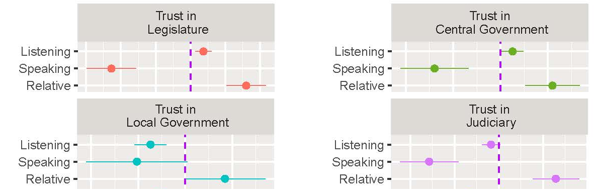
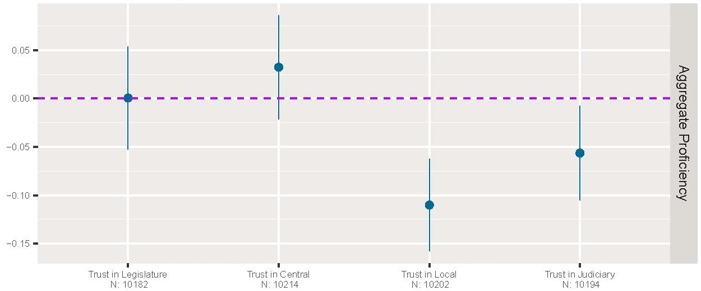
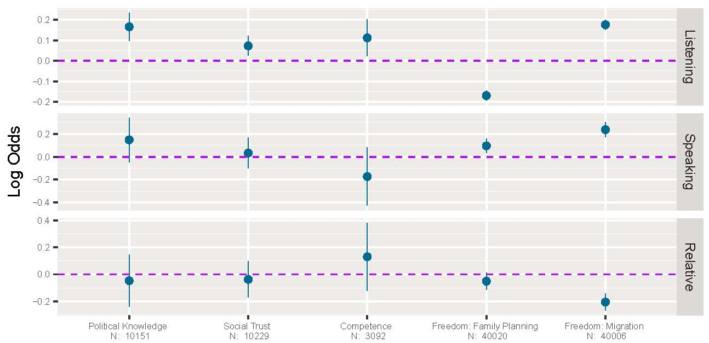
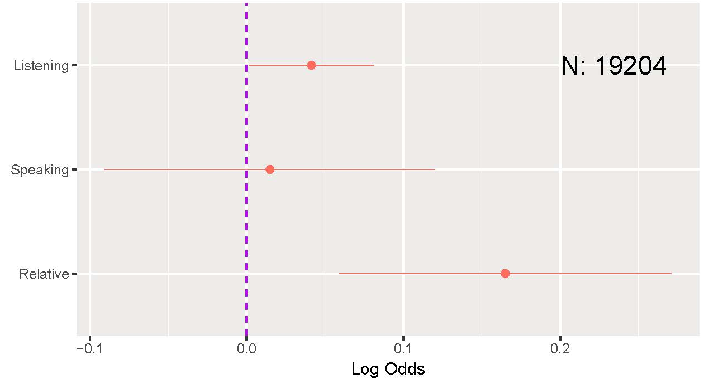

```{r setup, include=FALSE}
options(htmltools.dir.version = FALSE)
```


class:large

## Rebuilding the Towel of Babel?

.pull-left[]

--

.pull-right[]

--

.center[.large[<font color = "red">Language policy ?&#10132; Political trust</font>]]

---

class:large


## Going Beyond Existing Research

--


.pull-left[

### Limits

* Only minorities
* Only state-building phase
* Proxy of culture

]

--

.pull-right[

### Goal

1. .red[Full] population
1. .red[Established] environment
1. .red[Beyond] culture

]

--

### Shared Object

* Official Language


---

## <del>Culture</del> Communication-Based Theory

--

* Listening: 
    + Propaganda &#8686;
    + Hypotheses:
        + Being <font color="red">more</font> familiar with the political institutions 
        + Align <font color="red">more</font> with the government (also trust)
    
--
    
* Speaking: 
    + Activism &#8686;
    + Hypotheses:
        + <font color="red">More</font> interests and internal efficacy in politics
        + <font color="blue">Less</font> external efficacy
        + <font color="red">More</font> negative impression of the governmental officials.

--
    
* Relative
    + Suitability &#8686;
    + Hypotheses:
        + <font color="red">Better</font> self-evaluation
        + <font color="blue">Less</font> enthusiasm in changing it
        + <font color="red">More</font> political trust

---

## Research Design

--

* Source: Chinese General Social Survey 2010--15

--

* DV: 
    + Propagandistic effects (5)
    + Activism (6)
    + Self-evaluation (1)
    + **Political Trust**
        + National legislature, central government, local government, judiciary

--

* IV:
    + Listening, speaking and relative proficiencies ( $\Delta_{si} = s_i - \bar{s}.$ )
    + Demographic and socioeconomic controls (13)
    + Fixed effect (province, wave), post-stratification weights.

---

## Results




---

class:large

## Conclusion

1. Communication-based theory: A general understanding

--

1. New insight into public opinion


---

class: inverse, center, middle

# Thank you!

<i class="fa fa-envelope fa-lg"></i>&nbsp; [yue-hu-1@uiowa.edu](mailto:yue-hu-1@uiowa.edu)

<i class="fa fa-globe fa-lg"></i>&nbsp; https://sammo3182.github.io/

<i class="fa fa-github fa-lg"></i>&nbsp; [sammo3182](https://github.com/sammo3182)

<i class="fa fa-twitter fa-lg"></i>&nbsp; [@yuehupolisci](https://twitter.com/yuehupolisci)


---

class: inverse, center, middle

# Appendix

---

class:large

## New Case: Mainland China

.pull-left[

*Ethnicity*


]

.pull-right[

*Language*


]

---

## Reliability of Self-Report Official Language Proficiency


---

## Results

### Culture-based theory + aggregated measurement




---

## Results

### <del>Culture</del> Communicate-based theory + <del>aggregate</del> decomposed measurement: Listening





---

## Results

### Communicate-based theory + decomposed measurement: Speaking


---

## Results

### Communicate-based theory + decomposed measurement: Relative



