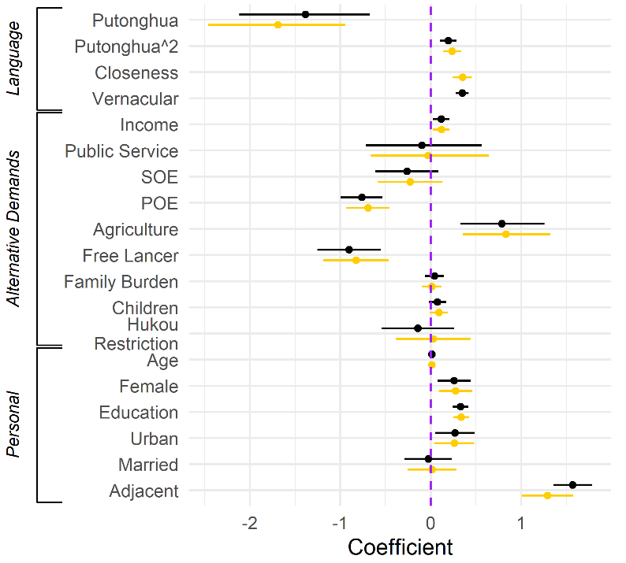

```{r setup, include=FALSE}
options(htmltools.dir.version = FALSE)
knitr::opts_chunk$set(echo = FALSE,
                      message = FALSE,
                      warning = FALSE)

# # wrap hook
# 
# library(knitr)
# hook_output <- knit_hooks$get('output')
# knit_hooks$set(output = function(x, options) {
#   # this hook is used only when the linewidth option is not NULL
#   if (!is.null(n <- options$linewidth)) {
#     x = knitr:::split_lines(x)
#     # any lines wider than n should be wrapped
#     if (any(nchar(x) > n)) x = strwrap(x, width = n)
#     x = paste(x, collapse = '\n')
#   }
#   hook_output(x, options)
# })

```

## Research Question

What leads migrants' decisions?
+ Where to go
+ How long to stay

Apart from economic demands

--

Our answer: Language

+ Socioeconomically
+ Culturally
+ Migration outcome

---

## Theory

### Language matters

+ Migrants prefer to .red[linguistically close] area.

--

### Language matters as a bypass rather than harmonizer.

National communal language (NCL)

+ Bypass: NCL & Vernacular .blue[coexist] + .red[threshold]
+ Harmonizer: NCL replaces vernacular 

---

## Study 1: Matters in Terms of Linguistical Closeness

> .small[Assuming you have a plan to leave from the city your hukou was registered, there are two available options: City A and B. The two cities are very similar... The difference is that you are expected to earn twice as much in City A as in City B, while the average living cost in A is also about 1. 5 times of the cost in B. Given these conditions, where do you prefer to move, A or B?]

--

"The vernacular in City B is .red[quite similar to your mother tongue], while the vernacular of City A is very different from yours."

---

## Study 2: Mechanism

### Source

1. China Labor-Force Dynamics Survey (CLDS)
1. Living Environment Satisfaction Survey of Chinese Residents (LESS) 

### Measurement

1. Language closeness
1. Vernacular proficiency

---

## Results


---

## Study II: Mechanism

Promoting a national communal language (NCL).

---

## Harmonizing: Moderation Model


---

## Bypass: Quadratic Model




---

## Conclusion

* **Migration**: Language matters.

--

* **Modernization**: More communication than culture.

???

Selection and later decisions

---

class: inverse, center, middle

# Thank you!

`r icon::fontawesome("envelope", style = "solid")`&nbsp;[yuehu@tsinghua.edu.cn](mailto:yuehu@tsinghua.edu.cn) 

`r icon::fontawesome("globe", style = "solid")`&nbsp; https://sammo3182.github.io/

`r icon::fontawesome("github")`&nbsp; [sammo3182](https://github.com/sammo3182)
