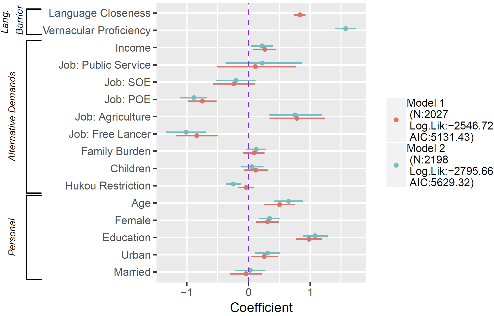
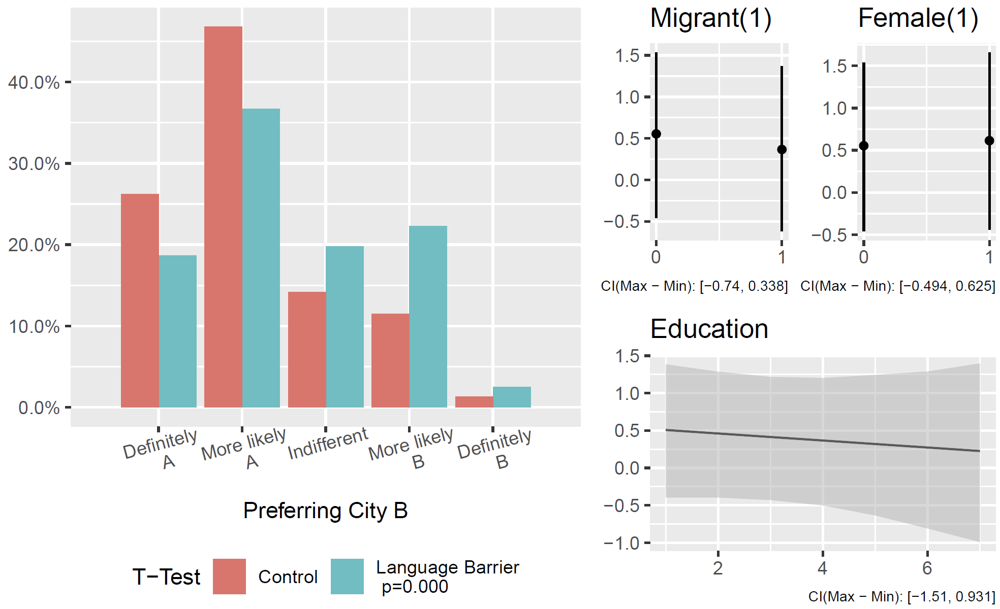
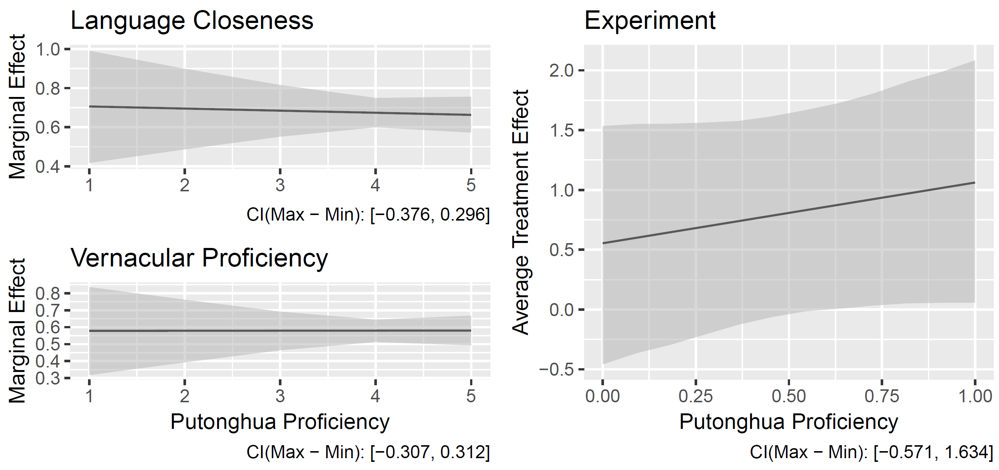
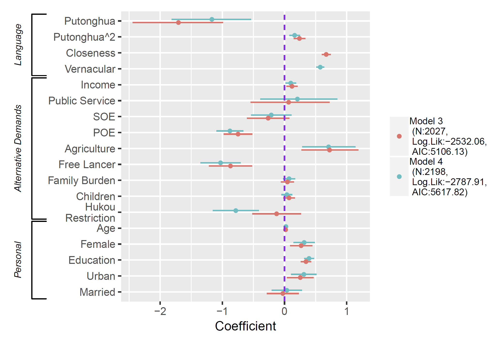
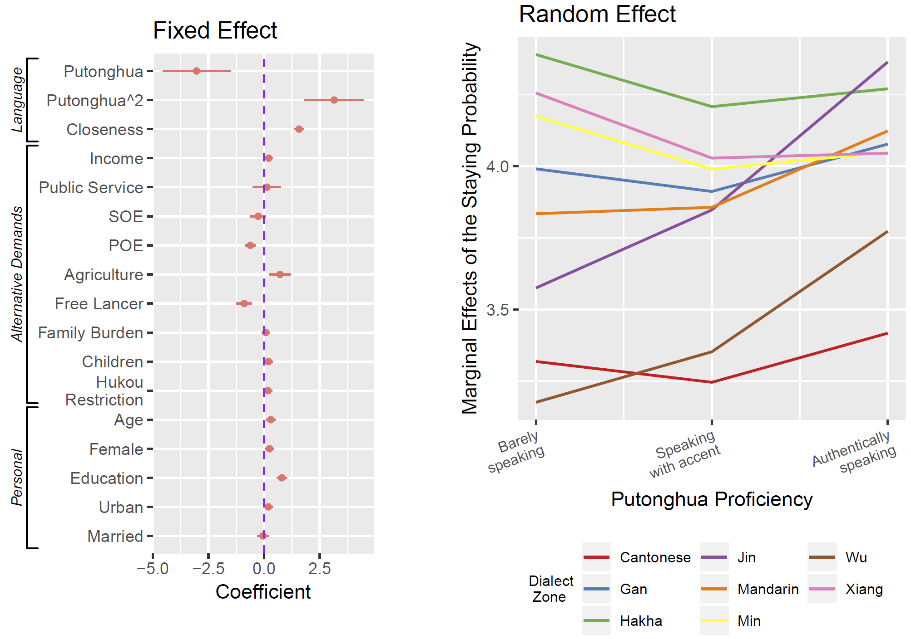

```{r setup, include=FALSE}
options(htmltools.dir.version = FALSE)
knitr::opts_chunk$set(echo = FALSE,
                      message = FALSE,
                      warning = FALSE)

# # wrap hook
# 
# library(knitr)
# hook_output <- knit_hooks$get('output')
# knit_hooks$set(output = function(x, options) {
#   # this hook is used only when the linewidth option is not NULL
#   if (!is.null(n <- options$linewidth)) {
#     x = knitr:::split_lines(x)
#     # any lines wider than n should be wrapped
#     if (any(nchar(x) > n)) x = strwrap(x, width = n)
#     x = paste(x, collapse = '\n')
#   }
#   hook_output(x, options)
# })

```

## Research Question

* What affects (domestic) migrants' decisions?
    + Where to go
    + How long to stay
--

Our answer: Language

--

* What can the government do?

---

## Why Language?

### Known

* Language matters
    + Socioeconomically
    + Culturally
    + Migration outcome

--

### Unknown

* Language effect on decision-making
* Language manipulation by the government

---

## Study 1: Does language matter?

### How does language affect migration decisions?

Barriers in communication & culture

--

.small[H1: When migrants determent where to migrate or whether to remain where they are, they prefer the place with a weaker language barrier.]

---

## Examination

Data: 

1. China Labor-Force Dynamics Survey (CLDS) 2016
    + Nationally representative sample
    + Special battery for the migrants
    
--

1. Living Environment Satisfaction Survey of Chinese Residents (LESS) 2018
    + Nationwide online sample
    + Detail questions + experiments

---

Measurement of language barrier

1. Language closeness: Linguistic measurement, random tree

--

1. Vernacular proficiency: Usage measurement, subjective evaluation

---

### Experiment

.small[Assuming you have a plan to leave from the city your hukou was registered, there are two available options: City A and B. The two cities are very similar... The difference is that you are expected to earn twice as much in City A as in City B, while the average living cost in A is also about 1. 5 times of the cost in B. Given these conditions, where do you prefer to move, A or B?]

--

.red[The vernacular in City B is quite similar to your mother tongue. You can make smooth communication there with no problem, while the vernacular of City A is very different from yours.] 

---

## Results




---



---

## Study II: What can governments do?

### Two mechanisms of the language policy

A. Harmonizing effect: reducing the influence of vernacular 

.small[H 2.1a: Migrants with higher Putonghua proficiency are more likely to migrate to place with larger language distance than those with lower proficiency.
]
.small[H 2.1b: For migrants with higher Putonghua proficiency, proficiency in the vernacular has less influence over migration destinations than for those with lower Putonghua proficiency. ]

---

B. Bypass effect: alternative path to vernacular 

.small[H2.2: Migrants with higher NCL proficiency are more likely to stay in a migration destination despite the concern of language barriers.]

--

.small[Coexistance + U-shape]


---

## Harmonizing: Moderation Model



---

## Bypass: Quadratic Model



---

## Regional Variance and Robustness Check



---

## Conclusion

* **Migration**: Language matters and language policy works.

--

* **Modernization**: More communication than culture.

???

Selection and later decisions


---

class: inverse, center, middle

# Thank you!

<i class="fa fa-envelope fa-lg"></i>&nbsp; [yuehu@tsinghua.edu.cn](mailto:yuehu@tsinghua.edu.cn)

<i class="fa fa-envelope fa-lg"></i>&nbsp; [elise-pizzi@uiowa.edu](mailto:elise-pizzi@uiowa.edu)

<i class="fa fa-globe fa-lg"></i>&nbsp; https://sammo3182.github.io/
