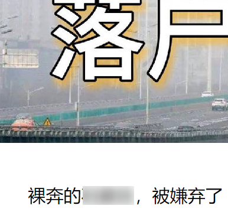
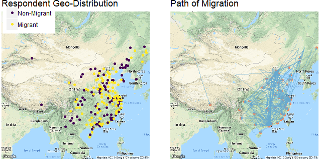
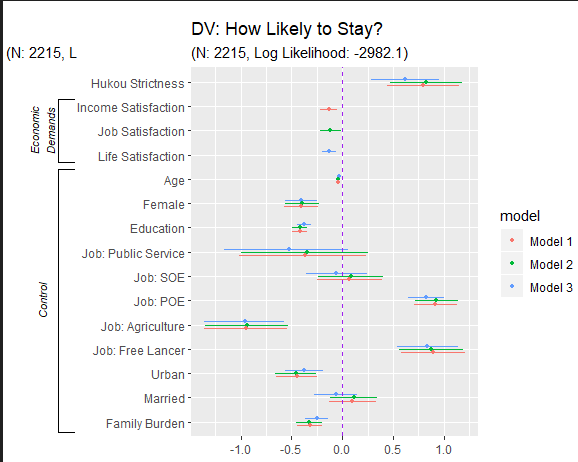
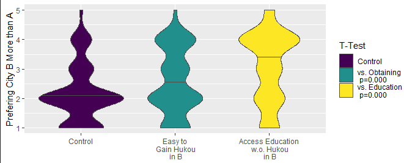
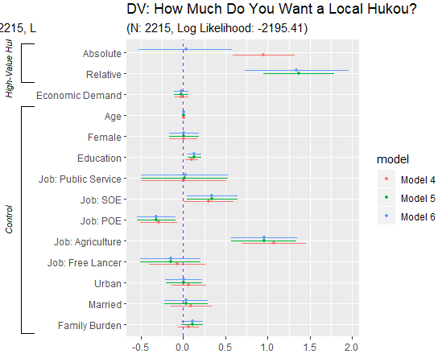

## Research Question

What Shapes Migrants' decisions?

How does the government do that? 

* Hukou policy: 
    + Does it work? 
    + How does it work?

---

## Hukou Policy

Residence Registration System

--

1/ Residents vis-a-vis Non-residents

--

2/ Alive and well

Favoring the residents

???
government housing, urban education, or even some types of employment

--

3/ Decentralized reform

---

## Does Hukou Actually Work?

.center[]

---

class: center

.left-column[

]

--

.right-column[

  

]

---

## Theory: Barrier vs. Benefit

Assumption: Moving for better life.

$H_{barrier}:$ People prefer cities with .magenta[less strict] requirements for local hukou status.

--

$H_{benefit}:$ People prefer cities where the potential local .magenta[benefits is big].

* People prefer places where the local hukou is .magenta[more strict].
* People prefer places where they can access hukou benefits, .magenta[regardless of hukou].

---

## Data

Living Environment Satisfaction Survey of Chinese Residents (LESS 2018)

* 1100 respondents

---

* Half migrants, half non-migrants

.center[]

---

## Validation

China Labor-Force Dynamics Survey (CLDS 2016)

---

## Measurements

* Preference:
    + Willing to move in
    + Willing to stay

---

* Hukou strictness

Subjective: "How difficult to gain the hukou in your current living place?"

--

Objective: A semi-machine learing process

---

* Training set: Hukou openness of 64 cities

(刘金伟. 2016. “我国城市户籍开放程度及其影响因素分析——基于全国63个样本城市的评估.” 《国家行政学院学报》 (05): 91-95+143-144.)

* Input Data: A list of socioeconomic, industrial, and demographic variables of the prefectures.

* Prediction: Chaining random forest
    + 0-1
    + Beijing: 0.927

???

334 prefectures (直辖市及地级行政区)

国家卫生健康委流动人口服务中心调查评估与家庭发展处副处长
Migrant Population Service Center, National Health Commission

---

## Examination Map

### For the barrier theory

Do people know the barrier?

&rarr; Do they care?
    
--

### For the benefit theory

Do people care about a high-valued Hukou?

&rarr; Hukou vs. benefit?

---

## Do People Know and Care?

.center[]

---

.center[]

---

## Hukou vs. Benefit?

.center[]

---

.center[]

---

.center[]

---

## Take-home Points

1. People don't care Hukou as much as commonly thought.
1. Hukou does shape (potential) migrants' decisions by loading values.

---

---

class: inverse, center, middle

# Thank you!

<i class="fa fa-envelope fa-lg"></i>&nbsp; [yuehu@tsinghua.edu.cn](mailto:yuehu@tsinghua.edu.cn)

<i class="fa fa-globe fa-lg"></i>&nbsp; https://sammo3182.github.io/

<i class="fab fa-github fa-lg"></i>&nbsp; [sammo3182](https://github.com/sammo3182)
