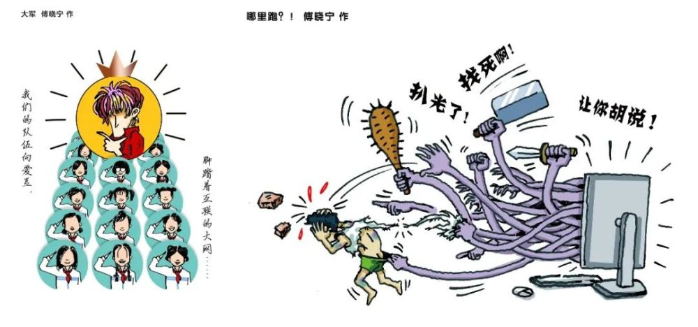
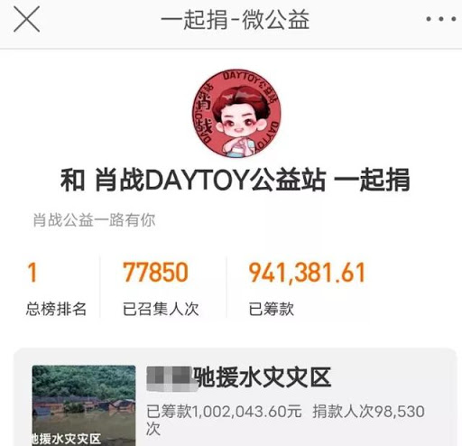
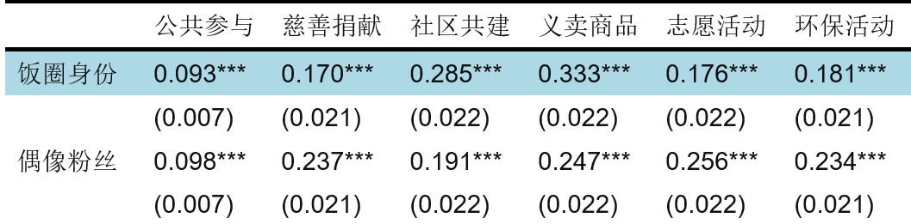
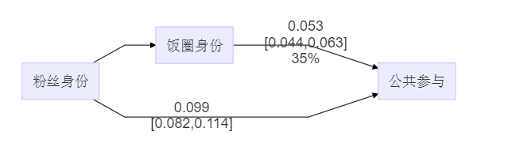

```{r setup, include=FALSE}
library(pacman)
p_load(knitr, tidyverse, icon)
```

## 研究问题

饭圈：粉丝圈， fandom——一种有别于“粉丝”的身份认同

1. 对于中国青少年公共参与的.red[推动]作用
1. 对于偶像号召力的.red[中介]作用

---

## 被“污名化”的饭圈

.center[]

???

1. 年龄小、少不更事
1. 盲目维护偶像

---

## "出圈"

.pull-left[.center[]]
.pull-right[.center[]]

???

1. “出圈”力量
1. 饭圈 vs. 偶像

---

## 身份认同理论：饭圈行为与公共参与

.center[
一致身份 &rArr; 近似行为    
身份建构 &rArr; 身份动员
]

--

H<sub>1</sub>: 饭圈身份.red[&uarr;], 公共参与.red[&uarr;]   
H<sub>2</sub>: 粉丝身份 .navy[&rarr;] 饭圈身份 .red[&rarr;] 公共参与

---

## 研究设计

"中国青少年网络行为调查" 2020

有效样本：2,211

公共参与行为：

1. 慈善捐献
1. 社区共建
1. 义卖商品
1. 志愿活动
1. 环保活动

公共参与（Croach's &alpha; = .89）

---

## 研究结果

.center[]

控制：
1. 人口特征：性别、教育、职业（与学生比较）
1. 其他身份：流动人口、党员、少数民族

---

.center[]

---

## 稳健性检验

.center[]

---

background-image: url("images/experiment-1.png")
background-position: center
background-size: contain

???

您和您的偶像在微博上共同关注的一个A国明星，近日发表了一些言论引发了争议，您的偶像在微博中明确@这一A国明星表示反对，并且即刻取关了A国明星的微博帐户。您的粉丝圈也立刻做出反应，号召粉丝们和偶像保持一致。


取关A国明星   
在自己的微博中@A国明星批评ta    
到A国明星微博中留言批评ta   
取关您的偶像    
什么都不做


---

## 结论：为饭圈“正名”

1. .red[广泛]身份 &rArr; 群体动员
1. .red[“出圈”]动员 &rArr; 公共参与
1. .red[正向]推动 vs. .navy[Bad] apple

???

one bad apple can spoil the bunch