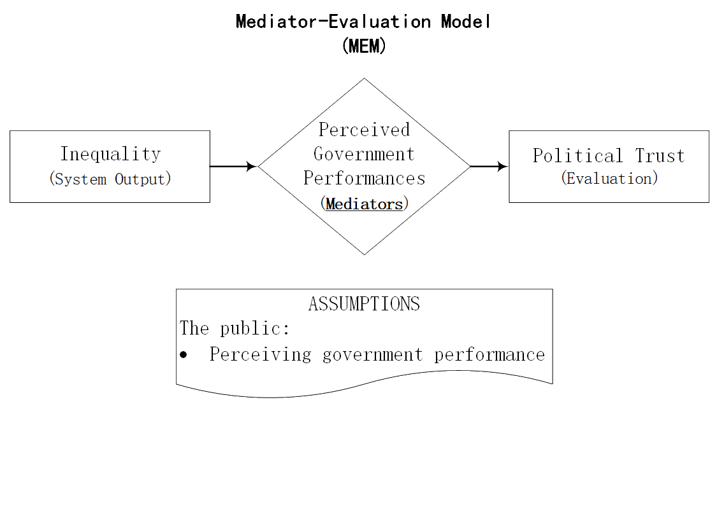
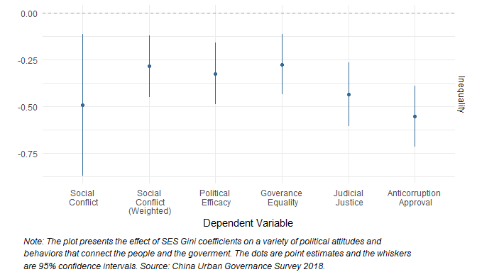
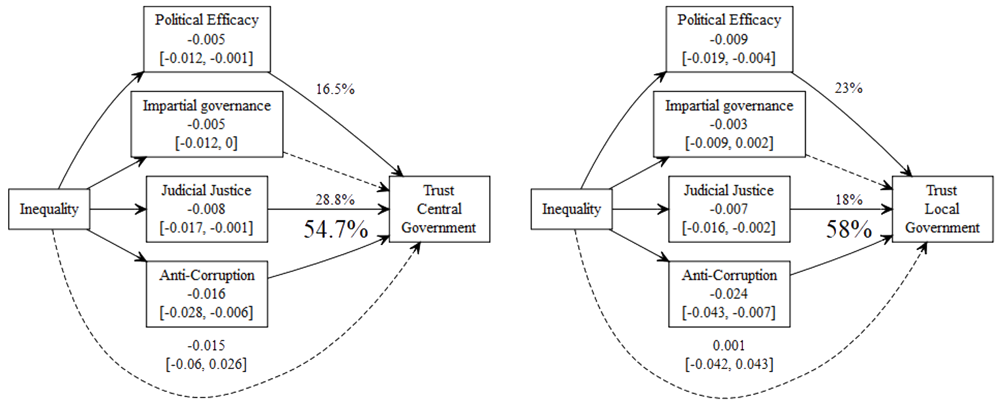

```{r setup, include = FALSE}
knitr::opts_chunk$set(echo = FALSE, message = FALSE, warning = FALSE, htmltools.dir.version = FALSE)

if (!require(pacman)) install.packages("pacman")
library(pacman)

p_load(
  knitr, icons, xaringanExtra, tidyverse
) # data wrangling # data wrangling

use_xaringan_extra(c("tile_view", # O
                                    "broadcast", 
                                    "panelset",
                                    "tachyons"))

use_extra_styles(
  hover_code_line = TRUE,
  mute_unhighlighted_code = TRUE
)

# Functions preload
set.seed(313)
```

## Objective

Inequality &mdash;?&rarr; Political Trust

+ Inequality bad, but .red[how]?
+ Macro &rarr; micro, but .red[how]?

---

class: center, bottom

### When Inequality Increases

--

Economic growth.navy[&darr;]    

--

Risk taking.red[&uarr;]
Trust in other people.navy[&darr;]
Happiness.navy[&darr;]

--


Life expectancy.navy[&darr;]Infant mortality.red[&uarr;]   

Mental illness.red[&uarr;]Drug abuse.red[&uarr;]    

Obesity.red[&uarr;]Child well-being.navy[&darr;]    

Education performance.navy[&darr;]   

Teenage births.red[&uarr;] Homicides.red[&uarr;]    

Imprisonment rates.red[&uarr;]......

--

.red[*Bad, bad inequality*, but mechanisms?]

---

## Why Should We Care: Inequality, Perception, and Common Prosperity

**Theoretically** 

+ System &rarr; individual

--

**Empirically**

+ Experience of inequality governance from the Chinese case

--

**Practical**

+ Potential Paths towards Common Prosperity
    + Social welfare
    + Perceptive satisfaction
    
???

十九大报告提出，中国特色社会主义进入新时代，我国社会主要矛盾已经转化为人民日益增长的美好生活需要和不平衡不充分的发展之间的矛盾

吴晓刚 2009 “very high normative support to income inequality.”
谢宇 等 2012： economic inequality as a byproduct of economic development

周英男、金帅 2018 The China Quarterly，Lei, Ya-Wen 2020 Socius 在省级发现了负相关系
吴晓刚 李jun 2017 心理压力

Luo, Weixiang, and Yu Xie. 2020 actual life loss

+ Social welfare: 公共福利能否缓解不平等带来的影响
+ Perceptive satisfaction：是什么影响满意程度

---

## How Inequality Affects Perceptions: Two Competitive Models

.pull-left[


]

--

.pull-right[

]


---

## Three Influencing Paths

.center[
Path 1: *Governance inequality*   
Economic Inequality &rarr; Class Discrimination  &rarr; Lower Trust

Path 2: *Government Non-responsiveness*   
Economic Inequality &rarr; Low responsiveness on average &rarr; Lower Trust

Path 3: *Judicial Injustice**    
Economic Inequality &rarr; Imbalance sources and odds in judicial affairs &rarr; Lower Trust

Path 4: *Anti-Corruption Inadequacy*    
Economic Inequality &rarr; Dissatisfaction of anti-corruption &rarr; Lower Trust
]


---

## Research Design

.pull-left[

Data:

*Chinese Household Finance Survey* (CHFS) 2013

+ 28,141 households from 29 provinces 
+ Representative income data for Gini coefficient

*China Urban Governance Survey* (CUGS) 2015

+ 3,513 from 50 prefectures 
+ Later than CHFS
+ Political perceptions

]

--

.pull-right[

Method:

*Causal mediation analysis*

+ Multi-mediator estimation
+ central and local governments

]

???

Imai 2014, mediation analysis for causal mechanism and non binary treatment


---

## Results: Does Inequality Alter the Paths



---

## Results: Does Paths Influence Trust

.center[]

---

## Conclusion

1. Over 90% of the effects from inequality to trust: No need to know inequality
1. Mechanisms
    + Governance inequality < ... < Anti-Corruption
1. Central vs. Local
    + Judicial justice
    + Responsiveness


---

class: center, middle, inverse

# Thank you!

`r feather_icons("mail")`&nbsp;[yuehu@tsinghua.edu.cn](mailto:yuehu@tsinghua.edu.cn) 

`r feather_icons("globe")`&nbsp; https://sammo3182.github.io/

`r feather_icons("github")`&nbsp; [sammo3182](https://github.com/sammo3182)


---

## Gini Coefficient

\begin{equation}
G = 1 - \sum(q_i + q_{i - 1})(p_i - p_{i - 1}) 
\end{equation}

where `q` is the cumulative proportion of SES of prefecture `i`; `p` is cumulative proportion of population within the prefecture. 
The resulted coefficients ranges from 0.16 to 0.25. 
