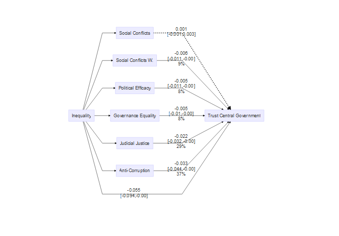

```{r setup, include=FALSE}
library(pacman)
p_load(knitr, tidyverse, icon)
```


## Object

Inequality &mdash;?&rarr; Political Trust

+ Inequality .navy[bad], but .red[how]?
+ Macro &rarr; micro, but how?

---

class: center, bottom

### When Inequality Increases

--

Economic growth.navy[&darr;]    

--

Risk taking.red[&uarr;]
Trust in other people.navy[&darr;]
Happiness.navy[&darr;]

--


Life expectancy.navy[&darr;]Infant mortality.red[&uarr;]   
Mental illness.red[&uarr;]Drug abuse.red[&uarr;]    
Obesity.red[&uarr;]Child well-being.navy[&darr;]    
Education performance.navy[&darr;]   
Teenage births.red[&uarr;] Homicides.red[&uarr;]    
Imprisonment rates.red[&uarr;]   
......

--

.magenta[*Bad, bad inequality*]

---

## Inequality and Politics

### Individual

Inequality.red[&uarr;]    
&dArr;    
Democratic support.navy[&darr;]

--

### Institutional

Democratic engagement.navy[&darr;]    
Representation.navy[&darr;]   
Responsiveness.navy[&darr;]


---

## Inequality and Politics


### Individual

Inequality.red[&uarr;] &lArr; Government performance    
&dArr;    
Democratic support.navy[&darr;] &lArr; Public evaluation

### Institutional

Democratic engagement.navy[&darr;]    
Representation.navy[&darr;]   
Responsiveness.navy[&darr;]


---

## Inequality and Politics

### Individual

Government performance.large[&#8668;].red[Retrospective?]    
&dArr;    
Public evaluation

### Institutional

Democratic engagement.navy[&darr;].large[&#8668;].red[Other regimes?]   
Representation.navy[&darr;]   
Responsiveness.navy[&darr;]

???

+ whether citizens perceive inequality correctly
+ consider it a priority or respond to inequality at all

a reason of the above is the democracy---political trust is regarded as democratic supports, but inequality is also severe in others


---

## Goal

1. Political trust in general
    + Case of China

???

1. Prominent authoritarian state
1. One of the most unequal countries in the world in terms of income and wealth distribution

十九大报告提出，中国特色社会主义进入新时代，我国社会主要矛盾已经转化为人民日益增长的美好生活需要和不平衡不充分的发展之间的矛盾

吴晓刚 2009 “very high normative support to income inequality.”
谢宇 等 2012： economic inequality as a byproduct of economic development

周英男、金帅 2018 The China Quarterly，Lei, Ya-Wen 2020 Socius 在省级发现了负相关系
吴晓刚 李 jun 2017 心理压力

Luo, Weixiang, and Yu Xie. 2020 actual life loss

--

1. Research of mechanisms
    + Social conflict
    + Governance inequality
    + Judicial injustice
    + Corruption
    
???

Conflict theory: Inequality reduces social capital, generates distrust and social conflicts, then make governance difficult.
Relative power theory: Inequality reduce social conflicts, John Galbraith 1983, third face of power, but also lower trust

Governance inequality: unequal distribution of resources in society leads to unequal influences in politics, biased governance

judicial justice: the last resort for citizens 

Corruption

Uslaner (2011) illustrated that economic inequality leads to high levels of corruption and low levels of service delivery, which then reduces trust in government
    
---

## Hypotheses

Inequality (.red[&uarr;]) &rArr;

1. Social conflict (.red[&uarr;] vs. .navy[&darr;]) 
1. Governance equality (.navy[&darr;])
1. Judicial justice (.navy[&darr;])
1. Corruption (.red[&uarr;])

&rArr; Political trust (.navy[&darr;])

---

## Research Design

.pull-left[

### Data

1% National Population Sampling Survey 2015

+ 1.37 million

China Urban Governance Survey 2015

]

--

.pull-right[

### Method

Causal mediation analysis

Multi-mediator estimation

]

???

Imai 2014, mediation analysis for causal mechanism and non binary treatment

---

## Measurement

### DVs

Social conflicts (3 * 2), governance inequality (2), judicial injustice (1), corruption (1)

???

参与游行/示威/群体性事件, 在网上批评政府官员或政策, 在网上讨论游行/示威/群体性事件

political efficacy + 在我国，人人都得到了政府的公平对待

我国法院/检察院维护了司法公正

反腐工作的满意程度

--

### IV

SES Gini at prefectural level

???

level of education, occupational prestige, value of cars owned, type of social security, and type of health care

the most spatially concrete and temporarily updated measurement of socioeconomic inequality of China in the Xi era

--

### Controls

Individual and prefectural

---

## Results


---



---

## Conclusion

1. Over 90%
1. Mechanisms
    + Social Conflicts &asymp; Governance Inequality < Judicial Inequality < Corruption
1. Central vs. Local
    + Corruption
    + Governance inequality (Reversed hierarchical trust?)

???

Corruption affects the local more

---

class: center, middle

# Thank you!

`r icon::fa("envelope", size = "lg")`&nbsp; [yuehu@tsinghua.edu.cn](mailto:yuehu@tsinghua.edu.cn)

`r icon::fa("globe", size = "lg")`&nbsp; https://sammo3182.github.io/

`r icon::fa("github", size = "lg")`&nbsp; [sammo3182](https://github.com/sammo3182)

---

## SES Indicators

.scroll-output[

```{r ses, echo=FALSE}
options(knitr.kable.NA = '') # hide "NA" in the table 

tibble::tribble(
 ~Coding,          ~Education,                                                  ~`Job Prestige`,                ~`Car Value`,                                                        ~`Social Security`,                                              ~`Health Care`,
      1L,         "No school",                                                      "Farmers",                  "No car",                                                           "No coverage",                                             "No coverage",
      2L,    "Primary school",                        "Manufacturing, transportation workers",       "Under 100,000 RMB",                          "Social Pension Insurance for Rural Residents",                 "New Rural Cooperative Medical Insurance",
      3L,     "Middle school",                                              "Service workers",   "100,000 - 200,000 RMB",              "Social Pension Insurance for Non-working Urban Residents", "Basic Medical Insurance for Non-working Urban Residents",
      4L,       "High school",                                                       "Clerks",   "200,000 - 300,000 RMB",                      "Social Pension Insurance for Urban Working Group",         "Basic Medical Insurance for Urban Working Group",
      5L, "Vocational school",                                                "Professionals",   "300,000 - 500,000 RMB", "Pension Insurance for Employees in Government and Public Institutions",                       "Publicly Funded Free Medical Care",
      6L,    "Junior college", "Government officials, principals in public or private sector", "500,000 - 1,000,000 RMB",                                                                      NA,                                                        NA,
      7L,           "College",                                                             NA,   "Above one million RMB",                                                                      NA,                                                        NA,
      8L,   "Graduate school",                                                             NA,                        NA,                                                                      NA,                                                        NA
 ) %>% kable(format = "html")

```

]

---

## Gini Coefficient

\begin{equation}
G = 1 - \sum(q_i + q_{i - 1})(p_i - p_{i - 1}) 
\end{equation}

where `q` is the cumulative proportion of SES of prefecture `i`; `p` is cumulative proportion of population within the prefecture. 
The resulted coefficients ranges from 0.16 to 0.25. 
