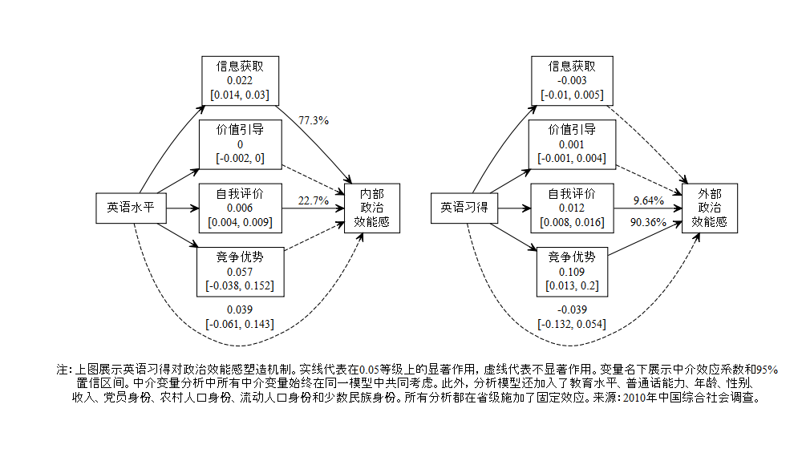

```{r setup, include = FALSE}
knitr::opts_chunk$set(echo = FALSE, message = FALSE, warning = FALSE, htmltools.dir.version = FALSE)

xaringanExtra::use_xaringan_extra(c("tile_view", # O
                                    "broadcast", 
                                    "panelset",
                                    "tachyons"))


library(pacman)

p_load(icons)

# Functions preload
set.seed(313)
```

## 概览

1. 外语习得&rarr;政治认知？
1. 语言政策场域: 一种语言相对性理论
1. 基于中国的实证检验
1. 发现与讨论


---

class: center, middle, normal

**研究对象**: 语言，人类根本属性
**研究问题**：语言习得 &rarr; 认知

--

.bg-black.golden.ba.shadow-5.ph4.mt3[
语言与认知关系是社会科学、语言学、教育学、文学、哲学、神经科学    
**.red[共同]**关注的课题
]


---

## 文献：语言、政治与认知

两个切口：

.left-column[
### 语言相对主义
]

.right-column[
主导力量：语言学和教育学

社会科学

+ 经济学: 语言的资本功能    
.small[(Esman 1982; 刘毓芸，徐现祥 &肖泽凯 2015； 张卫国 & 孙涛 2016; Ginsburgh & Weber 2020)]
+ 心理学：语言的个体塑造    
.small[(Wright and Taylor 1995; 张先亮 2015; 武小军 2015) )]
+ 社会学: 语言的身份认同    
.small[(Vroome, Hooghe, and Marien 2013)]

政治学？
]


???

政治学的声音还很弱

萨丕尔·沃夫

马克思 & 恩格斯 (1961)《德意志意识形态》: “语言是思想的直接现实”

---

## 文献：语言、政治与认知

两个切口：


.left-column[
### 语言相对主义
### 政治语言学
]
.right-column[
1. 语种区隔导向   
.small[(Laitin 1994; Laitin 2007; )]
1. 语言政策导向    
.small[(Liu 2015; Liu and Ricks 2012; Tang, Hu & Jin 2016)]
1. 语言心理导向   
.small[(Chang and Lu 2014; Hu 2020;Hu & Pizzi 2021)]

语言与政治认知？
]

---

class: middle, center

## 语言政策场域理论

总体条件：语言政策条件（教育、使用、认同）

???

一种语言在社会中的能、好、怎

--

.large[&dArr;]    

### 语言能力

.red[信息]货币    
.red[价值]体系    
自我.red[认同]    
竞争.red[优势]

--

.large[&dArr;]

政治认知（e.g., 内外政治效能感）

---

## 外语习得&rarr;政治效能感

.pull-left[
英语 &rarr; 信息 .blue[&uarr;] 
+ 内部效能感 .blue[&uarr;]
+ 外部效能感 .blue[&uarr;]
    

英语 &rarr; 价值 .blue[&uarr;] 
+ 内部效能感 .blue[&uarr;]
+ 外部效能感 .red[&darr;]
]

--

.pull-right[
英语 &rarr; 自信 .blue[&uarr;] 
+ 内部效能感 .blue[&uarr;]
+ 外部效能感 .red[&darr;]


英语 &rarr; 优势 .blue[&uarr;] 
+ 内部效能感 .blue[&uarr;]
+ 外部效能感 .blue[&uarr;]
]

---

## 实证检验

.left-column[
### 步骤
]
.right-column[
1. 效果研究（相关分析）
1. 机制研究（因果中介相应分析)
]

---

## 实证检验

.left-column[
### 步骤
### 数据
]
.right-column[
CGSS 2010, 11,782


]


---

## 效果检验

.center[]

---

## 中介作用

.center[]

---

## 发现和讨论

英语习得 &rarr; 政治效能感 .green[.normal[&check;]]

--

影响机制：

1. 英语水平 &rarr; 信息获取/竞争优势 &rarr; 内/外部效能感.normal[.blue[&uarr;]]
1. 英语水平 &rarr; 自我评价 &rarr; 内外效能感.normal[.blue[&uarr;]]
1. 价值引导 .normal[.red[&cross;]]

--

### 思考

.bg-black.golden.ba.shadow-5.ph4.mt3[
其实家长大可不必担心，当代的学生正处在教育改革的阶段，对每名学生来说都是一样的，所以大家的起点是相同的，不存在**输在起跑线上**的情况。


.tr[
---.small[[《教育部：将英语在期末考试中剔除，上海成为试点》](https://www.sohu.com/a/484277618_453160)]]
]
]

???

来源：央视新闻、娟娟lu教育

---

class: inverse, center, middle

# 感谢聆听!

`r feather_icons("mail")`&nbsp;[yuehu@tsinghua.edu.cn](mailto:yuehu@tsinghua.edu.cn) 

`r feather_icons("globe")`&nbsp; https://sammo3182.github.io/

`r feather_icons("github")`&nbsp; [sammo3182](https://github.com/sammo3182)


```{r pdfPrinting, eval = FALSE, include = FALSE}
pagedown::chrome_print(list.files(pattern = "language.*.html"), 
                       timeout = 500, 
                       box_model = "padding")
```
