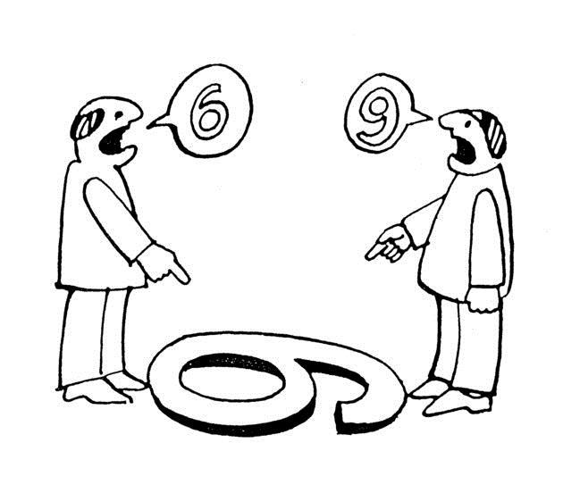

```{r setup, include = FALSE}
knitr::opts_chunk$set(echo = FALSE, message = FALSE, warning = FALSE, htmltools.dir.version = FALSE)

xaringanExtra::use_xaringan_extra(c("tile_view", # O
                                    "broadcast", 
                                    "panelset",
                                    "tachyons"))


library(pacman)

p_load(icons)

# Functions preload
set.seed(313)
```

## Overview

1. 

---

## Linguistic Relativity in Political Science

.center[]

What's the role of language in sociopolitical lives?
.pull-left[
Ex-ante cultural/cognitive differences    
.small[(Mazuka and Friedman 2000; Perlovsky 2009; Slobin 1996)]

]

???

Sapir-Whorf hypothesis

--

.pull-right[
.red[.large[vs.]]     

Framework modifying thoughts    
.small[(Hu 2020; Hu and Liu 2020)]
]

---

class: center, middle

### Potential Problem

*Ignoring* the communication function   
*Ignoring* the role of the government   
*Lab* data

--

.large[&dArr;]

.red[Policy-based] theory 

\+ 

.red[Observed] data 

\+ 

.red[Functional] measurement

---

## Policy-Based Language Effect: Two Theoretical Frameworks

State &rarr; language policies &rarr; official language w. others

Contribution from poli sci: State building, ethnic relationship     

--

&darr;

Ethnolinguistic 

---

## Design and Measurement

---

## Results

---

## Conclusion and Discussion

---

class: inverse, center, middle

# Thank you!

`r feather_icons("mail")`&nbsp;[yuehu@tsinghua.edu.cn](mailto:yuehu@tsinghua.edu.cn) 

`r feather_icons("globe")`&nbsp; https://sammo3182.github.io/

`r feather_icons("github")`&nbsp; [sammo3182](https://github.com/sammo3182)
