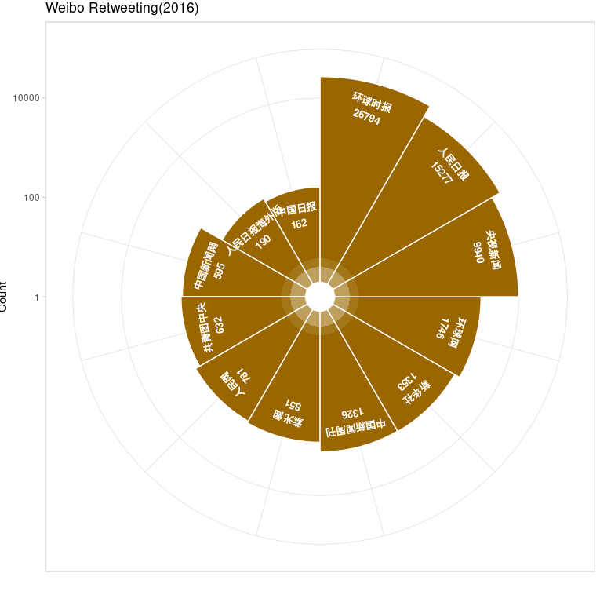
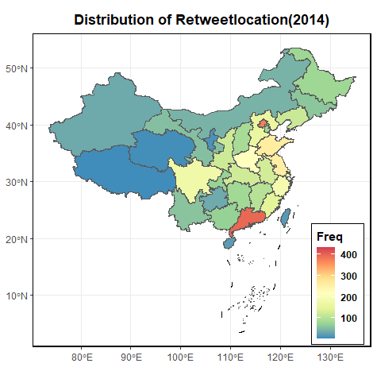
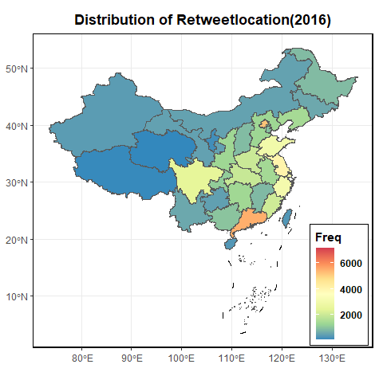
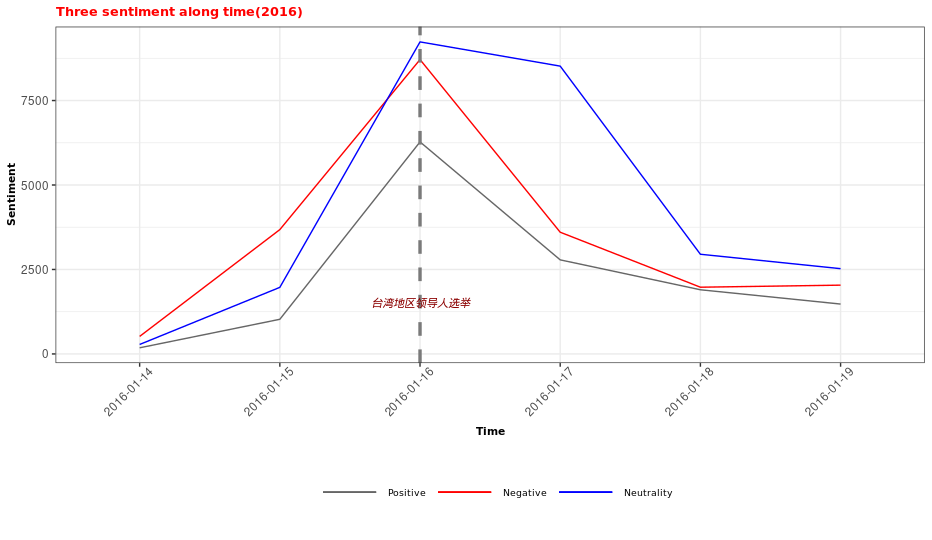
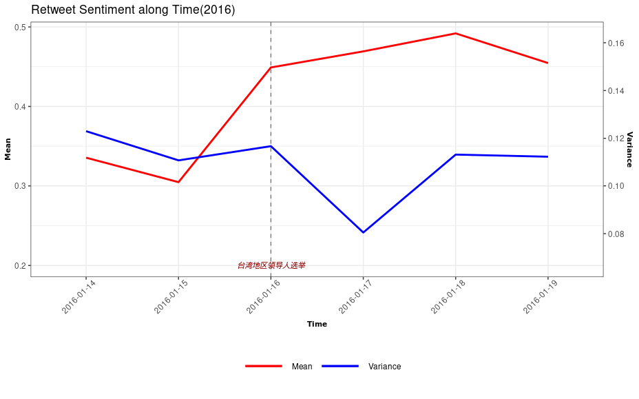
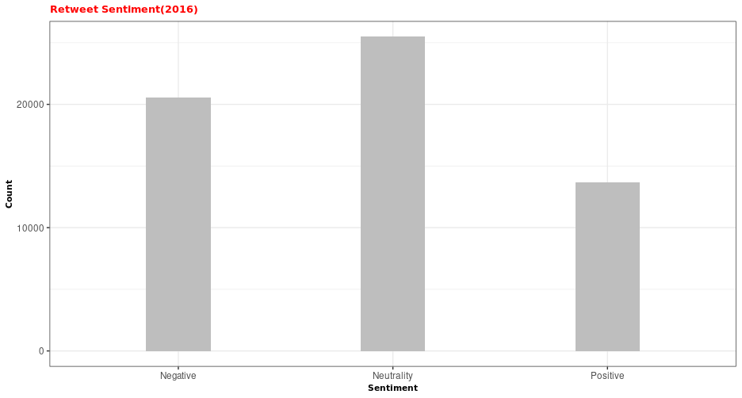

```{r setup, include = FALSE}
knitr::opts_chunk$set(echo = FALSE, message = FALSE, warning = FALSE, htmltools.dir.version = FALSE)

xaringanExtra::use_xaringan_extra(c("tile_view", # O
                                    "broadcast", 
                                    "panelset",
                                    "tachyons"))


library(pacman)

p_load(icons)

# Functions preload
set.seed(313)
```

## Overview

1. Myth of Online Participation
1. Psycho Path of Responding to Political News
1. Loyalists in Weibo
1. Preliminary Findings


.footnote[\* Also thanks for the efforts of Siyu Sun and Meng Zhu]

---

class: inverse, bottom

# Participation .huge[&#8799;] Care

---

class: center, middle

 .huge[vs.] 


--

&dArr;    
.large[What .red[motivates]?]

.red[Media] influence;    
.red[Government-mass] relationship;    
.red[Political participation] in the Age of Internet


???

Apathy: Both democracy & autocracy

Lijphart, Arend. 1976. The Politics of Accommodation: Pluralism and Democracy in the Netherlands. Berkeley, Los Angeles, London: Univ of California Pr.

Rosenbergr, Morris. 1954. “Some Determinants of Political Apathy.” Public Opinion Quarterly 18(4): 349–66.


Xiaojun, Yan. 2014. “Engineering Stability: Authoritarian Political Control over University Students in Post-Deng China.” The China Quarterly (218): 493–513.


Mobilizing to participate: Niche responding, communicative techniques (framing, priming, agenda setting), ideology/identity mobilizing(nationalism/fandom)

---

## Myth of Participation: What Do We Know and We Don't

.pull-left[
### Criteria of Media Influence

Exposure (Likes, subscriptions)   
Participation (Comments, retweets)
]

--

.pull-right[
### Empirics

Exposure .red[&ne;] Acceptance .small[(e.g., Zaller 2013)]   
Participators .red[&ne;] Supporters .small[(e.g., 高宪春 2011; Zhang & Tomlinson 2012; Pan & Siegel 2020)]

]

--

.center[
.red[Motivations] to participate
]

--

.pull-left[
### We Know

Media influence
+ Path .small[(Maxwell 1972; 孙忠良, 2014)]
+ Content .small[(Belousov 2012; Rich 2014; 马得勇 & 王丽娜, 2016)]
+ Empowered Audience    
.small[(Morley 1993; Hall et al. 2003; Wedeen 2015)]

]

???

Path dependency: Filter bubble
Content analysis: Echo chamber

--

.pull-right[
### We Don't (Yet)

1. Who care .small[(Stockman 2010, 2015; Hu & Shao 2021)]
1. Why participate 🌟

]

???
Talk to:

The .red[influence] of media    
The .red[mechanisms] of government-mass interaction

---

class: inverse, bottom

# Why Responding to Political News
A Poltiical-Psychologic Framework

---

## Rethink of Media Influence via the Loyalists' Eyes

Those who spread the state-media messages

+ .red[Active & puzzling] participators
    + Extent
    + Aspects
    + Motivations
    
+ Beyond the content and path
+ If loyalists ..., then...?

---

## Psycho Paths of Participation

.pull-left[
.center[Indoctrination]

]

.pull-right[

.red[Content] matters.

> H<sub>1</sub>: Posters spread wider and sooner due to the posts per se.

]

---

class: middle


.pull-left[
.red[Demand] matters.

> H<sub>2</sub>: Posters spread wider and sooner if more retweeters have emotional or expressive pursuits.
]

.pull-right[
.center[Active audience]

]

---

class: center, middle

Social network    


.red[Connection] matters.

> H<sub>3</sub>: Posters spread wider and sooner when one is in a social network of retweeters

---

class: inverse, bottom

# Loyalists in Weibo
An Empirical Examination

---

## Data

.pull-left[
+ Peripheral political events

+ Top state-media Weibo retweets (&plusmn; 7 days)
+ 2014: 
    + 49 posts &larr; 4,243 retweets
+ 2016: 
    + 193 posts &larr; 59,647 retweets
]

.pull-right[

]

---

## Trend of Spreading 




???

State-media or commercial state-media leading the threads

---




???

Near and political center

Personal and political connections

---

background-image: url("images/retweetTrend2016.png")
background-position: center
background-size: contain

???

Unit is hours

Fluent not fading down

---





.center[]

???

1. Actual comments appears right after. Except for that, the sentiment distribution does not alter very much
1. Polarization does not fade out, but the sentiment turns to more positive
1. It seems neutral posts are the majority category, but...

---

Example Post 1

.bg-black.golden.ba.shadow-5.ph4.mt3.center[
小英子，看你还能撑多久

]

Example Post 2

.bg-black.golden.ba.shadow-5.ph4.mt3.center[
祖国一天不统一，我就一天不娶媳妇儿
]

Example Post 3

.bg-black.golden.ba.shadow-5.ph4.mt3.center[
恭喜蔡女士任福建省台湾县县长，享受副处级待遇
]

---

## Measurement

.pull-left[

## Mixed Coding Process

+ Computer: .red[Signal] analysis
+ Human: .red[Semantic] analysis
+ Multidimensional coding

### OVs

1. Extensiveness
1. Duration
1. Retweet Sentiment

### Controls

1. Retweeters' gender
1. Spatial distribution
1. Event Difference

]

.pull-right[

### EVs

1. Indoctrination (Original Post)
    + Content
    + Sentiment
    + Timing 
1. Active Audience
    + Emotion
    + Expression
        + Ideology
        + Apathy
        + Sensitivity
        + Timing
1. "Loyal" network
    + Identity
    + Position in the Net
    + Similarity


]

---

class: bottom, inverse

# Preliminary Results

---

background-image: url("images/number.png")
background-position: center
background-size: contain


---

background-image: url("images/sentiment.png")
background-position: center
background-size: contain

---

background-image: url("images/duration.png")
background-position: center
background-size: contain

---

background-image: url("images/r2trend.png")
background-position: center
background-size: contain

---

## Future Plan

1. Better ways to identify the important factors
1. Better network analysis
1. Retweeter-based analysis


---

class: inverse, center, middle

# Thank you!

`r feather_icons("mail")`&nbsp;[yuehu@tsinghua.edu.cn](mailto:yuehu@tsinghua.edu.cn) 

`r feather_icons("globe")`&nbsp; https://sammo3182.github.io/

`r feather_icons("github")`&nbsp; [sammo3182](https://github.com/sammo3182)


