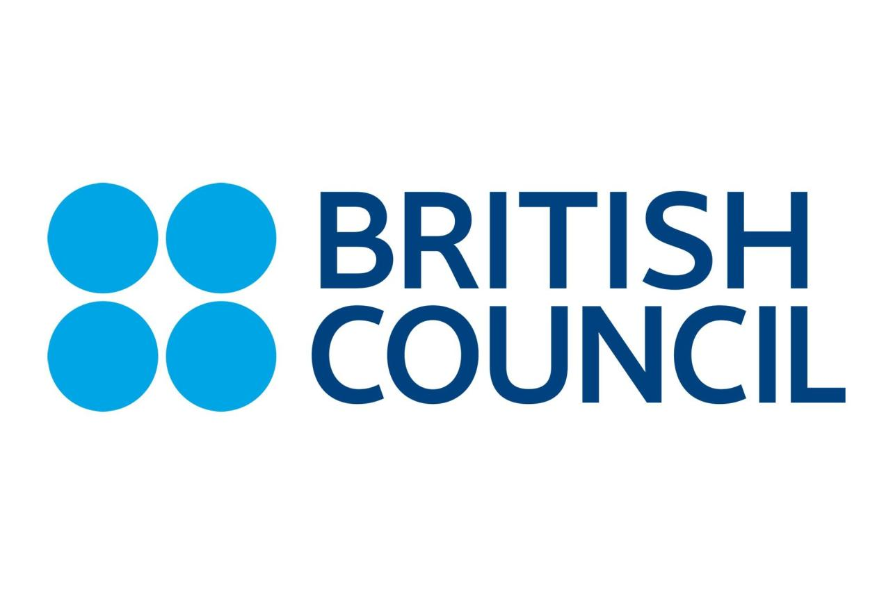
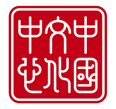
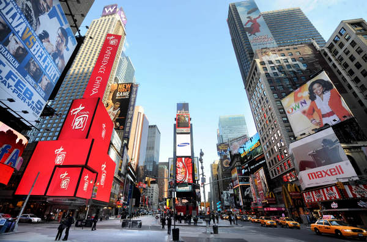

class: center, middle, normal

```{r setup, include = FALSE}
knitr::opts_chunk$set(echo = FALSE, message = FALSE, warning = FALSE, htmltools.dir.version = FALSE)

xaringanExtra::use_xaringan_extra(c("tile_view", 
                                    "broadcast", 
                                    "panelset",
                                    "tachyons"))


library(pacman)

p_load(icons)

# Functions preload
set.seed(313)
```


## Overview

- Confucius Institutes (CI): A Comparative Bio
- CIs "Do Not Work"
- CIs "Work"
- CI Closure: Work?

???

Xie, Tao, and Benjamin I. Page. 2013. “What Affects China’s National Image? A Cross-National Study of Public Opinion.” Journal of Contemporary China 22(83): 850–67.

Brazys, Samuel, and Alexander Dukalskis. 2019. “Rising Powers and Grassroots Image Management: Confucius Institutes and China in the Media.” The Chinese Journal of International Politics 12(4): 557–84.

---

class: bottom, inverse

# Confucius Institutes (CI): A Bio

---

class: center

## History of CIs

.pull-left[

*1999*    


]

.pull-right[
*2001*


]

???

https://opinion.huanqiu.com/article/9CaKrnJv6F1

金灿荣

第一次泛滥是在1992-1993年间，鼓吹者从意识形态、社会制度乃至文明角度展开了对"中国威胁论"的具体论证。美国费城外交政策研究所亚洲项目主任芒罗首先发难，发表了《正在觉醒的巨龙：亚洲真正的威胁来自中国》，一时间"中国威胁论"风靡太平洋东岸，芒罗因而也声名显赫。哈佛大学教授亨廷顿那篇高论《文明的冲突与世界秩序的重建》也在这个大背景下问世。
前者渲染中美军事冲突不可避免，后者断言儒教文明与伊斯兰教文明的结合将是西方文明的天敌，具有极强的意识形态色彩，美国学者哈克特更是危言耸听，"在苏联解体后，一个新的邪恶帝国正在出现，它的名字叫中国"。此后，每隔一段时期，"中国威胁论"都会出现。

第二波发端于1995-1996年，主要与李登辉访问美国后两岸关系紧张，中美围绕台湾问题发生军事对峙有关。

第三次发生在1998-1999年，其背景是在亚洲经济危机中，中国经济逆势崛起，经济影响力迅速扩大。

进入21世纪后，“中国威胁论”已经是第四波了，其特点是威胁论的内容日益扩大，往往涉及人们的日常生活，如中国计算机黑客威胁论、食品安全威胁论、环境威胁论等等。

--

Launched since 2004

--

> The brightest brand of China's soft power ---Xu Lin (2007)


???

国家汉办主任许琳说,孔子学院已成为体现中国“软实力”的最亮品牌,孔子学院已经成为当代中国“走出去”的符号

---

class: center

## "Foreign CIs"

Spatially





???

歌德学院、塞万提斯学院、英国文化中心，中国文化中心（China Cultural Centre)

--

Temporarily





???

胡锦涛2011访美，纽约时代广场同步宣传片

---

class: center, middle

.normal[
.gray[How are they different? ]

Do they work?
]

---

class: bottom, inverse

# "Do Not Work": A Comparative View

---

## Research Puzzle

Effect of National Image Building

1. Critical part of public diplomacy    
.small[(Barr 2012)]
1. Altering public attitudes towards the sender     
.small[(Kotler and Gertner 2002; Rose 2019)]

Cutting-In Angles:

- Enthusiasm of the government (public diplomacy)     
.small[(Zhang, CAmeron 2003; Cai, Lee, Pang 2009)]
- Aggregate perceptions of China abroad     
.small[(Page, Rabinovich, Tully 2008)]
- Individual-level determinants of perceptions    
.small[(Xie, Page 2010; Lee, Melissen 2011)]
- The role of international communication     
.small[(Wang 2011)]

???

Enthusiasm of the government (public diplomacy)

- Cai Peijuan, Lee Peiting and Augustine Pang, ‘Managing a nation’s image during crisis: a study of the Chinese government’s image repair efforts in the “made in China” controversy’, Public Relations Review 35(3), (2009), pp. 213– 218; 
- Juyan Zhang and Glen T. Cameron, ‘China’s agenda building and image polishing in the US: assessing an international public relations campaign’, Public Relations Review 29(1), (2003), pp. 13– 28.

Aggregate perceptions of China abroad
- Benjamin I. Page, Julia Rabinovich and David G. Tully, ‘How Americans feel about Asian countries and why’, Journal of East Asian Studies 8(1), (2008), pp. 29–59; 


Individual-level determinants of perceptions
- Tao Xie and Benjamin I. Page, ‘Americans and the rise of China as a world power’, Journal of Contemporary China 19(65), (2010), pp. 479–501; 
- Sook Jong Lee and Jan Melissen, eds, Public Diplomacy and Soft Power in East Asia (New York: Palgrave Macmillan, 2011)

The role of international communication
- Jianwei Wang, Soft Power in China: Public Diplomacy Through Communication (New York: Palgrave Macmillan, 2011).

University of Macau, dept. of government and public administration

---

## Before the Effect, Why Bother (for China)

- Economic Growth
    - 2009, overtook Germany as the largest exporter
    - 2009, surpassed the U.S. as the largest auto market
    - 2010, replaced Japan to be the 2nd economy

- International Contribution
    - Over 14,000 peacekeeping personnel on 25 multilateral missions
    - The third largest quota share in the IMF

- "Collapse of China" + "China Threat"
    - 1991: Overseas Publicity Department within the Central Committee of CPC; Information office under the State Council
---

class: bottom, inverse

# "Work"

---

class: bottom, inverse

# Work "Afterlife"?

---

## Objective

.pull-left[
NIB:

1. Critical part of public diplomacy (Barr 2012)
1. Altering public attitudes towards the sender (Kotler and Gertner 2002; Rose 2019)
]

.pull-right[]

???

Regardless of power 

---

## What We've Already Known

### Source

1. Branding effect (Boulding 1959; Buhmann 2016)
1. Identity construction (Ohad and Bar-Tal 2009)

--

### Means

1. Macro and micro levels (Barr 2012; Xie and Page 2013)
1. Cultural institutions (Brett and Schaefer 2019; Ichijo 2012; Kluver 2014; Lanshina 2015; Vyas 2008, 2008; Weir and O’Sullivan 2017)

???

macro-level (e.g., domestic and economic and social development) and micro-level factors (e.g., elite-level communications and ethnic identities) 

--

### Effect

1. Effective (Brazys and Dukalskis 2019a; Meng 2020; Owen IV 2010).
1. Noneffective (Lien, Oh, and Selmier 2012; Xie and Page 2013)

---

## Missing Fact in the Litrature: NIB resilience

Well observed, though (N. Abu-Nasr 2019; Ainslie, Lipura, and Lim 2017; Cowen 2007; PTI 2016, ; Riley and Horowitz 2021; Russia Today 2021; Sishuwa 2019)

+ Area: Middle East, Asia, and Africa
+ Power: U.K., Germany, and Russia
+ Within area: Anti-Hallyu movements in Asia

--

.center[
### Understudied

+ Few research 
+ Power imbalance
+ Case studies
]

???

Brannagan and Giulianotti 2018, “The Soft Power–Soft Disempowerment Nexus: The Case of Qatar.” International Affairs 94(5): 1139–57

Soft disempowerment other competitors (states, the media, corporate entities and non-governmental organizations) publicly shame opponents for any perceived immoral, unethical and/or illegitimate (in)actions. 

Messerlin, Patrick, Hwy-Chang Moon, and Jimmyn Parc. 2020. “Cultural Industries in the
Era of Protectionism.” Global Policy 11(S2): 5–6


---

## CI and CI Closure

.left-column[
### CI
]

.right-column[
.center[

]
+ Planned 2002 and used to lead by *Hanban*
+ Non-profit, education institutions
+ 550 + 1,172 (100 + 80) 
+ Part of NIB of China

]

???

Managed by the Chinese International Education Foundation since 2020

Confucius institute and classroom

---

## CI and CI Closure

.left-column[
### CI
### CI Closure
]

.right-column[
.center[]

1. Since 2004
1. Sever strike against CI
1. Unique Opportunity for research

]

---

background-image: url("images/map_closed.gif")
background-position: center
background-size: contain

class: bottom, right


.red[Sufficient] data   
Power .red[balance]   
.red[Consistent] bilateral relationship   

---

## Resistance vs. Resilience

.center[
Who drove the closures？

]

???

> $H_{1.0}$ (School-driven): CI closures were mainly driven by universities' preferences; public schools were less likely to close CIs.

> $H_{1.1}$ (Politics-driven): CI closures were mainly driven by political preferences; public schools were more likely to close CIs because of the political ideology of the state.

---

.center[Consequences of the Closure]

.pull-left[

]

--

.pull-right[

]

???

> $H_{2.0}$ (Shutting down): CI closures erase the national image of China.

> $H_{2.1}$ (Ice cream): CI closures diminish the NIB efforts of China but do not eliminate all the positive effects.

---

## Examining NIB Resistance

### Data

.pull-left[
+ Subset I
    + CI status
    + University features
    + Government features 
]

.pull-right[
+ Subset II
    + From GDELT 
    + 2004--2020, China related
    + Attention and tones
    + Media-oriented CI distribution
        + 25, 50, 75, 100, 1000km
]

---

### Method

+ Drivers: Conditional effect

\begin{align}
CI\ Status =& \beta_0 + \boldsymbol{School\ Factors}\beta_1 + \boldsymbol{Political\ Factors}\beta_2 + \\
& \beta_3Trade\ War\times Public\ School + \epsilon.
\end{align}

.center[
School factors: Characters of universities   
Political factors: Federal and state
]

+ Consequences: Multi-shock DID with sparse data

$$Media\ Response = \beta_0 + \beta_1Opening\times Closure + \boldsymbol{Controls}\beta + \epsilon.$$
.center[Media response: Media attention + average media tone]

---

background-image: url("images/closeEffect.png")
background-position: center
background-size: contain

## Results

---

background-image: url("images/freqEffect.png")
background-position: center
background-size: contain

---

## What Can We Learn

1. Public diplomacy: Resistance yet resilience
1. Soft power: Empirical evidence and mechanism 
1. Culturalist approach: Manageable yet vulnerable

???

1. Two powers, show what works and what remains
1. Empirical evidence of soft power at the mass level
1. Culture is manageable yet it is also vulnerable.

---

class: inverse, center, middle

# Thanks

`r feather_icons("mail")`&nbsp;[yuehu@tsinghua.edu.cn](mailto:yuehu@tsinghua.edu.cn) 

`r feather_icons("globe")`&nbsp; https://sammo3182.github.io/

`r feather_icons("github")`&nbsp; [sammo3182](https://github.com/sammo3182)

