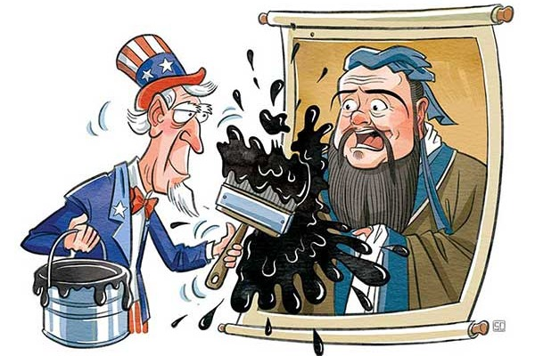

class: center, middle, normal

```{r setup, include = FALSE}
knitr::opts_chunk$set(echo = FALSE, message = FALSE, warning = FALSE, htmltools.dir.version = FALSE)

xaringanExtra::use_xaringan_extra(c("tile_view", 
                                    "broadcast", 
                                    "panelset",
                                    "tachyons"))


library(pacman)

p_load(icons)

# Functions preload
set.seed(313)
```


## Brief

National image building (NIB) and resilience

--

Confucius Institutes (CIs) and CI closures in the U.S. 

--

How to .red[examine] the closure effect?

--

Do the closures .red[affect] the NIB effort,     
to what *extent* and on which *aspect*?

--

What do we .red[learn]?

---

## Objective

.pull-left[
NIB:

1. Critical part of public diplomacy (Barr 2012)
1. Altering public attitudes towards the sender (Kotler and Gertner 2002; Rose 2019)
]

.pull-right[]

???

Regardless of power 

---

## What We've Already Known

### Source

1. Branding effect (Boulding 1959; Buhmann 2016)
1. Identity construction (Ohad and Bar-Tal 2009)

--

### Means

1. Macro and micro levels (Barr 2012; Xie and Page 2013)
1. Cultural institutions (Brett and Schaefer 2019; Ichijo 2012; Kluver 2014; Lanshina 2015; Vyas 2008, 2008; Weir and O’Sullivan 2017)

???

macro-level (e.g., domestic and economic and social development) and micro-level factors (e.g., elite-level communications and ethnic identities) 

--

### Effect

1. Effective (Brazys and Dukalskis 2019a; Meng 2020; Owen IV 2010).
1. Noneffective (Lien, Oh, and Selmier 2012; Xie and Page 2013)

---

## Missing Fact in the Litrature: NIB resilience

Well observed, though (N. Abu-Nasr 2019; Ainslie, Lipura, and Lim 2017; Cowen 2007; PTI 2016, ; Riley and Horowitz 2021; Russia Today 2021; Sishuwa 2019)

+ Area: Middle East, Asia, and Africa
+ Power: U.K., Germany, and Russia
+ Within area: Anti-Hallyu movements in Asia

--

.center[
### Understudied

+ Few research 
+ Power imbalance
+ Case studies
]

???

Brannagan and Giulianotti 2018, “The Soft Power–Soft Disempowerment Nexus: The Case of Qatar.” International Affairs 94(5): 1139–57

Soft disempowerment other competitors (states, the media, corporate entities and non-governmental organizations) publicly shame opponents for any perceived immoral, unethical and/or illegitimate (in)actions. 

Messerlin, Patrick, Hwy-Chang Moon, and Jimmyn Parc. 2020. “Cultural Industries in the
Era of Protectionism.” Global Policy 11(S2): 5–6


---

## CI and CI Closure

.left-column[
### CI
]

.right-column[
.center[

]
+ Planned 2002 and used to lead by *Hanban*
+ Non-profit, education institutions
+ 550 + 1,172 (100 + 80) 
+ Part of NIB of China

]

???

Managed by the Chinese International Education Foundation since 2020

Confucius institute and classroom

---

## CI and CI Closure

.left-column[
### CI
### CI Closure
]

.right-column[
.center[]

1. Since 2004
1. Sever strike against CI
1. Unique Opportunity for research

]

---

background-image: url("images/map_closed.gif")
background-position: center
background-size: contain

class: bottom, right


.red[Sufficient] data   
Power .red[balance]   
.red[Consistent] bilateral relationship   

---

## Resistance vs. Resilience

.center[
Who drove the closures？

]

???

> $H_{1.0}$ (School-driven): CI closures were mainly driven by universities' preferences; public schools were less likely to close CIs.

> $H_{1.1}$ (Politics-driven): CI closures were mainly driven by political preferences; public schools were more likely to close CIs because of the political ideology of the state.

---

.center[Consequences of the Closure]

.pull-left[

]

--

.pull-right[

]

???

> $H_{2.0}$ (Shutting down): CI closures erase the national image of China.

> $H_{2.1}$ (Ice cream): CI closures diminish the NIB efforts of China but do not eliminate all the positive effects.

---

## Examining NIB Resistance

### Data

.pull-left[
+ Subset I
    + CI status
    + University features
    + Government features 
]

.pull-right[
+ Subset II
    + From GDELT 
    + 2004--2020, China related
    + Attention and tones
    + Media-oriented CI distribution
        + 25, 50, 75, 100, 1000km
]

---

### Method

+ Drivers: Conditional effect

\begin{align}
CI\ Status =& \beta_0 + \boldsymbol{School\ Factors}\beta_1 + \boldsymbol{Political\ Factors}\beta_2 + \\
& \beta_3Trade\ War\times Public\ School + \epsilon.
\end{align}

.center[
School factors: Characters of universities   
Political factors: Federal and state
]

+ Consequences: Multi-shock DID with sparse data

$$Media\ Response = \beta_0 + \beta_1Opening\times Closure + \boldsymbol{Controls}\beta + \epsilon.$$
.center[Media response: Media attention + average media tone]

---

background-image: url("images/closeEffect.png")
background-position: center
background-size: contain

## Results

---

background-image: url("images/freqEffect.png")
background-position: center
background-size: contain

---

## What Can We Learn

1. Public diplomacy: Resistance yet resilience
1. Soft power: Empirical evidence and mechanism 
1. Culturalist approach: Manageable yet vulnerable

???

1. Two powers, show what works and what remains
1. Empirical evidence of soft power at the mass level
1. Culture is manageable yet it is also vulnerable.

---

class: inverse, center, middle

# Thanks

`r feather_icons("mail")`&nbsp;[yuehu@tsinghua.edu.cn](mailto:yuehu@tsinghua.edu.cn) 

`r feather_icons("globe")`&nbsp; https://sammo3182.github.io/

`r feather_icons("github")`&nbsp; [sammo3182](https://github.com/sammo3182)

