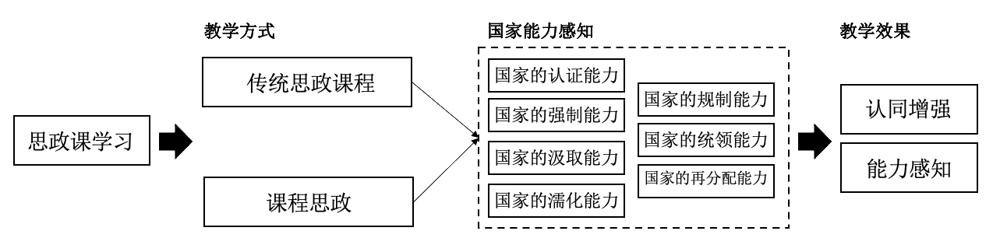

```{r setup, include = FALSE}
knitr::opts_chunk$set(echo = FALSE, message = FALSE, warning = FALSE, htmltools.dir.version = FALSE)

xaringanExtra::use_xaringan_extra(c("tile_view", # O
                                    "broadcast", 
                                    "panelset",
                                    "tachyons"))


library(pacman)

p_load(icons)

# Functions preload
set.seed(313)
```
## 学生培养

+ 陈华垚等：“立言·立行·立心：多维度锻造“社稷担当”研究生主题教育品牌”; 
+ 李秋甫等：“学院特色、品牌建设与平台搭建：学生工作发力点形成机制探析”。

## 科学精神

+ 孙宇飞，汤霓：“教育式宣传与宣传式教育：基于思政课教学的实验研究”。

---

## 立言·立行·立心：多维度锻造“社稷担当”研究生主题教育品牌

陈华垚，陈翔宇，党森，王可即，张子牧，庄凌云


---

class: small

## 学院特色、品牌建设与平台搭建：学生工作发力点形成机制探析

李秋甫，黄思奕，戎珂

+ 背景：学院本科生招生结构性变化；疫情影响下暴露的心理建设短板；学生思想多样
    + 大陆生占比降低，家庭经济状况和个人综合素质**两极化**；港澳台和国际学生在参与学生工作中呈现巨大潜力
    + 普遍重视学业成绩（即使没有分流压力），对社科**缺乏专业认知和实践**
    + 在入党和社会实践、公益志愿上积极，在文体活动上容易被动员但实力不均
    + 渴望集体和组织的**归属感**，但受疫情、军训推迟、自卑心理、思想多元等使班团**集体建设更困难**
    + 心理危机增多，思想多元，亚文化青年群体持续存在，极个别同学在意识形态上**容易入歧途**

+ 发力点1：思想引领与特色育人
    + 党、校、院三史融合学习：学生组首先提出“明斋伴我成长”系列活动，将党史、校史与明斋史学习有机结合
    + 学生组织功能性党支部建设：学院团委联合学生会、学生科协建立功能型党支部，在校内形成示范引领效应 
    + 特色育人专项计划日趋成熟：社工骨干“至善计划”积极推进院校资源互通，设立学术创新人才“格致计划”

+ 发力点2：五育并举与优质平台打造
    + 以社会调研为根本传统与历史传承，面向同学需求，反映社科学生工作实际问题，寻求解决办法，四获校金奖
    + 成立宣传中心，整合三口宣传渠道、打造宣传品牌；秉持人文关切，传递涉世温度，创立“社氏一度”专栏；注册微信视频号，推出短视频记录社科同学日常生活和文体赛事精彩瞬间，主动传播社科文化 
    + 社会实践蓬勃开展，支队参与度更高、社会影响力更大、学生成长性更强，打造学院实践“历变城乡”品牌项目 

+ 发力点3：组织建设与制度保障
    + 优化辅导员与业务办分工，减轻导员事务性工作，突出思想育人作用

---

class: center

## 教育式宣传与宣传式教育：基于思政课教学的实验研究

孙宇飞, 汤霓

.bg-black.golden.ba.shadow-5.ph4.mt3[
思政课是落实立德树人根本任务的关键课程，思政课作用不可替代

.tr[
---习近平，在学校思想政治理论课教师座谈会上的讲话 (2019)
]
]

???

教育部职业技术教育中心研究所助理研究员

--

.large[
以.red[政治传播学]和.red[政治心理学]审视思政课

&dArr;

学习 .red[.large[&#8799;]] 习得
]

---

class: center, normal

## 研究问题

学习 .red[.large[&#8799;]] 习得

&dArr;

思政课对公众影响的.red[心理机制];

\+ 

思政课的.red[形式]对教学效果的影响

&dArr;

如何讲.red[好]思政课

---

## 政治科学视角下的的思政教育

.left-column[
### 两种信号
]

.right-column[
.normal[
- 灌输机制：信息 &rarr; 信仰   
(Jowett et al., 2018; Arceneaux, 2020)
- 信号机制：宣传.red[不是]塑造个人的政治偏好    
(Huang, 2015)
]
]

???

灌输机制：向社会发布对自己有利的知识或新闻 [@JowettODonnell2018]。

信号机制：政治宣传往往不是为了说服 [@Arendt2007]，即使民众不喜欢、不相信政治宣传，重新计算自己的反抗成本，从而减少对政府提出反对的意识和行动。宣传不是塑造个人的政治偏好，而是通过影响他们对国家能力的感知来发挥作用。[@Huang2018]

---

## 政治科学视角下的的思政教育

.left-column[
### 两种信号
### 实践方式
]

.right-column[
.normal[
- 宣传 vs. 知识
- 演示文稿 vs. 教师呈现
- 思政课程 vs. 课程思政
]
]

---

## 研究问题与假设

问题1: 公众通过思想政治课的学习会具体感知什么*国家能力*？

问题2: 什么形式的思想政治课能有效提升*民众认同*、*能力感知*和*思政课
喜好*？

--



???

研究假设 1.1: 公众通过思想政治课的学习会感知到政府的强制性能力；    
研究假设 1.2: 公众通过思想政治课的学习会感知到政府的非强制性能力；    

研究假设 2.1: 宣传导向的思想政治课在提升民众对政府强制性能力感知方面更有效；    
研究假设 2.2: 知识导向和实践导向的思想政治课在民众对政府的非强制性能力感知    
和通过说服机制提升认同方面更有效；    
研究假设 2.3: 不同的教师呈现方式对思想政治课的学习效果没有影响。    


---

### 实验设计与数据采集

.left-column[

### 干预变量

]

.right[


]

???

调查问卷的析因实验设计，根据思政课的3种内容形式和两种教师呈现方式，生成六种不同的实验干预，通过向不同受访者随机展示六类教学视频作为干预，比较六类干预状态下的教学效果。通过随机化的方式，平均化其他个体间混淆因素的影响，进而能够使用传统的回归分析实现因果效应的推断。

---

## 实验设计与数据采集

.left-column[

###干预变量
### 响应与控制变量

]

.right[


控制变量：性别、年龄、年级、专业、班级规模、对所在学校的喜好程度、政治面貌

]

---

## 实验设计与数据采集

.left-column[

### 干预变量
### 响应与控制变量
### 数据获取

]

.right[

"高等职业学校在线教育问卷调查"(MoE, 2021)   
29省份, 97职业院校, 6030学生


]

---

background-image: url("images/figure3.png")
background-position: center
background-size: contain

## 实验结果

---

background-image: url("images/figure4.png")
background-position: center
background-size: contain

---

## 结论与启示

### 结论

1. 学生学会了什么： 非强制性 .red[>] 强制性
    
1. 哪种方式更有效： 课程思政 .red[>] 思政课程


--

### 启示

思想站位 + 社会情怀 + 科学视角

.bg-black.golden.ba.shadow-5.ph4.mt3[
人们为着要在社会上得到自由，就要用社会科学来了解社会、改造社会。

.tr[
---毛泽东，在陕甘宁边区自然科学研究会成立大会上的讲话 （1940）
]
]


---

class: inverse, center, middle

# 感谢聆听!

`r feather_icons("mail")`&nbsp;[yuehu@tsinghua.edu.cn](mailto:yuehu@tsinghua.edu.cn) 

`r feather_icons("globe")`&nbsp; https://sammo3182.github.io/

`r feather_icons("github")`&nbsp; [sammo3182](https://github.com/sammo3182)

```{r pdfPrinting, eval = FALSE, include = FALSE}
pagedown::chrome_print(list.files(pattern = "indoctrination.html"), timeout = 300)
```