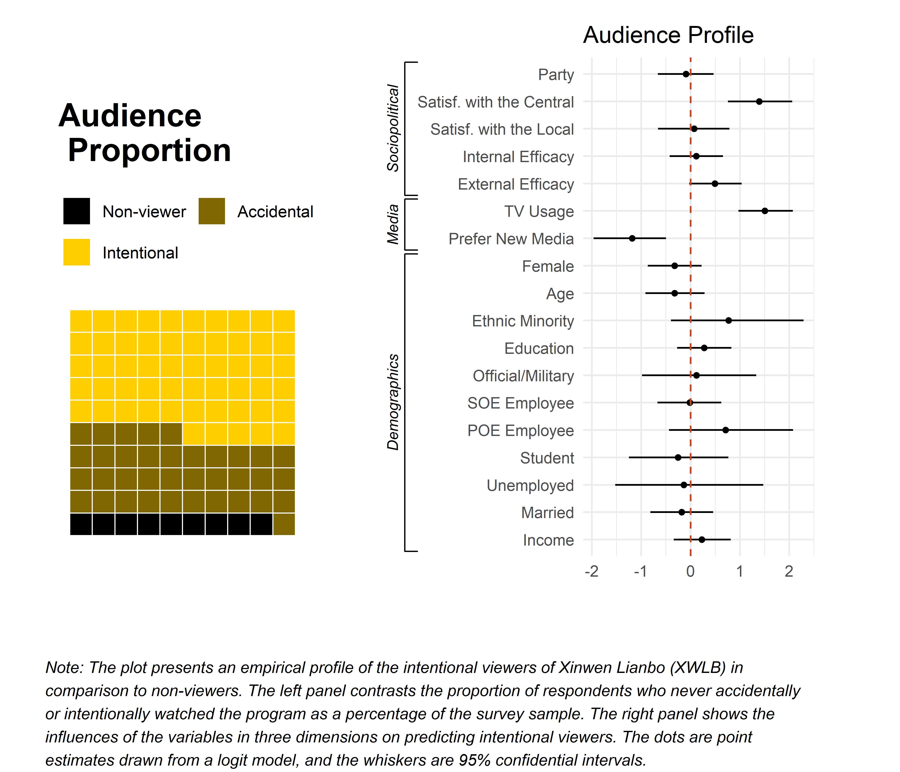
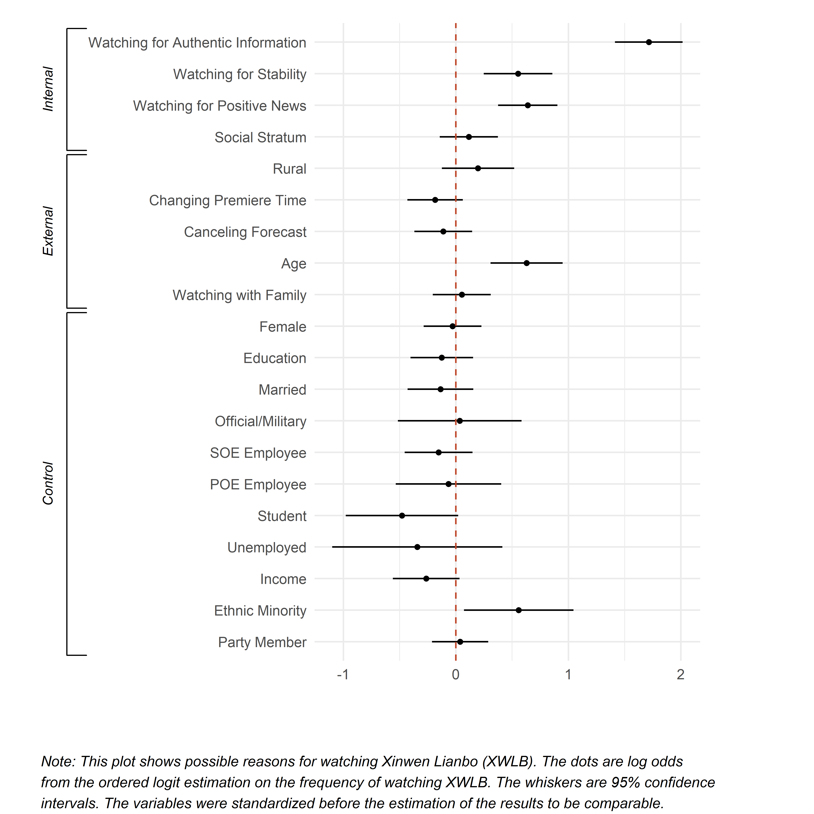

## State-Media Audience

Fact 1: Large group

Xinwen Lianboweekday >  (ABC + CBC + NBC)weekend

--

Fact 2: Understudied (exc. Stockmann 2010, 2015)

1. New media emergence
1. People can identify political indoctrination

---

## Puzzle: Who and Why?

1. Who are watching state-media broadcast, e.g., Xinwen Lianbo(XWLB)
1. .magenta[What drives them to watch?]

---

## What Drives People to Watch: Supply? 

**Media inequality** Environments can restrict individuals' media pool and their choices, e.g, urban-rural difference.

**Historical inertia** Being indisposed to change the habit from the age of media scarcity.

**Family bundling** "Dad said he wanna watch Xinwen Lianbo..."

---

HSupply:

1. Rural residents are more likely to watch XWLB than urban residents.(`Rural`)
1. People who have historical inertia are more likely to watch XWLB more than those who do not. (`Age`, `Changing premiere time`, `Cancelling forecast`)
1. People watch XWLB more when it is a family habit (`W.family`).

---

### Demand?

**Information**: Authentic information from the government

**Gratification**: People choose television as the medium on purpose (Tang 2014); signals of stability, security, and development comfort people psychologically. 

---

HDemand:

1. People who are interested in information of which the government is the authentic source are more likely to watch XWLB.(`Policies`, `Political trend`, `Foreign affairs`; Placebo: `social issues`, `local economy`)
1. People who are interested in positive news are more likely to watch XWLB. (Direct: `Watching for stability`, `Watching for positive news`; Indirect: `social stratum`)

---

## DGP Strategy

The mostly unlikely case: internet users who still watch XWLB

1. Rapidly growing group (800 million, 4% increase/yr)
1. Holding alternative ways to collect information

---

&rArr; Survey of Information Collection Preferences of Chinese Citizens (SICP 2017)

1. Crowd-sourcing
1. Nationwide

--

### Potential data/specification biases? 

Solution: Coarsened exact matching (CEM)

--

### Social desirability?

Solution: List-experiment based adjustment

---

class: small

## Result: Who Are the Audience

.right-column[]
.left-columnp[
1. Large proportion of intentional audience (watched more than occasionally)
1. Audience characteristics: 
    + Pro-government
    + Interested in politics
    + Less new-media dependence
    + No difference in **partisanship, political efficacy, age, education, job, etc**.
]

---

class: small

## Result: Why Do They Watch

.right-column[]

.left-column[
Supply: 

* **Media inequality**: No
* **Historical inertia**: No, exc. age
* **Family bundling**: Negative

Demand:

* **Information**: Yes
* **Gratification**: Yes
]

---

## Take-Home Points

* Motivation: Demand > Supply
* Family bundling: Negative effects

&rArr; State-media audience is still there---and stabily---despite the rise of new media.

---

class: inverse, center, middle

# Thank you!

<i class="fa fa-envelope fa-lg"></i>&nbsp; [yuehu@tsinghua.edu.cn](mailto:yuehu@tsinghua.edu.cn)

<i class="fa fa-envelope fa-lg"></i>&nbsp; [shaozijie@vip.sina.com](mailto:shaozijie@vip.sina.com)