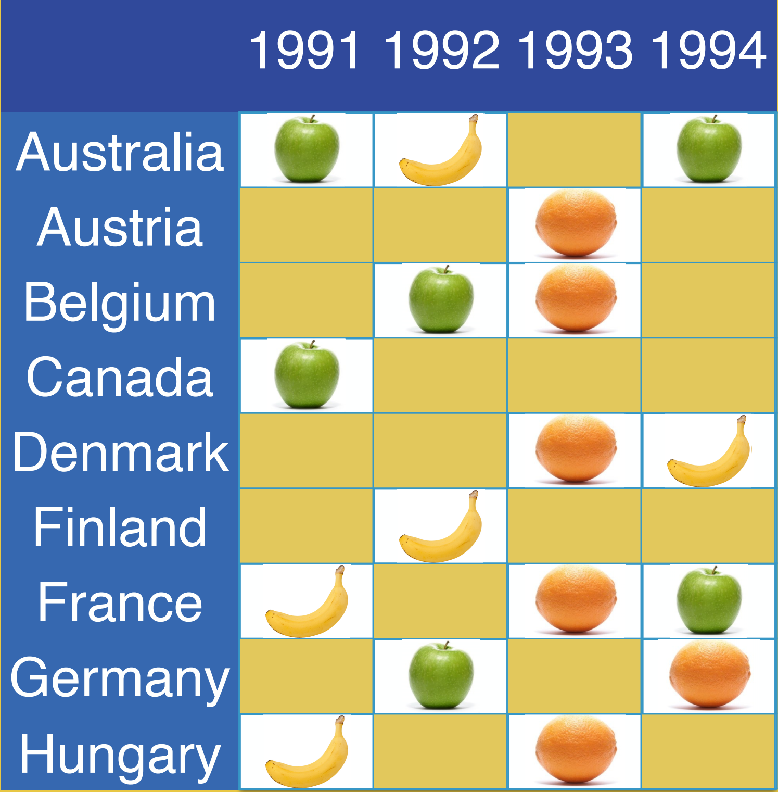

class: inverse, bottom

```{r setup, include = FALSE}
knitr::opts_chunk$set(echo = FALSE, message = FALSE, warning = FALSE, htmltools.dir.version = FALSE)

xaringanExtra::use_xaringan_extra(c("tile_view", # O
                                    "broadcast", 
                                    "panelset",
                                    "tachyons"))


library(pacman)

# Functions preload
set.seed(313)
```

# Overview

+ Common issue in comparative politics

+ Methodological solution

+ A New method: Dynamic Comparative Public Opinion (DCPO)

+ New findings 

---

class: center, middle

.bg-black.golden.ba.shadow-5.ph4.mt3.center[
Social scientists aim for patterns in a society.
]


.large[.blue[Common] issues]    
.small[Development, culture, democracy...]

\+ 

.large[.blue[Rich] data]    
.small[WVS, Global Barometers, ?GSS, Pew ...]


.large[.red[&#10504;]]

.large[General patterns]


---

## E.g.: Democracy &larr;?&rarr; Public support

Support .navy[&uarr;] &rarr; democracy .navy[&uarr;] .small[(e.g., Inglehart & Welzel 2005, Claassen 2019)]    
Support .navy[&uarr;] &rarr; democracy .orange[&#8675;] .small[(e.g., Fails & Pierce 2010)]

???

Countries with greater democratic support have been found to become stronger and more stable democracies

Inglehart, Ronald and Christian Welzel. 2005. *Modernization, Cultural Change, and Democracy*. Cambridge: Cambridge University Press. 

Fails, Matthew D. and Heather Nicole Pierce. 2010. “Changing Mass Attitudes and Democratic Deepening.” *Political Research Quarterly* 63(1):174–187.

(Insignificant positive with one-year survey, and insig negative with multiple years)

--

Democracy .navy[&uarr;] &rarr; support .navy[&uarr;] .small[(e.g., Wuttke et. al. 2020) ]   
Democracy .navy[&uarr;] &rarr; support .red[&darr;] .small[(e.g., Foa & Mounk 2017)]  
Democracy .red[&darr;] &rarr; support .navy[&uarr;] .small[(Claassen 2020)]

???
More experience with democracy yields more democratic support 
vs.
Long-established democracies are suffering from democratic fatigue 

Wuttke, Alexander, Christian Schimpf and Harald Schoen. 2020. “When the Whole Is Greater
than the Sum of Its Parts: On the Conceptualization and Measurement of Populist Attitudes and Other Multidimensional Constructs.” *American Political Science Review* 114(2):356–374.

Foa, Roberto Stefan and Yascha Mounk. 2017. “The Signs of Deconsolidation.” *Journal of Democracy* 28(1):5–15

thermostatic effect. 

---

## Puzzle Makers: Invisible Opinions

.red[Different] questions

.center[]

???
Why are there mixed results? 
Difficutlies in measuring. 
First, pub sp is latent variable, unobservable. Uncertainty. 
Sec, a big challenge is the sparced and fragmented data at aggregate level. 
churchihill items,  democracy has its probles, still the best one. 
milltary rule items, military should govern the country. what do you think. 
Worldwide survey project, 4 years. 
across countries, overtime. 

---

.red[Different] respondents

.pull-left[


]

--

.pull-right[


]

???

Different respondents have different concepts of democracy and different way to support democracy. 
United Kindom, lawmakers leave. 
Swarming Capital defending democracy.  

---

class: center, middle, large

.blue[Different] questions   
.blue[Different] people   
&dArr;    
.red[Incomparable] data   


--

w. 

.green[Latent variable analysis]


---

## Two-Parameter Item Response Theory (2PL-IRT)

.center[]

???

Difficulty/discrimination: how well a question can different people from below to above

Dispersion: magnitude of the measurement error

---

## Newest Development at Group Level

.center[IRT &rarr; MIRT &rarr; DGIRT &rarr; .red[D]ynamic .red[C]omparative .red[P]ublic .red[O]pinion]


.pull-left[

]

.pull-right[
Running time:   
Claasseen 2019 <
DCPO <
DGIRT
]


???
multilevel mixture ordinal item response model Stegmueller 2011

Caughey & Warshaw 2016, DGIRT, Claassen 2019, 2020

---

## DCPO

$$Pr(y_{ktqr} = 1) = logist^{-1}[\frac{\bar{\theta}'_{kt} - {(\beta_{qr} + \color{orange}{\delta_{kq}})}}{\sqrt{\alpha^2_q + (1.7\times \color{red}{\sigma_{kt}})^2}}]$$


.pull-left[
$\bar{\theta}$: Mean public opinion    
&beta;: Question difficulty   
&alpha;: Question dispersion
]

.pull-right[
.orange[&delta;]: Country-specific item bias   
.red[&sigma;:] Polarization in public opinion]

--

.green[Random walk priors] for opinion mean and sd

$$\bar{\theta}_{ktqr}\sim N(\bar{\theta}'_{k, \color{green}{t-1}}, \sigma^2_{\bar{\theta}'}),\sigma_{kt}\sim LN(\sigma_{k, \color{green}{t-1}}, \sigma^2_{\sigma})$$

???
D(dynamic)C(comparative)PO
model country specific-item to address equivalence. 
aggregate level public opinion 
polarizaiton 
ordinal scaled answers. 
The sophisticated measurement models ignite the hope on the studies of relationship between democratic development and public support. 

Claassen, Christopher. 2019. “Estimating Smooth Country–Year Panels of Public Opinion.” *Political Analysis* 27(1):1–20

Caughey, Devin, Tom O’Grady and Christopher Warshaw. 2019. “Policy Ideology in European
Mass Publics, 1981–2016.” American Political Science Review 113(3):674–693

Solt, Frederick. 2020b. “Modeling Dynamic Comparative Public Opinion.” SocArXiv
10.31235/osf.io/d5n9p.

---

background-image: url("images/irtCompare.png")
background-position: center
background-size: contain


???

Bounded: 使用logit归为0-1

---
background-image: url("images/irtFitCompare.png")
background-position: center
background-size: contain

---

## Uncertainty Matters


No uncertainty engaged &hArr; The latent variable is measured .orange["~~perfectly~~"].

&rArr; Biased coefficients and standard errors.

--

### Incorporating Uncertainty (Tai, Hu & Fred 2021)

1. .red[Repeated] Latent variable estimation (e.g., DCPO &times; 1000);
1. Regressing with the .navy[distribution];
1. .navy[Combination] with Rubin's Rule.

---

## Application: Replicate the Most Recent Findings 

Claassen 2020, AJPS; Claassen 2020 APSR

--

### More Data together with Better Method

1988~2020 (144 countries, 33 years)

Comparing with Claassen (2020a, 2020b):

> 26.2% .red[more] questions;     
33.3% .red[more] survey sources

---

background-image: url("images/visualizeAJPS-1.png")
background-position: center
background-size: contain

## Findings

---

background-image: url("images/visualizedAPSR-1.png")
background-position: center
background-size: contain

---

## Potential Explanations

.pull-left[
### Methodology

1. .navy[Multidimensional] support;
1. Conceptual .navy[Difference];
1. Relations with .navy[other values].

]

???

survey questions do not ask respondents how they prioritize democracy relative to other values with which it may come into conflict, such as their partisanship.cannot capture the extent

--

.pull-right[
### Theory

1. Effectiveness .red[>] existence
1. Support + .red[dissatisfaction]
1. .red[Elite] driven

]

???

It's is the combination of democratic support and dissatisfaction with current regime performance that generates demand for greater democracy

Qi, Lingling and Doh Chull Shin. 2011. “How Mass Political Attitudes Affect Democratization: Exploring the Facilitating Role Critical Democrats Play in the Process.” *International Political Science Review* 32(3):245–262

---

## Take-Home Points

1. Rethinking Democracy &harr; Public support: .red[~~Sanguine~~] assessment
1. Cross-section time-series diverse-question method: .blue[DCPO]
    + `DCPO`
    + `DCPOtools`
    
<iframe src="https://ctai.shinyapps.io/dmsweb/" height = 300 width = 1000></iframe>
    

???
Uncertainty caused by measurement and in concept. 
without taking uncertainty into account, no way of knowing whether their conclusions are correct or not even their studies have been published in top journals. 

Sanguine, super optimistic fate of democracies rely on their public, but is not well grounded. 
practioners and researchers interested in democracy and understanding democracies should work hard to figour out what is going one. 
we point several potential explanations, but we dont' know which one is right. each of them is worth additional research. 

---

class: inverse, center, middle

# Thank you!

`r icon::fontawesome("envelope", style = "solid")`&nbsp;[yuehu@tsinghua.edu.cn](mailto:yuehu@tsinghua.edu.cn) 

`r icon::fontawesome("globe", style = "solid")`&nbsp; https://sammo3182.github.io/

`r icon::fontawesome("github")`&nbsp; [sammo3182](https://github.com/sammo3182)


