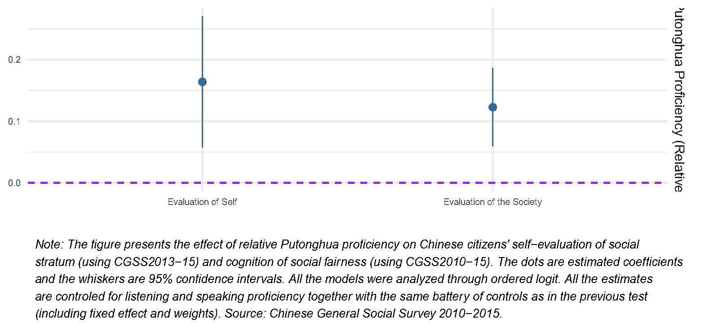

```{r setup, include = FALSE}
knitr::opts_chunk$set(echo = FALSE, message = FALSE, warning = FALSE, htmltools.dir.version = FALSE)

xaringanExtra::use_xaringan_extra(c("tile_view", # O
                                    "broadcast", 
                                    "panelset",
                                    "tachyons"))


library(pacman)

p_load(icons)

# Functions preload
set.seed(313)
```

## Overview

1. Linguistic Relativity in Poli Sci: An Over View
1. Policy-Based Language Effect: Two Competitive Theories
1. Empirical Examinations in the case of China
1. Findings and Implications

---

## Linguistic Relativity in Political Science

.center[]

What's the role of language in sociopolitical lives?
.pull-left[
Ex-ante cultural/cognitive differences    
.small[(Slobin 1996;Mazuka and Friedman 2000; Perlovsky 2009)]

]

???

Sapir-Whorf hypothesis

--

.pull-right[
.red[.large[vs.]]     

Framework modifying thoughts    
.small[(Pendakur and Pendakur
2002; Efrén O. Pérez and Tavits 2017, 2019; Schildkraut 2003;Hu 2020; Hu and Liu 2020)]
]

---

class: center, middle

### Potential Problem

*Ignoring* the communication function   
*Ignoring* the role of the government   
*Lab* data

--

.large[&dArr;]

.red[Policy-based] theory 

\+ 

.red[Observed] data 

\+ 

.red[Functional] measurement

---

## Policy-Based Language Effect: Two Theoretical Frameworks

State &rarr; language policies &rarr; official language w. others


--

.pull-left[
### Ethnolinguistic Theory (H<sub>1</sub>)

Cultural function of language

+ Accumulation .small[(Park 1950; Berry 1980)]:

Higher proficiency &rarr; political trust .blue[&uarr;]

+ Competition .small[(Kelly and Schauffler
1996; Michelson 2003; Rumbaut 1994)]

Higher proficiency &rarr; political trust .red[&darr;]

]

--

.pull-right[
### Official Language Field Theory (H<sub>2</sub>)

Communication functions of language

+ Listening &rarr; Familiar; aligning w. the gov. &rarr; Trust as the gov expects
+ Speaking &rarr; Internal .blue[&uarr;]; External .red[&darr;] &rarr; Trust .red[&darr;]
+ Relative &rarr; self-evaluation .blue[&uarr;]; social evaluation.blue[&uarr;] &rarr; Trust .red[&uarr;]

]


---

.pull-left[
## Design and Measurement

1. Examing the effect
1. Examing the mechanism

### Data

CGSS 2010-2015
+ Putonghua proficiency
+ Mechanism related variables
+ Political trust
]

--

.pull-right[
### Measurement

EV: 

1. Listening, Speaking
1. Relative: &Delta;<sub>si</sub> = s<sub>i</sub> - $\bar{s_k}$


OV: 

1. Effect: Trust in legislature, central & local gov, judiciary
1. Mechanism:
    + Political familiarity, obedience, banning policy, encouraging policy
    + Political interest, internal & external efficacy
    + Self evaluation, society evaluation

]

---

## Results

### Ethnolinguistic

.center[]


---

### OLF Effect

.center[]

---

### OLF Mechanism: Listening

.center[]

---

### OLF Mechanism: Speaking

.center[]

---

### OLF Mechanism: Relative

.center[]

---

## Conclusion and Discussion

OLF

+ Language works based on their .red[communication] functions
+ Listening, speaking, and relative affect political trust .red[differently] and all .red[together].

--

.center[
&dArr; 

1. Generality of language effect
1. Complexity of language effect
1. Policy-based language effect
1. Lanugage and human development
]
---

class: inverse, center, middle

# Thank you!

`r feather_icons("mail")`&nbsp;[yuehu@tsinghua.edu.cn](mailto:yuehu@tsinghua.edu.cn) 

`r feather_icons("globe")`&nbsp; https://sammo3182.github.io/

`r feather_icons("github")`&nbsp; [sammo3182](https://github.com/sammo3182)
