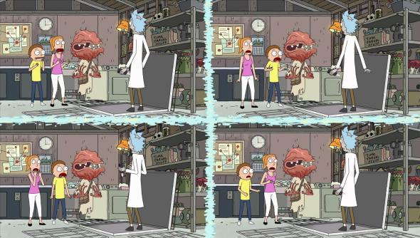

```{r setup, include = FALSE}
knitr::opts_chunk$set(echo = FALSE, message = FALSE, warning = FALSE, htmltools.dir.version = FALSE)

library(pacman)
p_load(icons, xaringanExtra)

use_xaringan_extra(c("tile_view", # O
                     "broadcast",
                     "panelset",
                     "tachyons",
                     "fit_screen"))
use_extra_styles(
  hover_code_line = TRUE,         #<<
  mute_unhighlighted_code = FALSE  #<<
)

# Functions preload
set.seed(313)
```

class: normal

## Overview

* Event Probability
* Calculating probabilities
* Presenting Probability
* Distribution

---

class: inverse, bottom

# Event Probability

---

## Event Probability

.center[To what extent an event may happen?]

.pull-left[
Determinist: Pr = 0/1


]

--

.pull-right[
Probabilist event: Pr &in; [0, 1]


]

---

## Understanding Probability

.pull-left[
**Classic ("objective") view**

"Coin has two sides, balance" &rArr; Pr(head) = 0.5.
]

.pull-right[
**Relative frequency view**

You are observing a random sample.

$${\displaystyle \lim_{n\to \infty}\frac{f(x)}{n}}$$
]

.center[
**Evolutionary ("subjective") view**

Bayesian, based on beliefs (prior), game theory
]

---

## Probability Evolution

<video width="1000" height="500" controls>
    <source src="images/prob_probability_Bbc.mp4" type="video/mp4">
</video>

---

class: inverse, bottom

# Calculating Probability

---

## How Do We Know an Event's Probability

1. Sample Point Method
1. Event Composition Method
1. Bayesian Method

???

Two ways to know the probability, but first to know what's sample space is.


---

## Sample Space

.center[Space of all possible outcomes]

--

Rules:

1. &sum; Pr = 1
1. All of the probability constitute the probability distribution
1. For all event in the space, $P(E) + P(\tilde E) = 1$

---

## Sample Point Method

Get the probability of an event

--

1. Define experiment event;
1. Define sample space;
1. Assign probabilities, P(E<sub>i</sub>) &GreaterEqual; 0, &sum; P(E<sub>i</sub>) = 1;
1. Define event of interest, A;
1. Find Pr(A) by summing probability of A.

---

## Sampling Replacements

W/o replacement means once picked, it won't be sampled again. 

--

e.g., Through a dice for five times: 

W. replacement: $6^5$; w.o. replacement: $P(6, 5) = \frac{6!}{(6 - 5)!}.$ 

???
n! factorial

--

.pull-left[
### Infinite population
Or extremely large sample

.red[Little] difference between sampling with and without replacement). 
]

.pull-right[
### Finite population

The variability of the sample is actually .red[less] than expected &rarr;

**Finite population correction**

$FPC = \sqrt{\frac{N - n}{N - 1}}$
]

???

FPC is used when you sample without replacement from more than 5% of a finite population, leading to more uncertainty. 

$s = \frac{\sigma}{\sqrt{n}}\sqrt{(N-n)/(N-1)}.$

---

class: large, center, middle

 Q: Is survey sampling a w. or w.o. sampling? 

???

w.o.

---

## Sample Point Method

Get the probability of an event,

## Event Composition Method (ECM)

Get the probabilities by the application of .red[multiplicative and additive] rules.

--

E<sub>1</sub>: m outcomes, E<sub>2</sub>: n outcomes, therefore there are $m\times n$ possible outcome for E<sub>1</sub>E<sub>2</sub>. 

--

e.g., A car dealer has 6 models, 8 colors, and 3 financial plans. How many package can one choose? 

--

6 &times; 8 &times; 3 = 144.

---

## Tools for ECM: Permutation and Combination

Permutation: Ordered

$$P(n, r) = \frac{n!}{(n - r)!}.$$

Combination: Order doesn't matter

$${n \choose r} = \frac{n!}{r!(n - r)!}.$$

---

## Rules for ECM (Compound Event)

Event G and H

* Union: G&cup;H = $\{S_i: S_i\in G\ or\ S_i\in H\}$
    + P(G&cup;H) = P(G) + P(H) - P(G)&cap;P(H).
* Intersection: G&cap;H = $\{S_i: S_i\in G\ and\ S_i\in H\}$
* Exclusive: G&cap;H = &empty;
* Complement: J &sub; -G &cap; H
* Conditional: $P(H|G) = \frac{P(G\cap H)}{P(G)}$
* Independent: P(H|G) = P(H); P(G&cap;H) = P(G)P(H)

---

## Baysian Method

.center[ Thomas Bayes (1702--1761) ]

Bayes' Theorem

$$\begin{aligned}
P(A|B)P(B) =& P(B|A)P(A) = P(A\cap B);\\
P(A|B)=& \frac{P(B|A)P(A)}{P(B)},\\
=& \frac{P(B|A)P(A)}{P(B|A)P(A) + P(B|\tilde A)P(\tilde A)}
\end{aligned}$$


???

1. Conjugate prior: posterior distribution = prior distribution
1. Cromwell's rule: if a region of the parameter space has 0 prior probability, then it also has 0 posterior probability. 
 
---

background-image: url("images/prob_bayesComponents.png")
background-position: center
background-size: contain
 
---

## Example

.center[ ]

A new season of Antiques Roadshow verifies antiques for buyers based on machine-learning techniques.
Based on experience of previous seasons, 30% of the products were knockoff in the platform. 
When people bring a product to verify, AR can tell 90% knockoff knockoff, and 80% authentic products authentic. 
Then, what's the probability that a product is knockoff, if AR said so?


---

A new season of Antiques Roadshow verifies antiques for buyers based on machine-learning techniques.
Based on experience of previous seasons, .red[**30%**] of the products were knockoff in the platform. 
When people bring a product to verify, AR can tell .red[**90%**] knockoff knockoff, and .red[**80%**] authentic products authentic. 
Then, what's the probability that a product is knockoff, if AR said so?

.pull-left[
$$\begin{align}
& P(K|VK) \\
=& \frac{P(VK|K)P(K)}{P(VK|K)P(K) + P(VK|\tilde K)P(\tilde K)}, \\
=& \frac{.9 * .3}{.9 * .3 + .2*.7} = .659.
\end{align}$$
]

--

.pull-right[
```{r diagramCar, echo = FALSE, fig.height=6}

library("DiagrammeR")

grViz("
digraph usedCar {

  # a 'graph' statement
  graph [overlap = true, fontsize = 10]

  # several 'node' statements
  node [shape = circle,
        fixedsize = true,
        width = 0.9] // sets as circles
  N[label = 'Nature'];
  MF[label = 'Verify'];
  MS[label = 'Verify'];
  RFF[label = 'Result'];
  RFS[label = 'Result'];
  RSF[label = 'Result'];
  RSS[label = 'Result']

  # several 'edge' statements
  N -> MF[label='K: .3']
  N -> MS[label='A: .7']
  MF -> RFF[label='K: .9']
  MF -> RFS[label='A: .1']
  MS -> RSF[label='K: .2']
  MS -> RSS[label='A: .8']
  
}
")

```
]

---

## Another Example

<video width="1000" height="500" controls>
    <source src="images/prob_bayesianApplication.mp4" type="video/mp4">
</video>


---

## Bayesian Diss Frequentist

1. *Repeated sample*: When the population data are collected, the repeat-sample makes no sense.
1. *Future event*: It is impossible to have repeat samples for future.

--

## Frequentist Diss Bayesian

.center[]

---

class: inverse, bottom

# Presenting Probability

---

## Four Common Ways to Presenting Probability

1. Percentage
1. Relative risk
1. Odds Ratio
1. Bayesian method

---

## Relative Risk

* $\hat{\pi}_{1|1}/\hat{\pi}_{1|2} = \frac{n_{11}/n_{\bullet 1}}{n_{12}/n_{\bullet 2}}$

--

e.g., A hospital investigated whether drinking has a relation with fatal illness. Here's the counts:

| Drinking 	| Fatal 	| Nonfatal 	|
|----------	|-------	|----------	|
| Yes      	| 1,601  	| 162,527   	|
| No       	| 510   	| 412,368   	|

$Risk_{fatal} = \frac{1601/(1601 + 162527)}{510/(510 + 412368)} = 7.897$

???

That is, when people drink, they are 7.9 more times to die in a fatal accident than w/o.

---

## Odds Ratio

.pull-left[

$$\begin{align}
O_{12} =& \frac{\pi_{1|1}/\pi_{1|2}}{\pi_{2|1}/\pi_{2|2}}, \\
 =& \frac{n_{11}/n_{12}}{n_{21}/n_{22}}, \\
 =& n_{11}n_{22}/n_{21}n_{12}.
\end{align}$$

]

.pull-right[
e.g., A hospital investigated whether drinking has a relation with fatal illness. Here's the counts:

| Drinking 	| Fatal 	| Nonfatal 	|
|----------	|-------	|----------	|
| Yes      	| 1,601  	| 162,527   	|
| No       	| 510   	| 412,368   	|

$O_{fatal} = \frac{1601/510}{162527/412368}$ = 7.965

]

???

The fatal risk of wearing a belt is 8 times larger than not

--

Log odds: mapping the range (0,1) to (-&infin;, +&infin;) using log of odds, a.k.a., "logistic unit" (logit)

If independent, then log odds = 0.

---

## RR vs. OR

.center[]

* For rare cases, both ok.
* For common cases, RR is better.

---

class: inverse, bottom

# Probability &rarr; Distribution

---

## Puting Probability Together

(Probability) distribution: 

The mathematical .red[function] that gives the probabilities of occurrence of different possible .red[outcomes] for an .red[experiment].

--

What probability method is using here?

???

Sample point method. 

--

Is a distribution built upon w. or w/o replacement?

???

Both work.

---

## Different Angles of Distribution

.pull-left[

*Marginal and joint totals *

$$\begin{align} 
n_{i\bullet} =& \sum_j n_{ij}; n_{\bullet j} = \sum_i n_{ij}; \\
n_{\bullet\bullet} =& \sum\sum n_{ij}.
\end{align}$$

]

.pull-right[

### Marginal and joint distributions

Marginal 

$$\begin{align}
\pi_{i\bullet} =& \sum_j \pi_{ij}, \hat{\pi_{i\bullet}} =  n_{i\bullet}/n_{\bullet\bullet}; \\
\pi_{\bullet j} =& \sum_i \pi_{ij}, \hat{\pi_{\bullet j}} =  n_{\bullet j}/n_{\bullet\bullet}.
\end{align}$$

Joint: $\pi_{\bullet\bullet}$ = &sum;&sum; &pi;<sub>ij</sub> = 1.
]
---

e.g., Do you think Kamala Harris is a qualified VP? 

| Gender 	| Yes 	| No 	| Total 	|
|--------	|-----	|----	|-------	|
| Male   	| 5   	| 12 	| 17    	|
| Female 	| 6   	| 5  	| 11    	|
| Total  	| 11  	| 17 	| 28    	|

What's the probability for Female who don't agree?

--

$Pr(FD) = 5/28.$

???

Kamala Harris, Senator from California, announced VP in 20120

---

### Conditional distribution

$$\pi_{i|j} = \pi_{ij} / \pi_{\bullet j};$$
$$\hat{\pi_{i|j}} = n_{ij}/n_{\bullet j}.$$
---

e.g., Do you think Kamala Harris is a qualified VP? 

| Gender 	| Yes 	| No 	| Total 	|
|--------	|-----	|----	|-------	|
| Male   	| 5   	| 12 	| 17    	|
| Female 	| 6   	| 5  	| 11    	|
| Total  	| 11  	| 17 	| 28    	|


Probability of "yes" given the respondent is a male.

???

Conditional: $P(Y|M) = 5/17.$

---

## Independence

$P(X\cap Y) = P(X)P(Y); P(Y|X) = P(X).$

Such event's probability is: 

* Population: $\pi_i = n_i/N$;
* Sample: $\hat{\pi_i} = n_i/n_{\bullet\bullet}.$

---

e.g., Do you think Kamala Harris is a qualified VP? 

| Gender 	| Yes 	| No 	| Total 	|
|--------	|-----	|----	|-------	|
| Male   	| 5   	| 12 	| 17    	|
| Female 	| 6   	| 5  	| 11    	|
| Total  	| 11  	| 17 	| 28    	|


Are gender and approval independent? 

--

Pr(MY) = .navy[11/28 &times; 17/28] &ne; 5/28

.navy[11/28 &times; 17/28]: .red[Expected value for independence]


???

$\chi^2 = \sum(\frac{Observation - Expected}{Expected})^2.$


---

## Wrap Up

.pull-left[
* Event Probability
    + Classic
    + Relative
    + Evolutionary
* Calculating probabilities
    + Sample point
    + Event composition
    + Bayesian
    ]

--

.pull-right[ 

* Presenting Probability
    + Percentage
    + Relative risks
    + Odds
* Distribution
    + Marginal, joint, conditional
    + Independence
    ]
    
```{r pdfPrinting, eval = FALSE, include = FALSE}
pagedown::chrome_print(list.files(pattern = "03_.*.html"), 
                       timeout = 500, 
                       box_model = "padding")
```