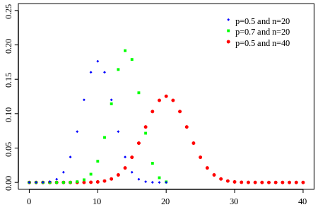

## Probability Distribution

* Probability Mass Function: Discrete

???

Draw a histogram

--

* Probability Density Function: Continuous
    + Cumulative density function: $F(x) = P(X < x)$

???

Draw a density plot

--

.center[]

---

class: center, middle

.Large[Rethink: What's a Distribution?]

???

a pile of probability

what did we just call a distribution? Function

---

## Moments of Probability Distribution

A specific quantitative measure of .red[the shape of a function].

---

.pull-left[

Physics

+ 0th: Total mass
+ 1st: Center of mass
+ 2ed: Rotational inertia

]

???

Rotational inertia: 惯性矩

--

.pull-right[
Statistics

+ 0th: Total probability
+ 1st: Mean
+ 2ed: Variance
+ 3id: Skewness
+ 4th: Kurtosis (tailedness)
]

???

Kurtosis：尖锐程度

---

## Properties of PMF/PDF

+ None-negative

--

+ Total area = $\int^{+\infty}_{-\infty}f(x)dx = 1$

--

+ $P(x = c) = \int^c_cf(x)dx = 0$

--

+ $P(a\leq x \leq b) = \int^b_af(x)x.$
    + $= \int^b_{-\infty}f(x)dx - \int^a_{-\infty}f(x)dx$

--

+ CDF: $P(X\leq x)$, PDF = $\frac{\partial CDF}{\partial X}$
    
    
---

## Common Distributions

+ Bernoulli (discrete)
+ Binomial (discrete)
+ Uniform (continuous)

---

## Bernoulli

k is possible outcome

$k\in 0, 1,$ p is P(X = 1)

--

### CDF: 

$$F = \begin{cases}
0, if\ k<0,\\
1 - p, if\ k \in[0, 1),\\
1, if\ k \geq 1.
\end{cases}$$

--

### PMF: 

$$f(k;p) = p^k(1 - p)^{1 - k}$$

---

--

+ Mean: p
+ Variance: p(1 - p)

---

## Binomial: 

PDF: $f(k; n, p) = {n \choose k}p^k(1 - p)^{n - k}$

+ n, number of trials; 
+ p, the success probability in each trial; 
+ k, the number of success

???

$${n \choose k} = \frac{n!}{k!(n - k)!}$$

---

.center[]

+ Mean: np
+ Variance: np(1 - p)

---

## Application

A school hired 100 faculty members, 25 female and 75 male, in a year. Given the general hired ratio is .4 for women and .6 for men. What's the chance that the employment is fair in this year?

$$PDF = {n \choose r}\pi^r(1 - \pi)^{n - r}$$

--

$$P(25) = {100 \choose 25}0.4^{25}(1 - 0.6)^{75} = 0.0006$$

--

Very unlikely.

---

## Uniform

### CDF: 

$$F = \begin{cases}
0, if\ x < a,\\
\frac{x - a}{b - a}, if\ x \in[a, b),\\p
1, if\ x \geq b.
\end{cases}$$
--

.center[]

---

### PDF: 

$$f(x) = \begin{cases} 1/(b - a), if\ x \in [a, b],\\ 0, otherwise.\end{cases}$$

.center[]

---

+ Mean: $\mu = E(x) = \frac{a + b}{2}$
+ Variance: $\sigma^2 =  \frac{(b - a)^2}{12}.$

???

\begin{align}
\mu =& E(x) = \int^b_a x \frac{1}{b - a} dx \\
=& \frac{1}{b - a}\int^b_axdx \\
=& \frac{1}{b - a}\frac{1}{2}x^2|^b_a \\
=& \frac{b^2 - a^2}{a(b - a)} \\
=& \frac{a + b}{2}
\end{align}

\begin{align}
\sigma^2 =& \sum x^2p(x) - \mu^2 \\
=& \int^b_ax^2\frac{1}{b - a}dx - (\frac{a + b}{2})^2 \\
=& \frac{(b - a)^2}{12}.
\end{align}

---

## Normal: Gaussian curve

### PDF: 

$$f(x) = \varphi(\frac{x - \mu}{\sigma}) = \frac{1}{\sigma\sqrt{2\pi}}e^{-\frac{(x - \mu)^2}{2\sigma^2}}$$

When $\mu = 1; \sigma = 0$, standard normal distribution

--

.red[Z Score:]

$Z = \frac{x - \mu}{\sigma}$ &rarr; $f(x) = \frac{1}{\sigma\sqrt{2\pi}}e^{-\frac{(z)^2}{2}}$

???

Knowing Z-score, one can calculate the probability of it accordingly

---

## Application

Known that the average IQ in the U.S. is 100, standard deviation is 16, what's the probability a US citizen's IQ is higher than 125 or lower than 85?

--

$Z_1 = \frac{125 - 100}{16} = 1.056$

$Z_2 = \frac{85 - 100}{16} = -0.9375$

---

## Next Step---Conventionally

.center[]

---

## When You Have R...

`pnorm(<Z-score>)`

P(X &ge; 125) = `1 - pnorm(1.056)` = `r 1 - pnorm(1.056)`

P(X < 85) = `pnorm(-0.9375)` = `r pnorm(-0.9375)`

???

Hint: p-value: $P(z\leq x)$.

---

## Expectation

(Work for all the distributions

--

1. Mean: E(X) = &sum; xp(x)
2. Variance: E(x - &mu;)2 = &sum; (x - &mu;)2p(x)

### Rule of expectation:

1. E(aX + bY + c) = aE(X) + bE(Y) + c;
2. var(aX + bY) = a2var(x) + b2var(y) + 2ab&bull;cov(x, y)

---

### Application

X is the reward generator of a paid module of a video game, the seed of which is based on tossing a fair dice.
When the dice is tossed, the reward is produced following this function: g(X) = 2 + 3X.

What's the expectation of rewards "ke-jin" players can get by purchasing this module?

$$E(X) = \sum xp(x) = 1\times\frac{1}{6} + 2\times\frac{1}{6} +\dots+6\times\frac{1}{6}$$

$$ = 3.5$$

$E(g(x)) = E(2 + 3X) = 2 + 3\times 3.5 = 12.5$
    
    
---

## Wrap Up

.pull-left[
### Describing a Distribution

+ PDF/PMF
    + Five moments
+ CDF

### Common Distributions

+ Bernoulli
    + Binomial
+ Uniform
+ Normal
]

.pull-right[

### Expectation

+ Definition
+ Rules

]