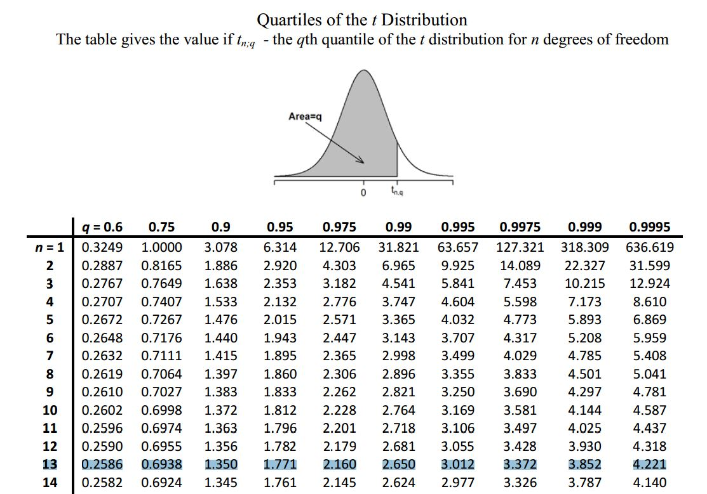

```{r setup, include = FALSE}
knitr::opts_chunk$set(echo = FALSE, message = FALSE, warning = FALSE)


if (!require(pacman)) install.packages("pacman")
library(pacman)

p_load(
  flextable,
  knitr, # dependency
  descr, stringr, broom, tidyverse
) # data wrangling # data wrangling

# Functions preload
set.seed(114)
```

class: inverse, bottom

# Confidence Intervals

---

class: small

## Sample Properties

### Finite-sample properties

* Unbiased estimators: produce the right answer on coverage.
    + How to reduce bias? 
        1. Randomization;
        2. Weight.

* Efficiency: smaller variance of .magenta[unbiased estimators]
    + How to increase efficiency? $SE = \frac{\sigma}{\sqrt{n}}$
    
Hint: mean is 1.57 times more efficient than median for a standard normal
    
---

### Large-sample properties

+ Finite-sample properties properties (unbiasedness + efficiency) holds irrespective of the size of the sample
+ "Large-sample" properties are asymptotic. 

---

## Convergence

When a sequence of random variables stabilizes to a certain probabilistic behavior as n &rarr; &infin; , the sequence is said to show stochastic convergence

$p\lim_{n \to \infty}X_n = a, a\in R.$

---

### Two types of meanings

1. Convergence in .magenta[probability]: values in the sequence eventually take a constant value (i.e. the limiting distribution is a point mass).

1. Convergence in .magenta[distribution]: values in the sequence continue to vary, but the variation eventually comes to follow an unchanging distribution (i.e. the limiting distribution is a well characterized distribution)

---

## Consistency: 

An estimator $\theta_n$ is consistent if the sequence $\theta_1\cdots\theta_n$ converges in probability to the true parameter value $\theta$ as sample size n grows to infinity:

$p\lim_{n \to \infty}\theta_n = \theta.$

* Often seen as a minimal requirement for estimators
* A consistent estimator may still perform badly in small samples

---

### Does Unbiasedness Imply Consistency?

--

No, e.g., An estimator can be unbiased but not consistent. For example, for an IID sample {x_
1,..., x_n} one can use $T_n(X) = x_n$ as the estimator of the mean E[x]. 
$E[T_n(X)] = E[x]$ and it is unbiased, but it does not converge to any value.

--

Only if a sequence of estimators is unbiased and converges to a value, then it is consistent, as it must converge to the correct value.

---

### Does Consistency Imply Unbiasedness?

No, e.g., if the mean is estimated by ${1 \over n}\sum x_{i}+{1 \over n}$ it is biased, but as $n\rightarrow \infty$, it approaches the correct value, and so it is consistent.

--

Another example?


???

w.o., Bressel's correction

\begin{align}
s^2 =& \sum(pX - \bar X)^2p(x) \\
=& \frac{\sum(X - \bar{X})^2}{n - 1}.
\end{align}

---

class: small

## What's CI

CI Frequentist: 

* Confidence Intervals 
* In a repeatedly sampling, the percentage of the samples that could contain $\mu$. 
* .magenta[Narrative]: "In 100 times sampling of ..., there are ... samples that the CI could contain the true value."

CI for Bayesian:

* Credible intervals
* Some percentage of the posterior distribution lies within an particular region.
* .magenta[Narrative]: "There are ...% of the chance that the true value lies in the CI."

---

### Focusing on the confidential intervals for now

+ Proportion: $\pi = P \pm Z_{\alpha/2}\sqrt{\frac{P(1 - P)}{n}}$
+ Mean: $\mu = \bar X \pm Z_{\alpha/2}SE$
+ $\alpha$: 1 - confidence level

--

How to get smaller CI? 


???

1. Large N
1. Large $\alpha$

---

## Why 95% CI

```{r ci}

funcShaded <- function(x) {
    y <- dnorm(x, mean = 0, sd = 1)
    y[x < 0 - 2 | x > (0 + 2)] <- NA
    return(y)
}

ggplot(data = data.frame(x = c(-4, 4)), aes(x = x)) +
  stat_function(fun = dnorm, n = 1000, args = list(mean = 0, sd = 1)) +
  stat_function(fun=funcShaded, geom="area", fill="#84CA72", alpha=0.2) +
  ylab("") + xlab("")

```

???

.red[Arbitrary!!!]

---

class: inverse, bottom

# Sample Comparison

---

## Student's t:

First derived as a posterior distribution in 1876 by Helmert and Lüroth.

Symmetric: $\mu = 0$

---

Fatter tails

```{r zvst, fig.width=10}
ggplot(data.frame(x = c(-4, 4)), aes(x = x)) +
  stat_function(fun = dnorm, aes(colour = "Normal")) +
  stat_function(fun = function(x) dt(x, df = 3), aes(colour = "Student's t")) + 
  ylab("Probability Density") + 
  xlab("") +
  labs(color = "Distribution")
```

???

William Gosset published in English in 1908, used the pseudonym "student." Fisher called it the "student distribution"

---

## Degree of Freedom for t

T critical points are relative to d.f.

+ For s.d.: n - 1
+ For CI: n - 1
+ For regression: n - k - 1


---

E.g., For nine cars, the mean mileage per gallon is 29.5 and standard deviation is 3. 
Is the estimation of 31 for the mileage is likely, in terms of the 95% CI for the sample's mileage?

d.f. = 9 - 1 = 8, therefore $t(\alpha < .975) =$ `r qt(.975, df = 8)`


then CI = $29.5 \pm t_{\frac{\alpha}{2}}(\frac{3}{\sqrt{9}})$, i.e, [27.5, 31.8].

--

.magenta[Narrative]: If we make repeated sampling from these cars, there are 95% of the samples in which the interval between 27.5 and 31.8 contains the true mean of the car mileage.

---

## Z and T Tables

.center[]

---

.center[]

---

## Summary

+ For mean
    + $\sigma$ known, $\mu = \bar X \pm Z_{\alpha/2}\frac{\sigma}{\sqrt n}$
    + $\sigma$ unknown
        + $N \geq 100$, $\bar X \pm Z_{\alpha/2}\frac{s}{\sqrt n}$
        + $N < 100$, $\bar X \pm t_{\alpha/2}\frac{s}{\sqrt n}$
        
--

+ For proportion
    + $\pi$ known, $\Pi = P \pm Z_{\alpha/2}\sqrt{\frac{\pi(1 - \pi)}{n}}$
    + $\pi$ unknown, calculate the proportion

---

class: small

### Difference in means of independent samples

* $\sigma$ is known, $\mu_1 - \mu_2 = (\bar X_1 - \bar X_2) \pm Z_{\alpha/2}\sqrt{\frac{\sigma_1}{n_1} + \frac{\sigma_2}{n_2}}$.
* $\sigma$ is unknown, $\mu_1 - \mu_2 = (\bar X_1 - \bar X_2) \pm t_{\alpha/2}S_p\sqrt{\frac{1}{n_1} + \frac{1}{n_2}}$
   + Assuming the population have the same variance $\sigma_1 = \sigma_2$, where $S_p^2 = \frac{\sum(X_1 - \bar X_1)^2 + \sum(X_2 - \bar X_2)^2}{(n_1 - 1) + (n_2 - 1)}$
   + d.f. is $(n_1 - 1) + (n_2 - 1)$.

---

class: small

Q. In a class, there are two groups, the scores of members in group one are 64, 66, 89, 77, the scores of members in group two are 56, 71, and 53, are the mean scores different between the two groups?

--

\begin{align}
\bar X_1 =& 296/4 = 74; \\
\bar X_2 =& 60. \\
S_p^2 =& \frac{398 + 186}{(4 - 1) + (3 - 1)} = 116.5\\
\mu_1 - \mu_2 =& (74 - 60) \pm 2.57 (\sqrt{116.5}\sqrt{1/4 + 1/3}) \\
=& 14 \pm 21.
\end{align}

--

The 95% CI shows that there's no statistical difference between the means.

---

### Difference in means of matched samples

* Matched samples: $D = X_1 - X_2$, then $\Delta = \bar D \pm t_{\alpha/2}\frac{S_D}{\sqrt{n}}$, where $S_D = \frac{\sum(D - \bar D)^2}{n - 1}$. 

---

class: small

E.g., Four students first conducted an examination and went through a review section. Then, they took the examinations again. The scores are shown following. Did they get better after the review?

| Student 	| Amy 	| Bill 	| Becky 	| Mark 	|
|---------	|-----	|------	|-------	|------	|
| E2      	| 64  	| 66   	| 89    	| 71   	|
| E1      	| 57  	| 57   	| 73    	| 65   	|

\begin{align}
D =& X_1 - X_2 \Rightarrow \bar D = \sum D / n = (7 + 9 + 16 + 12) / 4 = 11\\
S_D^2 =& 46 / 3 = 15.3 \Rightarrow S_D = 3.9\\
\therefore \Delta =& 11 \pm 3.18 \frac{39}{4} = 11 \pm 6
\end{align}

--

Students did get better.

---

class: small

### Comparing Proportion for large sample

$$\Pi_1 - \Pi_2 = P_1 - P_2 \pm Z_{\alpha/2}\sqrt{\frac{P_1(1 - P_1)}{n_1} + \frac{P_2(1 - P_2)}{n_2}}$$

---

E.g., Gallop drew a pair of 1500 samples from the American population. In the sample of 1980, there are 52% Democrats, and 46% in the 1985 sample. Were the Democrats the same for two years, given the 95% CI?

\begin{align}
\Pi_1 - \Pi_2 =& (0.52 - 0.46) \\
&\pm 1.96\sqrt{\frac{0.52 * 0.48}{1500} + \frac{0.46 * 0.54}{1500}} \\
&\approx 0.06 \pm 0.036.
\end{align}

--

Thus, the proportion of Democrats decreased in 1984.

---

class: small

## Hypothesis Testing with CIs 

### Two ways: 

* Using confidence intervals
* Using critical t/z scores & p-value.

--

### Element: 

1. Null hypothesis: $H_0$ specifies values for one or more population parameter ( $\mu, \pi$ rather than $\bar X, P$ )

2. Alternative hypothesis: $H_1$ the population parameter is something other than the value in H.

3. $\alpha = 1 - CI$

4. One-tailed/two-tailed test: Most applications are one-tail tests, while most software gives two-tail results

--

Substantive vs. statistical significance?

---

class: small

## Types of Errors

| Decision 	| Accept                   	| Reject                   	|
|----------	|--------------------------	|--------------------------	|
| $H_0$ TRUE  	| P = 1 - $\alpha$            	| Type I error (P = $\alpha$) 	|
| $H_0$ FALSE 	| Type II error (P = $\beta$) 	| P = 1 - $\beta$             	|

Hint: $\beta$ is the power of the test.

???

Avoiding Type I is more emergent.

---

class: small

E.g., Given a virus can influence 10% of the population. Now there's a sample of the older people, n = 527, within which there are 14% infected the virus. Are the older people more likely to be victimized?

$H_0: \Pi \leq 10; H_1: \Pi > 10$ 

Method 1: 

$Z = \frac{P - \pi}{\sqrt{\frac{\pi(1 - \pi)}{n}}} = \frac{14 - 10}{\sqrt{\frac{0.1 * 0.9}{527}}} = 3.06$

Given the level of $\alpha = 0.05$, therefore reject the $H_0.$

Method 2: 

$\pi = 0.14 \pm 1.96 * \sqrt{\frac{0.14 * (1 - 0.14)}{527}} = 0.14 \pm 0.03,$ that is [0.11, 0.17], which does not cover .1, so reject $H_0.$
