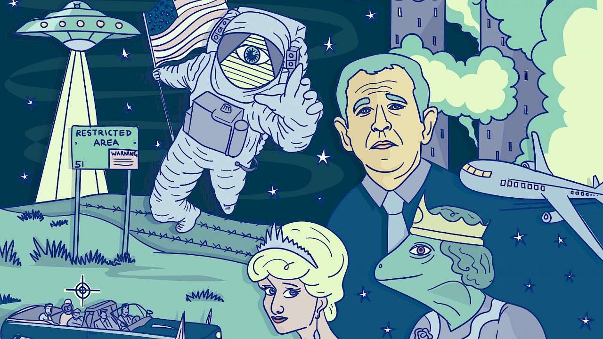

```{r setup, include = FALSE}
knitr::opts_chunk$set(echo = FALSE, message = FALSE, warning = FALSE)

if (!require(pacman)) install.packages("pacman")
library(pacman)

p_load(
  tidyverse, icons, xaringanExtra
) 


use_xaringan_extra(c("tile_view", # O
                     "broadcast",
                     "panelset",
                     "tachyons",
                     "fit_screen"))
use_extra_styles(
  hover_code_line = TRUE,         #<<
  mute_unhighlighted_code = FALSE  #<<
)


# Functions preload
set.seed(313)

theme_set(theme_minimal())
```

class: inverse, bottom

A Methodologist View
# Understanding OLS

---

## Overview

1. Road to OLS
1. OLS Principles
    + Goal
    + Model
    + Uncertainty
1. OLS Components
    + Coefficients
    + Variances/SEs


---

## The Path

Genre: Hypothesis testing
+ Uncertainty: Confidence intervals
+ Statistical significance

--

.pull-left[
*Path We've Passed*

One variable
+ Probability theory
+ Distribution

Variable comparison
+ Difference of means (t score)
+ Cov & cor (r/&tau;/&rho;, &chi;<sup>2</sup>/&Phi;/V)
+ ANOVA (F)
]

--

.pull-right[
*Path Foward*

+ Single explanatory variable (.red[OLS])
+ Multiple explanatory variable (.red[Multiple OLS])
+ Nonlinear effect (.red[Med/Mod])
+ Generalized linear (.red[MLE])
]


---

## Review: Expectation and Variance

.pull-left[
\begin{align}
E(X)_{discrete} =& \sum^n_{i = 1} X_if(X_i)\\
E(X)_{continuous} =& \int^{+\infty}_{-\infty}X_if(X_i)dX.\\
\sigma^2 =& E[X - E(X)]^2 
\end{align}
]

--

.pull-right[
\begin{align}
\sigma^2 =& E[X - E(X)]^2\\
=& E[(X - \mu)^2]\\
              =& E(X^2 - 2X\mu + \mu^2)\\
              =& E(X^2) - 2\mu E(X) + \mu^2\\
              =& E(X^2) - \mu^2
\end{align}
]

---

class: small

## Review: Rule of Variance

var(aX + b) = a<sup>2</sup>var(X);

\begin{align}
var(aX + b) =& E[(aX + b) - E(aX + b)]^2\\
            =& E[aX + b - aE(X) - b]^2\\
            =& E[aX - aE(X)]^2 = a^2E[X - E(X)]^2 = a^2var(X)
\end{align}

--

var(aX<sub>1</sub> + bX<sub>2</sub> + c) = a<sup>2</sup>var(X<sub>1</sub>) + b<sup>2</sup>var(X<sub>2</sub>) + 2ab&middot;cov(X<sub>1</sub>, X<sub>2</sub>).

--

When X<sub>1</sub> is i.i.d., 
var(a<sub>1</sub>X<sub>1</sub> + a<sub>2</sub>X<sub>2</sub> + ... + a<sub>n</sub>X<sub>n</sub>) = var(&sum;a<sub>i</sub>X<sub>i</sub>) = &sum;a<sub>i</sub>^2var(X<sub>i</sub>)

--

$var(\bar X) = var(\frac{\sum X_i}{n}) = \sum^n_{i = 1}\frac{var(X_i)}{n^2} = \frac{n\sigma^2}{n^2} = \frac{\sigma^2}{n}$

--

cov(X, Y) = E(XY) - E(X)E(Y)
    + When X = Y, cov(X, X) = E(X<sup>2</sup>) - [E(X)]<sup>2</sup> = var(X)

\begin{align}
cov(X, Y) =& E[X - E(X)][Y - E(Y)]\\
          =& E[XY - XE(Y) - YE(X) + E(X)E(Y)]\\
          =& E(XY) - E(Y)E(X) - E(X)E(Y) + E(X)E(Y)\\
          =& E(XY) - E(X)E(Y)
\end{align}

---

## Property of Estimator $\hat \theta$

* Unbiased: On average, the estimator gives the right answer, formally, $E(\hat\sigma) = \sigma.$

--

* Consistent: As the sample size increases, the variance decreases.

```{r consistency, fig.height=5, fig.width=10, fig.align='center'}
ggplot(data.frame(x = c(0, 40)), aes(x = x)) +
  stat_function(fun = function(x) dgamma(x, shape = 9, scale = .5), aes(color = "small")) +
  stat_function(fun = function(x) dgamma(x, shape = 9, scale = 1), aes(color = "mediam")) +
  stat_function(fun = function(x) dgamma(x, shape = 9, scale = 2), aes(color = "large")) +
  ylab("Probability Density") + 
  xlab("X") +
  labs(color = "Distribution")
```

???

finite sample property    
large sample property

Consistency: n1 < n2 < n3

---

* Efficiency: Smallest variance among unbiased estimators

```{r efficiency, fig.height=4, fig.width=10, fig.align='center'}
ggplot(data.frame(x = c(-7, 7)), aes(x = x)) +
  stat_function(fun = function(x) dnorm(x, mean = 0, sd = 0.5), aes(color = "0.5")) +
  stat_function(fun = function(x) dnorm(x, mean = 0, sd = 1), aes(color = "1")) +
  stat_function(fun = function(x) dnorm(x, mean = 0, sd = 2), aes(color = "2")) +
  ylab("Probability Density") + 
  xlab("X") +
  labs(color = "SD")
```

--

Sometimes, one may want to trade off a little bias against variance.

+ RMES: Root mean square error, $\sqrt{bias^2 + var}$


---

## Ordinary Least Squares (OLS)

One type of .red[simulation] of the reality among many others, unnecessarily the best one.

--

.center[General Guide of Usage]

.bg-black.golden.ba.shadow-5.ph4.mt3[
Don't let the data drive you, you .red[drive the data] with appropriate methods.
]

--

.center[
.large[&dArr;]

Always getting attention to the .red[detailed] data.
]


---

## OLS in a Substantive View

How does some outcome variable Y change .navy[when] some explanatory variable X changes? 

--

E.g., are the political ideology of different partisan voters different? 

.center[H<sub>0</sub>: &mu;<sub>D</sub> = &mu;<sub>R</sub>]

$$\text{diff} = \frac{\bar X_R - \bar X_D}{SE}.$$

???


---

## OLS Component: Linear Estimator

A crucial yet strong assumption

Y changes .red[linearly] with X. In terms of the population regression function, formally,
.center[Y<sub>i</sub> = &beta;<sub>0</sub> + &beta;<sub>1</sub>X<sub>1</sub> + u<sub>i</sub>]

--

&zwj;Q: Which one shows a linear relationship between X and Y?

\begin{align}
Y_i =& \beta_0 + \beta_1X_i + ui;\\
Y_i =& \beta_0 + \frac{\beta_1}{X_i} + ui;\\
Y_i =& \beta_0 + \beta_1ln(X_i) + ui;\\
Y_i =& \beta_0 + X_i^{\beta_1} + ui;\\
Y_i =& \frac{1}{\beta_0} + \frac{X_i}{\beta_1} + ui.
\end{align}

???

First three are linear.

The last one isn't linear until redefining.


---

## OLS Component: Uncertainty

.center[
The Signal of Being Scientific    
u<sub>i</sub>: Things we don't know (or human errors).
]


\begin{align}
Y_i =& \beta_0 + \beta_1X_1 + u_i.\\
E(Y_i|X_i) =& E(\beta_0 + \beta_1X_1 + u_i|X_i),\\
           =& E(\beta_0|X_i) + E(\beta_1X_1|X_i) + E(u_i|X_i),\\
           =& \beta_0 + \beta_1X_i + E(u_i|X_i).
\end{align}

???

$\beta_1X_i$ consistent

E(u_i|X_i) assumed 0

--

### .center[Sample Regression Function (SRF)]

\begin{align}
Y_i =& \hat\beta_0 + \hat\beta_1X_i + \hat u_i,\\
    =& \hat Y_i + \hat u_i.\\
Y_i =& E(Y_i|X_i) + u_i,\\
\Leftrightarrow u_i =& Y_i - E(Y_i|X_i).
\end{align}


---

## Estimating Goal

.bg-black.golden.ba.shadow-5.ph4.mt3[
Getting the .red[mean] right is a good thing.

.tr[
---Frederick J. Boehmke
]
]

.center[
$u_i = Y_i - E(Y_i|X_i).$

$\sum|\hat u_i| = 0$    
&dArr;    
$\hat u^2 = 0$  
&dArr;    
$\sum(Y_i - \hat Y_i)^2 = 0,$    
(or $\sum[Y_i - (\hat\beta_0 + \hat\beta_1X_i)]^2 = 0.$)  
&dArr;    
$\sum[Y_i - (\hat\beta_0 + \hat\beta_1X_i)]^2 = 0.$ How ?
]

???

Minimizing expected ui

---

class: center, middle

## Minimizing Expected u<sub>i</sub>

 &hArr; &beta;<sub>0</sub> and &beta;<sub>1</sub> that make $\sum[Y_i - (\hat\beta_0 + \hat\beta_1X_i)]^2 = 0$


.center[]


???

1. &beta;<sub>1</sub>
1. &beta;<sub>0</sub>


---

class: small

## &beta;<sub>1</sub>


\begin{align}
\frac{\partial\sum[Y_i - (\hat\beta_0 + \hat\beta_1X_i)]^2}{\partial\hat\beta_1} =& -\sum 2X_i(Y_i - \hat\beta_0 - \hat\beta_1X_i) = 0\\
\Leftrightarrow \sum X_iY_i - \sum X_i\hat\beta_0 - \sum\hat\beta_1 X_1^2 =& 0\\
\sum X_iY_i =& \sum X_i\hat\beta_0 + \sum\hat\beta_1 X_1^2\\
\sum X_iY_i - \sum X_i(\bar Y - \hat\beta_1\bar X) - \sum\hat\beta_1 X_1^2 =& 0\\
\sum X_iY_i - \sum X_i\bar Y + \sum X_i\hat\beta_1\bar X - \sum\hat\beta_1 X_1^2 =& 0\\
\sum X_i(Y_i - \bar Y) + \hat\beta_1\sum X_i(\bar X - X_i) =& 0\\
\sum X_i(Y_i - \bar Y) =& \hat\beta_1\sum X_i(X_i - \bar X)
\end{align}

--

.pull-left[
\begin{align}
\sum X_i(Y_i - \bar Y) =& \sum X_i(Y_i - \bar Y) - \bar X\sum (Y_i - \bar Y)\\
                       =& \sum X_i(Y_i - \bar Y) - \bar X(\sum Y_i - \sum\bar Y)\\
                       =& \sum X_i(Y_i - \bar Y) - \bar X(n\bar Y - n\bar Y)\\
                       =& (\sum X_i - \bar X)(Y_i - \bar Y) \blacksquare
\end{align}
]

???

 "Quod Erat Demonstrandum" (QED) which loosely translated means "that which was to be demonstrated".

--

.pull-right[
\begin{align}
Given \sum(X_i - \bar X)(Y_i - \bar Y) =& \sum X_i(Y_i - \bar Y)\\
\sum X_i(Y_i - \bar Y) =& \hat\beta_1\sum X_i(X_i - \bar X)\\
\sum (X_i - \bar X)(Y_i - \bar Y) =& \hat\beta_1\sum (X_i - \bar X)(X_i - \bar X)\\
\hat\beta_1 =& \frac{\sum (X_i - \bar X)(Y_i - \bar Y)}{\sum (X_i - \bar X)^2}.
\end{align}
]

---

class: small

## &beta;<sub>0</sub>

\begin{align}
\frac{\partial\sum[Y_i - (\hat\beta_0 + \hat\beta_1X_i)]^2}{\partial\hat\beta_0} =& -\sum 2(Y_i - \hat\beta_0 - \hat\beta_1X_i) = 0\\
\Leftrightarrow\sum Y_i - \sum\hat\beta_0 - \sum\hat\beta_1X_i =& 0\\
\sum Y_i =& \sum\hat\beta_0 + \sum\hat\beta_1X_i\\
                         =& n\hat\beta_0 + \hat\beta_1\sum X_i\\
\hat\beta_0 =& \frac{\sum Y_i}{n} - \hat\beta_1\frac{\sum X_i}{n}\\
                        =& \bar Y - \hat\beta_1\bar X
\end{align}

--

 Hint: $\hat\beta_0, \hat\beta_1$ are called .red[co]-efficients;

.center["Normal equations"]

\begin{align}
\sum Y_i =& n\hat\beta_0 + \hat\beta_1\sum X_i\\
\sum X_iY_i =& \sum X_i\hat\beta_0 + \sum\hat\beta_1 X_1^2
\end{align}

???

&beta;<sub>0</sub> is efficient (minimizng the u) depending on &beta;<sub>1</sub>

---


## Coefficient

\begin{align}
\hat\beta_1 =& \frac{\sum (X_i - \bar X)(Y_i - \bar Y)}{\sum (X_i - \bar X)^2}\\
        =& \frac{\sum (X_i - \bar X)(Y_i - \bar Y)}{\sqrt{\sum (X_i - \bar X)^2}\sqrt{\sum (Y_i - \bar Y)^2}}\cdot\frac{\sqrt{\sum (Y_i - \bar Y)^2}}{\sqrt{\sum (X_i - \bar X)^2}}\\
        =& r_{X, Y}\frac{s_Y}{s_X}
\end{align}

--

So when the variance of Y(s<sub>Y</sub>) increases, &beta;<sub>1</sub> increases.

--

Special case: Standardized X and Y, i.e., $s_Y, s_X$ are 1s, then,

$$\beta_1 = r_{X, Y}\frac{s_Y}{s_X} = r_{X,Y}.$$

---

## Linear Coefficient (Revisit)

Remember $\sum X_i(Y_i - \bar Y) = \sum(X_i - \bar X)(Y_i - \bar Y).$
.pull-left[
\begin{align}
\hat\beta_1 =& \frac{\sum (X_i - \bar X)(Y_i - \bar Y)}{\sum (X_i - \bar X)^2},\\
            =& \frac{1}{\sum (X_i - \bar X)^2}\sum (X_i - \bar X)Y_i,\\
            =& \frac{1}{\sum (X_i - \bar X)^2}\sum (X_i - \bar X)(\beta_0 + \beta_1X_i + u_i),\\
            =& \frac{1}{\sum (X_i - \bar X)^2}[\sum (X_i - \bar X)(\beta_0 + \beta_1X_i) + \sum (X_i - \bar X)u_i],\\
            =& \frac{\sum (X_i - \bar X)(\beta_0 + \beta_1X_i)}{\sum (X_i - \bar X)^2} + \frac{\sum (X_i - \bar X)u_i}{\sum (X_i - \bar X)^2}.
\end{align}
]

--

.pull-right[
Let $k_i=\frac{X_i - \bar X}{\sum (X_i - \bar X)^2},$ then $\hat\beta_1 = \beta_1\sum k_iX_i + \sum k_iu_i$. 

+ A .red[linear] combination of errors
+ Min/max(X) influences a lot.
]


---

## Characteristics of OLS Coefficients

1. Calculated using .red[observed] data
1. Unique point estimates
1. SRF passes through $(\bar X, \bar Y)$
1. $\bar{\hat Y} (\text{predicted}) = \hat Y (\text{observed})$, $\frac{\sum\hat Y_i}{n} = \frac{\sum Y_i}{n}$
1. $\bar{\hat u_i} = \frac{\sum{\hat u_i}}{n} = 0$
1. $\sum X_i\hat u_i = 0$

---

.pull-left[
##  $\bar{\hat u_i} = \frac{\sum{\hat u_i}}{n} = 0$

\begin{align}
\frac{\partial\sum[Y_i - (\hat\beta_0 + \hat\beta_1X_i)]^2}{\partial\hat\beta_0} =& 0\\ -2\sum[Y_i - (\hat{\beta_0} + \hat{\beta_1}X_i)] =& 0\\
\sum (Y_i-\hat Y_i) =& 0\\
\sum{\hat u_i} =& 0\\
\Rightarrow \frac{\sum{\hat u_i}}{n} = \bar{\hat u_i} =& 0 \blacksquare
\end{align}
]

--

.pull-right[
## $\sum X_i\hat u_i = 0$

\begin{align}
cov(X_i, u_i) =& 0,\\
\frac{\sum(X_i - \bar X)(\hat u_i - \bar{\hat u_i})}{n-1} =& 0,\\
\frac{\sum X_i\hat u_i}{n-1} =& 0. \blacksquare
\end{align}
]

---

## Uncertainty of OLS Estimators (Revisit): &beta;<sub>1</sub>

.pull-left[
\begin{align}
\sigma^2 =& var(u_i|X),\\
         =& var(Y_i - \hat\beta_0 - \hat\beta_1X_i|X),\\
         =& \frac{\sum(\hat u_i^2)}{n - 2},\\
         =& \hat\sigma^2.
\end{align}
]


???

n - 2: $\hat\beta_0, \hat\beta_1$

--

.pull-right[
.small[
\begin{align}
var(\hat \beta_1|X) =& var(\frac{\sum(X_i - \bar X)(Y_i - \bar Y)}{\sum(X_i - \bar X)^2}|X)\\
                  =& var(\beta_1\sum k_iX_i + \sum k_iu_i|X)\\
                  =& var(\sum k_iu_i|X), \text{given}\ \beta_1\sum k_iX_i \text{constant}\\
                  =& \sum var(k_iu_i|X), \text{assuming}\ u_i\ \text{independent}\\
                  =& \sum k_i^2 var(u_i|X)\\
                  =& \sum[\frac{X_i - \bar X}{\sum (X_i - \bar X)^2}]^2\sigma^2\\
                  =& \frac{\sum(X_i - \bar X)^2}{[\sum (X_i - \bar X)^2]^2}\sigma^2 = \frac{\sigma^2}{\sum (X_i - \bar X)^2}
\end{align}
]
]

--

If u<sub>i</sub> is not independent, then cov(k, u) > 0, and this estimator is underestimated.

(That is, the assumption is .large[.red[IMPORTANT]])

---

class: small

## Uncertainty of OLS Estimators (Revisit): &beta;<sub>0</sub>

\begin{align}
var(\hat \beta_0|X) =& var(\bar Y - \hat\beta_1\bar X|X),\\
                   =& var[\frac{\sum(\beta_0 + \beta_1X_i + u_i)}{n} - \hat\beta_1\bar X|X],\\
                  =& var(\frac{\sum u_i}{n}|X) + var(\hat\beta_1\bar X|X), \beta_0 + \beta_1X_i\text{constant and independent},\\
                  =& var(\frac{\sum u_i}{n}|X) + var(\hat\beta_1\bar X|X),\\
                  =& \frac{var(\sum u_i|X)}{n^2} + \bar X^2var(\hat\beta_1|X),\\
                  =& \frac{n\sigma^2}{n^2} + \frac{\bar X^2\sigma^2}{\sum (X_i - \bar X)^2},\\
                  =& \sigma^2[\frac{1}{n} + \frac{\bar X^2}{\sum (X_i - \bar X)^2}],\\
                  =& \sigma^2[\frac{\sum (X_i - \bar X)^2 + n\bar X^2}{n\sum (X_i - \bar X)^2}] = \sigma^2[\frac{\sum X_i^2 - \sum\bar X^2 + n\bar X^2}{n\sum (X_i - \bar X)^2}],\\
                  =& \sigma^2[\frac{\sum X_i^2 - n\bar X^2 + n\bar X^2}{n\sum (X_i - \bar X)^2}]= \sigma^2\frac{\sum X_i^2}{n\sum (X_i - \bar X)^2}.
\end{align}
---

## Wrap Up

.pull-left[
+ OLS: A simulation
+ OLS Regression: Get the mean right
    + Linear estimators
    + Uncertainty

+ SRF: Y<sub>i</sub> = &beta;<sub>0</sub> + &beta;<sub>1</sub>X<sub>1</sub> + u<sub>i</sub>
]

--

.pull-right[
\begin{align}
\hat\beta_1 =& \frac{\sum (X_i - \bar X)(Y_i - \bar Y)}{\sum (X_i - \bar X)^2}\\
=& r_{X, Y}\frac{s_Y}{s_X}\\
\hat\beta_0 =& \bar Y - \hat\beta_1\bar X\\
var(\hat \beta_1|X) =& \frac{\sigma^2}{\sum (X_i - \bar X)^2}\\
var(\hat \beta_0|X) =& \sigma^2\frac{\sum X_i^2}{n\sum (X_i - \bar X)^2}
\end{align}
]

---

## Bonus: Evaluating Theory

General statement to describe .red[causality] and relevant phenomena.

.center[]

???

内华达51区（《美恐》S10 双面，怪诞小镇制片Alex Hirsch 新动画Inside job; 

--

.center[
Scientific Theory

+ Logical consistency
+ Empirical .red[falsifiable]
]


---

class: center, middle

## Good Scientific Theory

--

Large explanatory power
+ Importance
+ Range
+ Applicability

???

+ Importance: How much X affects Y
+ Range: generality
+ Applicability: How often affecting in the reality

--

Parsimony

--

Satisfying elaboration

--

Clearly framed (formal?)

--

Explaining important phenomena

--

Prescriptive richness (+policy suggestion?)

---

class: center

## Conspiracy


What makes a conspiracy theory NOT a good scientific theory?

???

Rothschild family

---

class: small

## How to Test a Theory

| .small[Necessity\\Sufficiency]<sup>&midast;</sup> | Yes             | No                |
|-----------------------|-----------------|-------------------|
| Yes                   | Double-Decisive | Smoking Gun       |
| No                    | Hoop            | Straw-in-the-Wind |

.footnote[\* Evera, Stephen Van. 1997. Guide to Methods for Students of Political Science. Ithaca: Cornell University Press.]

???

1. Hoop test: the accused in the state when murder happens? If not innocent, but passing does not mean being guilty.
1. Smoking-gun test: a smoking gun seen in a suspect's hand moments after a shooting is quite conclusive proof of guilt, but a suspect not seen with a smoking gun is not proven innocent.
1. Double-decisive test: hoop + smoking-gun, like a camera record
1. Straw-in-the-wind test: Richard Liu seemed friendly with the girl.
