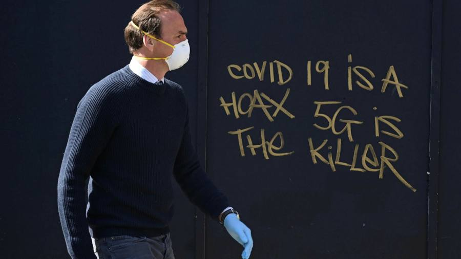

```{r setup, include = FALSE}
knitr::opts_chunk$set(echo = FALSE, message = FALSE, warning = FALSE)

if (!require(pacman)) install.packages("pacman")
library(pacman)

p_load(
  knitr, # dependency
  descr, stringr, broom, tidyverse
) # data wrangling # data wrangling

# Functions preload
set.seed(313)
```

class: small

## The Path

&zwj;Genre: Hypothesis testing
+ Uncertainty: Confidence intervals
+ Statistical significance

--

.pull-left[

### Path We've Passed

One variable
+ Probability theory
+ Distribution

&darr;    

Variable  comparison
+ Difference of means (.navy[t score])
+ Cov & cor (.navy[r/&tau;/&rho;, &chi;<sup>2</sup>/&Phi;/V])
+ ANOVA (.navy[F score])

&rArr;
]

--

.pull-right[

### Path Foward

+ Single variable (.red[OLS])
+ Multivariate (.red[Multiple OLS])
+ Nonlinear effect (.red[Med/Mod])
+ Generalized linear (.red[MLE])

]

---

class: inverse, bottom

## Understanding OLS
# A Methodological View

---

## Overview

1. Road to OLS (Old stuff)
1. OLS Principles
    + Goal
    + Model
    + Uncertainty
1. OLS Components
    + Coefficients
    + Variances/SEs

---

## Road to OLS

### Expectation:

\begin{align}
E(X)_{discrete} =& \sum^n_{i = 1} X_if(X_i)\\
E(X)_{continuous} =& \int^{+\infty}_{-\infty}X_if(X_i)dX.
\end{align}

### Variance:

\begin{align}
\sigma^2 = E[X - E(X)]^2 =& E[(X - \mu)^2]\\
              =& E(X^2 - 2X\mu + \mu^2)\\
              =& E(X^2) - 2\mu E(X) + \mu^2\\
              =& E(X^2) - \mu^2
\end{align}

???

Expectation is the mean.

---

## Rule of Variance

1. var(aX + b) = a<sup>2</sup>var(X);
1. var(aX<sub>1</sub> + bX<sub>2</sub> + c) = a<sup>2</sup>var(X<sub>1</sub>) + b<sup>2</sup>var(X<sub>2</sub>) + 2ab&middot;cov(X<sub>1</sub>, X<sub>2</sub>).
1. When X<sub>1</sub> is i.i.d., 
var(a<sub>1</sub>X<sub>1</sub> + a<sub>2</sub>X<sub>2</sub> + ... + a<sub>n</sub>X<sub>n</sub>) = var(&sum;a<sub>i</sub>X<sub>i</sub>) = &sum;a<sub>i</sub>^2var(X<sub>i</sub>)
1. $var(\bar X) = var(\frac{\sum X_i}{n}) = \sum^n_{i = 1}\frac{var(X_i)}{n^2} = \frac{n\sigma^2}{n^2} = \frac{\sigma^2}{n}$
1. cov(X, Y) = E(XY) - E(X)E(Y)
    + When X = Y, cov(X, X) = E(X<sup>2</sup>) - [E(X)]<sup>2</sup> = var(X)


???
\begin{align}
var(aX + b) =& E[(aX + b) - E(aX + b)]^2\\
            =& E[aX + b - aE(X) - b]^2\\
            =& E[aX - aE(X)]^2 = a^2E[X - E(X)]^2 = a^2var(X)
\end{align}

\begin{align}
cov(X, Y) =& E[X - E(X)][Y - E(Y)]\\
          =& E[XY - XE(Y) - YE(X) + E(X)E(Y)]\\
          =& E(XY) - E(Y)E(X) - E(X)E(Y) + E(X)E(Y)\\
          =& E(XY) - E(X)E(Y)
\end{align}


---

## Property of Estimator $\hat \theta$

* Unbiased: On average, the estimator gives the right answer, formally, $E(\hat\sigma) = \sigma.$

--

* Consistent: As the sample size increases, the variance decreases.

```{r consistency, fig.height=4, fig.width=10}
ggplot(data.frame(x = c(0, 40)), aes(x = x)) +
  stat_function(fun = function(x) dgamma(x, shape = 9, scale = .5), aes(color = "small")) +
  stat_function(fun = function(x) dgamma(x, shape = 9, scale = 1), aes(color = "mediam")) +
  stat_function(fun = function(x) dgamma(x, shape = 9, scale = 2), aes(color = "large")) +
  ylab("Probability Density") + 
  xlab("X") +
  labs(color = "Distribution")
```

???

finite sample property    
large sample property

Consistency: n1 < n2 < n3

---

* Efficiency: Smallest variance among unbiased estimators

```{r efficiency, fig.height=4, fig.width=10}
ggplot(data.frame(x = c(-7, 7)), aes(x = x)) +
  stat_function(fun = function(x) dnorm(x, mean = 0, sd = 0.5), aes(color = "0.5")) +
  stat_function(fun = function(x) dnorm(x, mean = 0, sd = 1), aes(color = "1")) +
  stat_function(fun = function(x) dnorm(x, mean = 0, sd = 2), aes(color = "2")) +
  ylab("Probability Density") + 
  xlab("X") +
  labs(color = "SD")
```

* RMES: Root mean square error, $\sqrt{bias^2 + var}$
    + Trade off a little bias against variance.

---

## Ordinary Least Squares

One type of simulation of the reality among many others

--

### General guide of usage

Always getting attention to the .navy[detailed] data.

Don't let the data drive you, you .red[drive the data] with appropriate methods.

---

## Regression in Social Science

How does some outcome variable Y change .navy[when] some explanatory variable X changes? 

--

E.g., are the political ideology of different partisan voters different? 

&mu;<sub>D</sub> = &mu;<sub>R</sub>

$\text{diff} = \frac{\bar X_R - \bar X_D}{SE}.$

???


---

## Linearity: A Strong, Strong Assumption

Y changes linearly with X.

In terms of the population regression function, formally,

.center[Y<sub>i</sub> = &beta;<sub>0</sub> + &beta;<sub>1</sub>X<sub>1</sub> + u<sub>i</sub>]

---

&zwj;Q: Which one shows a linear relationship between X and Y?

\begin{align}
Y_i =& \beta_0 + \beta_1X_i + ui;\\
Y_i =& \beta_0 + \frac{\beta_1}{X_i} + ui;\\
Y_i =& \beta_0 + \beta_1ln(X_i) + ui;\\
Y_i =& \beta_0 + X_i^{\beta_1} + ui;\\
Y_i =& \frac{1}{\beta_0} + \frac{X_i}{\beta_1} + ui.
\end{align}

???

First three are linear.

The last one isn't linear until redefining.


---

## Uncertainty: Can't Be More Important


\begin{align}
E(Y_i|X_i) =& E(\beta_0 + \beta_1X_1 + u_i|X_i)\\
           =& E(\beta_0|X_i) + E(\beta_1X_1|X_i) + E(u_i|X_i)\\
           =& \beta_0 + \beta_1X_i + E(u_i|X_i)
\end{align}

???

$\beta_1X_i$ consistent

E(u_i|X_i) assumed 0

---

## Sample Regression Function (SRF)

\begin{align}
Y_i =& \hat\beta_0 + \hat\beta_1X_i + \hat u_i\\
    =& \hat Y_i + \hat u_i
\end{align}

\begin{align}
Y_i =& E(Y_i|X_i) + u_i\\
\Leftrightarrow u_i =& Y_i - E(Y_i|X_i)
\end{align}

u<sub>i</sub>: Things we don't know (or human errors).

---

## Estimating Goal

> Getting the .red[mean] right is a good thing. ---Frederick J. Boehmke

.center[
$\sum|\hat u_i| = 0$    
&dArr;    
$\hat u^2 = 0$  
&dArr;    
$\sum(Y_i - \hat Y_i)^2 = 0$    
(or $\sum[Y_i - (\hat\beta_0 + \hat\beta_1X_i)]^2 = 0$)  
&dArr;    
$\sum[Y_i - (\hat\beta_0 + \hat\beta_1X_i)]^2 = 0$
]

???

Minimizing expected ui

---

class: center, middle

$$\sum[Y_i - (\hat\beta_0 + \hat\beta_1X_i)]^2 = 0$$
.large[How to Minimizing?]

.center[]


???

1. &beta;<sub>1</sub>
1. &beta;<sub>0</sub>


---

class: small

## &beta;<sub>1</sub><sup></sup>


\begin{align}
\frac{\partial\sum[Y_i - (\hat\beta_0 + \hat\beta_1X_i)]^2}{\partial\hat\beta_1} =& -\sum 2X_i(Y_i - \hat\beta_0 - \hat\beta_1X_i)\\
=& 0\\
\Leftrightarrow \sum X_iY_i - \sum X_i\hat\beta_0 - \sum\hat\beta_1 X_1^2 =& 0\\
\sum X_iY_i =& \sum X_i\hat\beta_0 + \sum\hat\beta_1 X_1^2\\
\sum X_iY_i - \sum X_i(\bar Y - \hat\beta_1\bar X) - \sum\hat\beta_1 X_1^2 =& 0\\
\sum X_iY_i - \sum X_i\bar Y + \sum X_i\hat\beta_1\bar X - \sum\hat\beta_1 X_1^2 =& 0\\
\sum X_i(Y_i - \bar Y) + \hat\beta_1\sum X_i(\bar X - X_i) =& 0\\
\sum X_i(Y_i - \bar Y) =& \hat\beta_1\sum X_i(X_i - \bar X)
\end{align}

--

\begin{align}
Given \sum(X_i - \bar X)(Y_i - \bar Y) =& \sum X_i(Y_i - \bar Y)\\
\sum X_i(Y_i - \bar Y) =& \hat\beta_1\sum X_i(X_i - \bar X)\\
\sum (X_i - \bar X)(Y_i - \bar Y) =& \hat\beta_1\sum (X_i - \bar X)(X_i - \bar X)\\
\hat\beta_1 =& \frac{\sum (X_i - \bar X)(Y_i - \bar Y)}{\sum (X_i - \bar X)^2}.
\end{align}

???

\begin{align}
\sum X_i(Y_i - \bar Y) =& \sum X_i(Y_i - \bar Y) - \bar X\sum (Y_i - \bar Y)\\
                       =& \sum X_i(Y_i - \bar Y) - \bar X(\sum Y_i - \sum\bar Y)\\
                       =& \sum X_i(Y_i - \bar Y) - \bar X(n\bar Y - n\bar Y)\\
                       =& (\sum X_i - \bar X)(Y_i - \bar Y) \blacksquare
\end{align}

 "Quod Erat Demonstrandum" which loosely translated means "that which was to be demonstrated".


---

class: small

## &beta;<sub>0</sub><sup></sup>

\begin{align}
\frac{\partial\sum[Y_i - (\hat\beta_0 + \hat\beta_1X_i)]^2}{\partial\hat\beta_0} =& -\sum 2(Y_i - \hat\beta_0 - \hat\beta_1X_i) = 0\\
\Leftrightarrow\sum Y_i - \sum\hat\beta_0 - \sum\hat\beta_1X_i =& 0\\
\sum Y_i =& \sum\hat\beta_0 + \sum\hat\beta_1X_i\\
                         =& n\hat\beta_0 + \hat\beta_1\sum X_i\\
\hat\beta_0 =& \frac{\sum Y_i}{n} - \hat\beta_1\frac{\sum X_i}{n}\\
                        =& \bar Y - \hat\beta_1\bar X
\end{align}

???

$\hat\beta_0, \hat\beta_1$: Co-efficients;

\begin{align}
\sum Y_i =& n\hat\beta_0 + \hat\beta_1\sum X_i\\
\sum X_iY_i =& \sum X_i\hat\beta_0 + \sum\hat\beta_1 X_1^2
\end{align}

"Normal equations."

---

class: small

## Coefficient and Covariance

\begin{align}
\hat\beta_1 =& \frac{\sum (X_i - \bar X)(Y_i - \bar Y)}{\sum (X_i - \bar X)^2}\\
        =& \frac{\sum (X_i - \bar X)(Y_i - \bar Y)}{\sqrt{\sum (X_i - \bar X)^2}\sqrt{\sum (Y_i - \bar Y)^2}}\cdot\frac{\sqrt{\sum (Y_i - \bar Y)^2}}{\sqrt{\sum (X_i - \bar X)^2}}\\
        =& r_{X, Y}\frac{s_Y}{s_X}
\end{align}

--

So when the variance of Y(s<sub>Y</sub>) increases, &beta;<sub>1</sub> increases.

--

Special case: Standardized X and Y, i.e., $s_Y, s_X$ are 1s, then,

$$\beta_1 = r_{X, Y}\frac{s_Y}{s_X} = r_{X,Y}.$$

---

class: small

## The Path (Revisit)

.pull-left[

### Path We've Passed

.gray[
One variable
+ Probability theory
+ Distribution

&darr;    

Variable comparison
+ Difference of means (t score)
]

+ .magenta[Cov & cor] (.navy[r].gray[/&tau;/&rho;, &chi;<sup>2</sup>/&Phi;/V])

.gray[
+ ANOVA (F score)
]

&rArr;
]

.pull-right[

### Path Foward

+ .magenta[Single variable] (.red[OLS])
.gray[
+ Multivariate (Multiple OLS)
+ Nonlinear effect (Med/Mod)
+ Generalized linear (MLE)
]
]

---

## Linearity (Revisit)<sup></sup>

Let $k_i=\frac{X_i - \bar X}{\sum (X_i - \bar X)^2},$     
then $\hat\beta_1 = \beta_1\sum k_iX_i + \sum k_iu_i$. 


+ A .red[linear] combination of errors
+ Min/max(X) influences the estimation a lot.

???

Remember $\sum X_i(Y_i - \bar Y) = \sum(X_i - \bar X)(Y_i - \bar Y).$

\begin{align}
\hat\beta_1 =& \frac{\sum (X_i - \bar X)(Y_i - \bar Y)}{\sum (X_i - \bar X)^2}\\
            =& \frac{1}{\sum (X_i - \bar X)^2}\sum (X_i - \bar X)Y_i\\
            =& \frac{1}{\sum (X_i - \bar X)^2}\sum (X_i - \bar X)(\beta_0 + \beta_1X_i + u_i)\\
            =& \frac{1}{\sum (X_i - \bar X)^2}[\sum (X_i - \bar X)(\beta_0 + \beta_1X_i) + \sum (X_i - \bar X)u_i]\\
            =& \frac{\sum (X_i - \bar X)(\beta_0 + \beta_1X_i)}{\sum (X_i - \bar X)^2} + \frac{\sum (X_i - \bar X)u_i}{\sum (X_i - \bar X)^2}
\end{align}


---

## Feature of Regression Coefficients

1. Calculated using .red[observed] data
1. Unique point estimates
1. SRF passes through $(\bar X, \bar Y)$
1. $\bar{\hat Y} (\text{predicted}) = \hat Y (\text{observed})$, $\frac{\sum\hat Y_i}{n} = \frac{\sum Y_i}{n}$
1. $\bar{\hat u_i} = \frac{\sum{\hat u_i}}{n} = 0\\$<sup></sup>
1. $\sum X_i\hat u_i = cov(X_i, u_i) = 0$

???

&zwj;Proof:

\#4: 

\begin{align}
\frac{\partial\sum[Y_i - (\hat\beta_0 + \hat\beta_1X_i)]^2}{\partial\hat\beta_0} = -2\sum(Y_i - \hat{\beta_0} - \hat{\beta_1}X_i) =& 0\\
\sum (Y_i-\hat Y_i) =& 0\\
\sum{\hat u_i} =& 0\\
\Rightarrow \frac{\sum{\hat u_i}}{n} = \bar{\hat u_i} =& 0 \blacksquare
\end{align}

\#5: 

\begin{align}
\sum X_i\hat u_i =& \sum(X_i - \bar X)(\hat u_i - \bar{\hat u_i})\\
                 =& \sum(X_i - \bar X)(\hat u_i - \bar{\hat u_i})\\
                 =& \sum [X_i (\hat u_i - \bar{\hat u_i}) - \bar X(\hat u_i - \bar{\hat u_i})]\\
                 =& \sum X_i (\hat u_i - \bar{\hat u_i}) - \sum\bar X(\hat u_i - \bar{\hat u_i})\\
                 =& \sum [X_i\hat u_i - X_i\bar{\hat u_i}] - \sum\bar X(\hat u_i - \bar{\hat u_i})\\
                 =& \sum X_i\hat u_i - \sum\bar X\hat u_i + \sum\bar{\hat u_i} \\
                 =& \sum X_i\hat u_i - n\bar X\sum\hat u_i + \sum\bar{\hat u_i}
\end{align}

\#6: 

$\sum X_i\hat u_i =  \sum(X_i - \bar X)(\hat u_i - \bar{\hat u_i})\Rightarrow \frac{ \sum(X_i - \bar X)(\hat u_i - \bar{\hat u_i})}{n-1} = cov(X_i, u_i) = 0$

---

## Uncertainty of OLS Estimators

.pull-left[]

.pull-right[
\begin{align}
\sigma^2 =& var(u_i|X)\\
         =& var(Y_i - \hat\beta_0 - \hat\beta_1X_i|X)\\
         =& \frac{\sum(\hat u_i^2)}{n - 2}\\
         =& \hat\sigma^2
\end{align}
]

--

Why n-2?

???

n - 2: $\hat\beta_0, \hat\beta_1$

---
class: small

\begin{align}
var(\hat \beta_1|X) =& var(\frac{\sum(X_i - \bar X)(Y_i - \bar Y)}{\sum(X_i - \bar X)^2}|X)\\
                  =& var(\beta_1\sum k_iX_i + \sum k_iu_i|X)\\
                  =& var(\sum k_iu_i|X), \text{given}\ \beta_1\sum k_iX_i \text{is constant}\\
                  =& \sum var(k_iu_i|X), \text{assuming}\ u_i\ \text{independent}\\
                  =& \sum k_i^2 var(u_i|X)\\
                  =& \sum[\frac{X_i - \bar X}{\sum (X_i - \bar X)^2}]^2\sigma^2\\
                  =& \frac{\sum(X_i - \bar X)^2}{[\sum (X_i - \bar X)^2]^2}\sigma^2 = \frac{\sigma^2}{\sum (X_i - \bar X)^2}
\end{align}

--

If u<sub>i</sub> is not independent, then cov(k, u) > 0, and this estimator is underestimated.

(A.k.a, the assumption is .large[.red[IMPORTANT]])

---

class: small

\begin{align}
var(\hat \beta_0|X) =& var(\bar Y - \hat\beta_1\bar X|X)\\
                   =& var[\frac{\sum(\beta_0 + \beta_1X_i + u_i)}{n} - \hat\beta_1\bar X|X]\\
                  =& var(\frac{\sum u_i}{n}|X) + var(\hat\beta_1\bar X|X), \beta_0 + \beta_1X_i\text{constant and indp}\\
                  =& var(\frac{\sum u_i}{n}|X) + var(\hat\beta_1\bar X|X)\\
                  =& \frac{var(\sum u_i|X)}{n^2} + \bar X^2var(\hat\beta_1|X)\\
                  =& \frac{n\sigma^2}{n^2} + \frac{\bar X^2\sigma^2}{\sum (X_i - \bar X)^2}\\
                  =& \sigma^2[\frac{1}{n} + \frac{\bar X^2}{\sum (X_i - \bar X)^2}]\\
                  =& \sigma^2[\frac{\sum (X_i - \bar X)^2 + n\bar X^2}{n\sum (X_i - \bar X)^2}] = \sigma^2[\frac{\sum X_i^2 - \sum\bar X^2 + n\bar X^2}{n\sum (X_i - \bar X)^2}]\\
                  =& \sigma^2[\frac{\sum X_i^2 - n\bar X^2 + n\bar X^2}{n\sum (X_i - \bar X)^2}]= \sigma^2\frac{\sum X_i^2}{n\sum (X_i - \bar X)^2}
\end{align}

---

## Wrap Up

+ OLS: A simulation
+ Regression: Get the mean right
+ Linearity: Related as a line

+ Population Regression function: 

.center[Y<sub>i</sub> = &beta;<sub>0</sub> + &beta;<sub>1</sub>X<sub>1</sub> + u<sub>i</sub>]

+ Sample Regression Function

$$Y_i = \hat\beta_0 + \hat\beta_1X_i + \hat u_i$$

---

\begin{align}
\hat\beta_1 =& \frac{\sum (X_i - \bar X)(Y_i - \bar Y)}{\sum (X_i - \bar X)^2}\\
=& r_{X, Y}\frac{s_Y}{s_X}\\
\hat\beta_0 =& \bar Y - \hat\beta_1\bar X\\
var(\hat \beta_1|X) =& \frac{\sigma^2}{\sum (X_i - \bar X)^2}\\
var(\hat \beta_0|X) =& \sigma^2\frac{\sum X_i^2}{n\sum (X_i - \bar X)^2}
\end{align}

---

## Bonus: Theory

General .navy[statement] to describe .red[causality] and relevant .red[phenomena].

+ Logical .magenta[consistency]
+ Empirical .magenta[falsifiable]

---

## Good theory

1. Large explanatory power
    + Importance
    + Range
    + Applicability
1. Parsimony
1. Satisfying elaboration
1. Clearly framed (formal?)
1. Explaining important phenomena
1. Prescriptive richness (+policy suggestion)

???

+ Importance: How much X affects Y
+ Range: generality
+ Applicability: How often affecting in the reality

---

## Conspiracy

.center[]

What makes a .red[conspiracy] different from a .navy[theory]? 

???

Rothschild family

---

class: small

## How to Test a Theory (Causal Inference)

1. Hoop tests: Predictions of high certitude and no uniqueness provide decisive negative test
1. Smoking-gun tests: Predictions of high uniqueness and no certitude provide decisive positive tests:
1. Double-decisive tests: Predictions of high uniqueness and high certitude
1. Straw-in-the-wind tests: Predictions of low uniqueness and low certitude<sup>1</sup>

.footnote[[1] Evera, Stephen Van. 1997. Guide to Methods for Students of Political Science. Ithaca: Cornell University Press.]

???

1. Hoop test: the accused in the state when murder happens? If not innocent, but passing does not mean being guilty.
1. Smoking-gun test: a smoking gun seen in a suspect's hand moments after a shooting is quite conclusive proof of guilt, but a suspect not seen with a smoking gun is not proven innocent.
1. Double-decisive test: hoop + smoking-gun, like a camera record
1. Straw-in-the-wind test: Richard Liu seemed friendly with the girl.
