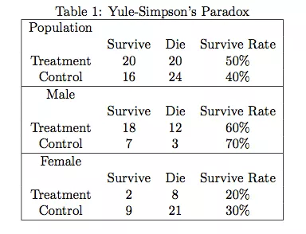
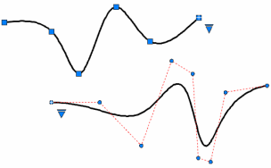

```{r setup, include = FALSE}
knitr::opts_chunk$set(echo = FALSE, message = FALSE, warning = FALSE)

if (!require(pacman)) install.packages("pacman")
library(pacman)

p_load(
  tidyverse, flextable, icons, xaringanExtra, ggeffects
) 


use_xaringan_extra(c("tile_view", # O
                     "broadcast",
                     "panelset",
                     "tachyons",
                     "fit_screen"))
use_extra_styles(
  hover_code_line = TRUE,         #<<
  mute_unhighlighted_code = FALSE  #<<
)


# Functions preload
set.seed(313)

theme_set(theme_minimal())
```
## Overview

1. Endogeneity
    + Issue
    + Diagnosis
    + Adjustment
1. Autocorrelation
    + Issue
    + Diagnosis
    + Adjustment

---

class: inverse, bottom

# Endogeneity

---

class: center

## What's the Problem

Grades ~ Language Skill   
Which influence which?

--

Formally, given Y<sub>i</sub> = &beta;<sub>0</sub> + &beta;<sub>1</sub>X<sub>i</sub> + u<sub>i</sub>, exogeneity means cov(X<sub>i</sub>, u<sub>i</sub>) = 0.


Endogeneity occurs when cov(X<sub>i</sub>, u<sub>i</sub>) .red[&ne; 0].

--

Explicitly, 

\begin{align}
Y =& \beta_0 + \beta_1X + u\\
X =& \beta'_0 + \beta'_1Y + v
\end{align}


---

## Causes

A.k.a., why can't correlation be causation?

.center[]

--

.pull-left[

*Selections on the Observables* (SOO)

.center[]
]

???

If Z is observed, by adjusting Z, the diagram fulfills the backdoor criterion.

--

.pull-right[
Unobservable Confounders

.center[]
]

---

## Diagnosis

For the observables: 

Hausman Procedure (using t distribution):

Full (true) model is $Y = \beta_0 + \beta_1X_1 + \beta_2X_2 + u$, and if one estimates $Y = \beta_0 + \beta_1X_1 + u'$, X<sub>2</sub> is missed. 

To test if this leads to endogeneity, we regress: $X_1 = \gamma X_2 + v$, and test 

.center[H<sub>0</sub>: cov(u', v) = 0.]

--

How about those unobservables?

???

Residuals is probably the most direct indicator

---

## Dealing with Endogeneity: SOO

A classic example: Yule-Simpson Paradox

.center[]

???

+ Edward H. Simpson 1951
+ Karl Pearson et al.1899
+ Udny Yule, in 1903
+ Also called as Simpson's reversal, Yule–Simpson effect, amalgamation paradox, or reversal paradox

整体 treatment > control
男女都是treatment < control

---

background-image: url("images/ea_yuleSimpson.gif")
background-position: center
background-size: contain

---

Matching, weighting, even better controls would be helpful.

--

.center[What if the selection outcomes are only partially observable?]

E.g., Wage  ~ **X**, but only **X**<sub>employed</sub> is observable.

???

Suppose that a researcher wants to estimate the determinants of wage offers, but has access to wage observations for only those who work. Since people who work are selected non-randomly from the population, estimating the determinants of wages from the subpopulation who work may introduce bias.

--

If the omission has a .red[fixed, known limit] determining what observations get in to the sample &rarr; a .navy[Tobit] model.

--

If not &rarr; a .navy[Heckman] model (two/N-stage model)

.pull-left[
Stage I: **E** ~ **Z**&gamma; + **u**<sub>e</sub>;
]

???

E is probability to be hired; W is the explanatory variables

--

.pull-right[
Stage II:     
**Wage**|(E, **X**),  ~ **X**<sub>employed</sub> + **u**<sub>w</sub>

E[W|X,E]=X&beta; +&rho;&sigma;<sub>**u**<sub>w</sub></sub>&lambda; (Z&gamma;),

1. &lambda;: Inverse Mills Ratio from stage I;
1. &rho; = corr(**u**<sub>e</sub>, **u**<sub>w</sub>)<sup>\*</sup>;
1. &sigma;<sub>**u**<sub>w</sub></sub>: Standard deviation of **u**<sub>w</sub>.
]

.footnote[.red[ASSUMPTION]: The errors are jointly normal.]

???

Mills ratio: Complementary cumulative distribution function OVER probability density function:

\begin{align}
m(x) :=& \frac{\bar{F}(x)}{f(x)},\\
\bar{F}(x) := \Pr[X>x] = \int_x^{+\infty} f(u)\, du
\end{align}

---

## Dealing with Endogeneity: Unobservables

Famous or "notorious" instrumental variables (IV)

.center[]

--

Statistically, we need a variable Z<sub>i</sub> that .red[simultaneously] satisfies: 

1. cov(X<sub>i</sub>, Z<sub>i</sub>) &ne; 0
1. cov(u<sub>i</sub>, Z<sub>i</sub>) = 0

---

## An Example

The effect of education on earnings

OV: Income  
EV: Likelihood of going to school

.center[(What's the problem?)]

???

Individual ability

--

IV candidates: 

1. Proximity to college (Card 1995)
1. Month of birth (Angrist and Krueger 1991)

---

## Another Example

How does economic growth affect within-country conflicts? 

OV: Incidence of civil war   
EV: Economic growth per capita

.center[(What's the problem?)]

???

Endogeneity: religious fractionalization, mountainous terrain, and population

--

IV : Rainfall growth (% change in rainfall from the previous year) 

???
Miguel, Satyanath, and Sergenti 2004, Journal of Political Economy

--

Concerns? 

???

Agriculture only? 

Is rainfall random? Drought in one country could make another country's projects more scare and therefore valuable.

---

class: center, middle

## How to Find a Proper IV

Seeking something seemingly irrelevant

--

Seeking back to the time

--

Making some assumptions 

--

Ok, ok, IV is a .red[myth], unless by design...

---

## Assuming You Found One

.pull-left[
Two Stage Least Squares (2SLS)

A pretty rough way to think about it: 

1. Regress **X** on **Z** to get $\boldsymbol{\hat X}$;
1. Regress **Y** on $\boldsymbol{\hat X}$.

Solvable on one condition:    
Being identifiable, $$\hat{\boldsymbol{\beta}}_{IV} = (\boldsymbol{Z'X})^{-1}\boldsymbol{Z'Y}$$
]

--

.pull-right[
*Over-identified model*

.small[
\begin{align}
\hat{\boldsymbol{\beta}}_{2SLS} =& (\boldsymbol{X'P_ZX})^{-1}(\boldsymbol{X'P_ZY})\\
                                =& (\boldsymbol{X'Z(Z'Z)^{-1}Z' X})^{-1}\boldsymbol{X'Z(Z'Z)^{-1}Z'Y}
\end{align}
]

where $$\boldsymbol{P_z} = Z(Z'Z)^{-1}Z'$$ (a.k.a., the projection matrix), and $$\boldsymbol{\hat X} = \boldsymbol{P_ZX}$$
]

???

Recommend over-identified model more

http://www.soderbom.net/lec2n_final.pdf

because the additional instruments can be used to increase the precision of the estimates, and to construct tests for the validity of the overidentifying restrictions (which sheds some light on the validity of the instruments), but may lead to inefficiency.


---

## Effect

\begin{align}
cov(Y_i, Z_i) =& cov(\beta_0 + \beta_1X_i + u_i, Z_i)\\
              =& cov(\beta_0, Z_i) + cov(\beta_1X_i, Z_i) + cov(u_i, Z_i)\\
              =& \beta_1cov(X_i, Z_i)\\
\Rightarrow\beta_1 =& \frac{cov(Y_i, Z_i)}{\beta_1cov(X_i, Z_i)} = \frac{\sum(Y_i - \bar Y)(Z_i - \bar Z)}{\sum(X_i - \bar X)(Z_i - \bar Z)},\\
       var(\hat\beta_1) =& \frac{\sigma^2}{n\sigma_X^2\rho_{XZ}^2} \geq \frac{\sigma^2}{n\sigma_X^2\rho_{XX}^2} = \frac{\sigma^2}{\sum(X_i - \bar X)^2}
\end{align}

Trade-off: .navy[Unbiased estimates] from IV, yet a .red[bigger variance] (&rho;<sup>2</sup><sub>XX</sub> = 1 > &rho;<sup>2</sup><sub>XZ</sub>)

---

## Weak Instruments

.center[]


Statistically, we need a variable Z<sub>i</sub> that simultaneously satisfies cov(X<sub>i</sub>, Z<sub>i</sub>) &ne; 0, and cov(u<sub>i</sub>, Z<sub>i</sub>) = 0. 

--

However, when
cov(Y, Z) is small but not equal 0, "weak" instrument.

$$\beta_1 = \frac{cov(Y, Z) - cov(u, Z)}{cov(X, Z)}$$

+ When cov(X, Z) is salient, not fatal. w
+ When it's small, the estimate will be biased---in which case, OLS might be even better.

???

Check for the Problem: Stock and Watson (2007, 735)

---

class: inverse, bottom

# Autocorrelation

---

## Typology of Autocorrelation

.center[E(u<sub>1</sub>, u<sub>2</sub>) = 0]

1. Spatial autocorrelation
    + Heteroscedasticity (Multilevel)
    + Spillover (Spatial models)
1. Temporal autocorrelation

---

## Time Series

How does time make effects?

--

.pull-left[
One-period shock
\begin{align}
Y_t =& \beta_0 + \beta_1(Z_t + 1) + \beta_2Z_{t-1} + \cdots + u\\
Y_{t + 1} =& \beta_0 + \beta_1Z_{t + 1} + \beta_2(Z_t + 1) + \beta_3Z_{t-1} + \cdots + u\\
Y_{t + 2} =& \beta_0 + \beta_1Z_{t + 2} + \beta_2Z_{t + 1} + \beta_3(Z_t + 1) + \cdots + u
\end{align}
]

.pull-right[
.right[]
]

--
.pull-left[
Permanent Shift

\begin{align}
Y_t =& \beta_0 + \beta_1(Z_{t + 1}) + \cdots + u\\
Y_{t + 1} =& \beta_0 + \beta_1(Z_{t + 1} + 1) + \beta_1(Z_t + 1) + \cdots + u
\end{align}
]

.pull-right[
.right[]
]

---

## Time Dependency: When Time Per Se Is the Effect


$$E(u_i, u_j|X_i, X_j) = cov(u_i, u_j|X_i, X_j) = 0, \forall i, j.$$

When two variables both have, e.g., positive trend, then they appear correlated, although they are actually not.

$$E(u_{t_1}, u_{t_2}|X_{t_1}, X_{t_2}) \neq 0.$$

---

## Dealing with Time Dependency

.left-column[
### Fixed Effect
]

.right-column[
$$Y_t\sim X_t + Time_t$$
]

---

## Dealing with Time Dependency

.left-column[
### Fixed Effect
### De-trend
]

.right-column[
$$Y_t\sim X_t$$

\begin{align}
\text{Run } Y_t =& \beta_0 + \beta_1Time + u_t;\\
            X_t =& \gamma_0 + \gamma_1Time + v_t;\\
\text{Run } Y'_t =& Y_t - (\hat\beta_0 + \hat\beta_1Time);\\
            X'_t =& X_t - (\hat\gamma_0 + \hat\gamma_1Time).\\
\Rightarrow\ Y'_t =& \delta X'_t + e_t.
\end{align}
]

---

## Dealing with Time Dependency

.left-column[
### Fixed Effect
### De-trend
### Spline
]

.right-column[
.center[]
]

---

## Dealing with Time Dependency

.left-column[
### Fixed Effect
### De-trend
### Spline
### Smooth
]

.right-column[
Smooth function: t + t<sup>2</sup> + t<sup>3</sup>
]

???

"nearly identical substantively [with spline]", Carter, David B., and Curtis S. Signorino. 2010. "Back to the Future: Modeling Time Dependence in Binary Data." *Political Analysis* 18(3): 271–92.

---

## When Time is More than Time

Affecting the relations between OV and EVs and among IVs

--

.center[
*Time series analysis*

 
]

---

## Random Walk & Unit Root

Let &rho;&in;[-1, 1] identify the direction the path will go (&darr;-1, &uarr;1, &rarr;0).

\begin{align}
Y_t =& \rho Y_{t - 1} + e_t\\
u_t =& \rho u_{t - 1} + e_t, e_t\sim iid(0, \sigma^2)\\
\Rightarrow\ u_{t + 1} =& \rho u_t + e_{t+1}\\
                       =& \rho(\rho u_{t - 1} + e_t) + e_{t + 1}\\
                       =& \rho(\rho (\rho u_{t - 2} + e_{t-1}) + e_t) + e_{t + 1}
\end{align}

--

1. |&rho;| < 1 implies the effects of previous errors goes away eventually;
1. |&rho;| = 1, the pass never goes away, and the trend can end anywhere,

a.k.a. one .red[Unit Root].

---

## Stationary

For every collection of time periods (X<sub>t<sub>1</sub></sub>, X<sub>t<sub>2</sub></sub>, X<sub>t<sub>3</sub></sub>,... where t<sub>1</sub> < t<sub>2</sub> < t<sub>3</sub>...), their distributions are the same as X<sub>t<sub>1</sub></sub> + h, X<sub>t<sub>2</sub></sub> + h, X<sub>t<sub>3</sub></sub> + ... i.e., the .navy[same joint distribution], or saying the .navy[error terms are the same] for every period.

--

.pull-left[

]

--

.pull-right[

]


---

## Covariance Stationary

Given: 

1. t(X<sub>t</sub>) is constant;
1. var(X<sub>t</sub>) is constant;
1. cov(X<sub>t</sub>,X<sub>t + n</sub>)does not rely on t, i.e., cov(X<sub>t,</sub>X<sub>t + n</sub>) = cov(X<sub>t + 1</sub>,X<sub>t + 2</sub>).


Then, a moving average process that is covariance stationary is weakly dependent if cov(X<sub>t</sub>,X<sub>t + n</sub>)&rarr;0 as n&rarr;&infin;.


When covariance stationary plus weakly dependent (e.g., $Y_t = \rho Y_{t - 1} + X_t + e_t$), the OLS is consistent.

---

## Influence on the Coefficient

Let's assume the mean of X is zero to simplify the maths

\begin{align}
\hat\beta_1 =& \beta_1 + \frac{\sum(X_t - \bar X)}{\sum(X_t - \bar X)^2}u_t\\
            =& \beta_1 + \frac{\sum X_t}{\sum X_t^2}u_t, u_t = \rho u_{t - 1} + e_t
\end{align}

Only when &rho; = 0 (or cov(X<sub>t</sub>, X<sub>t + n</sub>) = 0), the estimate is identical with the OLS estimate.

In other cases, &beta; is .red[biased].

---

## Influence on the Variance

\begin{align}
var(u_t|X) =& var(\rho u_{t - 1} + e_t|X),\\
           =& var(\rho(\rho u_{t - 2} + e_{t - 1}) + e_t|X),\\
           =& var(\rho(\rho (\rho u_{t - 3} + e_{t-2}) + e_{t-1}) + e_t|X),\\
           =& var(\rho^3u_{t - 3} + \rho^2e_{t-2} + \rho e_{t - 1} + e_t |X),\\
           =& \rho^6var(u_{t - 3}) + \rho^4\sigma_{e_{t-2}} + \rho^2\sigma_{e_{t-2}} + \sigma_e^2.
\end{align}

--

Following this manner, when t increases,

\begin{align}
var(u_t|X) =& \sigma_e^2 + \rho^2\sigma_e^2 + \rho^4\sigma^2 +\cdots,\\
           =& \sigma_e^2\sum^T_{t = 1}\rho^{2(t - 1)} = \frac{\sigma_e^2}{1 - \rho^2}.
\end{align}

--

When &rho; > 0, the estimation of variance through OLS will be .red[overestimated].

---

## Diagnosis: Durbin-Watson test

Testing AR(1)

\begin{align}
DW =& \frac{\sum^T_{t = 2}(\hat u_t - \hat u_{t - 1})^2}{\sum^T_{t = 2}\hat u_t^2}= \frac{\sum^T_{t = 2}(\rho\hat u_{t-1} + e_t - \hat u_{t - 1})^2}{\sum^T_{t = 2}\hat u_t^2}\\
   =& \frac{\sum^T_{t = 2}[(\rho - 1)\hat u_{t - 1} + e_t]^2}{\frac{\sigma_e^2}{1 - \rho^2}}\\
   =& \frac{\sum^T_{t = 2}\{[(1 - \rho)^2\hat u^2_{t - 1}] + 2(\rho - 1)\hat u_{t - 1}e_t + e_t^2\}}{\frac{\sigma_e^2}{1 - \rho^2}}\\
   \approx& \frac{\sum^T_{t = 2}[(1 - \rho)^2\sigma_u^2 + \sigma_e^2]}{\frac{\sigma_e^2}{1 - \rho^2}} = (1 - \rho)^2 + (1 - \rho^2) = 2(1 - \rho)
\end{align}


---

.center[DW = 2(1 - &rho;)]

Since the range of &rho; is [-1, 1], DW &in; [0, 4].

In practice, DW test specifies a range of values, [d<sub>l</sub>, d<sub>u</sub>], and set the hypotheses:


.bg-black.golden.ba.shadow-5.ph4.mt3[
Positive AR: H<sub>0</sub>: &rho; = 0; H<sub>1</sub>: &rho; > 0
]

.pull-left[

*Positive autocorrelation*

DW < d<sub>l</sub>, reject H<sub>0</sub>;   
d<sub>l</sub> < DW < d<sub>u</sub>, inconclusive;   
DW > d<sub>u</sub>, fail to reject H<sub>0</sub>
]

--

.pull-right[
*Negative autocorrelation*

(4 - DW) < d<sub>l</sub>, reject H<sub>0</sub>;   
d<sub>l</sub> < (4 - DW) < d<sub>u</sub>, inconclusive;   
(4 - DW) > d<sub>u</sub>, fail to reject H<sub>0</sub>
]

---

## Dealing with Autocorrelation

Time series analysis

Most common model: Autoregressive distributed lag model, ADL

Mitchell, Sara B. 2017. “Time Series Analysis for the Social Sciences.” *Contemporary Sociology* 46(5). <sup>1</sup>


.footnote[

[1] Box-Steffensmeier, Janet M. 2014. *Time Series Analysis for the Social Sciences*. New York: Cambridge University Press.

]

---

## Special Case: Panel

Different from time series: T small, N large

General model: $Y_{it} = \beta_0 + \beta_1X_{it} + u_{it}$

--

**Solution 1**: Fixed effect

$$Y_{it} = \beta_0 + \beta_1X_{it} + a_i + u_{it}$$

--

**Solution 2**: Fixed differentiating

\begin{align}
Y_{i2} - Y_{i1} =& (\beta_0 - \beta_0) + \beta_1(X_{i2} - X_{i1}),\\
                 &+ (u_{i2} - u_{i1}),\\
\Delta Y_i =& \beta_1\Delta X_i + \Delta u_i.
\end{align}

---

Both are unbiased and consistent, nevertheless: 

When N = 2, FE and FD are identical;

When N > 2, not necessarily;

When autocorrelation is weak in the errors, FE might be better with smaller variance.

--

.red[Hint]: Neither methods allows time invariant X.

---

## Special Case: TSCS

General model: 

$$Y_{it} = \beta_0 + \beta_1X_{it} + \beta_2X_t + \beta_3X_i + u_{it}$$

X<sub>t</sub>: Only varying by time.

X<sub>i</sub>: Only varying by unit.

---

## TSCS Dealing with Time

**Solution 1**:  Detrend

1. Detrending functions, e.g., the time smooth function/spline
1. Adding lag Y [AR(1)] (.magenta[Hint]: May cause bias).

**Solution 2**: Regime switching

\begin{align}
Y_{it} =& \beta_0 + \beta_1X_{it} + \beta_2X_{it}dZ_t + \beta_3dZ_t + u_{it}\\
   dZ_t =& 1, \text{if } t \leq t^*.
\end{align}

Structural break at t<sup>*</sup> in the X-Y relationship.

---

### Treating time dependency as unit heterogeneity

**Solution 1**: LSDV, $Y_{it} = \delta_td_{t} + \beta_1X_{it} + a_i + u_{it}$

$\delta_td_{t}$: Fixed effect for time

$a_i$: Fixed effect for unit (unit-specific mean differences)

--

**Cons**: 

1. Using up the d.f.
1. Aggravating multicollinearity
1. .magenta[Losing time invariant variables].

---

**Solution 2**: Within-between model or random effect model

Modeling time as a level

$$Y_{it} = \delta_td_{t} + \beta_1X_{it} + a_i + u_{it}$$

Instead of using binaries, modeling $a_i\sim N(0, \tau^2)$

.red[ASSUMPTION]:

1. cov(a<sub>i</sub>, X<sub>it</sub>)= 0 (strong)
1. cov(a<sub>i</sub>, u<sub>it</sub>)= 0

---

## Wrap Up

**Endogeneity**

+ Issue: Biased &beta;
+ Diagnosis: Hausman Procedure
+ Adjustment: 
    + Matching, weighting, Heckman model
    + Instrumental Variable (if you could find one)

--

**Autocorrelation**

+ Issue: Biased &beta; overestimated SE
+ Diagnosis: DW *for AR(1)*
+ Adjustment: Time series
    + Panel data: Fixed effect/fixed differentiating
    + TSCS: Fixed effect/within-between/random effect model
    
```{r pdfPrinting, eval = FALSE, include = FALSE}
pagedown::chrome_print(list.files(pattern = "13_.*.html"), 
                       timeout = 500, 
                       box_model = "padding")
```