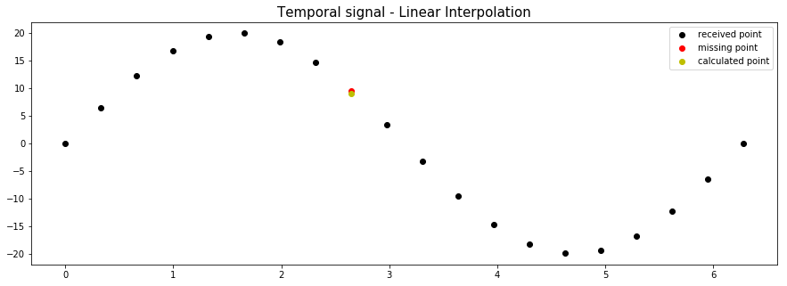
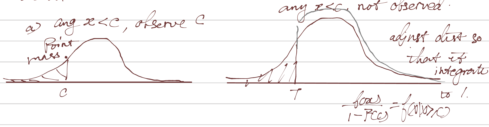

class: inverse, bottom

# Autocorrelation

---

## Time Series

---

class: inverse, bottom

# Endogeneity

---

class: inverse, bottom

# Missing Data

---

## What's Missing Data

Let's define  **X**, **Y**, and mij = 1 if Xi is missing.

\begin{align}
\boldsymbol{D} =& 
\left(\begin{array}{cc}
X_1 & Y_1\\
X_2 & Y_2\\
X_3 & Y_3\\
X_4 & Y_4\end{array}\right);
\boldsymbol{D^{Observed}} =
\left(\begin{array}{cc}
X_1 & Y_1\\
X_2 & Y_2\\
X_3 & Y_3\\
X_4 & Y_4\end{array}\right);\\
\boldsymbol{M} =& 
\left(\begin{array}{cc}
0 & 0\\
1 & 0\\
0 & 0\\
1 & 0\end{array}\right);
\boldsymbol{D^M} =
\left(\begin{array}{cc}
 & \\
X_2 & \\
 & \\
X_4 & \end{array}\right)
\end{align}

---

## Type of Missing

### Missing completely at random (MCAR)

P(M|D) = P(M)

### Missing at random (MAR)

P(M|D) = P(M|DObserved)

### Non-ignorable (NI/MNAR)

P(M|D) &ne; P(M|DObserved)

---

## Consequence of Missing

|      | Summary Stats | Regression          | SE vs. complete |
|------|---------------|---------------------|-----------------|
| MCAR | Unbiased      | Unbiased/consistent | Inefficient     |
| MAR  | Biased        | .magenta[Unbiased/consistent] | Inefficient     |
| NI   | Biased        | Biased              | Inefficient     |

???

Unbiasedness in MAR is because the censoring of the data is based on an irrelevant variable;
Biasedness in NI is because of the censor with an X within the model

---

## Solution

**Ignore it**: listwise deletion

???

Even for MAR, droping the entire entry due to the missing would cause bias, because there is no missing in Y but Y is dropped because of the missing of X; cov(X, u) &ne; 0, so often parwise deletion

--

**Fill it manually**: hot decking (using neayby approximate values, e.g., mean)

--

**Imputation**

1. Interpolation
1. Extrapolation
1. Regression imputation: $M = \boldsymbol{X\gamma} + u$
    + For multidimentional variable use joint distribution and iterative chain.
    
???

    
---

**Multiple imputations**: 

1. Take multiple guess given estimated distribution
2. Result $\hat\beta(1), \hat\beta(2), \hat\beta(3)$,... and their variance.
3. Combine: Rubin's formula

\begin{align}
\hat\beta =& \frac{\sum^m_{i = 1}\hat\beta_i}{m},\\
var(\hat\beta) =&  \frac{\sum^m_{i = 1}var(\hat\beta_i)}{m} + \frac{m + 1}{m}W,\\
\text{where}\ W =& \frac{1}{m}\sum^m var(\hat\beta_i - \hat\beta)^2 
\end{align}

???

$\frac{\sum^m_{i = 1}var(\hat\beta_i)}{m}$ variance within each complete dataset;

$\frac{m + 1}{m}W$ variance across datasets.

---

### Advantages

Imputation process is separated from the analysis process. Therefore, the misspecification of the model does not affect MI.

---

class: small

## When You Shouldn't Use MI

1. The analysis model is conditional on X and the functional form is known to be correctly specified, so that listwise would not affect the analysis.

--

1. There is NI missingness in X so that EMs can give incorrect answers.

--

1. Missingness in X is not a function of Y, and there is no unobserved omitted values
that affects Y.

--

1. The data is large enough that the influence of the listwise is trivial.

--

1. The model is nonlinear and complicated.

--

1. Extreme distributional divergence in missing data from multivariate normal.

---

**Likelihood approach**

Estimate distribution and integrate over it (the results are identical no matter how many times doing it).

e.g., SEM

---

class: small

## Non-Ignorable Missing

*Common types*:

**Censored**: Have .magenta[some] information about values of missing data, e.g., all data <0 are
coded as 0.
+ Leading to heteroscedasticity and nonnormal error
+ Solution: For Y missing, two-stage process, 2SLS (Heckman model).

???

2SLS: Two-Stage least squares

--

**Truncated**: Have .magenta[no] information about values of missing data, e.g., the data are only
observable when it > 100.
+ Solution: `tobit`, use the right distribution---a combination of $P(Y_i^* < 0|X)$ and $f(Y_i|X_i)$.

???

