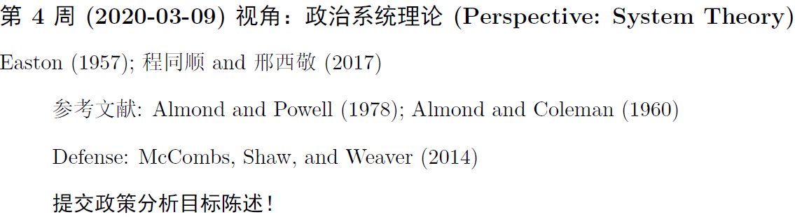

class: inverse, center, middle

# WHO ARE YOU?

(Why do you deserve to be remembered?)


---

## An Elevator Pitch

.center[]

* 30 seconds preparation
* 30 seconds presentation

---

## Preparation

```{r ranNm-generator}
set.seed(114)

# Random sequence generator

if(!require("readxl"))
  install.packages("readxl")

studentNM <- readxl::read_xls(file.path('学生信息.xls'))

studentNM[sample(1:nrow(studentNM)),]$`姓名`
```

---

class: center, middle

# Ready? 

```{r stopwatchII, echo = FALSE}
library(countdown)

countdown(minutes = 0,
          seconds = 30,
          play_sound = TRUE)
```


---

## Who am I?

.left-column[
* Ph.D. of Political Science
    + Comparative Politics
    + Methodology
]

.right-column[
.center[]
]

--

.full-column[

* Assistant professor in Department of Political Science at THU

* Personal Website： [sammo3182.github.io](sammo3182.github.io)
]

---

class: inverse, bottom

# Intro to the Course

---

## A PA Class

### GOAL

1. "Policy whisperer"
1. Tasting the paradigm of social science
1. Practicing academic writing/presenting

---

## An Unconventional PA Class

* Little about policy process
* Little about statistics

--

* Primarily, .magenta[perspectives and methods]
* Some professional training

---

class: small

## Not Much about...

In a typical PA course:

* A lot of concepts and procedures
    + Structures/systems/branches/sections
    + Procedures/execution/communication
    + Outcomes
    + Evaluation/Issue
    + ......

--

* A lot of models of public policy
    + Smith Model
    + Mutual Adaptation Model
    + Communication Model of Intergovernmental Policy Implement
    + ......

--

* A lot of specific areas

???

行政体系、社会福利、环保政策、经济政策

---

class: center, middle

.Huge[Why?]

???
National Center for Education Statistics (NCES) of the US:

"A program that prepares individuals to serve as managers in the executive arm of local, state, and federal government and that focuses on the systematic study of executive organization and management."

Incorporate with organization theories, law management, bureacrat, budget analyses, etc.

---

## In This Class...

.left-column[

* ~~Procedure~~
* ~~Evaluation~~
* ~~Policy Topics~~
]

--

.right-column[

* Perspectives
* Approaches
* Methods
]

---

## An Unconventional Method Course

We'll talk about a variety of approaches and methods, yet...

--

No math required

--

No programming required

--

No textbooks required.

.center[]


---

## What IS This Course About?

--

Long long time ago, like in 1927,...

.center[]

???

William Howard Taft: The 27th president of the United States and the tenth chief justice of the United States

Robert Maynard Hutchins: Dean of Yale Law School (28 yr old), 后president of the U of Chicago

---

## Chief Justice vs. Chancellor of the School

1927, Yale

--

[Taft:] “Well, I understand that at Yale you teach your students that judges are fools.”

--

[Hutchins:] “No, Mr. Chief Justice, at Yale we teach our students to **find that out for themselves**.”

---

class: inverse, botoom

# Finding for Yourselves How?

---

## What the Course Will Offer?

1. A perspective;

--

2. Strategies + tactics;

--

3. Data + tool;

--

4. Critical examination;

--

5. Professional writing.

---

## Operation

1. Reading
1. Listening/Expressing
1. Writing


---

## Reading

.center[]

---

"Easton (1957); 程同顺and 邢西敬(2017)"

> Required readings (~~word by word~~, going through instead )

--

"参考文献: Almond and Powell (1978); Almond and Coleman (1960)"

> References (a.k.a., no need to read immediately`r emo::ji("smiling_imp")`)

---

"Bonus Case: McCombs, Shaw, and Weaver (2014)"

> Presenting (elaborated later)

--

"提交政策分析目标陈述！"

> Assignment (!!!)

---

## Take Notes Properly

<iframe width="700" height="500" src="//player.bilibili.com/player.html?aid=18249428&cid=29793507&page=1" scrolling="yes" border="0" frameborder="no" framespacing="0" allowfullscreen="true"> </iframe>


---

## Listening and Expressing

--

Attend and listen carefully! (A.k.a., let me see your face~~)

--

Certainly respond!

--

Please, ask questions!

--

Well, also point out the typos~

.right[]

---

class: center, middle

## More than that...

--

.huge[Challenging]  
.Large[课堂宾主对]

---

background-image: url("images/monkDebate.jpg")
background-position: center
background-size: contain

---

background-image: url("images/qipashuo.jpg")
background-position: center
background-size: contain

---

## Spokesperson vs. Challenger

.left-column[
### Spokesperson (the presenter)

+ 5--10 min
+ Presenting
    + Content
    + Connection to the last class
    + Anything new
]

--

.right-column[
### Challenger (the audience)

+ Randomly chosen
+ 3--5 min
+ Answering 1--2 questions
+ Asking 1--2 questions

]


---

## Writing

(Final project)

A proposal of public policy analysis

--

A semester-long project

---

## Three Reports 

1. A topic with .magenta[approval]

--

1. An .magenta[annotated] bibliography

--

1. A .magenta[complete] proposal

---

## Extra Credits

.left-column[.center[]]

.right-column[
1. Being an additional spokesperson (2' max)
1. Being the challengers (3' max)
]

---

## Wrap It Up

.center[]

---

class: center, middle

.Large[Assigning Defenders]

---

class: small

```{r assigning, echo = FALSE, message=FALSE}
library(dplyr)
library(knitr)

studentNM$week <- sample(c(3:7, 9:15)[1:nrow(studentNM)])

tibble(week = c(3:7, 9:15)) %>% 
  left_join(studentNM) %>% 
  select(week, `姓名`) %>% 
  kable(format = "html")
```


```{r pdfPrinting, eval = TRUE, include = FALSE}
pagedown::chrome_print(list.files(pattern = "01_.*.html"), timeout = 300)
```