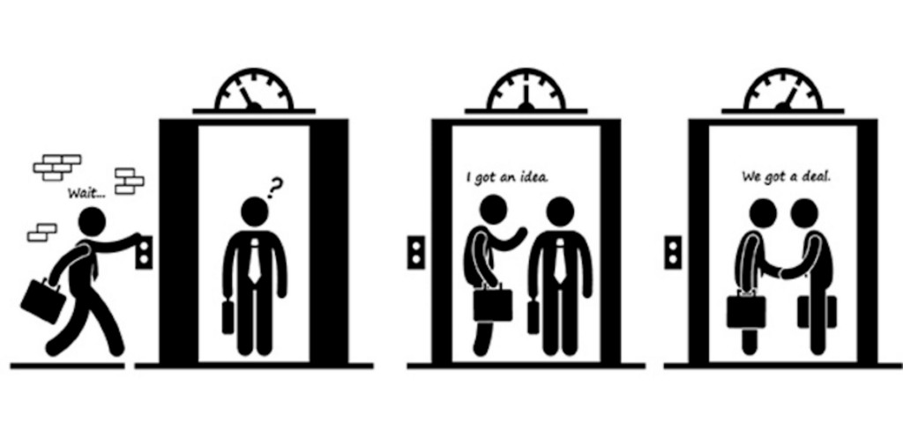
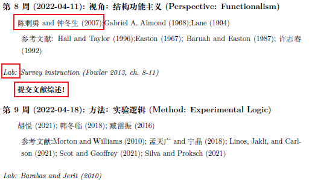

class: inverse, center, middle

```{r setup, include=FALSE}
knitr::opts_chunk$set(echo = FALSE, message = FALSE, warning = FALSE)

if (!require(pacman)) install.packages("pacman")
library(pacman)

p_load(
  tidyverse, flextable, icons, xaringanExtra, ggeffects
) 


use_xaringan_extra(c("tile_view", # O
                     "broadcast",
                     "panelset",
                     "tachyons",
                     "fit_screen"))
use_extra_styles(
  hover_code_line = TRUE,         #<<
  mute_unhighlighted_code = FALSE  #<<
)


# Functions preload
set.seed(313)

theme_set(theme_minimal())
```

# Analysis of Public Policy

(and why do you deserve to be remembered?)

???

Starting with "hello, how are you" and

1. You are controlled by public policies
1. You don't understand public policies, e.g., the electronic motobike policy
1. You'll learn about a thinking system instead of some techniques

---

## An Elevator Pitch

Please imagine that you are interviewed by the rest of the class for a job that you .red[REALLY] want. 
Whether you'll be employed depends on .red[how many] of the interviewers remember your name (of course, in a positive way).
You only have .red[30 seconds] to introduce yourself. 
What would you do?

.center[

]

???

30 s preparation    
30 s presentation

---

class: center, middle, inverse

# Ready? 

---

class: center, center

## Tips for Eleivator Pitching

Smile 

Body language

Audience view

- Question
- Fact
- Story


--

## Two Goals for the Elevator Pitch


Key point of public policy analysis (.red[oft-ignored])

(One of) the .red[primary features] of this class

???

- Not only understanding but also explaining/illustrating/convincing

- Being practical both on researching but also thinking

- Key: audience position, What may impress me?


---

class: center, middle

## Who am I

Pragmatic Political .red[Scientist]

???

Political Psychologist and Methodologist; Comparativist and China Expert

--

Patient and Passionate .red[Teacher]

--

King of .red[Anti-jokes] and Old Gags

--

Diehard Fan of .red[R] Programming


--


I am .Large[DR. HU!]


???

David Tennant (2005--2010)

---

class: center, middle, huge

Your    
lovely TA

---

class: inverse, bottom

# Take (Or Not Take) This Class?

---

class: small

## A Typical PA Class

.pull-left[
.center[
概论    
……    
……


政策环境    
……    
……


政策过程    
……    
……


政策参与者    
……    
……


政策工具    
……    
……


政策评估    
……    
……
]
]

.pull-right[
* Concepts and procedures
    + Structures/systems/branches/sections
    + Procedures/execution/communication
    + Outcomes
    + Evaluation/Issue    
    ......


* Models
    + Smith Model
    + Mutual Adaptation Model
    + Communication Model of Intergovernmental Policy Implement   
    ......

* Specific policy areas
    + Bureaucratic system
    + Social welfare
    + Environmental, distribution, tax, revenue    
    ......
]


---

## Goal of a Typical PA Class

> [A PA training is] a program that prepares individuals to .red[serve as managers] in the executive arm of local, state, and federal government and that focuses on the .red[systematic study] of executive organization and management.

> --- National Center for Education Statistics (NCES) of the US


???

Incorporate with organization theories, law management, bureaucrat, budget analyses, etc.

---

## Goal of This Class

Once upon a time,...

.center[]

???

1927

William Howard Taft: The 27th president of the United States and the tenth chief justice of the United States

Robert Maynard Hutchins: Dean of Yale Law School (28 yr old), 后president of the U of Chicago

---

## Chief Justice vs. Chancellor of the School

1927, Yale

--

[Taft:] Well, I understand that at Yale you teach your students that judges are fools.

--

[Hutchins:] No, Mr. Chief Justice, at Yale we teach our students to .red[find that out] for themselves.

---

class: large, center, middle

Finding for Yourselves, But How?

---

class: middle, center

## Goal in Specific

Public policy basics

Policy .red[whisperer]

Scientific sense to understanding political policy

- DGP
- Writing


---

class: center, middle

Little about policy process

Little about statistics

--


Primarily scientific .red[logic & procedure]

.red[Professional] training

---

background-image: url("images/intro_takingTheClass.png")
background-position: center
background-size: contain

## Take or Not Take

---

background-image: url("images/intro_designApp.png")
background-position: center
background-size: contain


---

## Preparation

.center[
.red[No] math required

.red[No] programming required

.red[No] textbooks required.

]

---

class: center, middle

## What Do I Expect

Learning

Enjoying

Showing


---

class: small

## Learning

.center[]

---

## Enjoying

.pull-left[
### Attend and listen

- I want to see your (half-)face 🐶
- Talk to us
- No stupid questions, but stupid answers
- 
]

--

.pull-right[
### Gathering by yourself

### Challenging
]

---

## DGP Workshop

Data generation process (DGP): .red[Vital & fatal]!

--

### Focus

Big data scrapping
+ Software based \+ programming based
+ Better to associate with the "Learning R with Dr. Hu and His Friends" workshop

--

Survey design and collection
+ Finding a policy topic
+ Design a survey (<= 5 questions)
+ Distribute the survey and collect data
+ Better to associate with stats class, e.g., "Analysis of Political Data" (70700173)

---

### Procedure

First 8 weeks

Team work: 3-4, randomly assigned

---

## Challenging

.center[]

???

临济宗被称为“棒喝门庭”，家风严峻，禅机凛冽。以彻骨彻髓的般若智慧，鼎盛禅林。自古以来，禅者必须甘于落寞，甘于清凉，甘于寂静；远离浮华、热闹、远离名利！

“四照用、四料简、四宾主”，主要是用来衡量禅师接度人时对话的利钝得失其中的教法。前两个四法重在如何接度学人，而四宾主则重在使禅师摆脱被动。

---

background-image: url("images/intro_greeceDebate.jpeg")
background-position: center
background-size: contain

---

background-image: url("images/intro_qipashuo.jpg")
background-position: center
background-size: contain

---

## Presenter vs. Challenger

Starting from Week 9

.pull-left[
### Presenter

1. 10 min
1. Presenting
    + Content
    + Connection
    + Inspiring
]

--

.pull-right[
### Challenger

1. 5 min
1. Answering a question
1. Asking a question

]

--

.center[
New random assignment;  
Consistent team score.
]

---

## Showing 

A report of public policy analysis (3,500--5,000)

--

A semester-long project

1. Nail the topic (Week 4)
1. Literature review (Week 8)
1. Research design (Week 12)
1. Complete report with data analysis (Week 17)

--

An academic presentation 

---

## Extra Credits

.pull-left[.center[]]

.pull-right[
+ 2 credits max
+ Data quality and quantity
+ Research design quality
]

---

## Tips

- (Retailed) English

--

- Smartly learning
    - Listening, thinking, and feeling over recording

<iframe height="200" src="//player.bilibili.com/player.html?aid=18249428&bvid=BV1TW411q7Si&cid=29793507&page=1" scrolling="no" border="0" frameborder="no" framespacing="0" allowfullscreen="true"> </iframe>

???

Reading

Impressing

Slides

--

- Respect the teacher and TA

--

- Office hours: 08:00~09:30; 14:30~15:30; by appointment


---

## Wrap It Up

.center[]

```{r pdfPrinting, eval = FALSE, include = FALSE}
pagedown::chrome_print(list.files(pattern = "01_.*.html"), timeout = 300)
```