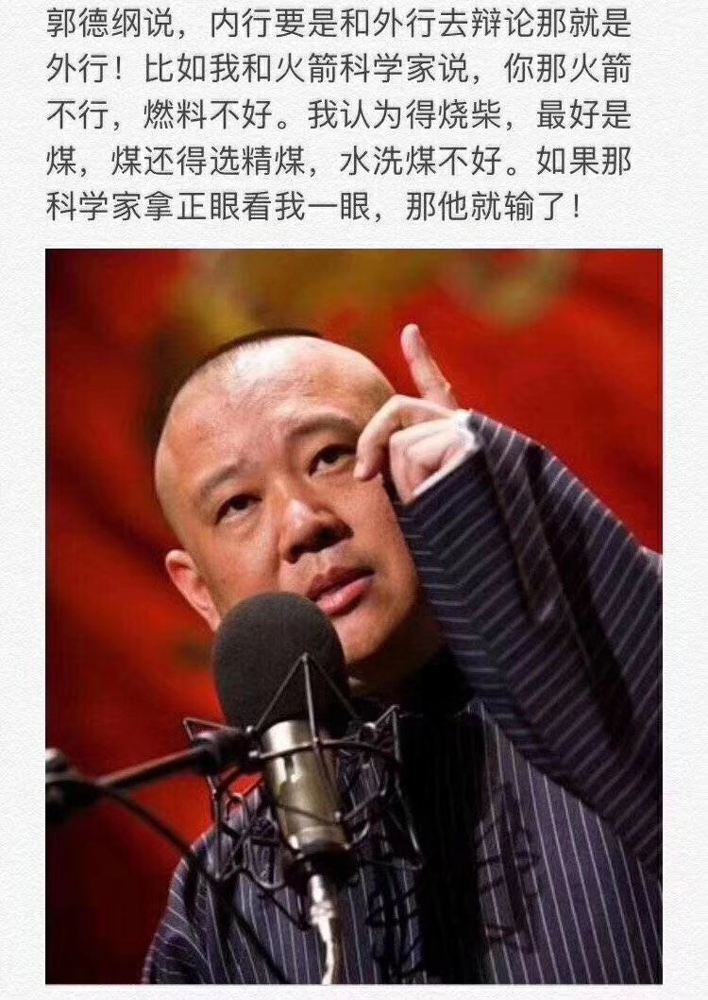
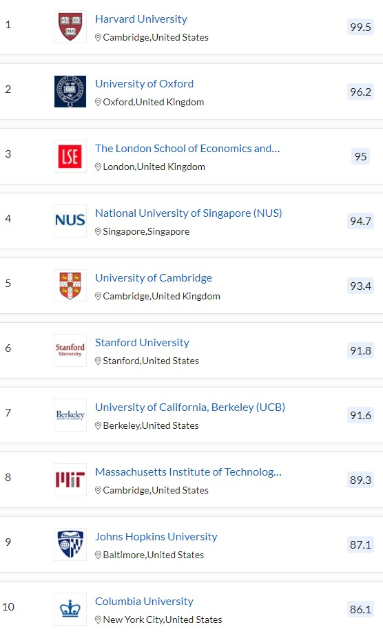
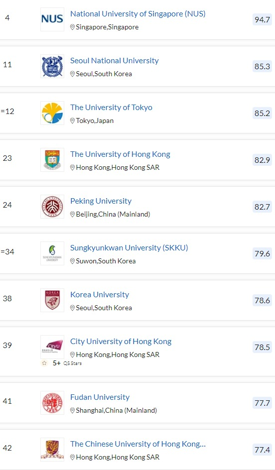
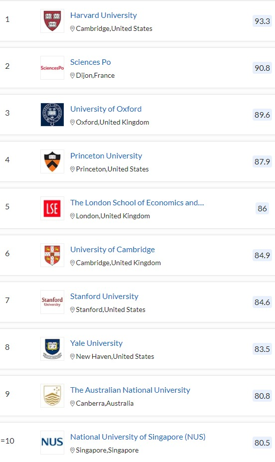
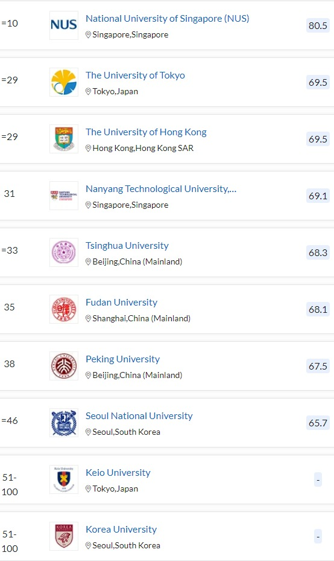
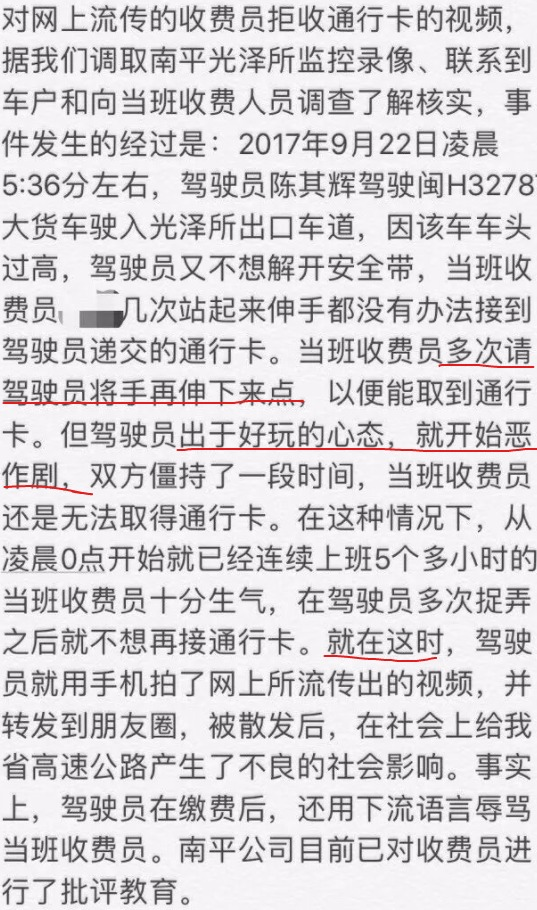
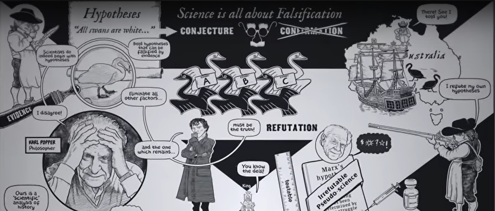

```{r setup, include=FALSE}
knitr::opts_chunk$set(echo = FALSE, message = FALSE, warning = FALSE)

if (!require(pacman)) install.packages("pacman")
library(pacman)

p_load(
  tidyverse, flextable, icons, xaringanExtra, ggeffects
) 


use_xaringan_extra(c("tile_view", # O
                     "broadcast",
                     "panelset",
                     "tachyons",
                     "fit_screen"))
use_extra_styles(
  hover_code_line = TRUE,         #<<
  mute_unhighlighted_code = FALSE  #<<
)


# Functions preload
set.seed(313)

theme_set(theme_minimal())
```
## Administrative

1. Professionalization

???

Finish an article in a weekend

--

1. First assignment
    + Group assignment
    + City assignment

---

class: inverse, bottom

# Previously in the *Public Policy Analysis*...

---

## Syllabus Is THE Guide

- What you will learn
    - How to understand public policies as a *professional* trainer
    - How to analyze public policies as a social *scientist*
    - How to evaluate public policy analyses as an *expert*

--

- What you need to do
    - Learning (Reading what you are supposed to read)
    - Enjoying (Being active in and off-class)
        - Dominate your own analysis (big-data/survey)
        - Tip: Staring at the instructor as you know everything 😝
    - Presenting
        - Challenging
        - Final report

---

## Overview

1. Landscape of policy analysis
1. Understanding policies .red[scientifically]
    - Why doing so 
    - How to do

---

## A Taste of the Professional Area

.center[]

---

## Whose Opinions You May Care More

A.k.a., the professionals


+ Major: 
    + Public Policy/Administration
    + Social Policy/Administration
+ Degree: Ph.D., MPA

+ Over 200 institutions by 2014

---

## Social Policy & Administration

.pull-left[
.center[]
]

--

.pull-right[
.center[
    
......

]
]

???

Reference: "[QS World University Ranking](https://www.topuniversities.com/university-rankings/university-subject-rankings/2019/social-policy-administration#indicator-tab)"

Quacquarelli Symonds: a British company specializing in education
Previous known as "Times Higher Education-QS World University Rankings"

---

## Political Science

.pull-left[
.center[]
]

--

.pull-right[
.center[]
]


---

## "Evaluation" of the Education Policy

1. Academic reputation .small[(expert opinions from 130,000 academic individuals)]
1. Employer reputation .small[(75,000 responses to the QS Employer Survey)]
1. Faculty/Student Ratio
1. Citations per faculty .small[(five-year publication window for papers, 96 million self-citations were excluded)]
1. International faculty ratio
1. International student ratio 

--

&rArr; .red[Weighted] results

$$Score = 0.4AP + 0.1EP + 0.2FR + 0.2CF + 0.05IFR + 0.05ISR.$$

---

## "Analysis" of Policy Implication

### Resort

| Approach         | China | U.S. |
|------------------|-------|------|
| Outsider<sup>1</sup>         | 55%   |      |
| Limited insider<sup>2</sup>  | 15%   | 75%  |
| In-depth insider<sup>3</sup> | 30%   | 25%  |

.right[.small[Source: He et al 2016, Table 4]]

.footnote[

[1] Solely of public policy .red[theories].  
[2] Positivist .red[framework] and .red[analysis] based on welfare economics.  
[3] Strong .red[analytic orientation]

]


---

### Content

- China

Public policy theories, policy environments, and policy processes

--

- U.S.

Welfare economics, rational modeling, utilities


---

background-image: url("images/sci_heetal2016tb3.png")
background-position: center
background-size: contain

???

The U.S, on Cost-benefit analysis and below, strategy of policy making

---

## Actor

.center[]

???

Few Chinese instructors focus on applied policy research

**NEXT**: In this class, teaching positivist policy analysis based on *social scientific paradigm*. 

Is that even possible?


---

class: inverse, bottom

.center[
<video width="700" height="500" controls preload>
    <source src="images/sci_sheldon_socialScience.mp4" type="video/mp4">
</video>
]

# Why Being Scientific

---

## Scientific Paradigms

> Paradigm: a bag of theories, research methods, postulates, and standards for what constitutes contributions to a field.

--

### Positivist

- French, *positivisme* (/positee vish men/), derived from positif in its sense of 'imposed on the mind by experience'. 
- *Data*-based
- Problem solving through systematic queries

???

Dominant, 实证主义; being positivist alone is not scientific

--

### Post-positivist

+ *Value*-based (norms, morality, culture)
+ Normative, ethical process


???

.greenLight[Q]: Does Positivist mean scientific? 

---

## [解决低生育的办法找到了——中国生育报告](https://www.sohu.com/a/515447321_467568) 


> 中国正面临世界上最严峻的老龄化少子化挑战，“低生育率陷阱”。**中国人口形势概括讲， 老龄化比其他国家更快，少子化比其他国家更低。**……有证据表明，2021年生育率将进一步降低到1.1左右，比欧美发达国家还低50%多，出生人口可能降至1000万左右。如果政策不做大力度调整，中国将在几十年内成为老龄化程度和人口萎缩最严重的国家之一。看看全球的总和生育率数据，欧洲是1.6，北美洲是1.8，拉丁美洲是2，大洋洲2.4，亚洲2.2，中国1.1，日本1.34，非洲是4，穆斯林国家是3.6。……**一定要抓住75-85年还能生的时间窗口，抓紧出台鼓励生育基金，再不出台就晚了，不要指望90后00后。**我国育龄妇女正在以每年300万-400万的速度在下降。原因也很简单，就是75年-85年的这批人还有多子多福的生育观念，而90后和00后不要说生二胎或者三胎，很多人甚至连结婚都不愿意。根据数据显示，2018年我国的单身成年人口还有2.4亿，其中处于独居状态的就有7200万人，预计到2021年这一数据可能会涨至9200万人。除此之外从2013年起我国的新婚登记人口人数也是一年不如一年，2020年年新婚登记人数只有813万对。所以，想要鼓励生三胎还是要看75年-85年的这批人。

???

Group discussion

任泽平， 国务院发展研究中心宏观部研究室副主任，国泰君安证券研究所董事总经理、首席宏观分析师等职务，清华大学经济管理学院博士后，中国人民大学经济学博士。前恒大集团首席经济学家（副总裁级）兼恒大经济研究院院长。2021年3月18日，任泽平加盟东吴证券，拟出任东吴证券特邀首席经济学家。

---

## Let's Decompose It

*Problem*

> [中国]老龄化比其他国家更快，少子化比其他国家更低。

--

*Theory*

> 出生人口可能降至1000万左右。如果政策不做大力度调整，中国将在几十年内成为老龄化程度和人口萎缩最严重的国家之一。

--

*Evidence*

> 欧洲是1.6，北美洲是1.8，拉丁美洲是2，大洋洲2.4，亚洲2.2，中国1.1，日本1.34，非洲是4，穆斯林国家是3.6。

--

*Solution/Conclusion*

> 一定要抓住75-85年还能生的时间窗口，抓紧出台鼓励生育基金，再不出台就晚了，不要指望90后00后。


---

## How Much Science

--

A human inquiry

.center[
<video width="700" height="400" controls preload>
    <source src="images/sci_Charle's_Angle_ScientistScene.mp4" type="video/mp4">
</video>
]

.pull-right[--- "Charle's Angle" (2019)]

???

Charle's Angle, 2019, Columbia Pictures, Elizabeth Banks' film

Let's see another example: mushroom

---

.pull-left[

### Eatable?


]

--

.pull-right[

### Find your BFF and observe...


]

--

.center[What's the problem?]

---

## [“你递啊，你伸啊！”收费员和司机僵持1分钟](“你递啊，你伸啊！”收费员和司机僵持1分钟)

.center[]


---

## Depending on the Data You Collect

.pull-left[.center[]]

--

.pull-right[
<br>
<br>
<br>
<br>
<br>
Data Generation Process (DGP) matters!]

---

class: center, middle

## Flaws of Human Inquiries

Selection observation  

--

Inaccurate observation  

--

Overgeneralization  

--

Illogical reasoning  

......


???


.orange[NEXT]: What should we do?

---

## Human &rarr; Scientific Inquiries

After the guessing (also denoted as "hypothesizing")...

--

.pull-left[

### DGP

*Valid*
+ Representative

*Sufficient*
+ Diverse

]

--

.pull-right[

### Analysis

Proper & consistent

- P &rarr; A &rarr; M & M &rArr; implications/conclusions
]

???

Perspective, approach, method and measurement

Approach includes inductive and deductive, elaborated later

.orange[NEXT]: Why are these scientific? 

---

## What Makes an Inquiry More Scientific?

.center[]

---

class: inverse, bottom

---

## How to Be Scientific: Criteria of the Procedure

.red[Valid] DGP

1. Where to find data?
1. Are the data legit?
1. How to make sense of the data?

--

.red[Credible] analyses

Assumption + Theory &rarr; Method + Data &rarr; Conclusion

???

Another way to say: Perspective, approach, method and measurement

---

## Scientific Process in Scientific Terms

.pull-left[

### Three(Four) Steps<sup>1</sup>

Exploration

Description

Explanation

(Prediction)  

]

.footnote[
[1] NB: No need to complete in one piece.
]

???

NB: Notare bene (note well)

--

.pull-right[

### Two Approaches

Inductive

Deductive

]


???

.orange[NEXT]: Explained in the next page

---

background-image: url("images/sci_wheelScience.png")
background-position: center
background-size: contain

???

The mushroom, the traditional medicine are inductive


---

## A Step Back

.center[]

---

## Further Back

Do scientists always produce progress of science?

.center[
<video width="800" height="500" controls preload>
    <source src="images/sci_youngSheldon.mp4" type="video/mp4">
</video>
]

---

## Further, further Back


.center[.large[Is Scientific Always Wanted?]]


---

.center[Credibility vs. Strong conclusions]

.bg-black.golden.ba.shadow-5.ph4.mt3[
.center[
## The Law of Decreasing Credibility

Credibility .red[&darr;] when strength of assumptions .blue[&uarr;]]
]


???

只要有疫苗了，我们就安全了

疫苗是战胜新冠病毒之制胜关键

---

## Abandoning Science?

.center[
<video width="800" height="500" controls preload>
    <source src="images/sci_dontlookup.mp4" type="video/mp4">
</video>
]

---

## A True Story

U.S. Congressional Budget Office & Joint Committee on Taxation:

1. Patient Protection and Affordable Care Act 
1. Reconciliation Act

--

.pull-left[]
.pull-right[]

> Congressional Budget Office (CBO) and Joint Committee on Taxation (JCT) estimate that enacting both pieces of legislation...would produce a .red[net reduction] of changes in federal deficits of .red[$138 billion] over the 2010–-2019 period as a result of changes in direct spending and revenue.


???

Douglas Elmendorf: dean and Don K. Price Professor of Public Policy at Harvard Kennedy School

House of Representatives Speaker Nancy Pelosi

.orange[NEXT]: What's the problem

---

## Problem?

> All such estimates are .red[uncertain] and that actual future impacts could differ significantly from the estimates of any given organization.

.pull-right[--- U.S. Dep of Health and Human Services]

???

On a separate estimation of the health care legislation

--

.center[.Large[Uncertainty!]]

---

## Uncertainty/Alternative Assumptions

CBO:

> ...a net reduction of changes in federal deficits of .blue[$138 billion]...

Douglas Holtz-Eakin (Syracuse University): 

> The health care reform legislation would .magenta[raise], not lower, federal deficits, by .red[$562 billion].

--

.center[**138+562 (=700)** billion]

???
an economics professor at Syracuse University, 2003 director of CBO, Director of the Congressional Budget Office, and chief economic policy adviser to Senator John McCain's 2008 presidential campaign

.orange[NEXT]: why do people tend to ignore the uncertainties

+ Complicated
+ Leader

---

## What Does the Decision Makers Say

Lyndon Johnson, the 36th POTUS:

> Ranges are for cattles. Give me a number.

--

Jerry Hausman, MIT economist, the inventor of the Durbin-Wu-Hausman test:

> You can't give the client a bound. The client needs a point.


---

## Why Leaders Don't Like Uncertainty?

.center[]


???

left-up: fan chart from the Bank of England about inflation forecast

---

class: middle, center

.Large[What Should I Do?]

--

.large[Being scientific and niche strategy!]

--

Especially when someone is .red[listen to] you!


---


## Take-Home Points

1. Landscape of the Field
    + Positivist vs. post-positivist
    
--

1. Steps of scientific analysis:   
    - Inquiry + DGP + Analysis
    + Assumption + Theory &rarr; Method + Data &rarr; Conclusion
    
--

1. Being scientific in a smart way

---

class: inverse, bottom

# DGP Workshop

```{r pdfPrinting, eval = FALSE, include = FALSE}
pagedown::chrome_print(list.files(pattern = "02_.*.html"), timeout = 300)
```