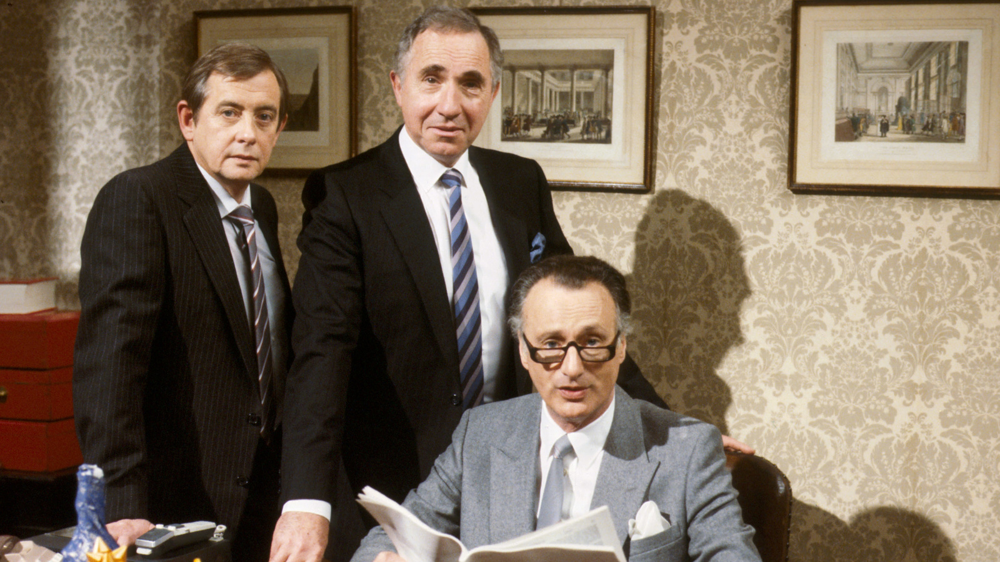

class: bottom, inverse

background-image: url("images/court.jpg")
background-position: center
background-size: contain

# Defense Time

---

## Procedure

1. Drawing a respondent from the audience
1. The defender talks.
1. The defender queries.
1. The respondent queries.
1. Preparation (30 sec)
1. The respondent answers.
1. The defender answers.

```{r stopwatch, echo = FALSE}
library(countdown)

countdown(minutes = 0,
          seconds = 30,
          play_sound = TRUE)
```


---

class: inverse, bottom

# Decision Making Theory

---

## Decision Making Models

### Rational-Choice Based

+ Economic Rational-Choice Model
+ Bounded Rational-Choice Model

--

### Irrational Model

+ Bureaucratic Organization
+ Belief System
+ Incremental

---

## Classic Rational-Choice Model

Goal : Utility = Earning - Cost

Being rational means being a .magenta[utility maximizer].

--

e.g., [Do you need to buy a VIP membership for a video provider?](https://www.bilibili.com/video/av84023998/) 


---

## Buy a Vip Membership?

### Cost

`r round((178 + 178 + 198 + 148)/4, digits = 1)`

???

Tencent, Iqiyi, Youku, Bilibili

---

class: small

### Earning

Given a people working 8 hours a day, [22 days a month](https://zhuanlan.zhihu.com/p/59137037) and earning a [nationally average wage](https://mp.weixin.qq.com/s?__biz=MzI3MTA0MTMyMg==&mid=2459900748&idx=1&sn=4eb6074e1483ba65681b287a21be4af4&chksm=fdac6d09cadbe41f560d73e87a91de5318b5e39ebd071c9e4232c93ad2b8c25e41fd6820e838&token=808700715&lang=zh_CN#rd), which means:

6000RMB/22d/8h &approx; `r round(6000/22/8, digits = 1)` (h)

--

For an [average college student](https://k.sina.com.cn/article_2634151773_9d01f75d01900fkx7.html),

(20298.63<sup>&midast;</sup> + 8506.2 + 2000 * 12m + 900)RMB /10m/22d/8h &approx; `r round((20298.63 + 8506.2 + 2000 * 12 + 900)/10/22/8, digits = 1)` (RMB/h)

.footnote[
[&midast;] 4 ~ 5 times for a high-tier university, which means about `r round((20298.63 * 5 + 8506.2 + 2000 * 12 + 900)/10/22/8, digits = 1)` RMD/h
]

???
教育部《2017年全国教育经费执行情况统计公告》
https://k.sina.com.cn/article_2634151773_9d01f75d01900fkx7.html

20298.63: 2017 教育事业费  
8506.2: 2017 公用经费
2000: 2017 平均消费

--

Given a Chinese citizen watch [3 episodes per day](https://new.qq.com/rain/a/20190806A0GAH4), , and there is an average 90sec ads before each episode,

3 e * 90s / 3600s * 365d = `r 3 * 90 / 3600 * 365` h, then 

`r 3 * 90 / 3600 * 365` h * `r round(6000/22/8, digits = 1)` RMB/h &approx; `r round(3 * 90 / 3600 * 365 * 6000/22/8, digits = 1)` RMB;

`r round(3 * 90 / 3600 * 365 * (20298.63 + 8506.2 + 2000 * 12 + 900)/10/22/8, digits = 1)` for an average college student;  
and `r round(3 * 90 / 3600 * 365 * (20298.63 * 5 + 8506.2 + 2000 * 12 + 900)/10/22/8, digits = 1)` for a college student at a first-tier university


???

中国社科院对外发布的《休闲绿皮书：2018~2019年中国休闲发展报告》

---

### How the Decision is Made?

*Rational choice model* says: 

Earning - Cost (`r round((178 + 178 + 198 + 148)/4, digits = 1)`) > 0, buy!!

--

The same logic is applied to policy decisions, such as whether to promote a new welfare package, constructing a dam, and so on.

---

## Something Missing...

+ Do you know how much time you will spend on a show?

--

+ Do you know how much you can earn in one hour?

--

+ Do you know calculate?

--

+ Do you know...

--

Therefore, Herbert Simon said...

---

## Bounded Rationality

Goal : ~~Utility~~ Satisficing (Satisfy + Suffice)

--

Reasoning: 

+ Lack of information
+ Cognitive Limitation
+ Time constraint

--

e.g., decision making in drug safety, inventory control, system modeling, game strategy

???

Cognitive Limitation: difficulty to evaluate data

---

## Simon's Decision Making Model

Step 1: Intelligence Phase: Problem identification

???
collective information, formulating the situation

--

Step 2: Design Phase: Developing alternatives

--

Step 3: Choice Phase: Choosing the option

---

## Irrational Models

Rationality is just a conjecture of economists.<sup>&midast;</sup>

.footnote[
[&midast;] See rationalists' defense in, e.g., Bueno de Mesquita, Bruce, et al. 2003. *The Logic of Political Survival*. Cambridge, MA: The MIT Press.
]

--

### Irrational models

Bureaucratic organization model  
Belief system model  
Incremental model

---

## Bureaucratic Organization Model

.center[]

???

October 16–28, 1962, Soviet ballistic missile deployment in Cuba

In response to the failed Bay of Pigs Invasion of 1961 and the presence of American Jupiter ballistic missiles in Italy and Turkey, Soviet leader Nikita Khrushchev agreed to Cuba's request to place nuclear missiles on the island to deter a future invasion.

Air Force U-2 spy plane produced clear photographic evidence 

After several days of tense negotiations, an agreement was reached. Publicly, the Soviets would dismantle their offensive weapons in Cuba and return them to the Soviet Union, subject to United Nations verification, in exchange for a US public declaration and agreement to avoid invading Cuba again. Secretly, the United States agreed that it would dismantle all US-built Jupiter MRBMs, which had been deployed in Turkey against the Soviet Union; there has been debate on whether or not Italy was included in the agreement as well.

When all offensive missiles and Ilyushin Il-28 light bombers had been withdrawn from Cuba, the blockade was formally ended on November 21, 1962. The negotiations between the United States and the Soviet Union pointed out the necessity of a quick, clear, and direct communication line between Washington and Moscow. As a result, the Moscow–Washington hotline was established. A series of agreements later reduced US–Soviet tensions for several years until both parties began to build their nuclear arsenal even further.

---

## How Bureaucracy Makes Decisions

.small[“Where you stand depends on where you sit.” (Mile's Law)]

--



.center[]

???

Bureaucrats and related agencies have their own outlook, values and assessment 

Organisational structure and bureaucracy are deciding factors

Allison, Graham, and Philip Zelikow. 1999. Essence of Decision: Explaining the Cuban Missile Crisis. 2 edition. New York: Pearson.

---

## Belief System 

.center[]

???

Converse, Philip E. 1964. “The Nature of Belief Systems in Mass Publics.” In Ideology and Discontent, ed. David E. Apter. New York: Free Press, 206–61.

Suez crisis and Cuban missile crisis

官员惧怕发展数据治理

---

## Incremental Model

.center[]

Lindblom, Charles E. 1959. *The Science of Muddling Through*. Place of publication not identified: publisher not identified.


---

## How to Muddle

.left-column[

### Simon

1. Intelligence
1. Design
1. Choice

]

--

.right-column[

### Lindblom

.small[
+ Identification
+ Development
+ Selection
    + Judging
    + Analyzing
    + .magenta[Bargaining]
    + Authorizing
+ Dynamic Factors
]

]

---

## Example: the Space Transportation System (1960s)

.left-column[

+ Initiated by NASA and DoD
+ Announced by JFK
+ Delegated to NASA
+ Clear goal, mean to an end, adequate resources

]

.right-column[]

???

Placed after Gagarin, Bay of Pigs

---

## Spatial Shuttle in a Incremental System

+ Identification: Gagarin, Bay of Pigs

--

+ Development
    + NASA led the fight and construct a broad coalition of scientists, military, aerospace companies, international partners, presidential advisers, some members of congress
    + The president's budget bureau doubted the benefits.

---

## Selection: "Everyone a shuttle designer"

+ No long-range plan
+ No agreement on objectives
+ .magenta[One step at a time]
+ Officials pursue similar goals for different reasons
+ The program turns to satisfy multiple constituencies with unresolved interests.
    + leading to programs .magenta[with conflicting] and often .magenta[forgotten objectives], funded with insufficient resources.

---

## Muddling, Muddling

> We must think of (space activities) as part of a continuing process…and not as a series of separate leaps, each requiring a massive concentration of energy...Space expenditures must take their proper place within a rigorous system of national priorities.  
---Richard M. Nixon (March 7, 1970)

---

class: small

NASA "promised" in the Space Shuttle (1972)

+ Ferry astronauts to a large earth orbiting space station (original goal)
+ Provide a "space truck" for commercial payloads, some bound for geosynchronous orbit
+ Deliver military reconnaissance satellites
+ Transport space station modules
+ Provide an orbital laboratory for science experiments
+ Repair and return satellites
+ Transport civilians (“anyone can fly”)
+ Increase reliability
+ Cut the cost of space flight by a “factor of ten”
+ Be reusable
+ Fly 24 to 50 times per year

---

## The Policy Failed

> The increased complexity of a Shuttle designed to be all things to all people created inherently greater risks than if more realistic technical goals had been set at the start...The greatest compromise NASA made was...with the premise of the vehicle itself.  
--- Columbia Accident Investigation Board, (2003)

---

class: small

## And Repeated

Space Station Freedom (1982-1987) 

+ Satellite servicing and repair station 
+ Checkout point for geosynchronous satellites
+ Observation facility
+ Assembly point for deep space missions
+ Laboratory for military R & D
+ Space manufacturing faculty
+ Node for European, Japanese, and Russian modules
+ Technology development facility
+ Pallet for scientific experiments
+ Life science research laboratory
+ Materials processing research center
+ $8 billion (1984 dollars)

--

The project actually costed $61 billion

--

Btw, the project was redesigned and operated to 2008


---

## Agenda Setting 

.right-column[.small[A collection of problems, understandings of causes, symbols, solutions, and other elements of public problems that come to the attention of members of the public and their governmental officials.]]

.left-column[]

???

boundaries of the system agenda represents the limit of legitimate jurisdiction of existing governmental authority---changing over time

---

## Nature of Agenda Setting

.left-column[
Three faces of power: 

1. Coercive
1. Blocking
1. Shutting-up
]

.right-column[]

???

e.g., of the third face: Appalachian coal minners. The mining company remains dominant and the miners cannot conceive of a situation. When the miners show some signs of rebelling, the dominant interests are able to ignore pressure for change. In the long run, people may stop fighting as they become and remain alienated from politics; quiescence is the result.

---

## How the Disadvantaged Changes Agenda

.left-column[ Going Public]
.right-column[ Appealing to higher level]

???

1. Going public with a problem by using symbols and images to induce greater media and public sympathy for their cause.
1. Groups that lose in the first stage of a political conflict appealing to higher decision-making level, such as when losing parties appeal to state and then federal institutions for an opportunity to be heard, hoping that in the process they will attract others who agree with them and their cause

---

## Timing Matters

.small[Kingdon, John W. 2013. *Agendas, Alternatives, and Public Policies*. Pearson Education Limited.]


.center[ ]

---

## Kingston's Policy Windows

1. Problem stream: The power of the society

a.k.a., Simon's intelligence phase and Lindblom's identification phase

--

1. Political stream: The power of politicians

e.g., Johnson's "Great Society" program, Obamacare

???
Lyndon Johnson administration’s Great Society program, which contained a package of policies that sought to attack poverty, poor health, racial discrimination, and urban decline, among other problems. This package of programs was made possible by an aggressively activist president and a large Democratic majority in the Congress

--

1. Policy stream: The power of interest groups

e.g., the Space shuttle case.

---

## Windows

.left-column[ ]

--

.right-column[ ]

???

spillover

---

## Take-Home Points

### Modeling Decision Making:

Rational Choice Models: 

1. Economic rational: Utility
1. Bounded rational: Satisfficing

Irrational Models:

1. Bureaucratic organization model  
1. Belief system model  
1. Incremental model

### Agenda Setting

Streams and policy window