class: inverse, bottom

```{r setup, include=FALSE}
knitr::opts_chunk$set(echo = FALSE, message = FALSE, warning = FALSE)

if (!require(pacman)) install.packages("pacman")
library(pacman)

p_load(
  emo
) # data wrangling # data wrangling

xaringanExtra::use_xaringan_extra(c("tile_view", # O
                                    "broadcast", 
                                    "panelset",
                                    "tachyons"))

# Functions preload
set.seed(313)
```


# Decision Making Theory

---

## Decision Making Models

### Rational-Choice Models

+ Economic Rational-Choice
+ Bounded Rational-Choice

### Irrational Models

+ Belief System
+ Bureaucratic Organization
+ Incremental

### Application

---

class: center, middle

Let's do a test first!

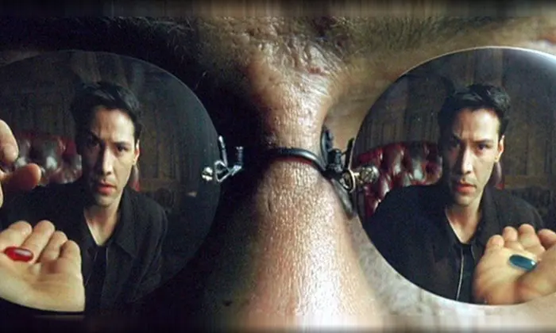

---

background-image: url("images/rat_allias1.png")
background-position: center
background-size: contain


???

Which one do you choose?

https://www.youtube.com/watch?v=c26wIhnDK9Q

---

background-image: url("images/rat_allias2.png")
background-position: center
background-size: contain

---

class: inverse, bottom

# Rationality

---

## Economic Rational Choice

**Concept**

- Goal

--

- Preference order

???

Who should we be friend with?

--


???

US > Russia: US never take a piece from China

Vietnam > US: Neighbor

Russia > Vietnam: History and power

so the preference order should be transit

Completeness, transitivity, continuity, independence of irrelevant alternatives

--

- Utility = .blue[Earning] - .red[Cost]
    - Expectation

???

If my wife can look like Scarlett Johansson or Anne Hathaway or Emma Watson

---

class: center, middle

.bg-black.golden.ba.shadow-5.ph1.mt1[
.center[Being rational &rarr; Utility **maximizer**.]
]

$${\displaystyle \mathrm {E} [u(X)]=\sum _{i}\;u(x_{i})\;P(x_{i}).}$$

.footnote[i is the option; P(x) is the probability of x.]

--

.center[.large[How beautiful it is 🙏]]

---

## Practice

Population issue of China


???

Goal, sustainable structure

Preference, wait and see; coercive birth; population quality; immigration

Order? Economic...


Different people, different answer

---

background-image: url("images/rat_allias1.png")
background-position: center
background-size: contain


???

Which one do you choose?

https://www.youtube.com/watch?v=c26wIhnDK9Q

---

background-image: url("images/rat_allias2.png")
background-position: center
background-size: contain

---

background-image: url("images/rat_allias3.png")
background-position: center
background-size: contain

???

Experiment on real people: more people pick blue pile and yellow piles

---

background-image: url("images/rat_allias4.png")
background-position: center
background-size: contain

*Allias Paradox*

???

People should consistently choose left or right strategy, rather than blue and yellow or red and green. 

The experiment shows most people choose blue plus yellow

---

## Subjective Expected Utility (Savage 1954)

$${\displaystyle \mathrm {E} [u(X)]_k=\sum _{i}\;u^k(x_{i})\;P^k(x_{i}).}$$

- *Personal* Utility
- *Personal* Expectation

.footnote[k is a specific individual.]

???

Ten years after Neumann and Morgenstern


--

Make more sense, yeah? 

Well, go check the Ellsberg Paradox

???

Ambiguity aversion

---

class: bottom, center

## Something Still Missing...

Back to our policy-making case to solve the population issue,... 

+ Do you know exactly the dynamic of population?

--

+ Do you know exactly what immigration would bring to the domestic scioeconomy?

--

+ Do you know exactly how soon the population quality can be raised?

--

+ Do you know...

---

## A Strategy When Facing Uncertainty

Selten, Reinhard. 1965. “Spieltheoretische Behandlung Eines Oligopolmodells Mit Nachfrageträgheit: Teil I: Bestimmung Des Dynamischen Preisgleichgewichts.” Zeitschrift für die gesamte Staatswissenschaft 121(2): 301–24.

.center[
.large[Sequential rationality]

Bayesian equilibrium
]

???

摸石头过河——过河很重要，摸石头也知道摸什么

---

## An Alternative Path

.pull-left[

Herbert Simon said...

***Bounded Rationality***~

]
.pull-right[]


???
Nobel Memorial Prize in Economic Sciences in 1978 and the Turing Award in computer science in 1975

American political scientist, management, organizational behavior

Artificial intelligence   

Cognitive Psychology    

Sociology and economics   

Pedagogy    

--

~~Homo economicus~~ &rArr; Satisficing (Satisfy + Suffice, ~~Utility~~)

???

Homo economicus: economic man

--

*Why satisficing (~~utility~~)*

+ .red[Lack] of information
+ Cognitive .red[limitation]
+ Time .red[constraint]

???

e.g., decision making in drug safety, inventory control(存货管理), system modeling, game strategy

Cognitive Limitation: difficulty to evaluate data

---

## Simon's Decision Making Model

*Step 1 *

Intelligence Phase: Problem identification

.small[Collective information, formulating the situation]

--

*Step 2*

Design Phase: Developing alternatives

--

*Step 3*

Choice Phase: Choosing the option

---

## Advancing

*Heuristics and Bias* (Tversky & Kahneman 1974)

.center[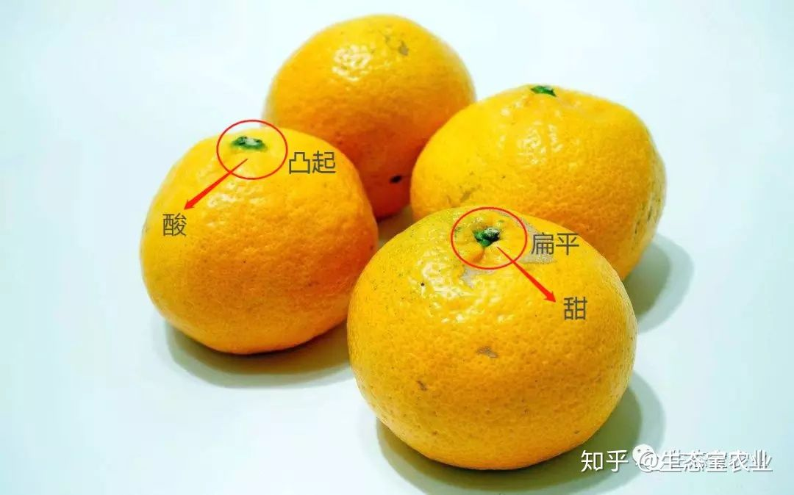]

--

.pull-left[
- Representativeness
- Availability of instances or scenarios
- Adjustment from an anchor
]

???

Dem vs. GOP

My wife, you see whose and whose....

举不举得起来，用脚踢


This article described three heuristics that are employed in making judgments under uncertainty: (i) representativeness, which is usually employed when people are asked to judge the probability that an object or event A belongs to class or process B; (ii) availability of instances or scenarios, which is often employed when people are asked to assess the frequency of a class or the plausibility of a particular development; and (iii) adjustment from an anchor, which is usually employed in numerical prediction when a relevant value is available. These heuristics are highly economical and usually effective, but they lead to systematic and predictable errors. A better understanding of these heuristics and of the biases to which they lead could improve judgments and decisions in situations of uncertainty.

--

.pull-right[
> .small[Whilst heuristics can speed up our problem-solving and decision-making processes, they can introduce errors and bias judgements. ---Dale 2015]
]
---

*Prospect theory* (Kahneman and Tversky 1979)

.center[]

--

Loss aversion + Reference dependency

???

people make decisions based on the potential gain or losses relative to their specific situation (the reference point) rather than in absolute terms; this is referred to as reference dependence.

Faced with a risky choice leading to gains, individuals are risk-averse, preferring solutions that lead to a lower expected utility but with a higher certainty (concave value function).
Faced with a risky choice leading to losses, individuals are risk-seeking, preferring solutions that lead to a lower expected utility as long as it has the potential to avoid losses (convex value function).

---

.pull-left[

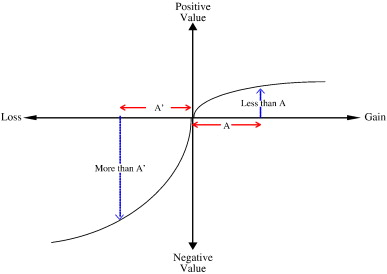

]

--

.pull-right[

Reference dependency model

- Endowment effect
- Status quo bias
......

.huge[
Look at where you are sitting!
]

]

???

individuals disproportionately stick with the status quo, which is an important reference point


---

class: bottom, inverse

# Irrationality

---

## Irrational Models

Rationality is just a conjecture of economists.<sup>&midast;</sup>

.footnote[
[&midast;] See rationalists' defense in, e.g., Bueno de Mesquita, Bruce, et al. 2003. *The Logic of Political Survival*. Cambridge, MA: The MIT Press.
]

--

- Belief system model  
- Bureaucratic organization model  
- Incremental model

---

## Belief System 

.pull-left[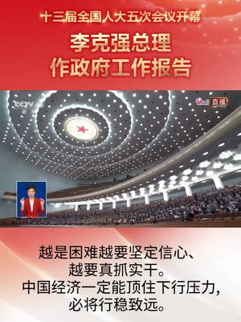]

--

.pull-right[
> Belief that values and extrarational components such as judgment, will to achieve purpose, charismatic leadership, tacit knowledge, creativity, love, loyalty, frendship, family ties, and serendipity are inextricably linked with, and often more significant than, measurable variables in our systems. --- Krone 1980
]

???

Converse, Philip E. 1964. “The Nature of Belief Systems in Mass Publics.” In Ideology and Discontent, ed. David E. Apter. New York: Free Press, 206–61.

Suez crisis（英法 vs 埃及） and Cuban missile crisis

官员惧怕发展数据治理

---

## Bureaucratic Organization Model

.center[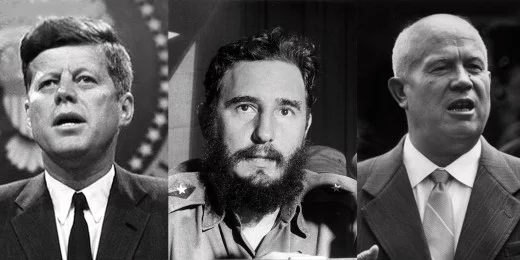]

Allison, Graham, and Philip Zelikow. 1999. *Essence of Decision: Explaining the Cuban Missile Crisis*. 2 edition. New York: Pearson.

???

猪湾事件

1961年4月15日，在刚上任不久的肯尼迪政府的支持下，古巴流亡者组成的部队驾驶改涂流亡政府标志的美国B-26型轰炸机从佛罗里达起飞，对古巴进行了两天的轰炸，1000多名流亡军从危地马拉的训练营出发，抵达尼加拉瓜卡贝萨斯港登船，于古巴南部猪湾登陆，意图占领当地机场，迎接古巴流亡政府，而后籍希望以介入朝鲜战争的方式，由流亡政府充当地方政权请求美国军事介入，由已在佛罗里达训练10个月的约1万美军直接插手，入侵古巴并推翻卡斯特罗政府。但是在72小时之内，流亡军被政府军击败，流亡政府也未能登陆古巴。美国政府并未就此罢休，继续对古巴施加压力。

October 16–28, 1962, Soviet ballistic missile deployment in Cuba

In response to the failed Bay of Pigs Invasion of 1961 and the presence of American Jupiter ballistic missiles in Italy and Turkey, Soviet leader Nikita Khrushchev agreed to Cuba's request to place nuclear missiles on the island to deter a future invasion.

Air Force U-2 spy plane produced clear photographic evidence 

After several days of tense negotiations, an agreement was reached. Publicly, the Soviets would dismantle their offensive weapons in Cuba and return them to the Soviet Union, subject to United Nations verification, in exchange for a US public declaration and agreement to avoid invading Cuba again. Secretly, the United States agreed that it would dismantle all US-built Jupiter MRBMs, which had been deployed in Turkey against the Soviet Union; there has been debate on whether or not Italy was included in the agreement as well.

When all offensive missiles and Ilyushin Il-28 light bombers had been withdrawn from Cuba, the blockade was formally ended on November 21, 1962. The negotiations between the United States and the Soviet Union pointed out the necessity of a quick, clear, and direct communication line between Washington and Moscow. As a result, the Moscow–Washington hotline was established. A series of agreements later reduced US–Soviet tensions for several years until both parties began to build their nuclear arsenal even further.


Bureaucrats and related agencies have their own outlook, values and assessment 

Organizational structure and bureaucracy are deciding factors


---

## How Bureaucracy Makes Decisions

Allison's three models

- Rational actor model
- Organizational process
- Bureaucratic politics

---

## Rational actor model

- Actor: Governments
- Goal &rArr; Utility of resorts &rArr; Best payoff

--

*In the Cuban Missile Crisis,*

Decision making of JFK: 

1. Evaluating options from doing nothing to a full invasion of Cuba
1. Choosing a blockade of Cuba
    - Less possible to escalate into war
    - Forcing the Soviets to response
1. Russia: Negotiation due to the mutually assured destruction of a nuclear war.

???

/blɑ'ked/


https://en.wikipedia.org/wiki/Essence_of_Decision#:~:text=In%20response%2C%20Allison%20constructed%20three,the%20%22Governmental%20Politics%22%20model.

---

## Organizational Process Model

Why the Soviets failed to camouflage the nuclear sites during construction, but did so only after U-2 flights pinpointed their locations?

.center[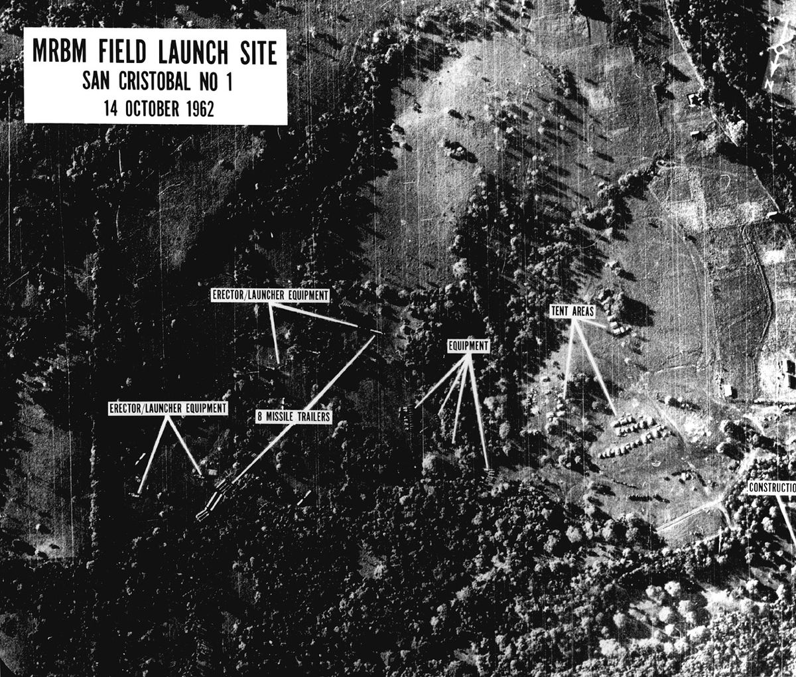]

Rational choice model cannot explain.

---

When faced with a crisis,

- Government leaders act .red[not like a whole] but according to pre-established organizational lines.
- Leaders are effectively limited to .red[pre-existing] plans, due to time and info constrictions.
- Leaders make the decision based on .red[satisficing] (yep, Simon's satisficing)
- Leaders gravitate towards solutions that limit .red[short-term] uncertainty.
- Organizations .red[follow] set "repertoires" and procedures when taking actions.

---

*In the Cuban Missile Crisis,*

1. Soviets never established nuc outside before, so the responsible department did what they did domestically (repertories)
    - Not making good camouflage
1. Air strikes were JFK's first choice
    - The Air Force didn't agree
        - No guarantee to disable all in once
        - Requiring extensive bombing &lArr; JFK didn't like
    - The Navy can build a blockade
        - JFK can contact directly to the fleet's captains
1. Blockade
1. USSR has no follow-up plan, then withdrawed.


???

- When faced with a crisis, government leaders don't look at it as a whole, but break it down and assign it according to pre-established organizational lines.
- Because of time and resource limitations, rather than evaluating all possible courses of action to see which one is most likely to work, leaders settle on the first proposal that adequately addresses the issue, which Simon termed "satisficing."
- Leaders gravitate towards solutions that limit short-term uncertainty (emphasis on "short-term").
- Organizations follow set "repertoires" and procedures when taking actions.
- Because of the large resources and time required to fully plan and mobilize actions within a large organization (or government), leaders are effectively limited to pre-existing plans.


Because the Soviets never established nuclear missile bases outside of their country at the time, they assigned the tasks to established departments, which in turn followed their own set procedures. However, their procedures were not adapted to Cuban conditions, and as a result, mistakes were made that allowed the U.S. to quite easily learn of the program's existence. Such mistakes included such gaffes as supposedly undercover Soviet troops decorating their barracks with Red Army Stars viewable from above.
Kennedy and his advisors never really considered any other options besides a blockade or air strikes, and initially, were almost unanimously in favor of the air strikes. However, such attacks created massive uncertainty because the U.S. Air Force couldn't guarantee it would disable all the nuclear missiles. Additionally, although Kennedy wanted a "surgical" air strike that would destroy the missiles without inflicting extensive damage, the existing Air Force plan required extensive bombing that would have created more collateral damage than Kennedy desired. Because the U.S. Navy already had considerable strength in the field, because there was a pre-existing plan in place for a blockade, and because Kennedy was able to communicate directly with the fleet's captains, members fell back on the blockade as the only safe option.
The Soviets simply did not have a plan to follow if the U.S. took decisive action against their missiles. Khrushchev's communications indicated a high degree of desperation. Without any back-up plan, the Soviets had to withdraw.

---

## Bureaucratic Politics Model

(After reading new studies)

Policy &lArr; Negotiation by top leaders

- Leaders differ in how to achieve the goal (due to .red[interests and background])
- Each level of leaders needs a .red[consensus] of their inner circle first and above
    - No consensus, then open to alternatives (disagreements)
- Leaders' .red[entourage] matters 
    - Entourage: yes men vs. advisors
    - Leader: Certain vs. uncertain (yet)
- A consensus &rArr; the .red[decision]/policy


???

After reading works by Richard Neustadt and Samuel P. Huntington, among others, Allison proposed a third model, which takes account of court politics (or "palace politics"). While statesmen don't like to admit they play politics to get things done, especially in high-stakes situations such as the Cuban missile crisis, they nonetheless do.

A nation's actions are best understood as the result of politicking and negotiation by its top leaders.
Even if they share a goal, leaders differ in how to achieve it because of such factors as personal interests and background.
Even if a leader holds absolute power (e.g., the President of the United States is technically the commander-in-chief), the leader must gain a consensus with his underlings or risk having his order misunderstood or, in some cases, ignored.
Related to the above proposition, the make-up of a leader's entourage will have a large effect on the final decision (i.e., an entourage of "yes men" will create a different outcome than a group of advisors who are willing to voice disagreement).
Leaders have different levels of power based on charisma, personality, skills of persuasion, and personal ties to decision-makers.
If a leader is certain enough, they will not seek input from their advisors, but rather, approval. Likewise, if a leader has already implicitly decided on a particular course of action, an advisor wishing to have influence must work within the framework of the decision the leader has already made.
If a leader fails to reach a consensus with his inner circle (or, at least, the appearance of a consensus), opponents may take advantage of these disagreements. Therefore, effective leaders must create a consensus.
Because of the possibilities of miscommunication, misunderstandings, and downright disagreements, different leaders may take actions that the group as a whole would not approve of.
Allison had to admit that, because the Soviets were not as open with their internal affairs as the Americans, he simply didn't have enough data to fully interpret the crisis with this model. Nonetheless, he made the following attempt:

---

.pull-left[
For Russia

- External signals: Bay of Pigs, Berlin airlift, etc.
- Internal signals: 
    - Economy stretched
    - Military leaders unhappy with cutting the size of the Red Army

&rArr; Placing missiles
]

.pull-right[
For the U.S.

- Bay of Pigs failed; the GOP made this a thing
- Congressional election came

&rArr; JFK decided a strong response

- Most favoring air strikes
- Distrust CIA due to Bay of Pigs
- Entourage favoring blockade
]

.center[
&rArr; A blockade

&rArr; Khrushchev need an out, so pointing to the U.S.'s Turkey missile.
- Soviets withdrew from Cuba
- The U.S. withdrew from Turkey (quietly)
    - JFK agreed never to invade Cuba.
]
???

Khrushchev came under increasing fire from the Presidium because of Kennedy's revelation of the Soviet lack of ICBMs, as well as American successes in the Berlin Airlift. Also, the Soviet economy was being stretched, and military leaders were unhappy with Khrushchev's decision to cut the size of the Red Army. Placing missiles in Cuba was a cheap and quick way for him to secure his political base.

Because of the failure of the Bay of Pigs invasion, Republicans in the Congress made Cuban policy into a major issue for the upcoming congressional elections later in 1962.
Therefore, Kennedy immediately decided on a strong response rather than a diplomatic one. Although a majority of EXCOMM initially favored air strikes, those closest to the president - such as his brother and Attorney General, Robert F. Kennedy, and special counsel Theodore Sorensen - favored the blockade. At the same time, Kennedy got into arguments with proponents of the air strikes, such as Air Force General Curtis LeMay. After the Bay of Pigs Invasion fiasco, Kennedy also distrusted the CIA and its advice. In order to avoid appearing weak to the hawkish members of EXCOMM, Kennedy rejected the purely diplomatic proposals of United States Ambassador to the United Nations Adlai Stevenson. This combination of push and pull led to a consensus for the implication of a blockade.
With his plans thwarted, Khrushchev tried to save face by pointing to American missiles in Turkey, a position similar to the Cuban missiles. While Kennedy refused to move these missiles "under duress," he allowed Robert Kennedy to reach a deal with Soviet ambassador Anatoly Dobrynin, in which the Turkish missiles would be quietly removed several months later. Publicly, Kennedy also agreed never to invade Cuba.

---

class: center, middle, normal

.bg-black.golden.ba.bw2.br3.shadow-5.ph4.mt5[
Where you stand depends on where you sit.

.tr[
--- Mile's Law
]
]

---

## Incremental Model

.center[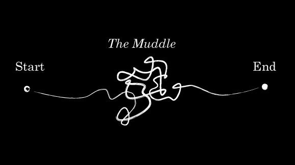]

Lindblom, Charles E. 1959. *The Science of Muddling Through*. Place of publication not identified: publisher not identified.


---

## Muddle How

.pull-left[

Recall...

*Sequential Rationality*

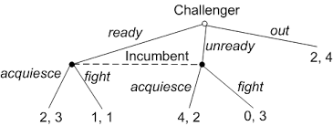

.red[Rationality based!]

]

--

.pull-right[

*Muddling Through*

+ Identification
+ Development
+ Selection
    + Judging
    + Analyzing
    + **Bargaining**
    + Authorizing
+ Dynamic Factors

.red[Experience based]
- No goal
- Conservative

]

---

## Advanced Versions

.center[
*Mixed scanning model* (Etzioni 1967)

- Higher rank vs. lower rank missions
- Rational choice for high-rank
- Incremental for low rank
]

--

.pull-left[
*Garbage can model* (March Cohen, Olsen 1972)

- Policy making: Process of garbage accumulation and dumping
    - Problems 
    - Solutions
    - Participants
    - Opportunities
]

???

Development of garbage can: Kingdon's multiple stream model

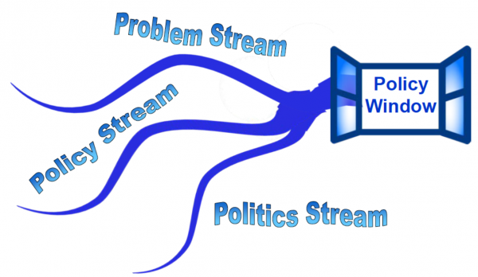

--

.pull-right[
*Punctuated equilibrium model*

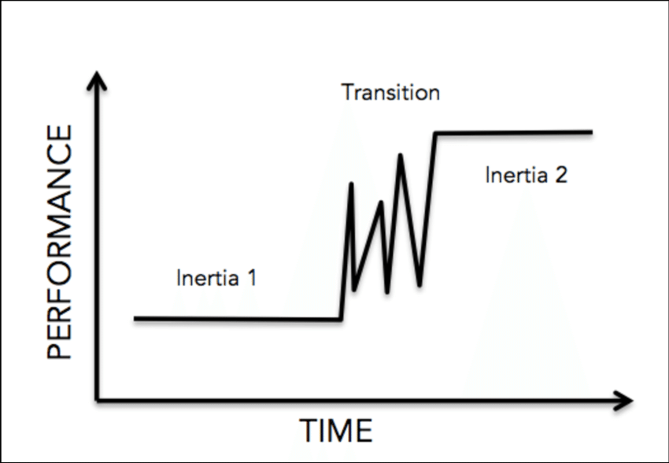
]

---

## Recent Rational Choice

.pull-left[
*Theory*

- Bounded rationality succeeds
- Separating policy process and optimization
]

--

.pull-right[
*Empirics*

- Modeling phases
- Evidence-based policy making
- Information and power structure matters
]

---

class: inverse, bottom

# Application

---

杨志军. 2018. 《模糊性条件下政策过程决策模型如何更好解释中国经验?——基于“源流要素+中介变量”检验的多源流模型优化研究》. 公共管理学报 15(04): 39-51+151.

Multiple stream model (a development of garbage can) + Mediation

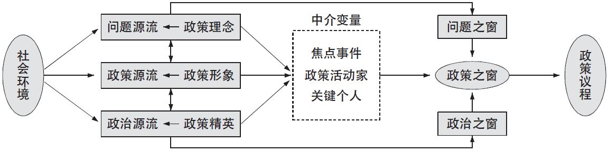

G大学N校区饮用水污染事件 + G大学水改议程建立过程

> "为破解决策模糊性提供了满意的方案，对中国政策过程更有解释力。"

???

通过文献梳理确立“要素嵌入”新思路作为优化路径，采用基于多案例的清晰集定性比较分析方法和基于深度调研的个案分析方法，分别验证要素嵌入源流的适配性以及由此建立的新多源流模型中中介变量的科学性。

按照布尔代数运行的最简化原则，以源流成熟度作为标准进行二分编码，政策理念、政策形象和政策精英三个要素作为解释变量，问题、政策和政治三个源流作为结果变量，研究表明要素嵌入源流的适配性完全成立。

通过详细调研G大学N校区饮用水污染事件发现，在G大学水改议程建立过程中，焦点事件、政策活动家和关键个人三个中介变量推动具有要素属性和生命信仰的主导性源流生成，牵引其它源流交汇，从而开启政策之窗，建立政策议程，实现政策变迁。经过“源流要素+中介变量”检验后的新多源流模型，为破解决策模糊性提供了满意的方案，对中国政策过程更有解释力。

---

background-image: url("images/rat_mindmap.png")
background-position: center
background-size: contain

## Take-Home Points

```{r pdfPrinting, eval = FALSE, include = FALSE}
pagedown::chrome_print(list.files(pattern = "03_.*.html"), timeout = 300)
```