```{r setup, include=FALSE}
knitr::opts_chunk$set(echo = FALSE, message = FALSE, warning = FALSE)

if (!require(pacman)) install.packages("pacman")
library(pacman)

p_load(
  emo
) # data wrangling # data wrangling

xaringanExtra::use_xaringan_extra(c("tile_view", # O
                                    "broadcast", 
                                    "panelset",
                                    "tachyons"))

# Functions preload
set.seed(313)
```

## Overview

.pull-left[
*Previously in Public Policy Analysis...*

Rational choice model

- Economic ~
- Bounded ~
- Irrational ~

.normal[
Rational or irrational decisions...   
.red[Who] make them?]

]

--

.pull-right[
Two types of answers: 

- Elitism
    - Evolution of Elitism
        - Classic
        - Elite democracy
        - Contemorary
    - Elites as who
    - Elites and Masses
    - Application

- Group theory (next lecture)
]

---

class: inverse, bottom

# Evolution of Elitism

---

## Classic Elitism (Italian School)

<video width="1000" height="500" controls preload>
    <source src="images/elite_powerTalk.mp4" type="video/mp4">
</video>

---


## A Nutshell

.pull-left[
Elites have better skills and resources;

Masses are unorganized;

Elite governance is inevitable.
]

--

.pull-right[
Elites .red[have] the power;    

Elites .red[make] the rule;   

Masses .red[follow] the rule;   

Elites .blue[get] benefits; masses .red[suffer].    
]

---

.pull-left[
.center[*Vilfredo Pareto*   
]

Governing elites; non-~; masses

Circulation of elites
- No progress in human history
- Democracy is a fraud
]

???

统治精英集团、非统治的精英集团和普通大众

社会的发展过程就是政治精英的无限循环过程，是一个精英集团衰落和另一个精英集团兴起的“精英循环”

--

.pull-right[
.center[*Gaetano Mosca*   
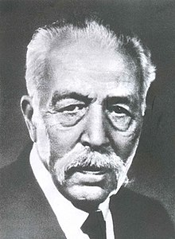]

Politcal class; non-~

Circulation of elites
- A perpetual condition of conflict
- A recycle of the elite

]

???

same as Pareto, circulation of elites

Elites that are superior organizational skills

精英的形成有两种方式：
- 渐变机制，即下层社会的一部分人地位不断上升，最终导致现有精英的新陈代谢，类似于精英的循环；
- 突生机制，即无论是被统治阶级还是统治阶级，都存在自己的精英，两种精英在权力斗争中发生相互替代，类似于精英再生产。

Unlike Marx, Mosca has not a linear concept of time, but a circular one

---

.center[
*Robert Michels*    

]

.pull-left[
A few individuals &rarr; social organizations &rarr; masses

- Need
- Utilization
- Psychological attributes

]


???

Variance of leaders
1. Need for leaders, specialized staff and facilities
1. Utilization of facilities by leaders within their organization
1. The importance of the psychological attributes of the leaders

--


.pull-right[
Effectiveness &rarr; centralization &rarr;    
a few

Desire to dominate &rarr; leaders

Bureaucratization and specialization &rarr; Bureaucracy
]

???
Iron law of oligarchy


same with Mosca, elites need to be organized

Bureaucracy means Rationalization and routinization of decision making

---

## Advanced Version of Elitism: Elite Democracy

- The society is controlled by elites
- Pluralistic elites: leading the interest groups
- Elites are morally responsible to the public

???

Leading not delegate interest groups

---

.pull-left[

.center[
*E.E. Schattschneider*    
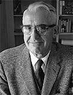
]

Elites:     
The most .red[educated and highest-income] members of society

Democracy:    
A pressure system, produces a government .red[approved] by the people
]

???

/shat'shnaider/

--

.pull-right[

.center[
*C. Wright Mills*    
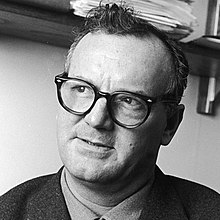
]

Elites:     
A .red[triumvirate] of power groups—political, economic and military
Distinguishable, not unified, power-wielding body

Democracy: A permanent war economy leading to a manipulative sociopolitical order
]

???

/shat'shnaider/


---

## Contemporary Elitism

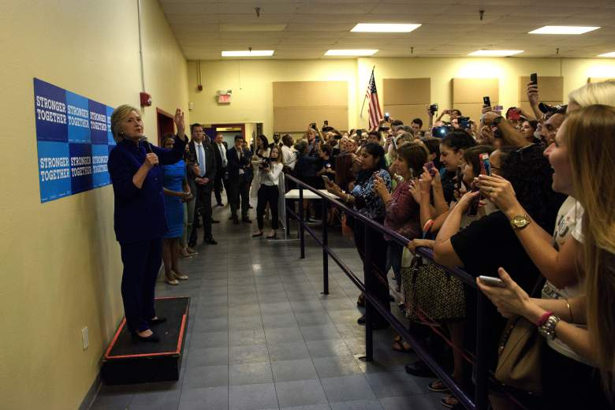
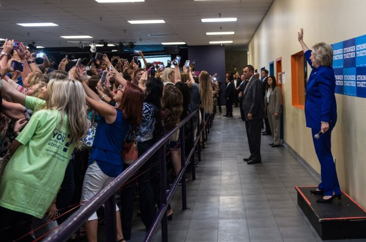

???

What can you see?

Elite bring benefit -> Elite shape the masses (became the core in their own selfies)

--

.pull-left[

**Classic**

1. Elites .red[have] the power;    
1. Elites .red[make] the rule;   
1. Masses .red[follow] the rule;   
1. Elites .blue[get] benefits; masses .red[suffer].    
]

--

.pull-right[

**Contemporary**

1. Elites .red[have] the power; (Same)
1. Elites .red[make] the rule; (Same)
1. Masses .red[participate];
1. Elites get .blue[benefits]; masses .blue[satisfy].
]


---

## Trends of Elite Theories

.center[
**Theme**   
How to incorporate elitism into democratic institutions]

- Voters choose which elites to govern in competitive elections
- Pluralistic elite organizations
- Vertical and horizontal mobility (by democratic institutions)


.center[**Efforts**]

.pull-left[
Theory coordination

- Liberalism
- Democracy
]

.pull-right[
Empirical research

- (Elite) power structure
- Elite governance
]

---

class: inverse, bottom

# Who Are the Elites

---

.center[.red[Who] Make the Decisions?]

.center[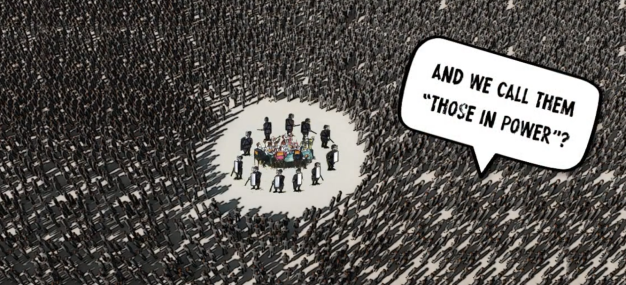]

---

## The "Who"


.left-column[

Simply put: 

.red[W]ealthy

.red[H]igh position

.red[O]ligarchy 
]

.right-column[]

???

Not only mean monetary, but also education, social network, etc.

 Bush: MBA from Harvard Business School  
 Trump: UPenn, Wharton School

 Biden: University of Delaware and Syracuse University

In 1968, Biden earned a Juris Doctor from Syracuse University College of Law, ranked 76th in his class of 85, after failing a course due to an acknowledged "mistake" when he plagiarized a law review article for a paper he wrote in his first year at law school.

---

## The Who But...

<video width="1000" height="500" controls preload>
    <source src="images/elite_russiaUkraine.mp4" type="video/mp4">
</video>

---

<image src = "images/elite_mao.png" height = 600>

<image src = "images/elite_xi.jpg" height = 600 width = 500>

---

class: inverse, bottom

# Elite-Mass Relationship

---

## Elites &harr; Masses: Immediate Contact

.pull-left[]

???

Individual: voting  

--

.pull-right[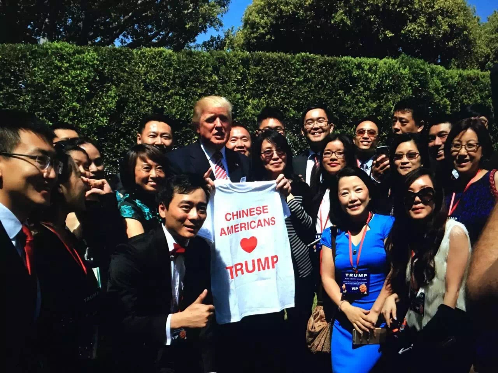]

???

Individual: personal contact  

--


.pull-left[]

???

Collective: Campaigning

--

.pull-right[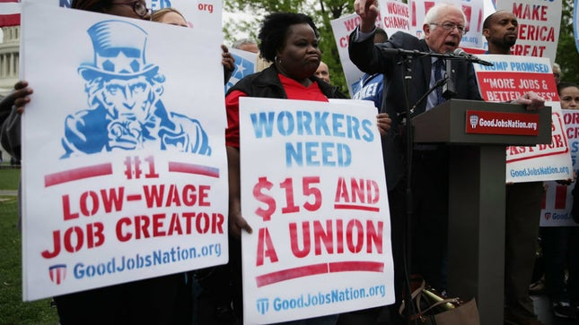]

???

Collective: communal

---

## Elites &harr; Masses: Long-Term Path

.center[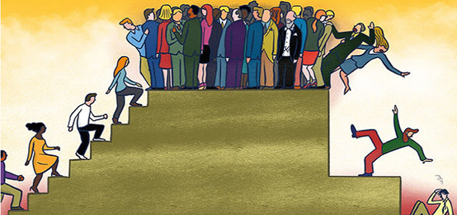    
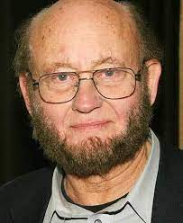
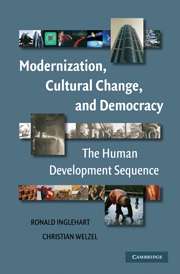
]


---

## Application I 

.small[
Mukuru, Moses et al. 2021. “‘The Actor Is Policy’: Application of Elite Theory to Explore Actors’ Interests and Power Underlying Maternal Health Policies in Uganda, 2000-2015.” *International Journal of Health Policy and Management* 10(7): 388–401.
]

*Objective*: Role of elites on achieving global targets in low- and middle-income countries

*Theory*: Classic elite theory

*Method*: Case of Uganda on Millennium Development Goal, Target 5 (MDG 5), 2000-2015; Interviews and focus group discussions
- Target 5: [Reduce by three quarters, between 1990 and 2015, the maternal mortality ratio](https://www.un.org/millenniumgoals/maternal.shtml)

*Findings*: Elites' personal interests rather than the MDG 5 influences the countries maternal health policies.
- Elites control over the policy process

---

class: middle

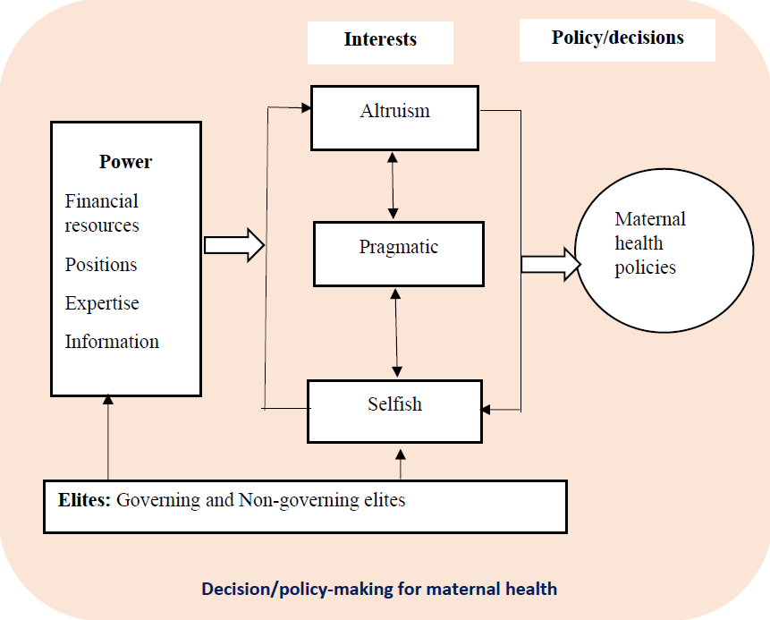
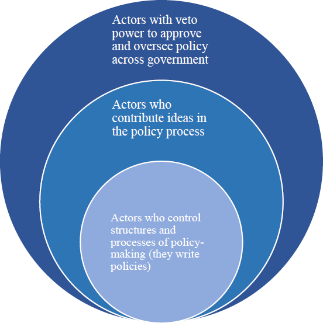

---

## Application II

.small[
Solt, Frederick, Yue Hu, Kevan Hudson, Jungmin Song, Yu Dong, 2017. “Economic Inequality and Class Consciousness.” *The Journal of Politics* 79(3): 1079–83.
]

Objective: Who are the activists in political participation, the waker or the rich?

.pull-left[]
.pull-right[]

Theory: Social psychology vs. relative power theory

Method: Pew surveys 2005--2009

---

class: center

## Once upon a time...

Newman, Johnston & Lown 2015

Exposure to higher levels of local income inequality

--

&darr;

Low-income people to view the United States as .red[divided];     
Low-income people identify themselves as the .red["have-not"]

--

&darr;

Class consciousness


---

## Theoretical Debate


.pull-left[.center[]]
.pull-right[.center[]]

???

贤哉回也！一箪食,一瓢饮,在陋巷,人不堪其忧,回也不改其乐

仓廪实而知礼节，衣食足而知荣辱

--

.pull-left[
*Social Psychology (Verba-Nie)*

SES &rarr; civic orientation &rarr; participation
]

--

.pull-right[
*Relative Power (Goodin-Dryzek)*

Pr(participation) &prop; Pr(win)<sup>*</sup> &times; Payoff

.footnote[\* The richer can .blue[afford more] participation cost---they also .red[what they can win].]
]

---

## Empirical Examination


.pull-left[.center[]]

???

More income, more unlikely to identify as the have-not

It looks significant, when inequality increases, the income's effect on identifying inequality

--

.pull-right[.center[]]


---

## Bonus: The Opposite of Elitism?

Populism or Pluralism?

--

Key question: Who's in charge?

--

.pull-left[

### Elitism

.large[A set of elites.]

]

.pull-right[

### Pluralism

.large[Interest groups]

]

???

There are places among the levels and branches that people and groups can engage.

---

background-image: url("images/elite_mindmap.png")
background-position: center
background-size: contain

## Take-Home Points

```{r pdfPrinting, eval = FALSE, include = FALSE}
pagedown::chrome_print(list.files(pattern = "06_.*.html"), timeout = 300)
```