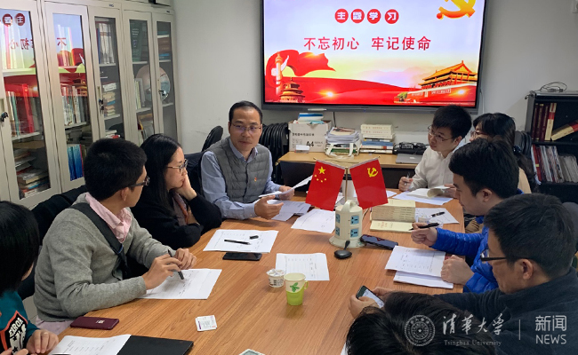

class: bottom, inverse

background-image: url("images/court.jpg")
background-position: center
background-size: contain

# Challenging Time

---

## Procedure

1. Drawing a respondent from the audience
1. The statesperson talks.
1. The statesperson queries.
1. The respondent challenges.
1. Preparation (30 sec)
1. The respondent answers.
1. The statesperson answers.

```{r stopwatch, echo = FALSE}
library(countdown)

countdown(minutes = 0,
          seconds = 30,
          play_sound = TRUE)
```

---

## Overview

1. What' a system?
1. What's a political system?
1. What constitute a political system and why do they matter?

---


class: bottom, inverse

# System Theory

---

## When Talking about System...

.center[]

---

## Computer System

.center[]

???

ALU: Arithmetic logic unit

---

## Political System

.center[]

???

Easton, David. 1957. “An Approach to the Analysis of Political Systems.” *World Politics* 9(03): 383–400.


---

## Purpose of the System Theory

--

To integrate?

Nope! To separate!

> The very idea of a system suggests that we can separate political life from the rest of social activity.---David Easton (1957: 384)

???

Why?

At least for analytical purpose

---

## How to Differentiate Systems

### Criteria

1. Unites (roles)
1. Boundaries

???

1. Human system vs. international system
1. Biological system vs. chemical system

---

## Units of Analysis

.center[]

---

class: small

Kim, Soonhee, and Jooho Lee. 2019. “Citizen Participation, Process, and Transparency in Local Government: An Exploratory Study.” *Policy Studies Journal* 47(4): 1026–47.


> This study had two purposes. First, it empirically examined the relationship between citizens' participation in administrative policymaking phases and their perception of government transparency. Second, it investigated how citizens' use of both offline and online participation channels and their involvement in different phases of policymaking (i.e., agenda setting, implementation, and evaluation) were related to their assessment of transparency in government. A 2009 survey of residents of Seoul, South Korea, was used to test the study hypotheses. Using two‐stage least squares estimate techniques, the study found that citizens involved in any citizen participation programs are more likely than those not involved to positively assess transparency in government. With regard to the relationship between participation channels and transparency, citizens who used offline participation channels were more likely than nonusers to perceive enhanced transparency in local government. 

---

class: small

Kim, Soonhee, and Jooho Lee. 2019. “Citizen Participation, Process, and Transparency in Local Government: An Exploratory Study.” *Policy Studies Journal* 47(4): 1026–47.


> This study had two purposes. First, it empirically examined the relationship between .magenta[citizens' participation] in administrative policymaking phases and their perception of government transparency. Second, it investigated how .magenta[citizens' use] of both offline and online participation channels and their involvement in different phases of policymaking (i.e., agenda setting, implementation, and evaluation) were related to their assessment of transparency in government. A 2009 survey of residents of Seoul, South Korea, was used to test the study hypotheses. Using two‐stage least squares estimate techniques, the study found that .magenta[citizens] involved in any citizen participation programs are more likely than those not involved to positively assess transparency in government. With regard to the relationship between participation channels and transparency, .magenta[citizens] who used offline participation channels were more likely than nonusers to perceive enhanced transparency in local government. 

---

## Fundamental Units of A Political System

Political actions

* Political roles
* Political groups

---

## Boundaries

* Social boundaries
* Biological boundaries
* Physical boundaries

---

background-image: url("images/socialBoundary.jpg")
background-position: center
background-size: contain

---

background-image: url("images/biologicalBoundary.jpg")
background-position: center
background-size: contain

---

background-image: url("images/physicalBoundaries.jpg")
background-position: center
background-size: contain

---

## Understanding the System

.center[]

???

+ Input: Reason to keeping the system going
+ Output: Identifying the consequences
+ Feedback: Adapting and adjusting

---

## Inputs

Environment &rarr; system

--

+ Demands
    + External
    + Internal

---

## Demands

### External

+ Ecology
+ Economy
+ .magenta[Culture]
+ Personality
+ Social structure
+ Demography

???
Internal and external

A little bit more words for culture

---

## Powerful Culture

> Culture shapes social members' general goals, specific objectives, and the procedures that the members feel ought to be used. 

???

Example from the American Factory

---

## Culture &rarr; Policy

<iframe width="700" height="500" src="//player.bilibili.com/player.html?aid=78543969&cid=134389361&page=1" scrolling="no" border="0" frameborder="no" framespacing="0" allowfullscreen="true"> </iframe>


---

## Demands

.left-column[
### External

+ Ecology
+ Economy
+ Culture
+ Personality
+ Social structure
+ Demography
]

.right-column[
### Internal 

"Withinputs"

Alterations in the political relationship
]

???

Equalizing representation between uran and rural voting districts

Process of recruitment of formal political leaders

Inter-party democratization

---

background-image: url("images/congYanZhiDang.jpg")
background-position: center
background-size: contain

---

## Why Demands Matter

1. Material basis of the system
1. Source of system's existence and adjustment

---

## Inputs

Environment &rarr; system

+ Demands
    + External
    + Internal
+ Support
    + Community
    + Regime
    + Government

---

## Support

> Energy in the form of actions or orientations promoting and resisting a political system. ---David Easton (1957: 390)

---

A supports B, which means...

--

.left-column[

*Back up*


]

.right-column[

*Intimacy*


]

---

### Objects to show the support

1. Community
1. Regime
1. Government

???

Discuss each individually

---

## Support in Political Community

.center[]


???

The issue turned on whether there was sufficient mutual identification among the members of the **system for them to be able to work together as a political community**.


---

## Regime and Government Support

*Regime*: Demands &rarr; Outputs

*Government*: Task takers

???
Relationship among the community

---

class: inverse

background-image: url("images/frenchRevolution.jpg")
background-position: center
background-size: contain

## Relationship among the Support

???

Case 1: One down, everything else down

Not support Louis XVI &rarr; not support the monarchy &rarr; not support the unified community

---

class: small

## Relationship among the Support

.left-column[
+ Abolition of slavery in the British Empire
+ Expansions of franchise
+ Chartism
+ Rise of liberalism
+ Nationalization of Conservative and Liberal parties 
+ Women’s rights activism  
......]

.right-column[

]

???

Case 2: One down, others are fine

Many regime modifications, no serious diminution of community support (expt Irish nationalism)

Franchise: 特许经营权

Chartism: 人民宪章运动，working-class activism

---

## Outputs

Input: Environment &rarr; system  
Output: System &rarr; environment

--

### Types

1. Policy
1. Politicization

---

## Outputs in Types

.left-column[

### Policy

+ No need for satisfying every demands
+ Demands of influential members are often satisfied

]

--

.right-column[
### Politicization



]

---

class: middle

background-image: url("images/response.jpeg")
background-position: center
background-size: contain

.right-column[
## Why Outputs Matter

1. Influencing the environment
1. Evaluating the inputs
]

???

2018, 12345 hotline

---

## Take-Home Points

.center[]

???

Political system: units (actions: roles and groups) and boundaries

Demands: external/internal
Support: backup/intimacy

Outputs: policy/politicization

```{r pdfPrinting, eval = FALSE, include = FALSE}
pagedown::chrome_print(list.files(pattern = "04_.*.html"), timeout = 300)
```