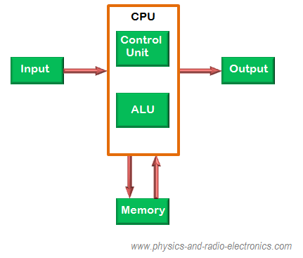
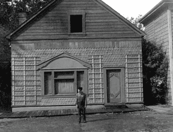

```{r setup, include=FALSE}
knitr::opts_chunk$set(echo = FALSE, message = FALSE, warning = FALSE)

if (!require(pacman)) install.packages("pacman")
library(pacman)

p_load(
  emo
) # data wrangling # data wrangling

xaringanExtra::use_xaringan_extra(c("tile_view", # O
                                    "broadcast", 
                                    "panelset",
                                    "tachyons"))

# Functions preload
set.seed(313)
```

## Administrative

+ First assignment done! Congratulations!
    + Let's talk!

---

background-image: url("images/cha_challenge.gif")
background-position: center
background-size: contain


---

## Procedure

.pull-left[
### Presenting

The presenter talks.

### Drawing the Luck Dog


]

.pull-right[
### Challenging

1. Presenter queries.
1. Challenger responds.
1. Challenger queries.
1. Presenter responds.
]

---


## Challenging

You have 15 sec to prepare for the responses.

```{r stopwatch_presenter, echo = FALSE}
library(countdown)

countdown(
  minutes = 0,
  seconds = 15,
  warn_when = 5,
  right = "20%",
  bottom = "40%",
  font_size = "3.5em",
  play_sound = TRUE
)

countdown(
  minutes = 0,
  seconds = 15,
  right = "20%",
  bottom = "10%",
  warn_when = 5,
  play_sound = TRUE
)
```


---

class: inverse, bottom

# System: Marcro &rarr; Micro

---

## Bonus


> 必须遵循的原则：坚持党的全面领导；坚持以人民为中心；坚持新发展理念；坚持深化改革开放；坚持.red[系统]观念。

---

## Overview

1. What's a system?
1. Why a system?
1. How to understand a system?

---

## What's a System?

.center[]

???

ALU: Arithmetic logic unit


---

## Why System?

--

To integrate? Nope!

> The very idea of a system suggests that we can .red[separate] political life from the rest of social activity.  
---David Easton (1957: 384)

???

At least for an analytic purpose

---

## How to Separate a System from Others

### Criteria

1. Unites (roles)
1. .gray[Boundaries]

???

e.g.,

1. Human system vs. international system
1. Biological system vs. chemical system

---

## Units of Analysis

.center[]

---

class: small

Kim, Soonhee, and Jooho Lee. 2019. “Citizen Participation, Process, and Transparency in Local Government: An Exploratory Study.” *Policy Studies Journal* 47(4): 1026–47.


> This study had two purposes. .blue[First], it empirically examined the relationship between citizens' participation in administrative policymaking phases and their perception of government transparency. .blue[Second], it investigated how citizens' use of both offline and online participation channels and their involvement in different phases of policymaking (i.e., agenda setting, implementation, and evaluation) were related to their assessment of transparency in government. .blue[A 2009 survey] of residents of Seoul, South Korea, was used to test the study hypotheses. Using two‐stage least squares estimate techniques, the study .blue[found] that citizens involved in any citizen participation programs are more likely than those not involved to positively assess transparency in government. With regard to the relationship between participation channels and transparency, citizens who used offline participation channels were more likely than nonusers to perceive enhanced transparency in local government. 

---

class: small

Kim, Soonhee, and Jooho Lee. 2019. “Citizen Participation, Process, and Transparency in Local Government: An Exploratory Study.” *Policy Studies Journal* 47(4): 1026–47.


> This study had two purposes. .blue[First], it empirically examined the relationship between .red[citizens]' participation in administrative policymaking phases and their perception of government transparency. .blue[Second], it investigated how .red[citizens]' use of both offline and online participation channels and their involvement in different phases of policymaking (i.e., agenda setting, implementation, and evaluation) were related to their assessment of transparency in government. .blue[A 2009 survey] of residents of Seoul, South Korea, was used to test the study hypotheses. Using two‐stage least squares estimate techniques, the study .blue[found] that .red[citizens] involved in any citizen participation programs are more likely than those not involved to positively assess transparency in government. With regard to the relationship between participation channels and transparency, .red[citizens] who used offline participation channels were more likely than nonusers to perceive enhanced transparency in local government.  

---

## Units of A Political System

"Who are conducting political actions?"

* Political roles
* Political groups

e.g., A theory-level break

Realism &rarr; Liberalism &rarr; Constructivism   
(States) &rarr; (regimes) &rarr; (Shared concepts) 

---

## Criteria

1. .gray[Unites (roles)]
1. Boundaries

--

## Boundaries

* .blue[Social] boundaries
* .blue[Biological] boundaries
* .blue[Physical] boundaries

---

background-image: url("images/sys_socialBoundary.jpg")
background-position: center
background-size: contain

???

杜甫《自京赴奉先县咏怀五百字》

朱门酒肉臭，路有冻死骨

---

background-image: url("images/sys_biologicalBoundary.jpg")
background-position: center
background-size: contain

---

background-image: url("images/sys_physicalBoundaries.jpg")
background-position: center
background-size: contain

---

## A Political System

.center[]

???

Easton, David. 1957. “An Approach to the Analysis of Political Systems.” *World Politics* 9(03): 383–400.

.green[Q]: How is it different from a computer system? 

Political system: no machine-human interaction perhaps

--

+ Input: Reason for .blue[keeping] the system going

--

+ Output: Identifying the .red[consequences]

--

+ Feedback: Adapting and adjusting

---

## Inputs

Environment &rarr; system

--

.pull-left[
### Demands
+ External
+ Internal
]

.pull-right[
### .gray[Support]
]

---

## Demands

> The material .blue[basis] of the system and the .red[source] of system's existence and adjustment.

--

.pull-left[
### External

+ Ecology
+ Economy
+ .orange[Culture]
+ Personality
+ Social structure
+ Demography
]

.pull-right[
### .gray[Internal]
]


???

A little bit more words for culture

---

## Powerful Culture

> Culture shapes social members' general goals, specific objectives, and the procedures that the members feel ought to be used. 

???

Example from the movie American Factory

---

## Culture &rarr; Policy

<iframe src="//player.bilibili.com/player.html?aid=929624558&bvid=BV1jK4y1U79H&cid=307626034&page=1" scrolling="no" border="0" frameborder="no" framespacing="0" allowfullscreen="true"> </iframe>

???

https://www.bilibili.com/video/BV1jK4y1U79H?from=search&seid=6434398716491968945

---

## Demands

.pull-left[
### External

+ Ecology
+ Economy
+ Culture
+ Personality
+ Social structure
+ Demography
]

.pull-right[
### Internal 

"Withinputs"

Alterations in the political relationship
]

???

Representativeness:

Equalizing representation between uran and rural voting districts


Alterantive ways to do the politics:

Process of recruitment of formal political leaders

Inter-party democratization


---

## Inputs

Environment &rarr; system


.pull-left[
### Demands

+ External
+ Internal
]

.pull-right[
### Support

+ Community
+ Regime
+ Government
]

---

## Support

> .blue[Energy] in the form of actions or .red[orientations] promoting and resisting a political system.   
---David Easton (1957: 390)

--

A supports B, which means...

.pull-left[

### Back up


]

.pull-right[

### Intimacy


]


---

class: inverse

background-image: url("images/frenchRevolution.jpg")
background-position: center
background-size: contain

## Non-Support: Domino

???

Case 1: One down, everything else down

Not support Louis XVI &rarr; not support the monarchy &rarr; not support the unified community

---

class: small

## Non-Support: Isolated Effect

.pull-left[



]


???

Charlie Chaplin. Steamboat Bill, Jr., 5

--

.pull-right[

+ Abolition of slavery in the British Empire
+ Expansions of franchise
+ Chartism
+ Rise of liberalism
+ Nationalization of Conservative and Liberal parties 
+ Women’s rights activism  

......

.center[]
]

???

Case 2: One down, others are fine

Many regime modifications, no serious diminution of community support (expt Irish nationalism)

Franchise: 特许经营权

Chartism: 人民宪章运动，working-class activism

---

## Outputs

.gray[Input: Environment .navy[&rarr;] system ] 

Output: Environment .red[&larr;] system 

--

### Types

1. Policy
1. Politicization

---

## Outputs in Types

.pull-left[

### Policy

> Attitude and actions regarding an objective.

1. No need for satisfying every demands
1. Demands of influential members are often satisfied

]

--

.pull-right[
### Politicization


]

---

class: middle

background-image: url("images/response.jpeg")
background-position: center
background-size: contain

.right-column[
## Why Outputs Matter

1. Influencing the environment
1. Evaluating the inputs
]

???

2018, 12345 hotline

---

## Take-Home Points

.center[]

???

Political system: units (actions: roles and groups) and boundaries

Demands: external/internal
Support: backup/intimacy

Outputs: policy/politicization

---

class: inverse, center, middle

# How's the no-slide class going?
# How's the semester-long project going?


```{r pdfPrinting, eval = FALSE, include = FALSE}
pagedown::chrome_print(list.files(pattern = "04_.*.html"), timeout = 300)
```