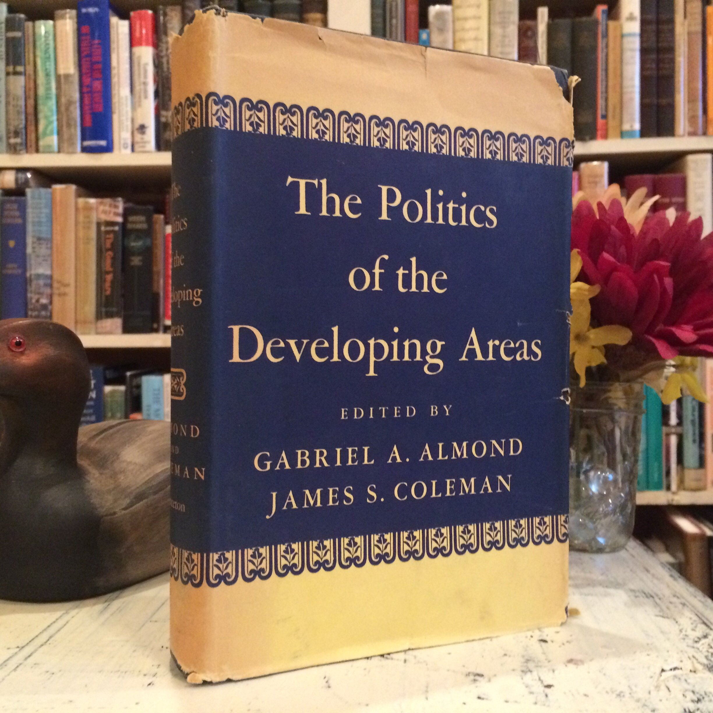

background-image: url("images/cha_challenge.gif")
background-position: center
background-size: contain

---

class: inverse, bottom

# Structural Functionalism

???

http://udel.edu/~jdeiner/strufunc.html
http://www.politicalsciencenotes.com/articles/almonds-model-structural-functionalism/735

---

## Overview

1. Origin
1. Components
1. Logic
1. Dynamics
1. Criticism
1. Bonus...

---

## A Theory Appearing in A Variety of Areas

+ Biology
+ Sociology
+ Anthropology
+ Political Science (public administration)

???

Sociology: Emile [ei'mi:l] Durkheim [ˈdɜːkhaɪm], 涂尔干

---

### Classic Perspective of Policy Making

+ Popular since 1960s
    + Political development in newly independent countries 

???

The approaches for the U.S. and European politics didn't work for new countries

--

.left-column[]

.right-column[]

???

Almond, Gabriel Abraham, and James Smoot Coleman. 1960. The Politics of the Developing Areas. Princeton University Press.

Almond, Gabriel A., and G. Bingham Jr. Powell. 1978. Comparative Politics: System, Process, and Policy. 2nd edition. Boston: Scott Foresman & Co.

---

## Objective

.center[.red[Political System]]

.center[]


What's in the "box"?  FUNCTION! (What's that?)

???

what does a structure (guerrilla movement, political party, election, etc.) do within the political system (of country x)? 

---

## Components

.huge[System]

???

1. The connection of structures
1. Conversion process, basic pattern maintenance, and various capabilities (distributive, symbolic, etc.)
1. Developing countries have a simpler system, and developed have a complex one, but both have structures with SIMILAR functions.

--

.center[.Large[&rarr; Structures]]

???

political party, legislature, executive, judiciary, interest group, officials

--


.right-column[
&rarr; Functions
+ Input
+ Output (Aha!)
]

???

1. Economic terms
1. Input: political socialization & recruitment, interest articulation/aggregation, and political communication
1. Output: rule-making, rule implementation/adjudication
1. Different structures may perform others' function: executive has legislature functions (部门立法)

---

.Large[System]
.center[.large[&rarr; Structures]]
.pull-right[
&rarr; Functions
+ Input
+ Output (Aha!)
]

.Large[Environment]

+ International
+ Domestic (culture)
    + Elite (e.g., expansive, exclusive, closed, parochial, synthetic, null)
    + Elite-mass interactions

???

What does environment mean in the system theory

Pye: China  
Weinter: mass demands and elites' strategies

---

## Focus

Consequences &larr; Actors' importance &larr; Actors' functions & performances

--

.center[System &harr; Actors (David Easton 1957)]

---

background-image: url("images/fun_structuralFunctionalism.png")
background-position: center
background-size: contain

## Logic

---

.center[


]

???

There's time, no development in political system

---

## Political Development

1. Penetration (elites &rarr; masses)
1. Commitment (elites &larr; masses)
1. Participation (elites &harr; masses)
1. Distribution (elites &rarr; masses)

???

Penetration: Whether political elites can get what they want from people over whom they seek to exercise power (Joseph LaPalombara, poli sci Yale)

--

.center[.red[Interaction w. environments]]

---

## System Change

*Inevitable*

+ ~~State~~ Political system: Openness

--

+ Challenges from the environments  
&rarr; adaptions and adjustment

--

+ Stability bias &rarr; Conservative, evolutionary changes

---

## Motivations of Changes

Elites and their associates

Social groups 

System's own demands

---

## Criticisms

What issues do you find?

--

1. Concept stretching: e.g., system, interactions

???
From anthropology.  
Giovanni Satori, David Collier

--

1. Actor exclusion

???
Only a mere number of structures

--

1. Normative bias

???
Pro-capitalism

--

1. "A theory about social wholes as social wholes"? 

---

class: bottom, inverse

# Structural Functionalism in Practice

---

## Operationalizing Structural Functionalism

Using a microanalytic, individualistic perspective

--

1. Actors
1. Goal
1. Interests
1. Interaction

---

class: middle

> .large[Where rational choice theory wants to simplify, the micro-version of structural-functionalism calls for enrichment.  
---Lane (1994: 466)]

---

## Actors

The actors are .blue[groups]: 

1. Elites
1. Masses
1. Governments

--

.center[*Does individuals enter the picture?*]

???
How? As leaders 

---

## Goals 

Actors have .blue[fixed] preference orders and move .red[strategically] to .blue[maximize] their interests.

--

&rArr; Social equilbiria

--

Changes, developments, and all sorts of politics

---

## what Constructs Interests?

Economics: Utility function  
Poli sci/sociologist: Non-universal, narrow, monetary

Structural-functionalism: political culture

???

Pye: Elites behave differently in different countries and circumstances

民主党（Union, LGBTQ, environmentalists） vs. 共和党

---

## Micro &rarr; Macro (Individual &rarr; System)

I. Each actor evaluates goals and opportunities &rarr; conform/fight

???
conform: following the existing rule

--

II. Game
+ All actor conform &rarr; system stable
+ Fighter vs. conformer &rarr; fighter wins
+ Fighter vs. fighter &rarr; "Stronger" wins

--

III. Winners rerule the system

--

IV. The process repeats in the new system.

---

## Contribution of Structural Functionalism

Bring the .blue[variety] and .blue[variance] in:

1. Varieties of the institutions, leaders, social configurations
1. Variances in space and time

---

## Taking-Home Points

1. Structural functionalism
    + Environment
    + System
    + Structure
1. From micro perspective: actor as groups
    + Elites
    + Masses
    + Government
    + Interests
    + Function
    
```{r pdfPrinting, eval = FALSE, include = FALSE}
pagedown::chrome_print(list.files(pattern = "05_.*.html"), timeout = 300)
```