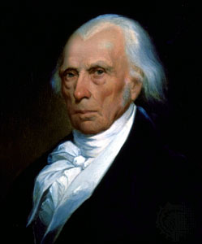
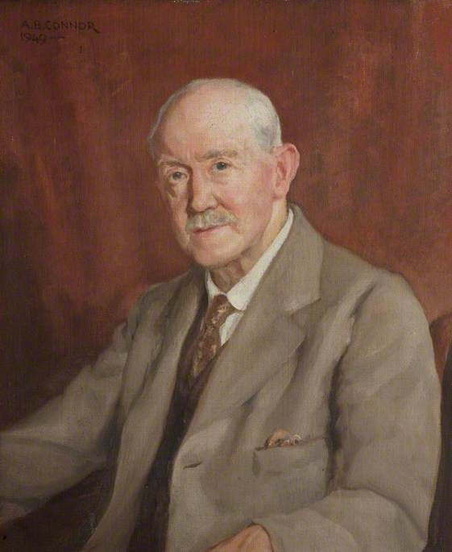
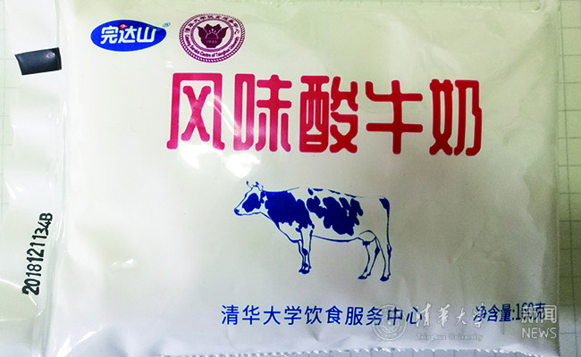
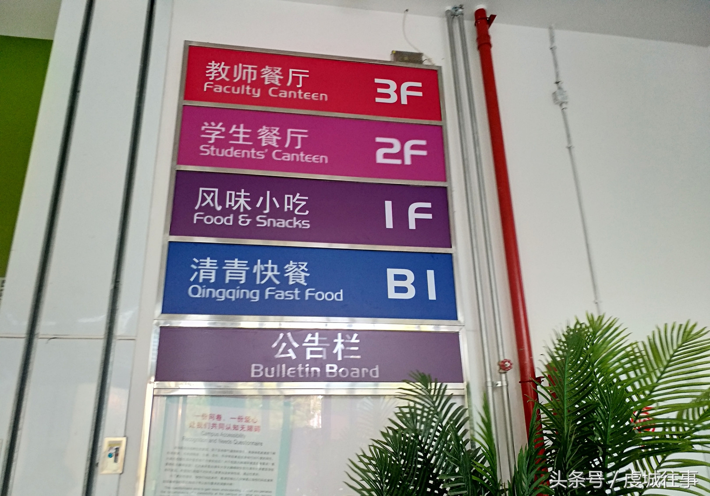
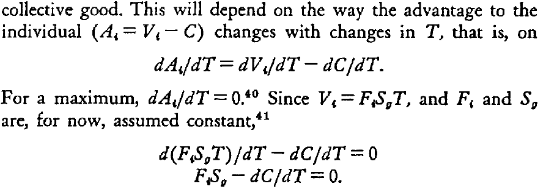
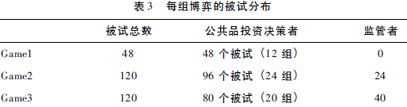

```{r setup, include=FALSE}
knitr::opts_chunk$set(echo = FALSE, message = FALSE, warning = FALSE)

if (!require(pacman)) install.packages("pacman")
library(pacman)

p_load(
  emo
) # data wrangling # data wrangling

xaringanExtra::use_xaringan_extra(c("tile_view", # O
                                    "broadcast", 
                                    "panelset",
                                    "tachyons"))

# Functions preload
set.seed(313)
```


## Overview

- Concept
    - Group theory
    - Collective action (how different from previous lectures?)
- Perspectives
    - Political view ("Neng")
    - Economic view ("Hao")
    - Interactive/Institutional view ("Zen")
- Application

---

class: inverse, bottom

# Conceptual Setup

---

## Concepts

### Group theory

> Policy making as a continual struggle for balance among the competing interests of various interest groups.

### Collective actions

> Actions taken .red[together] by a group of people to achieve a common objective (such as a policy goal). 

Examples? 

--

.pull-left[
- Anti-COVID-19
- Adjustment of population structure
- Double reduction    
......
]

--

.pull-right[Have you noticed that we are .red[changing the topic] from previous lectures? 😱]

---

## A Step Back to the Basics

### What's a public policy?
.pull-left[
*Principle based*

> The principles that govern action directed towards given ends.    
---Richard Titmuss

]

???

Founding chair of LSE

--

.pull-right[
*Outcome based*
.small[
> A set of actions that affect the solution of a policy problem, i.e. a dissatisfaction regarding a certain need, demand or opportunity for public intervention.   
--- Bruno Dente
]

]

???

professor of Public Policy Analysis at Politecnico di Milano, 意大利

--

.center[
*Actor based*

> Whatever governments choose to do or not to do. ---Thomas Dye

]

???
/dai/

Emeritus professor of political science at Florida State University

---

background-image: url("images/group_policyCycle.png")
background-position: center
background-size: contain

## Policy-Making cycle

???

We are turning from decision making to implementation

All steps can be used to evaluate

system theory are about agenda setting and policy formulation

---

class: middle, center

## Milestone Theorists of Group Theory





???
James Madison &rarr; Arthur Bentley &rarr; David Truman &rarr; Mancur Olson &rarr; Elinor Ostrom

The first three are purely political view, and the next two are rational view

---

class: inverse, bottom

# Group Theory as a Political View

---

## Madison's Pluralism

 Quiz: What's the opposite of pluralism?

--

Who are groups?

.bg-black.golden.ba.shadow-5.ph4.mt3[
By a faction, I understand a number of citizens, whether amounting to a majority or a minority of the whole, who are united and actuated by some common impulse of passion, or of interest, .red[adversed] to the rights of other citizens, or to the permanent and aggregate interests of the community.

.tr[
--- Madison, *Federalist* #10   
.small["The Utility of the Union as a Safeguard Against Domestic Faction and Insurrection"]
]
]

???

毛： 我们这个党不是党外无党，我们是党外有党，党内也有派，从来都是如此，这是正常现象。我们过去批评国民党，国民党说党外无党，党内无派。有人[陈独秀]就说：“党外无党，帝王思想，党内无派，千奇百怪。”我们共产党也是这样，你说党内无派？它就是有，比如说对群众运动就有两派，不过是占多占少的问题。


Faction and Prevent Faction (?)

--

Remove factions? Madison said:
+ Destroying liberty
+ Creating a society homogeneous in opinions and interests

---

## If Not Removing

.pull-left[
Pluralists' answer: 
+ A large one (.red[diverse] interest groups)
+ Federalism (making .red[local] matter)
]


.pull-right[
.center[]
]

 NB: Control "only working in a republic"(representative institution)
+ Only the representatives can construct common interests.

???

The principle of popular sovereignty should prevent minority factions from gaining power.  

https://en.wikipedia.org/wiki/Federalist_No._10#Madison's_arguments

--

.center[How do interest groups work?]

---

## Engaging Interest Group

.pull-left[
In a representative institution: 

+ Activity of a group
+ Expression of an interest
+ Exertion of pressure
]

.pull-right[
.center[]
]

???

Bentley, Arthur Fisher. 1908. *The Process of Government: A Study of Social Pressures*. Principia Press.

https://www.britannica.com/biography/Arthur-F-Bentley#ref164555

--

.center[What's the function of government?]


---

## Government: A Structure Rather Than A Player

.pull-left[
### Governmental Institutions
+ Operating structure
+ Groups' effects on particular branches of the government
]

.pull-right[
.center[]
]

???

Truman, David B. 1951. *The Governmental Process: Political Interests and Public Opinion*. New York: Knopf.


The government plays an active role in establishing the conditions for interest groups to act.

--

.pull-left[
### Interest groups' strategic position
.small[
+ Status & prestige
+ Standing against the rule
+ Government membership in the group
+ Usefulness as a source of information
]
]
--

.pull-right[
### Interest groups's inherent characteristics
+ Degree of organization
+ Skills of the leadership
+ Resources/money
]

---

.center[(Position + Characteristics) @ Institutions &rArr; Policies]

+ Government institutions .red[politicized] interest groups
+ Interest groups' .red[characteristics] influence governmental decisions
+ Diversity makes policy-making .red[flexible]


???

The interest groups' **strategic position** in the society (groups' status and prestige; their standing against the rules of the game; government membership in these groups; their usefulness as a source of information) and **internal characteristics** of both the interest groups (degree of organization; the skills of the leadership; and resources/money) and **governmental institutions** (operating structure; groups' effects on particular branches of the government) affect the influence on governmental decisions.  
The political structure of the U.S. government (federalism, liberty, rights) allows potential interest groups to rise and therefore play a role in representing interests.  
Diversity and will accommodate policy-making and will make it more flexible.

https://adambrown.info/p/notes/truman_the_governmental_process

--

.center[
A policy-.red[process] perspective
]

--

.center[
How do decisions are made and modified? 

Rational choice in!
]

---

class: inverse, bottom

# Group Decision from an Economic View

---

background-image: url("images/group_goods.jfif")
background-position: center
background-size: contain

## Goods

???

A more general view beyond politics (just like neo-institutionalism over institutionalism)


Private: Software?  
Club: Water network?  
Common: Freshwater?  
Public: Dam?


---

.center[




]

???

private good
club good
common good (rivalry is high)
public good

---

## Review

### Group theory

> Policy making as a continual struggle for balance among the competing interests of various interest groups.

### Collective actions

> Actions taken .red[together] by a group of people to achieve a common objective (such as a policy goal). 

---

class: center

## Olson's Problem of Collective Actions



???

The original version was in differential equations

一个和尚挑水喝，两个和尚抬水喝，三个和尚没水喝 

--

 Assumption: A fixed amount of collective goods

Group size &uarr; average goods &darr;    
Group size &uarr; average contribution &darr;   
Group size &uarr; supervision &darr;    
Group size &uarr; collective action &darr;

???

- 僧多粥少，分宿舍
- 只要人人都献出一点爱. 世界将变成美好的人间 （现在是阴间么）
- 法不责众
- 参见每次班级活动


---

background-image: url("images/group_freeRider.webp")
background-position: center
background-size: contain

## Crux of Collective Action Problem

Everyone has an intention **not** to contribute.

(Why?)

???

/kr'ʌks/

See also Garrett Hardin' s tragedy of the commons

a situation in a shared-resource system where individual users, acting independently according to their own self-interest, behave contrary to the common good of all users by depleting or spoiling the shared resource through their collective action. 

---

## Olson's Solutions

Group size: Reducing the group size
+ Lower organization/transaction cost
+ Higher impact on individuals' cost
+ Larger per-capita benefit

???

可以连坐

--


Group organization: Privileged 

+ Benefits are asymmetric
+ The most benefited party provides the public goods

--

Group member: Selective incentives
- Private goods for public goods providers

???

1. 自献血之日起5年内免费使用献血量5倍的血液；5年之后免费使用献血量等量的血液。参加北京市无偿献血公民的配偶和直系亲属，不符合献血条件的，自公民献血之日起5年内免费使用献血量等量的血液。
1. Donation for tax waiver

--

Group member: Coercion

---
class: inverse, bottom

# Group Cooperation in Different Views

---

## Criticism on Olson

**Assumptions**

Zero jointness of supply:

> When the cost of providing the good is proportional to the number who share in it.

???

Dorm cleanness depends on how many to maintain

--

 Alternative: Pure jointness of supply

> When it is irrelevant how many others might share in the good. Individuals will provide the good if their own benefit from the good outweighs its cost.

???

A video membership that others can also use, gain benefit from sharing

--

*Homogeneous actors*
- There is only one type of cost/benefit

---

## Alternative Explanations

### Rational-Choice Camp

*Critical Mass Theory* (Oliver & Marwell 1993)

Critical mass: A small group of people with highly interested and resourceful actor.

Production function:The correlation between what individuals give for a public good, and the utility of that good. 

--

.center[
 Decelerating: Olson's situation

 Accelerating: Apple effect
]

--

Achieving accelerating curve:

Overcoming start-up cost &rarr; Mobilizing more &rarr; Declining the marginal cost


???

1. Critical mass theory

Marwell, Gerald, and Pamela Oliver. 1993. The Critical Mass in Collective Action. Cambridge University Press.

1. Each additional contribution has an increasing effect on the public
good: BT downloading

1. Each additional contribution has a declining effect on the public
good: EU

1. First a problem of overcoming start-up costs, then
heightened mobilization, then declining marginal payoffs:


---

*Game theory*

Olson's problem: N actor, one-time prisoner dilemma

???

|         | Confess | Not |
|---------|---------|-----|
| Confess | -3,-3     | 0,-5 |
| Not     | -5,0     | -1,-1 |

--

Adding conditions

- Separate &rarr; negotiation
- One time &rarr; multiple times
- Full info &rarr; limited info &rarr; bounded rationality

???

tit-for-tat is the best for multiple time

--

Empirical works

- Games based on classic rational-choice models
- Preset conditions
    - Rational egocentrism
    - Conditional partner
    - Punishment executant
- ABM simulation
- Field work in actual group organizations

---

## Institutionalism Camp

Institutional arrangement for collective actions

+ People are .red[not] autonomous
+ Rules can .red[reduce] collective action issues


Ostrom, Elinor. 1990. *Governing the Commons: The Evolution of Institutions for Collective Action*. Cambridge University Press.

c.f., Trumbull, Gunnar. 2012. *Strength in Numbers: The Political Power of Weak Interests.* Cambridge, Mass: Harvard University Press.

???

Trumbull argues that diffuse interests have a legitimacy premium when they manage to mobilize, while concentrated interests are viewed with suspicion. He describes the concept of legitimacy coalitions, which are coalitions between state policymakers, social activists or industry to promote certain policy. By having to form a coalition, the interests are more broadly represented. An example of such a coalition is the post-war neo-corporatist system.

---

## Application

徐彪. 2019. “监管竞争能促进合作吗?——来自经典公共品实验的证据.” 公共行政评论 12(04): 5-26+189.

Objective: 监管作用

Theory: 行政监管理论

Data & Method: 

- 经典公共产品实验(Fudenberg & Pathak 2010)
    -无监管
    - 监管垄断
    - 监管竞争
- 被试：南京大学仙林校区成员, 10元出场费

.center[]

---

 Findings:

1. 在监管垄断情境下，监管对合作行为的促进效应逐渐减弱; 最终，被试在监管垄断和无监管情境下的合作行为没有显著差异。
1. 在监管竞争情境下，监管对合作行为的促进效应逐渐增强，最终的合作行为显著高于无监 、监管垄断情境。
1. 在监管环节引入竞争，可以促进监管者的客观监管严厉性及被试对监管严厉性的主观预期。
1. 在实验初期，监管严厉性以及严厉性预期在监管竞争对合作行为的影响关系中没有发挥中介作用; 但随着实验的推进，监管严厉性以及严厉性预期发挥了中介作用。

---


background-image: url("images/group_mindmap.png")
background-position: center
background-size: contain


## Taking-Home Points

```{r pdfPrinting, eval = FALSE, include = FALSE}
pagedown::chrome_print(list.files(pattern = "07_.*.html"), timeout = 300)
```