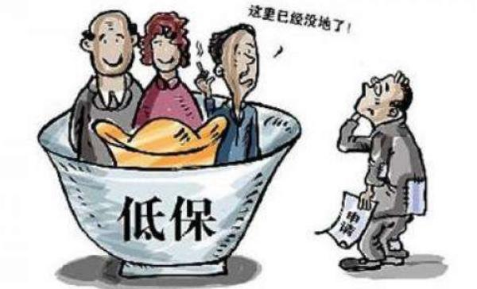

class: bottom, inverse

background-image: url("images/court.jpg")
background-position: center
background-size: contain

# Defense Time

---

## Procedure

1. Drawing a respondent from the audience
1. The defender talks.
1. The defender queries.
1. The respondent queries.
1. Preparation (30 sec)
1. The respondent answers.
1. The defender answers.

```{r stopwatch, echo = FALSE}
library(countdown)

countdown(minutes = 0,
          seconds = 30,
          play_sound = TRUE)
```


---

class: inverse, bottom

# Elitism

---

## A Different Approach

--

.center[]

--

**Macro, group, action/dynamics**: System theory + Structural Functionalism

**Micro, individual, decision/behavior**: Elitism

---

## Classical Logic


.center[


]

---

### Adjusted Focus

.left-column[


]

.right-column[


]

---

## Application: Classic Logic

.center[]

???

Evaluating the political consequences of 农村低保

---

## Category: Elite and Mass


> 现代乡村治理精英是指在乡村治理过程中凭借自身经济基础、文化水平、政治素养、社 会关系等综合能力而赢得一部分村民支持，并通过村民自治选举而成为乡村治理主要“管理者”的人……村干部作为乡村治理精英……---赵文杰，丁凡琳 (2015: 55)


---

class: small

## Power Source

> 村干部作为乡村治理精英，理应.magenta[了解]“低保”政策的具体目标和具体实施办法……多数村民对于“低保”政策了解不充分，并.magenta[不知晓]“低保”评定的具体方式方法，也缺乏表达自身诉求的反馈渠道。(Ibid., 55,56)

--

> 对于农村居民来说，其收入和支出的界定存在一定困难，在农村人口外出务工数量不断增加的大背景下，农村居民收入日趋多元化，其务工收入很难准确计算。此外，即便是按照务农收入来说，种植的农作物种类和价格存在差异也使得收入界定存在困难。加之部分村民存在隐瞒实际收入借以骗取“低保”等情况，对“低保”对象收入的界定缺乏十分有效的方式。.magenta[农民收入界定的困难]给“低保”不公平分配提供了基础。(Ibid., 56)

---

## Elite Power: Rent

村干部往往使“低保”分配最大限度符合个人利益 (Ibid., 57)

+ .magenta[拉近]与部分熟人的关系
+ 某些理应得到“低保”的村民因不能给予部分村干部选票和利益上的支持而被.magenta[排除]在“低保”范围外
+ 以“低保”分配.magenta[展示]自身权力，借以获得权威地位

---

## Consequences and Suggestions


### Consequence

> 村民对于分配不公平、过程不公开、村干部 个人决策、人情“低保”太多、村民缺乏发言 权等问题较为不满。(Ibid., 58)


--

### Suggestions

1. 完善相关制度法规
1. 开展宣传教育
1. 培育专业人员
1. 对乡村精英进行必要约束


---

## Application: Adjusted Focus

The "*Relative Power*" Theory (Goodin & Dryzek 1980)

--

### Main course: 

How does the rich influences the political participation of the poor?

### Side dish: 

Justifying A better theory

---

## Who Are the Elites

.left-column[
Simply put: 

.large[The rich]
]
.right-column[]

---

background-image: url("images/elites.png")
background-position: center
background-size: contain

---

background-image: url("images/IvyPotus.jpg")
background-position: center
background-size: contain

???

Bush: MBA from Harvard Business School  
Trump: UPenn, Wharton School

---

background-image: url("images/eliteMass.png")
background-position: center
background-size: contain

## Elites vs. Masses

---

## Why DO I Have a Better Theory

Lakatosian Criteria: 

1. Accounting for all the successes of the old
1. Being better than the old
1. Being broader than the old.

???

Imre Lakatos, hungarian philosopher of mathematics and science

--

Substantive Question: What/How the masses' political participation is affected? 

+ **Old**: Social psychological theory
+ **New**: Rational-choice based elitist theory

---

## Battle of the Theories

.left-column[
### Social Psychology

People participate according to their civic culture.

]

--

.right-column[
### Relative Power<sup>1</sup>

People participate when being more likely to win and win a lot.

]

.footnote[
[1] Power: More economic or political resources
]

---

## Logic and Hypotheses

### Social Psychology

SES &rarr; civic orientation &rarr; participation

---

### Relative Power

Pr(participation) &prop; Pr(win)<sup>1</sup> &times; Payoff

.small[The richer can .magenta[afford more] participation cost.]

--

EU<sub>participate</sub> &rarr; Information<sup>2</sup> &rarr; participation

.small[The richer .magenta[know more] about what they can win.]

---

## Examination in the Real Life

.left-column[]
.right-column[]

???

Individual: voting and personal contact  

--

.left-column[]
.right-column[]

???

Collective: Campaigning and communal

---

class: small

## Explanatory Variable

### Relative power

$$RP = \frac{\text{Household Income}_i}{\widetilde{\text{Household Income}}_n}$$

--

### Payoff

1. Government-provided benefits (aids for aged, medical, education, etc.)
1. Responsibility of government (feeling problem solved by the government

--

### Information

Frequency of TV watching, # of booked magazines,, newspaper, political knowledge (recognized officials)

---

## Results: Explanatory Power

| Participation | Relative Power | Social Psychology | Difference |
|---------------|----------------|-------------------|------------|
| Voting        | .17            | .15               | .02        |
| Contacting    | .02            | .01               | .01        |
| Campaigning   | .12            | .19               | .07        |
| Communal      | .17            | .23               | .05        |
| Summary       | .26            | .31               | .05        |

--

.small[
1. Accounting for all the successes of the old .magenta[&check;]
1. Being better than the old
1. Being broader than the old
]

---

## Results: Better Prediction

.center[]

???

Highly unequal area

SS: High individual and high communal
RP: High communal but low individual

--

.small[
1. Accounting for all the successes of the old .magenta[&check;]
1. Being better than the old .magenta[&check;]
1. Being broader than the old
]

---

## Results: Frontier Participation

### Historical Trends

**US**: More participation (west)  
**Norway**: Less participation (north & east)  
**Australia**: Opposite

--

Social psychology: can't explain the differences.  
Relative power: egalitarian/inegalitarian

???

US: Equal due to the Homestead Act of 1862  
Norway: manhood suffrage was enated into law way slower in NE
Australia: giant sheep ranchers and wealthy irrigationists on the one hand and their wage-laborers on the other.

--

.small[
1. Accounting for all the successes of the old .magenta[&check;]
1. Being better than the old .magenta[&check;]
1. Being broader than the old .magenta[&check;]
]

---

## Bonus: What's the Opposite of Elitism?

Populism or Pluralism?

--

Key question: Who's in charge?

--

.left-column[

### Elitism

A set of elites.

]

.right-column[

### Pluralism

Interest groups<sup>1</sup>

]

???

There are places among the levels and branches that people and groups can engage.


---

## Take-Home Points

Elitism is a micro, individual perspective

Elites are the rich.

Elitist theory has two approaches:

+ Classic view
+ Adjusted focus

Application of Elitist theory:

1. Officials' renting behavior
1. Relative Power

???

Elitism vs. pluralism

Better theory: as good as, better, broader