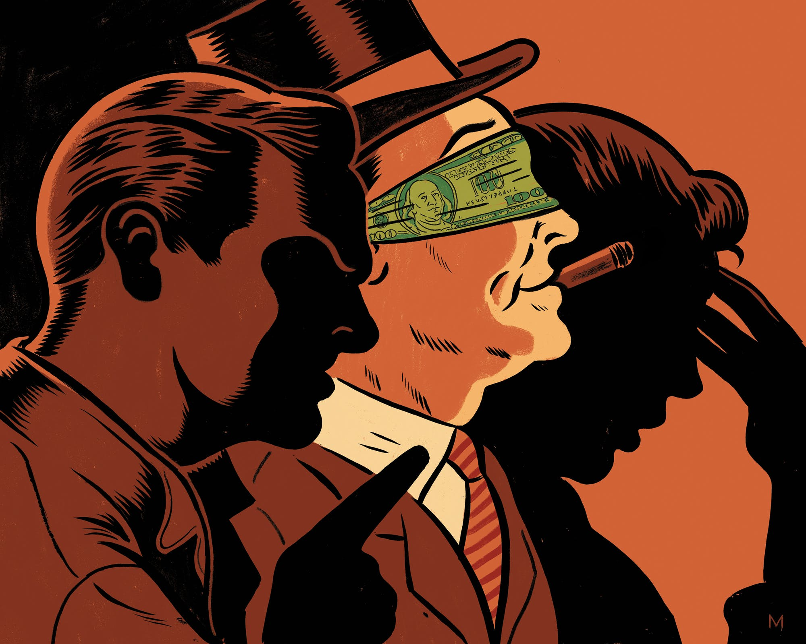

```{r setup, include=FALSE}
knitr::opts_chunk$set(echo = FALSE, message = FALSE, warning = FALSE)


if (!require(pacman)) install.packages("pacman")
library(pacman)

p_load(
  emo
) # data wrangling # data wrangling

xaringanExtra::use_xaringan_extra(c("tile_view", # O
                                    "broadcast", 
                                    "panelset",
                                    "tachyons"))

# Functions preload
set.seed(313)
```

background-image: url("images/cha_challenge.gif")
background-position: center
background-size: contain

---

class: inverse, bottom

<video width="1000" height="600" controls preload>
    <source src="images/elite_powerTalk.mp4" type="video/mp4">
</video>

# Watch a Video Before Everything
---

class: inverse, bottom

# Elitism

---

## Perspective vs. Perspective

.center[]

--

**Macro, group, action/dynamics**:  
System theory + Structural Functionalism

**Micro, individual, decision/behavior**:  
Rational choice model, .red[Elitism]

---

## Logic of Elite Leading


.center[


]

???

Money talks
Power talks


---

## Who Are the Elites

.pull-left[
Simply put: 

.large[The rich of]

+ Power
+ Money
+ Influence
+ Education
+ Social network    
......
]

.pull-right[]

???

Not only mean monetory, but also education, social network, etc.

---

background-image: url("images/elite_IvyPotus.jpg")
background-position: center
background-size: contain

???

Bush: MBA from Harvard Business School  
Trump: UPenn, Wharton School


---

## Model

.pull-left[

### Classic

1. E. have the .blue[power];
1. E. make the .blue[rule];
1. M. follow the .blue[rule];
1. E. get .blue[benefits];     
M. .red[suffer].
]

.pull-right[

### Adjusted

]

---

## Adjusted Focus

.pull-left[


]

.pull-right[


]

???

What can you see?

Elite bring benefit -> Elite shape the masses (became the core in their own selfies)

---

## Model

.left-column[

### Classic

1. E. have the .blue[power];
1. E. make the .blue[rule];
1. M. follow the .blue[rule];
1. E. get .blue[benefits];     
M. .red[suffer].
]

.pull-right[

### Adjusted

1. E. have the .blue[power];
1. E. lead the .blue[rule];
1. M. .blue[participate];
1. E. get .blue[benefits];  
M. .blue[satisfy].
]

---

## How Do Elites Influence You

.pull-left[]
.pull-right[]

???

Individual: voting and personal contact  

--


.pull-left[]
.pull-right[]

???

Collective: Campaigning and communal

---

<video width="700" height="600" controls preload>
    <source src="images/elite_powerTalk.mp4" type="video/mp4">
</video>

---

## Application: Classic Model

.center[]

???

Evaluating the political consequences of 农村低保

赵文杰, and 丁凡琳. 2015. “精英主义视角下农村‘低保’资源的个人化分析.” 北京农业职业学院学报 29(04): 54–60.


---

## Entering the Game


> 现代乡村治理精英是指在乡村治理过程中凭借自身经济基础、文化水平、政治素养、社 会关系等综合能力而赢得一部分村民支持，并通过村民自治选举而成为乡村治理主要“管理者”的人……村干部作为乡村治理精英……  
---赵文杰，丁凡琳 (2015: 55)

???

1. E. have the power;
1. E. make the rule;.


---

## Ruling

> 村干部作为乡村治理精英，理应.red[了解]“低保”政策的具体目标和具体实施办法……多数村民对于“低保”政策了解不充分，并.red[不知晓]“低保”评定的具体方式方法，也缺乏表达自身诉求的反馈渠道。(Ibid., 55,56)

--

> 对于农村居民来说，其收入和支出的界定存在一定困难……对“低保”对象收入的界定缺乏十分有效的方式。.red[农民收入界定的困难]给“低保”不公平分配提供了基础。(Ibid., 56)

???

1. M. follow the rule;

---

## Reaping

村干部往往使“低保”分配最大限度符合个人利益 (Ibid., 57)

+ .red[拉近]与部分熟人的关系
+ 某些理应得到“低保”的村民因不能给予部分村干部选票和利益上的支持而被.red[排除]在“低保”范围外
+ 以“低保”分配.red[展示]自身权力，借以获得权威地位

???

1. E. get benefits; M. suffer.

---

## Consequences and Suggestions

> 村民对于分配不公平、过程不公开、村干部 个人决策、人情“低保”太多、村民缺乏发言 权等问题较为不满。(Ibid., 58)

1. 完善相关制度法规
1. 开展宣传教育
1. 培育专业人员
1. 对乡村精英进行必要约束

```{r stopwatch2, echo = FALSE}
library(countdown)

countdown(
  minutes = 2,
  seconds = 0,
  warn_when = 5,
  bottom = "10%",
  font_size = "3.5em",
  play_sound = TRUE
)
```

???

赵文杰，丁凡琳

Breakroom:

Will they work? Yes, or no? why?

---

## Application: Adjusted Model

The "*Relative Power*" Theory (Goodin & Dryzek 1980)

### Core Inquiry

How does the rich influences the poor?

---

## Social Psychology vs. Relative Power

People participate according to their .blue[civic culture].


vs.

People participate when being .red[more likely] to win and win a lot.


--

&rArr; (Competitive Hypotheses)

.pull-left[
### Social Psychology (Verba-Nie)

SES &rarr; civic orientation &rarr; participation
]
--

.pull-right[
### Relative Power (Goodin-Dryzek)

Pr(participation) &prop; Pr(win)<sup>*</sup> &times; Payoff

.small[\* The richer can .blue[afford more] participation cost---they also .red what they can win.]
]

---

class: small

## Explanatory Variable

### Relative power

$$RP = \frac{\text{Household Income}_i}{\widetilde{\text{Household Income}}_n}$$

???

Median family income in the city or country

--

### Payoff

1. Government-provided benefits (aids for aged, medical, education, etc.)
1. Responsibility of government (feeling problem solved by the government)

--

### Information

Frequency of TV watching, # of booked magazines, newspaper, political knowledge (recognized officials)

---

## Results: Explanatory Power

| Participation (DV) | Relative Power | Social Psychology | Difference |
|---------------|----------------|-------------------|------------|
| Voting        | .17            | .15               | .02        |
| Contacting    | .02            | .01               | .01        |
| Campaigning   | .12            | .19               | .07        |
| Communal      | .17            | .23               | .05        |
| Summary       | .26            | .31               | .05        |

???

Numbers are R^2

---

## Results: Better Prediction

.center[]

???

Highly unequal area

SS: High individual and high communal
RP: High communal but low individual

The data bear out this prediction of the rational-choice model at the right column: correlations have been more than halved.

---

## Bonus: What's the Opposite of Elitism?

Populism or Pluralism?

--

Key question: Who's in charge?

--

.pull-left[

### Elitism

.large[A set of elites.]

]

.pull-right[

### Pluralism

.large[Interest groups]

]

???

There are places among the levels and branches that people and groups can engage.


---


class: inverse, bottom

<video width="1000" height="600" controls preload>
    <source src="images/elite_powerTalk.mp4" type="video/mp4">
</video>

# Let's Watch This Again

---

## Take-Home Points

Elitism is a micro, individual perspective

Elitist theory has two approaches:

+ Classic view
+ Adjusted focus

Application of Elitist theory:

1. Officials' renting behavior
1. Relative Power


```{r pdfPrinting, eval = FALSE, include = FALSE}
pagedown::chrome_print(list.files(pattern = "06_.*.html"), timeout = 300)
```