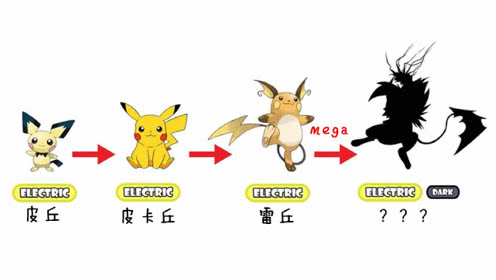
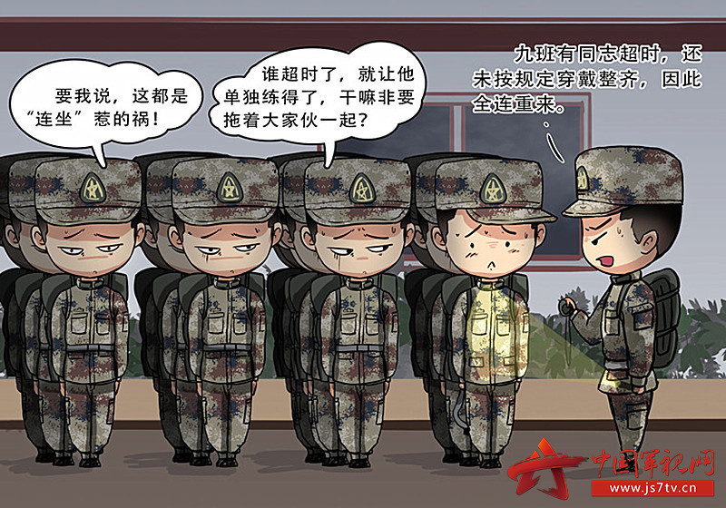
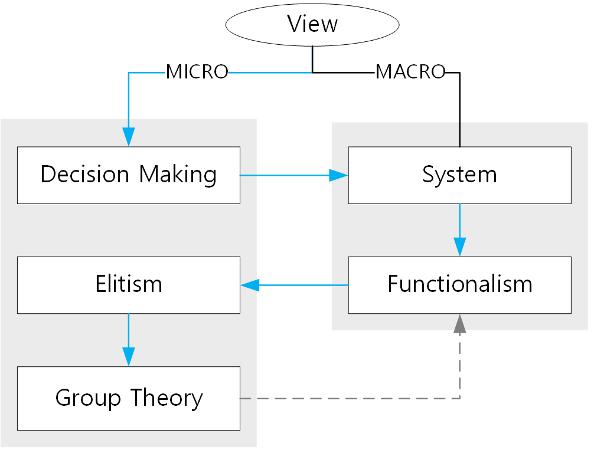

```{r setup, include=FALSE}
knitr::opts_chunk$set(echo = FALSE, message = FALSE, warning = FALSE)


if (!require(pacman)) install.packages("pacman")
library(pacman)

p_load(
  emo
) # data wrangling # data wrangling

xaringanExtra::use_xaringan_extra(c("tile_view", # O
                                    "broadcast", 
                                    "panelset",
                                    "tachyons"))

xaringanExtra::use_fit_screen() # Alt + F

# Functions preload
set.seed(313)
```

background-image: url("images/cha_challenge.gif")
background-position: center
background-size: contain

---

class: inverse, bottom

# Group Theory

---

## Overview

1. Evolution of group theory
1. Collective action
1. Solutions of collective action issue

---

class: middle, center

## Milestone Theorists of Group Theory


???
James Madison &rarr; Arthur Bentley &rarr; David Truman &rarr; Mancur Olson &rarr; Elinor Ostrom

--



---

## Madison's Pluralism

.bg-black.golden.ba.shadow-5.ph4.mt3[
By a faction, I understand a number of citizens, whether amounting to a majority or a minority of the whole, who are united and actuated by some common impulse of passion, or of interest, .magenta[adversed] to the rights of other citizens, or to the permanent and aggregate interests of the community.

.tr[
--- Madison, *Federalist* #10 

"The Utility of the Union as a Safeguard Against Domestic Faction and Insurrection"
]
]

???

Remove the causes of faction
+ Destroying liberty
+ Creating a society homogeneous in opinions and interests


Faction and Prevent Faction (?)


---

## When Removing Is Inappropriate

Control "only working in a republic"

+ A .blue[large] one (diverse interest groups)
+ Under federalism (making .red[local] matter)

Not fit pure democracy:
+ Only the representatives can construct common interests (Madison).

???

The principle of popular sovereignty should prevent minority factions from gaining power.  

https://en.wikipedia.org/wiki/Federalist_No._10#Madison's_arguments

--

.center[.large[How do interest groups work?]]

---

## Bentley's Interest Group


.large[
+ Activity of a group
+ Expression of an interest
+ Exertion of pressure
]

Bentley, Arthur Fisher. 1908. *The Process of Government: A Study of Social Pressures*. Principia Press.

.center[.large[*How About the Government*?]]

???

https://www.britannica.com/biography/Arthur-F-Bentley#ref164555

---

## Truman's Group Theory


.large[
Government Process: 

.blue[Via] interest groups (Bentley) &rarr;  
.red[As] interactions of interest groups (Truman)
]
Truman, David B. 1951. *The Governmental Process: Political Interests and Public Opinion*. New York: Knopf.

???

The government plays an active role in establishing the conditions for interest groups to act.

---

## Truman's Interest Group


### Interest groups' strategic position
+ Status & prestige
+ Standing against the rule
+ Government membersion in the group
+ Usefulness as a source of information

--

### Interest groups's internal characteristics
+ Degree of organization
+ Skills of the leadership
+ Resources/money

--

### Governmental Institutions
+ Operating structure
+ Groups' effects on particular branches of the government

---

.center[Position + Characteristics + Institutions &rArr; Policies]

+ Government institutions: .red[Politicized] interest groups. 
+ Interest groups' .blue[characteristics] influence governmental decisions. 
+ Diversity makes policy-making .blue[flexible].


???

The interest groups' **strategic position** in the society (groups' status and prestige; their standing against the rules of the game; government membership in these groups; their usefulness as a source of information) and **internal characteristics** of both the interest groups (degree of organization; the skills of the leadership; and resources/money) and **governmental institutions** (operating structure; groups' effects on particular branches of the government) affect the influence on governmental decisions.  
The political structure of the U.S. government (federalism, liberty, rights) allows potential interest groups to rise and therefore play a role in representing interests.  
Diversity and will accommodate policy-making and will make it more flexible.

https://adambrown.info/p/notes/truman_the_governmental_process

---

background-image: url("images/group_goods.jfif")
background-position: center
background-size: contain

## Goods

???

A more general view beyond politics (just like neo-institutionalism over institutionalism)

Olson's Collective Action

Private: Software?  
Club: Water network?  
Common: Freshwater?  
Public: Dam?


---

.center[


]

???

private good
club good
common good (rivalry is high)
public good

---

.center[]

## Examples of each type of goods  
(Or a good belonging to two types?)

1. Private  
2. Club  
3. Common  
4. Public

```{r, echo = FALSE}
library(countdown)

countdown(
  minutes = 2,
  seconds = 0,
  warn_when = 5,
  bottom = "10%",
  font_size = "3.5em",
  play_sound = TRUE
)
```


---

class: right

background-image: url("images/group_freeRider.png")
background-position: center
background-size: contain

## Olson's Collective Action Problem: Free Rider

???

Everyone has an intention not to contribute

See also Garrett Hardin' s tragedy of the commons

a situation in a shared-resource system where individual users, acting independently according to their own self-interest, behave contrary to the common good of all users by depleting or spoiling the shared resource through their collective action. 

---

background-image: url("images/group_brexit.png")
background-position: center
background-size: contain

## Brexit

???

British people fells the marjority of the Europe is free rider

---

## Olson's Solutions

### Size: .red[Small] is good

.center[]

???

+ Lower organization/transaction cost
+ Higher impact on individuals' cost
+ Larger per-capita benefit

---

### .red[Privileged]: Benefited groups work better

.center[]

???

+ Benefits are asymmetric
+ The most benefited party provides the public goods

---

### Selective .red[Incentives]

.center[]

???

.magenta[private] goods for public goods providers

1. 自献血之日起5年内免费使用献血量5倍的血液；5年之后免费使用献血量等量的血液。参加北京市无偿献血公民的配偶和直系亲属，不符合献血条件的，自公民献血之日起5年内免费使用献血量等量的血液。
1. Donation for tax waiver

---

### .red[Coercion]

.center[]

---

## Going Beyond Olson: Rereasoning Collective Action

*Critical Mass Theory* (Oliver & Marwell 1993)

Production functions determines the critical mass

+ Accelerating (bandwagon effects)
+ Decelerating (free-rider)

--

.pull-left[
+ S-shape

> People worry more about losing what they have than gaining more.

]
.pull-right[]

???

1. Critical mass theory

Marwell, Gerald, and Pamela Oliver. 1993. The Critical Mass in Collective Action. Cambridge University Press.

1. Each additional contribution has an increasing effect on the public
good: BT downloading

1. Each additional contribution has a declining effect on the public
good: EU

1. First a problem of overcoming start-up costs, then
heightened mobilization, then declining marginal payoffs:

垃圾分类
Partially caused by the pyschological utility curve:

---

## Network & Cooperation


Social capital: .red[Credibility] solves the collective action

Cooperation

+ Activists: Seeking for central positions and more connections
+ Resource users: Embedding in .blue[smaller, denser] networks.

???

Scholz, John T., Ramiro Berardo, and Brad Kile. 2008. “Do Networks Solve Collective Action Problems? Credibility, Search, and Collaboration.” *The Journal of Politics* 70(2): 393–406.


---

## Bringing Institutions In

Ostrom, Elinor. 1990. *Governing the Commons: The Evolution of Institutions for Collective Action*. Cambridge University Press.

Institutional arrangement for collective actions

+ People are .red[not] autonomous
+ Rules can .blue[reduce] collective action issues


---

## Taking-Home Points

Pluralism  
&rarr; Interest Group (Bentley vis-a-vis Truman)  
&rarr; Collective Action  
&rarr; Solutions of Collective Action

--

.center[]


---

## If There's Still Some Time...

魏娜, and 张小进. 2010. “集体行动的可能与实现:公民有序参与的视角——基于北京、青岛城市公共政策制定的实证分析.” *教学与研究* (03): 12–18.


---

## Definition

> 狭义上理解的集体行动与集体行为(collective behavior)相接近,是相对于组织行动而言的组织外非集团 行动。奥尔森等人经济政治学分析框架中的集体行动的概念界定当属此类。然而,本研究所指的集体行动则与以上界定相区别, .magenta[既非指社会冲突意义上的群体行为,亦非特指非制度化的组织外行为,而是更广泛意义上利益相关者所采取的一致行为的过程]。 (魏娜, 张小进 2010: 13)

---

class: right

background-image: url("images/wei-zhang2010_fig1.png")
background-position: center
background-size: contain

## Mechanism

???

Where did the collective action happen?

---

## Solution

.pull-left[
### 转变传统观念, 优化参与环境*
+ 确立服务型政府和共同治理的理念
+ 确立责任政府的理念
+ 转变“官本位”思想

### 培养公民意识, 增强参与能力*
+ 培养公民意识
+ 提高公民素质
    ]
    
.pull-right[
### 完善制度建设, 扩大参与渠道*
+ 完善听证制度
+ 完善信息公开制度
+ 建立民意调查制度
+ 健全网络参与制度
+ 发展社区组织参与
    ]

---

.center[]

Do they use collective action theory appropriately?

```{r, echo = FALSE}
library(countdown)

countdown(minutes = 2,
          seconds = 0,
          play_sound = TRUE)
```

```{r pdfPrinting, eval = FALSE, include = FALSE}
pagedown::chrome_print(list.files(pattern = "07_.*.html"), timeout = 300)
```