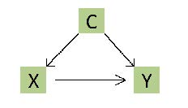
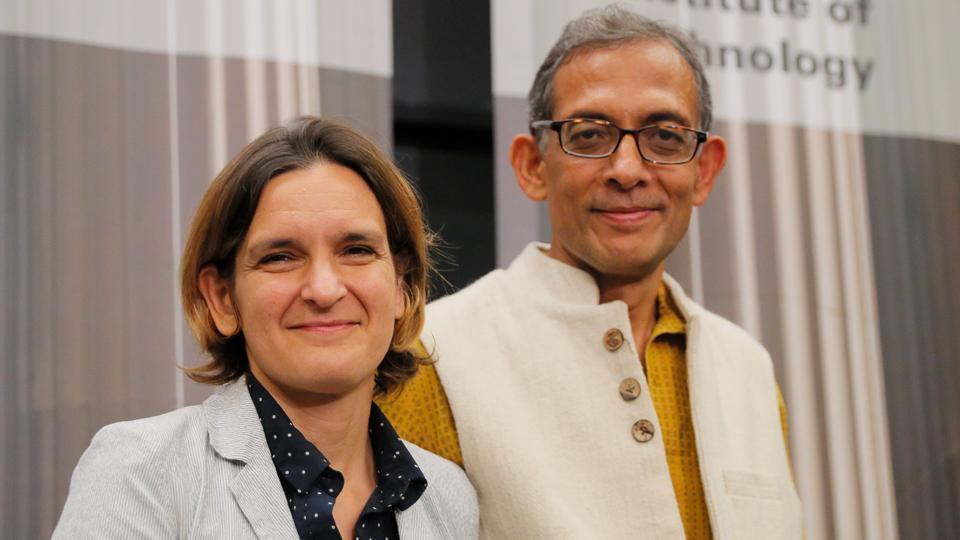

```{r setup, include = FALSE}
knitr::opts_chunk$set(echo = FALSE, message = FALSE, warning = FALSE)

library(pacman)
p_load(knitr, kableExtra, # dependency
       stringr, arm, car, 
       broom, tidyverse) # data wrangling

set.seed(313)
```


class: bottom, inverse

background-image: url("images/court.jpg")
background-position: center
background-size: contain

# Defense Time

---

## Procedure

1. Drawing a respondent from the audience
1. The defender talks.
1. The defender queries.
1. The respondent queries.
1. Preparation (30 sec)
1. The respondent answers.
1. The defender answers.

```{r stopwatch, echo = FALSE}
library(countdown)

countdown(minutes = 0,
          seconds = 30,
          play_sound = TRUE)
```


---

class: inverse, bottom

# Experimental Analysis

---

## Experiment

.center[]

The origin, core, foundation of the empirical/applied science.

---

## Facts about Experimental Methods

1. Not every type of research in the lab is an experiment.

--

1. Not every experiment has to be conducted in the lab.

--

1. Not every method called "experiment" is an experiment.

--

1. Not every research question can be tested by an experiment.


---

## Why Experiment

.center[]

---

## Logic of Counterfactual

.center[]

---

## When Sticking with the Observed

No .magenta[perfect] counterfactual cases

We have to see causation from correlations

--

.center[]

---

## Solution: Watching from an Aggregated Level

.center[]

--

How do we divide the groups?

---

## Randomization, Ta-Da~

.center[]

Double-blind

---

## Result of Randomization

A .magenta[balanced] data

.center[]

---

## Classical experiment

```{r}
library(knitr)
library(kableExtra)

text_tb <- data.frame(
  Test = c("Pre", "Post"),
  Stim. = rep("Treatment", 2),
  NonStim. = rep("Control", 2)
)

kable(text_tb, "html", align = "lcc")%>%
  kable_styling(full_width = TRUE, font_size = 25) %>%
    add_header_above(c(" " = 1, "Assignment" = 2)) %>%
      column_spec(c(2,3), width = "6em")
```

Pre-post?

Control-treatment?

---

## Validity

> The approximate truth of the inference or knowledge claim.  
---Morton & Williams (2010, 254)

+ Internal
+ External
+ Ecological

---

## Internal Validity

The approximate truth of the inference or knowledge claim .magenta[within] a target population studies.

+ Construct validity
+ Causal validity
+ Statistical validity
    
---

## External vs. Ecological Validities

* External validity: The approximate truth of the inference or knowledge claim .magenta[beyond] a target population studies.


* Ecological validity: Whether the methods, materials, and settings of the research are similar to a given target .magenta[environment].

---

## Problem of...Validity?

Q: How does the imagination of detectives change overtime?

.center[]

???

Robert Downey Jr: Sherlock Holmes (2009, 2011)
Benedict Cumberbatch: Sherlock (2010)

---

## Problem of...Validity?

Q: Effect of language policy on individuals' language choice

.center[]

???

Matched guise

---

## Problem of...Validity?

Q: Effect of the waste sorting in terms of the environmental governance

.center[]

---

## What's the Effect?

Rubin's causal model:

.center[]

--

+ Averaged treatment effect (ATE): $E(\tau_i) = E(Y_{i1}) - E(Y_{i0})$


---

## When Can You Use Experiments

1. Independence
1. Exclusion restriction
1. Stable Unit Treatment Value Assumption (SUTVA)
1. Montonicity
1. Nonzero causal effects of assignment on treatment

---

## Independence

### Definition

Subject will have the same effect regardless which group they are in.

E(Y<sub>i1</sub>|T<sub>i</sub> = 1) = E(Y<sub>i1</sub>|T<sub>i</sub> = 0);  
E(Y<sub>i0</sub>|T<sub>i</sub> = 1) = E(Y<sub>i0</sub>|T<sub>i</sub> = 0).

--

### Violation

* Nonrandom assignment
* Non-double-blind design

---

## Exclusion restriction

### Definition

Only treatment can make effects.

.center[]

--

### Violation

* Subjects change their behaviors
* Third party effects

---

## SUTVA

### Definition

The effect of stimulus on one subject is affected by other subjects.

--

### Violation (e.g., Herd Effect)

.center[]

---

## Montonicity and nonzero causal effects

### Definition

* The probability the subject is treated is at least as great when the subject is in the treatment group as when the subject is in the control group.
* The treatment assignment has an effect on the probability that at least some subjects are treated.

--

### Violation

* Operation errors
* Third-party effects

---

## When Experiment Is a Proper Choice?

* Well-defined concept 
* Clear-stated propositions
* Small-group interaction

---

## Field Experiment

.center[]

* Subject: sample from the target population
* Pro: Ecological validity
* Con: Internal and external validity

???

Random experiments in schools in urban India in 2007, hiring young women, test score increase .28 sd.

Banerjee, Abhijit V., Shawn Cole, Esther Duflo, and Leigh Linden. 2007. “Remedying Education: Evidence from Two Randomized Experiments in India.” The Quarterly Journal of Economics 122(3): 1235–64.


---

## Natural Experiment

<iframe width="700" height="480" src="images/naturalExperiment.mp4" scrolling="no" border="0" frameborder="no" framespacing="0" allowfullscreen="true"></iframe>

???

Rural north carolina, mental health of children, 1996, casino opened, profit distributed to some family. Turns out to be effect for improving mental health

---

* Stimulation: It just happened.
* Pro: Ecological and external validity
* Con: Internal validity

---

## Practice

What language/dialect should a street bureaucrat say when communicating with the citizens?