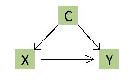
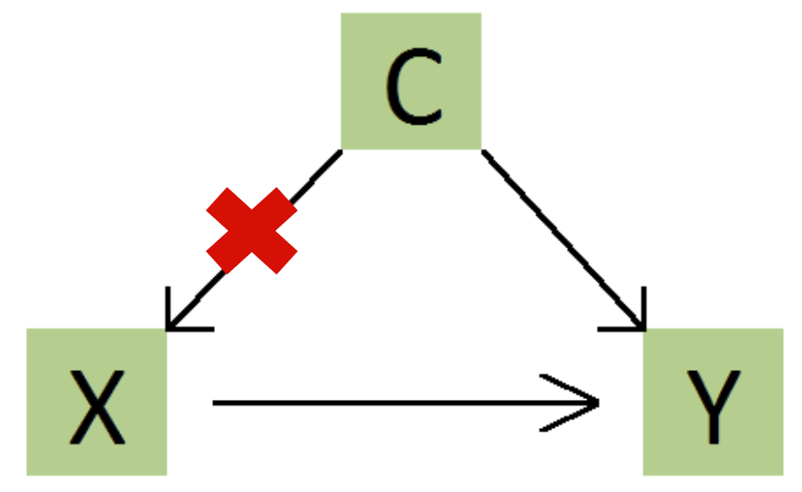

```{r setup, include=FALSE}
knitr::opts_chunk$set(echo = FALSE, message = FALSE, warning = FALSE)


if (!require(pacman)) install.packages("pacman")
library(pacman)

p_load(
  emo
) # data wrangling # data wrangling

xaringanExtra::use_xaringan_extra(c("tile_view", # O
                                    "broadcast", 
                                    "panelset",
                                    "tachyons"))

xaringanExtra::use_fit_screen() # Alt + F

# Functions preload
set.seed(313)
```

background-image: url("images/cha_challenge.gif")
background-position: center
background-size: contain

---

class: inverse, bottom

# Experiment

---

## Overview

.right-column[]

.left-column[

### About experiment

+ What
+ Why
+ How
]

---

## Facts You May not Know

1. Not every research .red[in the lab] is .blue[an experiment].

???

what you did in chemistry in middle school.

--

1. Not every .red[experiment] has to be conducted .blue[in the lab].

???

field, survey

--

1. Not every method called "experiment" is an experiment.

???

natural experiment

--

1. Not every research question can be tested by an experiment.


---

## Why Bother?

.center[]

---

## Counterfactual Logic

.center[]

???

Philip Dick "The Man in the High Castle" (also the author of *Do Androids Dream of Electric Sheep*, Blade Runner)

Fogel, Robert William. 1970. *Railroads and American Economic Growth: Essays in Econometric History*. Johns Hopkins Press.
如果没有铁路，美国的国民生产总值至多减少3%。铁路在美国的经济发展中并不像某些学者所说的那样起着至关重要的作用。

Fogel, Robert William, and Stanley L. Engerman. 1995. *Time on the Cross: The Economics of American Negro Slavery*. W. W. Norton & Company.

南方奴隶制农业比北方家庭农场的生产效率高出 35%。

典型的黑奴并非传统观念认为的那样懒散、无能和低效，平均意义上，黑奴比自由的白人农业工人更加勤奋和高效。

南方奴隶制拥有灵活而高效的激励机制，诸如奖金，休假，年终奖，对「劳动能手」的奖励，对完不成劳动定额的拖后腿者的惩罚，还有班组制和劳动分工，流水线作业等等。

南方奴隶主对奴隶的剥削率比人们通常认为的要低得多。黑奴的平均收入和生活水平高于自由农业工人，营养水平甚至高于美国人在 1964 年的平均水平。

关于奴隶的繁衍、性虐待与滥交摧毁了黑人家庭的观点只是一个传说.像自由人一样，大多数奴隶都拥有独门独户的住宅，几户人家共享一套房屋的情况并不常见。有些种植园甚至有一些专为未婚男女黑奴提供的宿舍，但这些都属例外，奴隶独门独户的房屋才是主流。

南方奴隶制之所以被终结，不是因为它的体系不能有效率地运作，而是由于在道德上不被接受，所以人们要求从政治上消除这种不道德的体制。

---

## When Sticking with the Observed

No .red[perfect] counterfactual cases

We have to see causation .red[from correlations]，but...

--

.center[]

---

## Solution: Watching from an Aggregated Level

.center[]

--

How to divide the groups?

---

## Randomization, Ta-Da~

.center[]

---

## Result of Randomization

A .red[balanced] data

.center[]

---

## When Can You Use Experiments

1. Independence
1. Exclusion restriction
1. Stable Unit Treatment Value Assumption (SUTVA)
1. Montonicity
1. Nonzero causal effects of assignment on treatment

---

## Independence

### Definition

Subject will have the same effect regardless which group they are in.

--

### Violation

* Nonrandom assignment
* Non-double-blind design

---

## Exclusion restriction

### Definition

Only treatment can make effects.

--

### Violation

* Subjects change their behaviors
* Third party effects

???

## SUTVA

### Definition

The effect of stimulus on one subject is affected by other subjects.


### Violation (e.g., Herd Effect)

.center[]


Stable Unit Treatment Value Assumption


## Montonicity and nonzero causal effects

### Definition

* The probability being treated is at least as great in the treatment as in the control.
* The treatment assignment has an effect on the probability that at least some subjects are treated.


### Violation

* Operation errors
* Third-party effects

---

## Classical experiment

```{r experimentTable}
library(knitr)
library(kableExtra)

text_tb <- data.frame(
  Test = c("Pre", "Post"),
  Stim. = rep("Treatment", 2),
  NonStim. = rep("Control", 2)
)

kable(text_tb, "html", align = "lcc")%>%
  kable_styling(full_width = TRUE, font_size = 25) %>%
    add_header_above(c(" " = 1, "Assignment" = 2)) %>%
      column_spec(c(2,3), width = "6em")
```

---

## Validity

> The approximate truth of the inference or knowledge claim.  
---Morton & Williams (2010, 254)

+ Internal (".red[within]")
+ External(".red[beyond]")
+ Ecological (".red[around]")

???

Morton, Rebecca B., and Kenneth C. Williams. 2010. *Experimental Political Science and the Study of Causality: From Nature to the Lab*. Cambridge; New York: Cambridge University Press.


## Internal Validity

The approximate truth of the inference or knowledge claim .red[within] a target population studies.

+ Construct validity
+ Causal validity
+ Statistical validity

## External vs. Ecological Validities

* External validity: The approximate truth of the inference or knowledge claim .red[beyond] a target population studies.

* Ecological validity: Whether the methods, materials, and settings of the research are similar to a given target .red[environment].

---

## Problem of...Validity?

**Question**: How does the imagination of detectives change overtime?  
**Design**: "Natural experiment" of Holmes  
**Subjects**: 200 students in Beijing

.center[]

???

Robert Downey Jr: Sherlock Holmes (2009, 2011)
Benedict Cumberbatch: Sherlock (2010)

---

## Problem of...Validity?

**Question**: Do people treat others differently due to their accent?  
**Design**: Matched-guise experiment  
**Subjects**: 400 Sichuannese in Shanghai

<video width="700" height="300" controls>
    <source src="images/accent.mp4" type="video/mp4">
</video>


---

## What's the Effect?

Rubin's causal model:

.center[]

--

+ Averaged treatment effect (ATE): $E(\tau_i) = E(Y_{i1}) - E(Y_{i0})$


---

## Field Experiment

* Subject: sample from the target population
* Pro: Ecological validity
* Con: Internal and external validity

--

.center[]

???

Random experiments in schools in urban India in 2007, hiring young women, test score increase .28 sd.

**Banerjee, Abhijit** V., Shawn Cole, **Esther Duflo**, and Leigh Linden. 2007. “Remedying Education: Evidence from Two Randomized Experiments in India.” The Quarterly Journal of Economics 122(3): 1235–64.


---

## Natural Experiment

* Stimulation: It just happened.
* Pro: Ecological and external validity
* Con: Internal validity

---

<video width="700" height="600" controls>
    <source src="images/naturalExperiment.mp4" type="video/mp4">
</video>

???

Rural north carolina, mental health of children, 1996, casino opened, profit distributed to some family. Turns out to be effect for improving mental health


---

## Take-Home Points

+ What: Randomization + aggregation
+ Why: Counterfactual
+ How:
    1. Valid design (internal, external, ecological)
    1. Randomly assign groups
    1. Stimulating
    1. ATE
    
```{r pdfPrinting, eval = FALSE, include = FALSE}
pagedown::chrome_print(list.files(pattern = "09_.*.html"), timeout = 300)
```