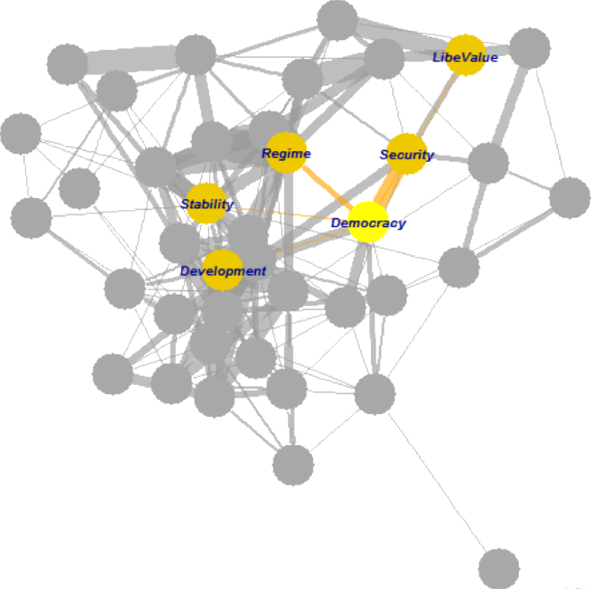
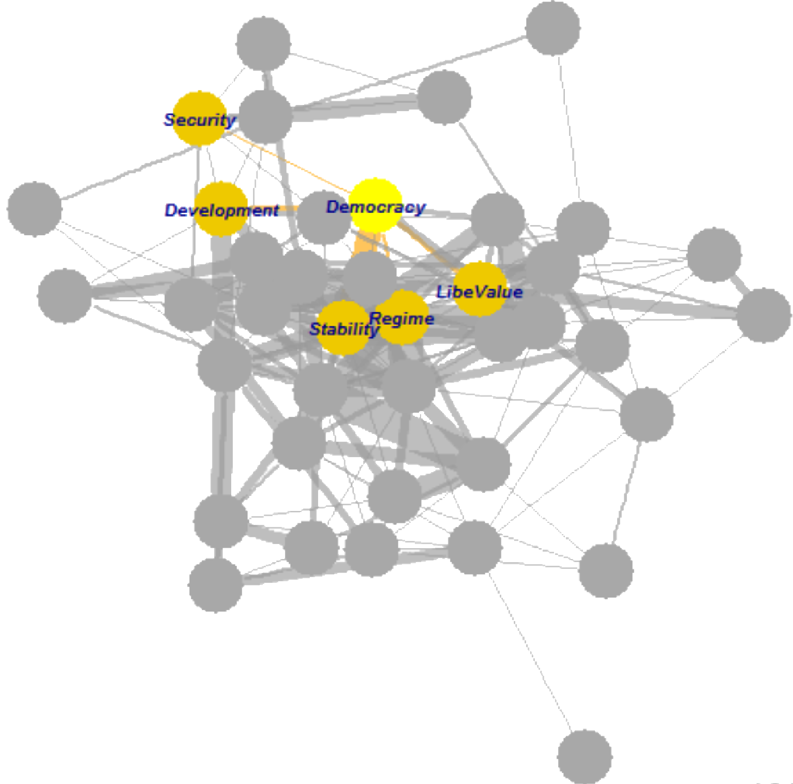

```{r setup, include=FALSE}
knitr::opts_chunk$set(echo = FALSE, message = FALSE, warning = FALSE)

if (!require(pacman)) install.packages("pacman")
library(pacman)

p_load(
  here, dplyr
) # data wrangling # data wrangling

xaringanExtra::use_xaringan_extra(c("tile_view", # O
                                    "broadcast", 
                                    "panelset",
                                    "tachyons"))

# Functions preload
set.seed(313)
```

## Overview

- What's "big" data?
- Big-data approaches
- Big-data problems

---

class: inverse, bottom

# What's Big Data

---

## Defining Big Data?

> Data sets characterized by huge amounts<sup>1</sup> of frequently updated<sup>2</sup> data in various formats<sup>3</sup>, such as numeric, textual, or images/videos.<sup>4</sup>  

--

.center[
[1] Volume  
[2] Velocity  
[3] Variety
]

--

.center[
[4] Two more "v"s: 

.red[Veracity]: Integrity

.red[Value]: Usefulness
]


???

veracity: accuracy, integrity (how do you know?)  
value: how much value for each unit of data?

--

.bg-black.golden.ba.shadow-5.ph4.mt3[
.center[
Bottom Line

The ".red[Non]-data" data
]
]

---

## Policy Analysis with Big Data

.pull-left[
*Sources*

1. Data from e-government, civil service hotlines, government-citizen interactions
1. Official data from bureaus and departments
1. Speeches, statements
1. Traditional and new media
1. Official document archives
1. Judicial documents  
......
]

--

.pull-right[
*Goals*

1. Initiation of the agenda
1. Profile of policy makers
1. Policy making process
1. Logic of policy decisions and implementation
1. Policy evaluation
1. Prediction of policy outcomes  
......
]

---

class: inverse, bottom

# Big-Data Approaches

---

class: middle, center

## Levels of Big Data Analysis

Description     
(Data science, the majority of big-data analysis)

&dArr;

Relationship analysis     
(Social science)

&dArr;

Pattern learning    
(Social science with other methods)

&dArr;

Causal inference
(Rare but growing)


---

## Description

Global Covid-19

<iframe src="https://ourworldindata.org/explorers/coronavirus-data-explorer?tab=map&facet=none&Metric=Confirmed+deaths&Interval=7-day+rolling+average&Relative+to+Population=true&Color+by+test+positivity=false&country=USA~ITA~CAN~DEU~GBR~FRA~JPN&hideControls=true" loading="lazy" style="width: 100%; height: 500px; border: 0px none;"></iframe>

---

Democratic Mood (Tai, Hu, & Solt 2022)

<iframe src="https://ctai.shinyapps.io/dmsweb/" loading="lazy" style="width: 100%; height: 550px; border: 0px none;"></iframe>

---

## Relationship Analysis

.center[]

???

1997

---

## Pattern Learning

.pull-left[]

.pull-right[]


---

background-image: url("images/big_pdregression.png")
background-position: center
background-size: contain


---

## Causal Inference

Causal effect of the Confucius Institute Closure

.pull-left[]

--

.pull-right[]

---

.center[Shutting-down vs. Ice-cream]

.pull-left[]

--

.pull-right[]

---

background-image: url("../../conference/2021-SPSA/images/closeEffect.png")
background-position: center
background-size: contain


---

class: inverse, bottom

# Problems of Big Data

---

## Issues about Big-Data Based Analysis

1. Analytic value
1. Ethics
1. Data representativeness
1. Pedagogical myth

---

## Analytic value: Anything new?

[](https://www.computerworld.com/article/3162030/microsofts-big-data-like-study-on-sleep-proves-what-doctors-already-know.html)
.center[[](https://www.independent.co.uk/voices/gender-pay-gap-worst-offenders-government-targets-diversity-disability-equality-a8788341.html)]

---

## Ethics: Where Are the Data from?

[.center[]](https://www.ftc.gov/news-events/press-releases/2019/09/google-youtube-will-pay-record-170-million-alleged-violations)

???

FTC, New York Attorney General allege YouTube channels collected kids’ personal information without parental consent for targeting ads.

---

## Ethics: What Are the Data Used for?


.center[]

???

2018年FB数据泄露事件: 脸书2015年就发现英国剑桥分析公司“窃用”大量用户隐私数据用于投放政治广告，却为何没能及时告知用户、非等到媒体今年曝光才承认？

Cambridge Analytica助选

---

<video width="1000" height="600" controls preload>
    <source src="https://link.jscdn.cn/1drv/aHR0cHM6Ly8xZHJ2Lm1zL3YvcyFBcnR0dk83MHdLSU8xRzNZWGJWQ096bWFHMDNxP2U9Q2xlWlNk.mp4" type="video/mp4">
</video>

???

Big-data kills

---

## Data Representativeness

> To systematically characterize their views, we obtained a random sample of 9,911 social media posts from 2010 to 2015 ...... From these data, we .red[drew a sample] of 128 posts written by people ...... --- King, Pan, & Roberts 2017 *APSR*

> This analysis is limited to .red[the random sample] of tweets for which we collected hand labels, ......  ---Cirone & Hobbs 2022 *PSRM*

--

Not saying....

Sampling bias, provenance conflicts, increased fluctuations,  error rates...

.center[]

???

provenance conflicts: source issue

Hansen, Lars Peter. 2019. “Purely Evidence-Based Policy Doesn’t Exist.” Chicago Booth Review. http://review.chicagobooth.edu/economics/2019/article/purely-evidence-based-policy-doesn-t-exist (March 27, 2019).

---

## Pedagogical Myth

Typical conversation:

> A: I wanna use big-data method for my project. What should I do?  
> B: Go learn Python!!

--

.pull-left[

]

--

.pull-right[
.large[Let alone a    
data-based    
social scientist!]
]


---

<video width="1000" height="600" controls preload>
    <source src="https://link.jscdn.cn/1drv/aHR0cHM6Ly8xZHJ2Lm1zL3YvcyFBcnR0dk83MHdLSU8xRzR6RzJFWERqbS1BcHZyP2U9eEF5REpX.mp4" type="video/mp4">
</video>

???

Difficult to change people's mind unless they want

---

background-image: url("images/big_mindmap.png")
background-position: center
background-size: contain

## Take-Home Points

---

## Procedure

.pull-left[
### Presenting (10min)

The presenters talk.

### Challenging (10min)

Drawing the Luck Dog


]

.pull-right[

*Process*

1. Presenters query.
    - A question about the paper
1. Challengers respond.
1. Challengers query.
    - A question about the presentation
1. Presenters respond.
]

---


background-image: url("images/cha_challenge.gif")
background-position: center
background-size: contain

```{r pdfPrinting, eval = FALSE, include = FALSE}
pagedown::chrome_print(list.files(pattern = "11_.*.html"), timeout = 300)
```