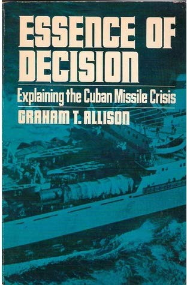
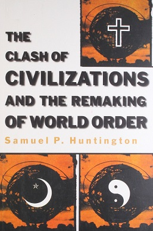
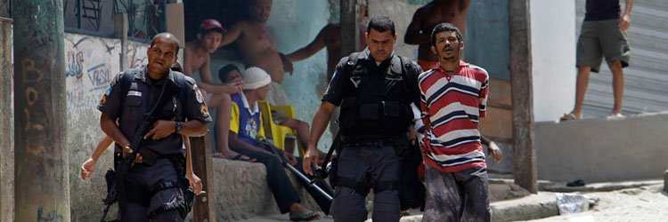
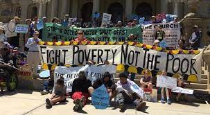
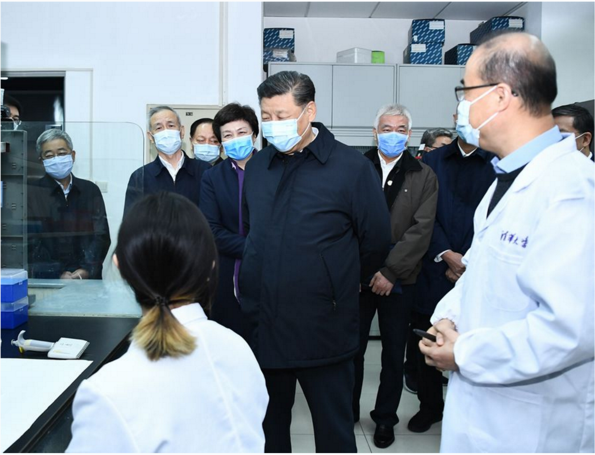

```{r setup, include=FALSE}
knitr::opts_chunk$set(echo = FALSE, message = FALSE, warning = FALSE)

if (!require(pacman)) install.packages("pacman")
library(pacman)

p_load(
  here, dplyr
) # data wrangling # data wrangling

xaringanExtra::use_xaringan_extra(c("tile_view", # O
                                    "broadcast", 
                                    "panelset",
                                    "tachyons"))

# Functions preload
set.seed(313)
```

## Overview

- Common paths of small-N analysis (SNA)
- Paradigm shift from LNA
- Conducting good SNA

---

class: inverse, bottom

# Common Paths of SNA

---

## A Review About N

.center[How large the N is large?]

--

.center[
\> 100 (LLN)    
\> 1000 (CLT)
]

???

Law of Large Numbers

Central limited therom

--

.center[Small N &#x225D; \[1~100\]]

--

.center[How about N = 0?] 

--

.center[
Formal modeling   
Political theory/philosophy
]

---

## Common Paths to Conduct SNA

1. Value judging
1. Story telling
1. Narrative analysis
1. Dramaturgical analysis
1. Category analysis

---

## Value Judging

.pull-left[
+ Identifying "communities of meaning"

+ Studying the framing and interactions among the communities
]

--

.pull-right[


]

???

Graham Tillett Allison Jr. , American political scientist and professor at the John F. Kennedy School of Government at Harvard

---

## Story Telling (Narrative Analysis)

Telling stories about a certain group or policy based on archives and interviews.


.pull-left[.center[]]
.pull-right[[《悬浮时代——异乡人的都市生存》](https://posts.careerengine.us/p/61ea44f44ab3963c8b7df873)
.small[
> 我想以“附近”（the nearby）作为研究框架，去深度描绘这些在我们日常附近中出现的打工者，他们是帮我们找房子的中介、为我们做家政的阿姨、给我们送外卖的外卖员、帮我们装窗户和做家具的建筑工人、在菜市场卖菜的菜贩、以及小区里值班的门卫保安等等。
这些人……我想通过这本书来记录这些陌生人的状态，以及每天生活在城市里，他们和我们之间会有什么样的交集，这样一种交集也是跟“真实的附近”产生亲密的关系，看到真实附近里具象的人是紧密联系在一起。真正的陌生人不会是完全和我们没有任何交集的。
]
]
???

Balay, Anne. 2018. Semi Queer: Inside the World of Gay, Trans, and Black Truck Drivers. UNC Press Books.

Winner of the Lambda Literary Emerging Writers Award. PhD students at University of Michigan’s American Culture.


---

## Dramaturgical Analysis

How do policy and policy makers "act"?

.pull-left[
+ "Actors"
+ "Content"
+ "Theme"
+ "Space"
]

--

.pull-right[

]

???

《耳朵大有福》（英文譯名：Lucky Dog）是一部2008年由中國和韓國合作拍攝的華語劇情片，是電影導演張猛的故事片處女作，也是其「東北三部曲」中的首部[1]，由范偉主演，講述了一位東北鐵路工人退休之後第一天的生活。影片在第11屆上海國際電影節上獲得了亞洲新人獎評委會特別獎。

在中國東北某小城鐵路局機務段修了四十多年火車的王抗美（范偉）迎來了退休的日子。這份「鐵飯碗」雖然不能為他帶來太豐厚的收入，卻一直讓他過著比上不足、比下有餘的生活，更是這位體制內職工在社交圈子中高人一等的資本。沉浸在「光荣退休」的喜悅中，老王最初對隨之而來的收入削減不以為意；然而，退休後的第一天，他就開始切身感受到生活的種種重負：抱病醫院的老伴（程淑波）仍無好轉跡象，每天的飲食起居都是不菲的開支；家境優渥的女婿（田雨）被女兒（賈瑟）撞破偷情，夫妻關係岌岌可危；試圖打零工補貼家用的老王先後探訪擦鞋女工、人力車夫、二人轉戲院老闆，卻接連鎩羽而歸，有一次更是誤入傳銷窩點而遭警察查扣。好強的老王終於被迫低下頭顱，攜禮物向鐵路局工會幹事（張珂）求助，然而又被告知他的氣管病不屬於工傷賠償範疇。這位以「抗美援朝」命名、並一直以曾在鐵路局宣傳隊領唱過《長征組歌》為豪的老工人，卻在舉國紀念長征勝利七十週年之際發現自己的生活已然舉步維艱。心灰意冷的老王要怎樣才能留住自己殘存的榮耀與尊嚴？

---

<iframe height="90%" width = "100%" src="//player.bilibili.com/player.html?aid=938325294&bvid=BV1nT4y1a7kX&cid=578731952&page=1&t=975" scrolling="no" border="0" frameborder="no" framespacing="0" allowfullscreen="true"> </iframe>

???

Stop at 17:16

---

### Category Analysis

+ Identity: Welfare recipients, official language...

--

+ Levels: Comprehensive strategic partners, strategic and cooperative partners, strategic partners, constructive cooperative partners...

???
Strüver, Georg. 2017. “China’s Partnership Diplomacy: International Alignment Based on Interests or Ideology.” The Chinese Journal of International Politics 10(1): 31–65.

--

+ Direction: Smart city, service-oriented government, neo-urbanization...

---

class: inverse, bottom

# Paradigm Shift: Interpretivist Approach

---

## Naturalism &rarr; Interpretivism

Philosophic roots: 

- From phenomenology to post-structuralism

???
Phenomenology: Edmund Husserl, reject the concept of objective research.
They believe that analyzing daily human behavior can provide one with a greater understanding of nature.

--

- From Discourse theory to Pragmatism

???

Discourse theory: Habermas, Foucault /fu:'kəu/
-  In our daily activities the way we speak and write is shaped by the structures of power in our society, and that because our society is defined by struggle and conflict our discourses reflect and create conflicts. 

Pragmatism: William James, Dewey
Considers words and thought as tools and instruments for prediction, problem solving, and action, and rejects the idea that the function of thought is to describe, represent, or mirror reality.

--

Public policy: .red[Not composed of a technical science]

- Story telling
- Local knowledge
- Democratic dialogue
- Argumentation

---

## Interpretivist Public Policy 

Methodologically,

.center[Quants vs. qualies]

--

Beyond methodology,

.center[
Reason: Globalization and .complexity

Goal: Unearthing major issues not methodology
]

--

Consequences: .red[*Deliberative*] policy analysis

.center[
1. Policies center on as .red[story telling]
1. Policies are .red[contestable]
1. Policymaking should be self-consciously .red[normative] 
1. Importance of .red[contextual] culture
1. Democratic .red[dialog] in policy making
1. .red[Performative] dimension of policy formation
]

---
class: center, middle

## Storytelling: Policy Narrative

Policies account for a field of .red[human beliefs and actions]

&uarr;

Not individual ideas but meaning holism

&uarr;

One belief, action, and practices is contingent upon    
other beliefs, actions, and practices

---

.center[]

--

A sign of social disintegration and loss of identity (democracy)?     
A reasonable and healthy symbol of civic pluralism?     
A strong feminist current?

--


> Women who wear the headscarf attach different meanings to it and respond to different motives (Bouchard-Taylor commission 2007)

???

The Bouchard-Taylor commission (named for its two co-chairmen), officially the Quebec Consultation Commission on Accommodation Practices Related to Cultural Differences, was created on 8 February 2007 by Quebec premier Jean Charest. Its mandate was to examine questions related to reasonable accommodation allowed because of cultural or religious differences in Quebec.

The commission was chaired by philosopher Charles Taylor and historian and sociologist Gérard Bouchard.

---

class: center

## Contestability

> Social realities and policies are debatable.

&uarr;

Expressive of some other rival set of meanings

???

让法治成为城市核心竞争力重要标志
——习近平法治思想引领上海全面依法治市再出发纪实

http://sh.people.com.cn/n2/2021/1116/c134768-35007058.html

2020年11月，《上海市公共卫生应急管理条例》正式施行，上海成为全世界首个将进入公共场所要戴口罩写入地方立法的城市。当时，乘坐地铁、公交等公共交通工具全程佩戴口罩已成为全体上海市民的共识，但立法者还是郑重地将其写入了法规……在习近平法治思想的引领下，上海全面依法治市稳步迈上新台阶。法治，正成为上海城市核心竞争力的重要标志……上海将依法保障人民权益作为全面依法治市工作的根本出发点。

---

## Ethical Engagement

> Legalizing abortions lowers crime rates across cultural groups and time periods because crime is tightly correlated with unwanted children, and unwanted children with criminality and other social ills.

Donohue, John J., III, and Steven D. Levitt. 2001. “The Impact of Legalized Abortion on Crime.” *The Quarterly Journal of Economics* 116(2): 379–420.

.center[]

???

What's the problem

---

class: center

Naturalist assumption: Human affairs are in principle manipulable.

--

"The poor are more likely to commit crimes"

&darr;

"The poor is the source of crimes"

&darr;

"Less poor kids, less source of crime"


--



???

北京市安委会回应“驱赶低端人口”：是在排查隐患

https://baijiahao.baidu.com/s?id=1585068230951214767&wfr=spider&for=pc

---


---

## Cultural Context

> Naturalists often make claims to .red[necessary causal bonds] that link two formal variables together as they migrate through highly heterogeneous cultural and historical contexts.

--

.pull-left[]

???

FBI 钓鱼执法抓市长

市长为了地方经济和黑手党合作建赌场

--

.pull-right[
Awareness of the matrices of beliefs

Avoiding the naive ethnocentrism/enthusiasm
]

---

## Dialog

> Naturalist assumption: policy elites have access to a specialized science of society that allows them to strongly predict outcomes.

.pull-left[]

.pull-right[]

???

Being Facilitator: reduce conflicts and generate cooperative behavior in the face of differences

---
class: small

## Performativity

Fischer, Frank, and John F. Forester, eds. 2013. *The Argumentative Turn in Policy Analysis and Planning*. Duke University Press.


> [Policy] analyses not only depicts but also constructs the issues at hand... policy-making is a constant discursive struggle over the criteria of social classification, the boundaries of problem categories, the .red[intersubjective interpretation] of common experiences, the conceptual framing of problems, and the definition of ideas.

--

.pull-left[]

???

They saw serious crime as the final result of a lengthier chain of events, theorizing that crime emanated from disorder and that if disorder were eliminated, then serious crimes would not occur.

--

.pull-right[]

???

Mayor Rudolph Giuliani in New York City were convinced that the aggressive order-maintenance practices of the New York City Police Department were responsible for the dramatic decrease in crime rates within the city during the 1990s. Police Commissioner William Bratton began translating the theory into practice as the chief of New York City’s transit police from 1990 to 1992. Squads of plainclothes officers were assigned to catch turnstile jumpers, and, as arrests for misdemeanours increased, subway crimes of all kinds decreased dramatically. 

When Bratton resigned in 1996, felonies were down almost 40 percent in New York, and the homicide rate had been halved.

---

class: middle, center, large

## So What: Foci of SNA

Role    

Data collection   

Analysis    

---

## Role

.pull-left[]
.pull-right[]

.pull-left[
Researchers are .red[human]
+ Experiences
+ Cognitive differences
 ]
 
???

Cognitive differences: men and women; allowing tourists entering the campus
--

.pull-right[
Researchers .red[participate]
+ Observer vs. Insider
+ Undercover vs. Activist
]

???

Researchers generalize/create culture, etc.

--

.center[Researchers have .red[value]]

---

## Data Collection

Observing with intention to .red[understand];

???

1. Pader, Ellen-J. 1994. “Spatial Relations and Housing Policy: Regulations That Discriminate Against Mexican-Origin Households.” Journal of Planning Education and Research 13(2): 119–35.

Using American view of occupancy (and thus housing policy enforcement) is discriminated.

--

Interviewing with respondents as .red[conversational partner];  

???

2. Schaffer, Frederic Charles. 2000. Democracy in Translation: Understanding Politics in an Unfamiliar Culture. Cornell University Press.

Interview of people in Senegal about democracy and American democracy

--

Reading the documents as they were writing .red[meaningfully].

???

3. Chock, Phyllis Pease. 1995. “Ambiguity in Policy Discourse: Congressional Talk about Immigration.” Policy Sciences 28(2): 165–84.

By examining the written record of spoken language, she was able to analyze the ways in which legislators’ and expert witnesses’ embedded ideas about immigrants reflected and shaped immigration reform and policy contentions.

---

## Analysis

.bg-black.golden.ba.shadow-5.ph4.mt3[
.center[
No need to transform words into numbers
]
]


+ Numbers are not the results but the sources

--

+ More details than digits

???

Narrative reports often read like novels.

--

+ Focusing on:  

1. Where did the number or whatever data come from
1. Where to find the data, what are data, how to know what are saying in the data?...

???

Analysis and collection are intertwined.

---

## What SNA Is A Good SNA

---

## Evaluating SNA

.pull-left[

~~Be objective~~

Reality is universal;   
Policy is not constructed.
]

--

.pull-right[

~~Be voiceless~~  

]

???

Simone de Beauvoir (西蒙尼·德·博瓦尔), The Second Sex, gender is constructed.

One is not born a woman, but becomes one.

--

.pull-left[

~~Be experimental~~

The SNA assumes impacts and multicausality are data and useful.

]

--

.pull-right[
~~Be replicated~~

]

???

Despicable Me 3

---

.center[

~~Be generalized~~

]

???

杨奇函：清华大学经管学院

许吉如：清华大学法学院

---

## Novel Evaluation System

+ Credibility
+ Transferability
+ Dependability
+ Confirmability

---

## Credibility

.center[]

???

If the data and implications are presented credibly.

Based on enough description

---

## Transferability

> 当年的SARS也属于冠状病毒，公众容易将二者相类比。当年在应对SARS的过程中，我们是有过教训的。这就提醒我们，千万不可产生轻敌心态和麻痹思想，更不能犯下和当年一样的错误。  
---"尽快掐灭疫情传播的'火种'"《人民日报客户端》（2020-01-22）

--

Readers' call, though.

???

a result of detailed, illustrative description, and the responsibility shifts from the researcher (the sender) to individuals in other settings (the receivers)

https://wap.peopleapp.com/article/5060699/4954813

--

## Dependability

Legit process of inquiry

+ What kinds of data, what period of time? 
+ Over a determined period of time, or simply one visit and a few interviews?  
...

---

## Confirmability

.center[]

???

There's an alternative set of criteria which is more philosophical,

Morrow, Susan L. 2005. “Quality and Trustworthiness in Qualitative Research in Counseling Psychology.” Journal of Counseling Psychology 52(2): 250–60.

--

Findings clearly linked to analysis, data, and the research site.

---


## Why Is SNA Not that Popular (for Now)

.center[Goal:   
**Subjective over "objective"**]

--

.center[Sources:    
**Deep over structural**]

--

.center[Design:   
**Creative over systemic**]

--

.center[Analysis:   
**Arts over skills**]

--

.center[Implications:   
**Complex/real over clear/causal**]

---

background-image: url("images/small_mindmap.png")
background-position: center
background-size: contain

## Take-Home Points

---

## Procedure

.pull-left[
### Presenting (10min)

The presenters talk.

### Challenging (10min)

Drawing the Luck Dog


]

.pull-right[

*Process*

1. Presenters query.
    - A question about the paper
1. Challengers respond.
1. Challengers query.
    - A question about the presentation
1. Presenters respond.
]

---


background-image: url("images/cha_challenge.gif")
background-position: center
background-size: contain

```{r pdfPrinting, eval = FALSE, include = FALSE}
pagedown::chrome_print(list.files(pattern = "12_.*.html"), timeout = 300)
```