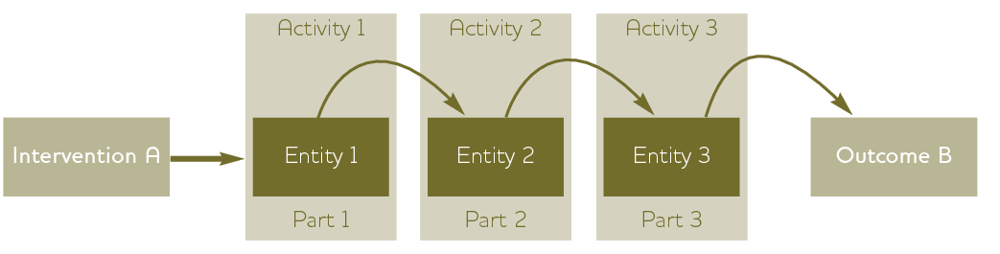
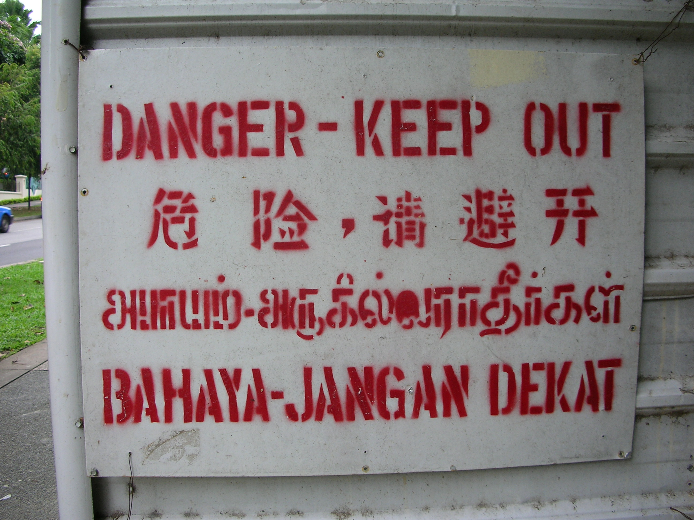
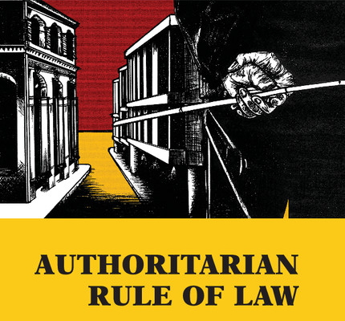
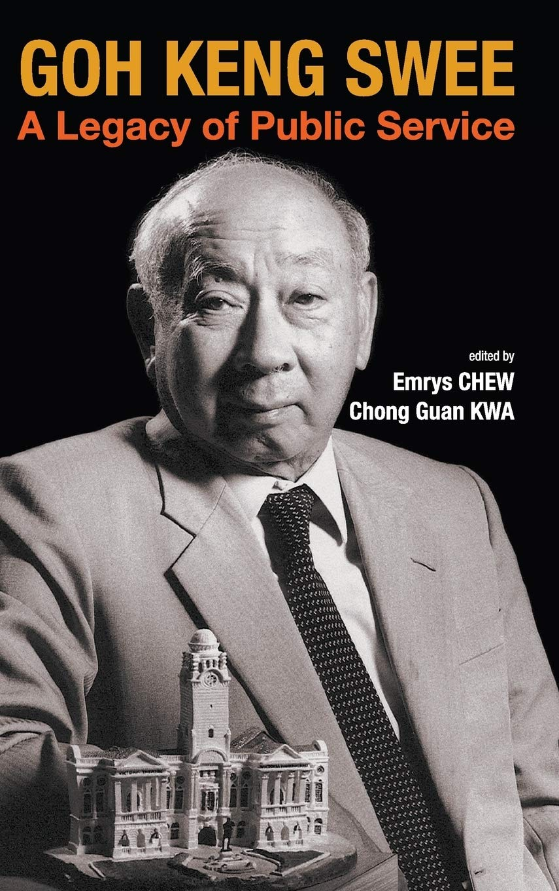

```{r setup, include=FALSE}
knitr::opts_chunk$set(echo = FALSE, message = FALSE, warning = FALSE)

if (!require(pacman)) install.packages("pacman")
library(pacman)

p_load(
  here, dplyr, kableExtra
) # data wrangling # data wrangling

xaringanExtra::use_xaringan_extra(c("tile_view", # O
                                    "broadcast", 
                                    "panelset",
                                    "tachyons"))

# Functions preload
set.seed(313)
```

## Overview

+ Process tracing
+ Interview
    + Focus group
+ Content analysis

---

background-image: url("images/process_crimeBoard.webp")
background-position: bottom
background-size: 90%

## Process Tracing

> A research method for tracing causal mechanisms using .red[detailed, within-case] empirical analysis of how a causal mechanism operated in real-world cases. (Beach & Pedersen 2019)

???

Crime board


---

## Operating a Process Tracing

Goal : Theory testing

Hypothesis: Examining explanation rivalries

--

Operation:




---

## Example: English Recognition in Singapore

Theoretical question:
- Language recognition

Empirical puzzle:
- English is an official language of Singapore, but only **21% of the population** spoke this language when the country was independent.

.pull-left[.center[]]

--

.pull-right[
Research Question:
- Why did English become an official language of Singapore?
]


---

## Step 1: Identify Hypotheses

.pull-left[
H<sub>0</sub>: State (institutional) capacity  


]

--

.pull-right[
H<sub>1</sub>: Prioritization of the education ministry

.center[]
]
???

Goh Keng Swee (吴庆瑞): 财政部长、内政及国防部长、副总理, 奠定了新加坡教育的精英主义政策, 取得伦敦政经学院经济学博士学位。

The Goh Report identified and set out recommendations to address three shortcomings: high education wastage, low literacy, and ineffective bilingualism. English was taught to maximize proficiency

---

background-image: url("images/timelineEnglish.jpg")
background-position: center
background-size: contain

## Step 2: Establish Time Line


???

1. The very second step right after determining the DV
1. Before the evidence collection

---

## Step 3: Construct Causal Graph

.center[]

???

Causal process of X &rarr; Y  
Used to identify relevant moments and actors that could affect the results.

---

## Step 4: Identify Alternative Choice or Event
## Step 5: Identify Counterfactual Outcomes

Counterfactual 1: Weak State &rarr; language of the dominant population language.

Counterfactual 2: Leed did not assign Goh as the MOE &rarr; the status quo.

???

A reason that choices might make differences  
If there's no comparative cases, then conterfactual outcomes.


---

class: center, middle

## Step 6: Find Evidence for Primary Hypothesis<sup>&midast;</sup> 

| .small[Necessity\\Sufficiency]| Yes             | No                |
|-----------------------|-----------------|-------------------|
| Yes                   | Double-Decisive | Smoking Gun       |
| No                    | Hoop (No alibi)            | Straw-in-the-Wind |

.footnote[
&midast; Evera, Stephen Van. 1997. *Guide to Methods for Students of Political Science*. Ithaca: Cornell University Press.
]

???

1. Hoop test: no alibi, the accused in the state when murder happens? If not innocent, but passing does not mean being guilty.
1. Smoking-gun test: a smoking gun seen in a suspect's hand moments after a shooting is quite conclusive proof of guilt, but a suspect not seen with a smoking gun is not proven innocent.
1. Double-decisive test: hoop + smoking-gun, like a camera record
1. Straw-in-the-wind test: Richard Liu seemed friendly with the girl.

---

## What Type of Evidence This IS? 

<iframe height="80%" width = "100%" src="//player.bilibili.com/player.html?aid=340625924&bvid=BV1z94y1d7Jk&cid=576028946&page=1&t=1475" scrolling="no" border="0" frameborder="no" framespacing="0" allowfullscreen="true"> </iframe>

???

对谁提供了什么证据


白手套，蝙蝠侠父亲是罪犯, smoking-gun

---

## What Type of Evidence This IS? 

<iframe height="80%" width = "100%" src="//player.bilibili.com/player.html?aid=340961043&bvid=BV14R4y1K7Kq&cid=581750449&page=1&t=273" scrolling="no" border="0" frameborder="no" framespacing="0" allowfullscreen="true"> </iframe>

???

Hoop


---

## What Type of Evidence This IS? 

<iframe height="80%" width = "100%" src="//player.bilibili.com/player.html?aid=884604227&bvid=BV1bK4y1a7pn&cid=235177797&page=1&t=273" scrolling="no" border="0" frameborder="no" framespacing="0" allowfullscreen="true"> </iframe>

???

Straw in the wind, 知乎有贴说女子与L某一路挽着回屋，中间没有强迫行为


---

background-image: url("images/process_evidenceEnglish.png")
background-position: center
background-size: contain

???

The primary hypothesis failed the hoop test: when recognition happened, the state was not a strong state

---

background-image: url("images/process_map.png")
background-position: center
background-size: contain

---

## Interview

.center[]


.center[.normal[A .red[strategic] communication (guiding and listening)]]

---

### How a Interview Processes

<video width="700" height="500" controls>
    <source src="https://link.jscdn.cn/1drv/aHR0cHM6Ly8xZHJ2Lm1zL3YvcyFBcnR0dk83MHdLSU8xSEdDS2ItLV9xMk5CYndpP2U9aEg3V011.mp4" type="video/mp4">
</video>

???

Brexit: The Uncivil War  

Benedict Cumberbatch as Dominic Cummings, main political strategist for Vote Leave, 

---

.pull-left[
### Outcomes: 
+ Open answers
+ Messy details
+ Contradictory points
]  

--

.pull-right[
### Set-up
+ Safe environment
+ More listening, less talking
+ Design the interview strategy + pilots
]

--

.center[
### Be Prepared...


]

---


## Focus Group

Procedure:

1. Size: 5--15 interviewees
1. Subjects read or watch something.
1. Researcher ask the questions.
1. Subjects express the feelings and opinions.

--

.pull-left[
### Pros:

1. Real-life environment
1. Flexibility
1. Low cost
]

--

.pull-right[
### Cons:

1. Non-privacy-protection
1. Who lead the talk?
1. No SUTVA
1. Selection interviewees
]

---

## How Focus Group Works

<video width="700" height="500" controls>
    <source src="https://link.jscdn.cn/1drv/aHR0cHM6Ly8xZHJ2Lm1zL3YvcyFBcnR0dk83MHdLSU8xSEpWNnJNTlYtTEtmMXFjP2U9aDZFWWRJ.mp4" type="video/mp4">
</video>


???

Brexit: The Uncivil War  

Rory Kinnear as Craig Oliver, the former Director of Politics and Communications for British prime minister David Cameron


---

## Content/Discourse Analysis

.center[]

---

## Step 1: Content Sampling

* Terminology:
    + Content analysis: 100 and below
    + Text analysis: above 100 (usually above 1,000)
    + Unit of analysis?

--
    
* Sampling technique
    + Convenient sample
    + Stratification
    + Clustering

--

## Step 2: Coding

* Manifest content
* Latent content
* Online assistance: [CATMA](http://catma.de/) or eMargin

---

## Example with CATMA

.center[]

---

.pull-left[]


.pull-right[

## Step 3 Analysis

Not much different from other interpretive methods

1. Context
1. Transparency
1. Transferability

.pull-left[
### Pros

* Economic
* Allowing correction
* Overtime survey
* Third party
]

.pull-right[
### Cons

* Limited content
* Limited scale
* Subjective consistency
]

]

---

background-image: url("images/process_mindmap.png")
background-position: center
background-size: contain

## Take-Home Points

---


background-image: url("images/cha_challenge.gif")
background-position: center
background-size: contain


```{r pdfPrinting, eval = FALSE, include = FALSE}
pagedown::chrome_print(list.files(pattern = "14_.*.html"), timeout = 300)
```