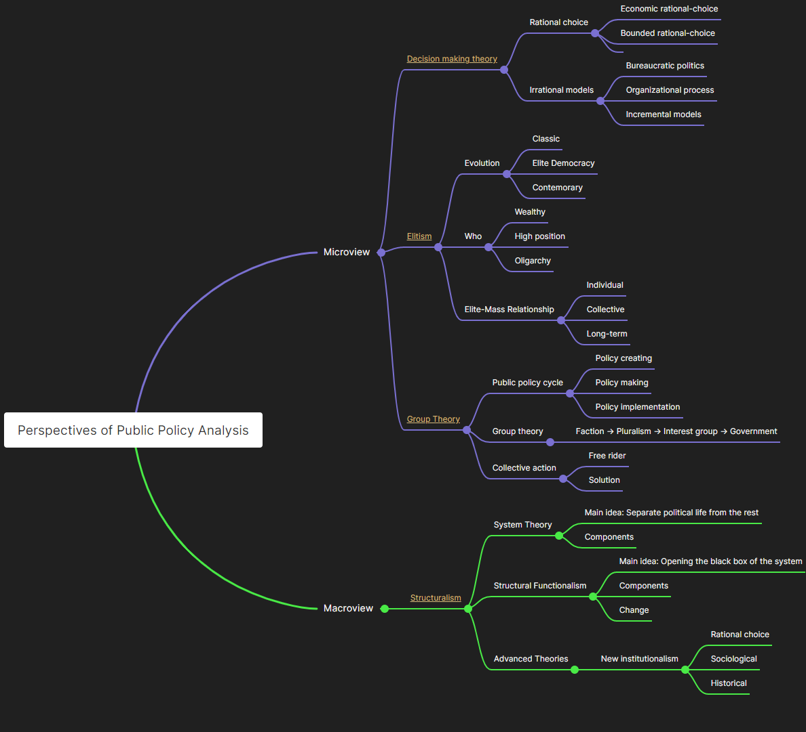

```{r setup, include=FALSE}
knitr::opts_chunk$set(echo = TRUE)

library(pacman)
p_load(tidyverse, lubridate)

# Opening Date
start <- ymd("2022-02-21")

# Final Week
end <- start + dweeks(15) 

schedule <-
  data.frame(day = seq(from = start, to = end, by = "days")) %>%
  mutate(day = ymd(day),
         weekDay = wday(day, week_start = 1)) %>% # get the relative week number
  filter(weekDay == 1) %>% # only keep Monday
  mutate(weekNum = 1:16, topic = NA, translation = NA)

# Schedule exchange due to Holiday

schedule$day[schedule$day == ymd(20220502)] <- ymd(20220506)

# Holiday
tombSweep <- ymd(20220403)%--%ymd(20220405)
laborDay <- ymd(20220430)%--%ymd(20220505)
dragonBoat <- ymd(20220603)%--%ymd(20210603)


schedule$topic[schedule$day %within% list(tombSweep, laborDay, dragonBoat)] <- "Public Holiday"
schedule$translation[schedule$day %within% list(tombSweep, laborDay, dragonBoat)] <- "哗啦啦，放假啦！"

# Schedule
content <- tibble::tribble(
    ~ topic,
    ~ translation,
    "Introduction",
    "课程介绍",
    "Approach: A Scientific View",
    "科学视角下的政策分析",
    "Perspective: Decision-Making Theory",
    "视角：决策过程理论",
    "Perspective: Elitism",
    "视角：精英理论",
    "Perspective: Group Theory",
    "视角：团体理论",
    "Perspective: System Theory",
    "视角：政治系统理论",
    "Perspective: Functionalism",
    "视角：结构功能主义",
    "Method: Experimental Logic",
    "方法：实验逻辑",
    "Method: Survey and Large-N",
    "方法：调研与大样本分析",
    "Method: \"Big Data\"",
    "方法：大数据分析",
    "Method: Small-N",
    "方法：小样本分析",
    "Method: Case Study",
    "方法：案例分析",
    "Method: Interpretive Analysis",
    "方法：解释性分析",
    "Student Presentation",
    "期末项目报告",
    "Professionalization",
    "如何在一个周末完成一篇B+以上论文"
  )

schedule$topic[is.na(schedule$topic)] <- content$topic
schedule$translation[is.na(schedule$translation)] <- content$translation

schedule$topic[nrow(schedule)] <- content$topic[nrow(content)]
schedule$translation[nrow(schedule)] <- content$translation[nrow(content)]

schedule <- select(schedule, day, weekNum, topic, translation) %>% 
  mutate(caption = paste0("第", schedule$weekNum, "周 (", schedule$day, "): ", schedule$translation, " (", schedule$topic, ")"))

```

<center></center>


Welcome to the lecture sources for the *Analysis of Public Policy*. Learn how to analyze public polices with Dr. Hu.


<center></center>


<br><br>

<ul>

* <a href="/slides_gh/slides/courses/analysisOfPublicPolicy/01_courseIntro.html">`r schedule$caption[1]`</a>
* <a href="/slides_gh/slides/courses/analysisOfPublicPolicy/02_scientific.html">`r schedule$caption[2]`</a>
* <a href="/slides_gh/slides/courses/analysisOfPublicPolicy/03_decisionMaking.html">`r schedule$caption[3]`</a>
* <a href="/slides_gh/slides/courses/analysisOfPublicPolicy/04_elitism.html">`r schedule$caption[4]`</a>
* <a href="/slides_gh/slides/courses/analysisOfPublicPolicy/05_groupTheory.html">`r schedule$caption[5]`</a>
* <a href="/slides_gh/slides/courses/analysisOfPublicPolicy/06_systemTheory.html">`r schedule$caption[6]`</a>
* `r schedule$caption[7]`
* <a href="/slides_gh/slides/courses/analysisOfPublicPolicy/07_functionalism.html">`r schedule$caption[8]`</a>
* <a href="/slides_gh/slides/courses/analysisOfPublicPolicy/09_experiment.html">`r schedule$caption[9]`</a>
* <a href="/slides_gh/slides/courses/analysisOfPublicPolicy/10_largeN.html">`r schedule$caption[10]`</a>
* <a href="/slides_gh/slides/courses/analysisOfPublicPolicy/11_bigData.html">`r schedule$caption[11]`</a>
* <a href="/slides_gh/slides/courses/analysisOfPublicPolicy/12_smallN.html">`r schedule$caption[12]`</a>
* <a href="/slides_gh/slides/courses/analysisOfPublicPolicy/13_case.html">`r schedule$caption[13]`</a>
* <a href="/slides_gh/slides/courses/analysisOfPublicPolicy/14_Process.html">`r schedule$caption[14]`</a>
* `r schedule$caption[15]`
* <a href="/slides_gh/slides/courses/analysisOfPublicPolicy/16_professional.html">`r schedule$caption[16]`</a>

</ul>