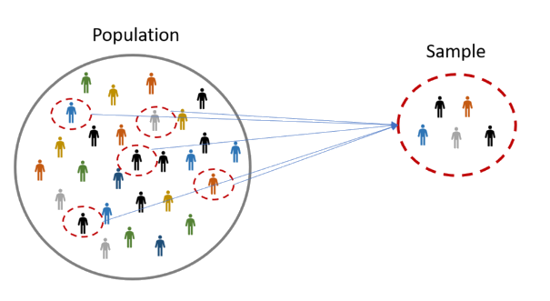
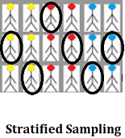
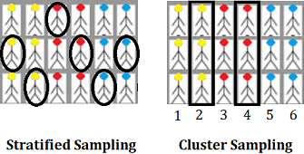
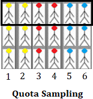
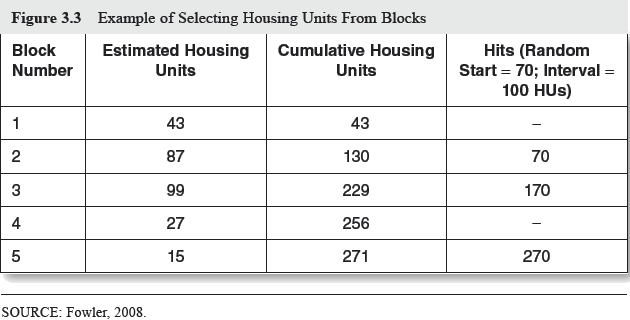
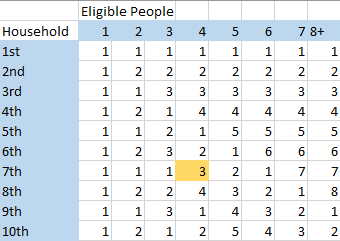

```{r setup, include=FALSE}
knitr::opts_chunk$set(echo = FALSE, message = FALSE, warning = FALSE)

if (!require(pacman)) install.packages("pacman")
library(pacman)

p_load(
  emo
) # data wrangling # data wrangling

xaringanExtra::use_xaringan_extra(c("tile_view", # O
                                    "broadcast", 
                                    "panelset",
                                    "tachyons"))

# Functions preload
set.seed(313)
```


class: center

## Sampling



--

Research can be done

--

Results can be generalized

--

Findings can be evaluated/falsified/replicated

---

## Method of Sampling

.pull-left[
### Probability Sampling

1. Simple random ~
1. Systematic ~
1. Stratified ~
1. Cluster ~
]

.pull-right[
### Non-probability Sampling

1. Convenience ~
1. Quota ~
1. Voluntary response ~ 
1. Purposive ~
1. Snowball ~
]

???

Systematic sampling: Every member of the population is listed with a number, but instead of randomly generating numbers, individuals are chosen at regular intervals.

--

.center[
.normal[
Probability sampling is better than non-probability sampling?     
Not necessarily🙅️
]
]

---

class: center, middle, normal

## Key Aspect for Sampling Method Choice

Sample frame

Sampling procedure

Sample design   
(including size and other features)

---

## Sample Frame

> A comprehensive listing or description of units, e.g., people or
business, who have a chance to be selected into the sample.

A.k.a., the "population"

--

**Source:**

- A more or less complete list of individuals in the population 

--

- A set of people who go somewhere or do something that enables them to be sampled

--

- Addresses or housing units (.red[most common])

---

## Right Sample Frame?

.bg-black.golden.ba.shadow-5.ph4.mt3[
.center[
GOLDEN RULE

Getting the people you want, and getting rid of the rest.
]
]


**Evaluation**

- Comprehensiveness relative to the population of interest
    - Are we missing anyone?
- Probability of selection
    - Do we know the chance each people that is included?
- Efficiency of getting the target population
    - Do we have people we don't need?

---

## Sampling Procedure

According to statisticians, the ideal sample should be generated by .red[random probability sampling]. 

All units have the same probability to be select.

&rArr; No other factors impact the selection except for the random assignment.

---

## How to Select A One-Stage Sample

e.g., Drawing a random sample of 100 from a sample frame of 1,140

.panelset[

.panel[.panel-name[Simple random sampling]
Method I:

1. Number all 1,140 units in the sample frame;
1. Use a list of 100 random numbers to choose the sample.

Method II:
1. Order the 1,1400 units of the sample frame randomly;
1. Choose the first/last/middle/... 100 units.

*Pros & Cons*: Straightforward but tedious.
]

.panel[.panel-name[Systematic sampling]
1. Divide sample size by sample frame size: 100/1140 &approx; 1/11
1. Pick a random person as the starting point
1. Proceed to take every 11th person on the list.

*Pros & Cons*: 
- Same precision as a simple random sampling yet more efficient;
- Ordering items in the sample frame may cause problems.
]

.panel[.panel-name[Stratified sampling]
1. Exploring the distributions of a few population characteristics;
1. Dividing the sampling frame into groups and conduct simple random sampling within each group.

.pull-left[.center[]]
.pull-right[
*Pros & Cons*:
- Ensure that the exactly same proportions as the whole population;
- Increased precision of estimates of stratification variables.
]

]

]


---

class: middle, center

## Multi-Stage and Nonrandom Sampling

.center[


]

???

Stratification: 分类，每类中随机抽取，每类成员在总体中配比不变        
Clustering：直接随机抽取一类        
Quota：成分配比够就行，不用随机


--

Post-DGP correction, a.k.a., weighting (See slides in 政务大数据应用与分析[80700673])

---

## Area Probability Sampling



---

## Methods

1. Address-list random drawing

--

1. GPS random sampling

--

1. Random-Digit Dialing (RDD)<sup>*</sup>
    - Approach I
        1. Draw randomly generated, four-digit numbers from telephone exchanges respectively; 
        2. Dial these numbers.
        - Disadvantages: unfruitful calls.
    - Approach II
        - Drawing a list of available phone numbers
        - Cost effective and efficient, advance notice, a known chance of selection.


.footnote[<sup>*</sup> RDD also stands for regression discontinuity design in causal inference.]

---

## Respondent Selection

.pull-left[
Depends on what information you need

- Info about the household? Head or primary member of the household.
- Specialized info, e.g., gender, education, senior? Corresponding members
- Self-reporting info
    - A list of household members &rarr; randomly draw
    - Last birthday method
    - The initial or eligible adults
]

--

.pull-right[

.center[
**Kish Grid**

]
]

???

Developed by statistician Leslie Kish in 1949.

---

## Nonresponse

- Most of the time, most of your sample will decline to participate. 

--

- Response rate &prop; responding people/sampled people
    - Actually, more complicated, see [AAPOR method](https://www.aapor.org/Education-Resources/For-Researchers/Poll-Survey-FAQ/Response-Rates-An-Overview.aspx)
    
--

- Reasons: refusals, language problems, illness, or lack of availability, etc. 

--

- Problems
    - How many & who
    - Nonresponse effect varies across variables
    - A low nonresponse rate unnecessarily means low quality data, but it does suggest that you should explore features among the responses.
        - Comparing the key characteristics between who answer and decline the answers

---

## Reducing Nonresponses

- Repeated attempts at contact plus reminders;
- Multiple modes of contact, e.g., a letter, phone call, social media; 
- Personal message to the respondent from the researcher;
- Professional and clear directions and survey tasks;
- *Providing incentives (modest but appropriate for the survey task)---both pre- and post-response* 
- Staggering contact attempts over days and times of day.

--

- Good news: Response rates have been declining over years

---


background-image: url("images/sample_mindmap.png")
background-position: center
background-size: contain

## Wrap Up