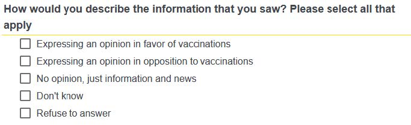
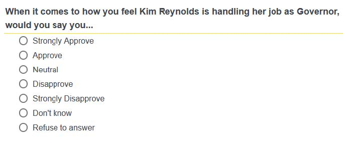
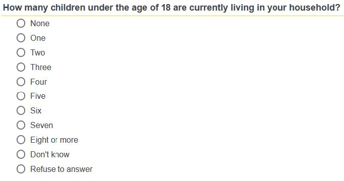
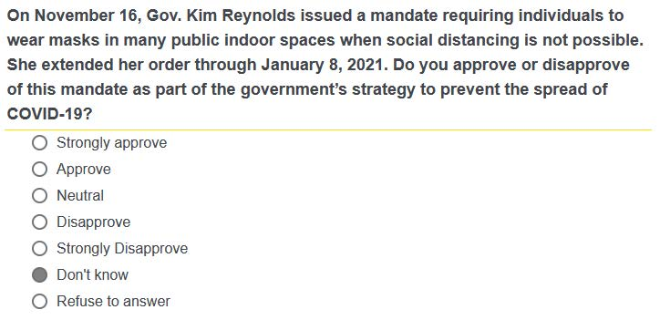
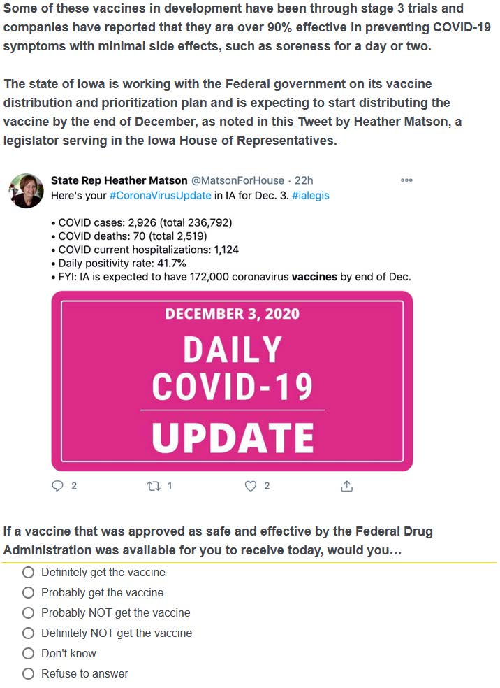
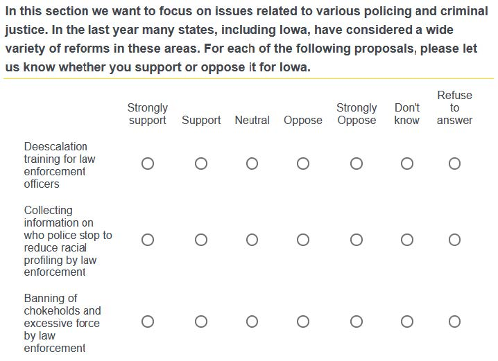
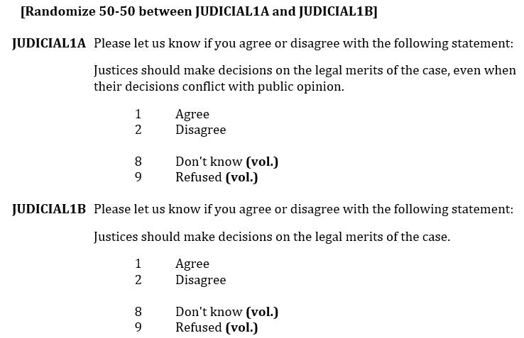

```{r setup, include=FALSE}
knitr::opts_chunk$set(echo = FALSE, message = FALSE, warning = FALSE)

if (!require(pacman)) install.packages("pacman")
library(pacman)

p_load(
  emo
) # data wrangling # data wrangling

xaringanExtra::use_xaringan_extra(c("tile_view", # O
                                    "broadcast", 
                                    "panelset",
                                    "tachyons"))

# Functions preload
set.seed(313)
```

## Overview

- Concept &rarr; Questions
- Principle: Validity
- Close-Ended Question Design
- Evaluation and Testing Instrument

---

class: inverse, bottom

# Concept &rarr; Questions

---

## Elements of Definition

1. The variation within a .red[measurable characteristic] or set of characteristics
2. The subjects or groups to which the concept .blue[applies]
3. How the characteristic is to be .green[measured]

The concept of .red[economic liberalism] is defined as the extent to which .blue[individuals] exhibit the characteristic of .green[supporting government spending for social programs].

*A workable template*:

The concept of \_\_\_\_\_ is defined as the extent to which \_\_\_\_\_ exhibit the characteristic of \_\_\_\_\_.

Ref. Measurement error

???

Pollock, Philip H., and Barry Clayton Edwards. 2019. The Essentials of Political Analysis. 6th edition. Washington, D.C: CQ Press.

Given by the answer not who answer, systematic error and random error


---

*Before designing a question, ask yourself:*

.center[
What are the concept’s concrete properties? 

How do they help define opposite ends of the scale?

]

--

- Properties must vary across units (individuals, communities, states, etc.)
- Narrow down your list to focus on core concepts rather than on associated features.
- Does your definition include multiple dimensions, i.e., distinct groupings that may not overlap?


---

background-image: url("images/ques_concept.jpg")
background-position: center
background-size: contain

---

## Concept &rarr; Measurement

*Level of Measurement* 

+ Nominal/categorical
+ Ordinal
+ Interval


There are also other categories, such as ratio. 

Learn more in *Analysis of Political Data* (70700173).

???

feeling thermometer: 0-200，冷淡到热情, 0是非常极端的情绪，不代表没有, so an interval;
-100-0-100， 0代表0的意思，ratio 是唯一一种scale可以表示meaningful ratio

Ratio: the ratio of two points on the scale conveys the same meaning regardless of where one is on the scale
e.g.1, Public budget, safty:health = 4:1 then no matter how much in total, it will 4:1
e.g.2, event history

---

## Learning about the Data

*Descriptive statistics*

+ Raw data
+ Frequency distribution: 
  n<sub>i</sub>, n<sub>.</sub> = &sum;n<sub>i</sub>, n<sub>..</sub> = &sum;n<sub>ij</sub>

--

+ Histogram
+ Time series plots, scatter plots

--

+ Percentiles
+ Moments

???

Information lost increasingly more

---

## A Professional Descriptive Table

```{r descriptive}
library(modelsummary)

df_mtcars <- mtcars
df_mtcars$vs <- as.logical(mtcars$vs)
df_mtcars$cyl <- as.factor(mtcars$cyl)

datasummary_skim(df_mtcars[,1:6])
datasummary_skim(df_mtcars, "categorical")
```


---

class: inverse, bottom

# Validity

---

## Validity Is the Sole Criterion for Question Designs

Validity means the collected data produce info .red[that you want].

In the survey context:

> Valid: Answers corresponding to what they are intended to be measured

--

In the terminology of concept:

> The extent to which a question (or other measure) captures the true value of the intended .red[characteristic] and does not measure any unintended characteristics.

- Face validity
- Construct validity    
......

.footnote[
See 胡悦. “实验室实验：政治科学研究的一种有效方法?” 《国外理论动态》, no. 06 (2021): 160–71.
]

???

▶ Face validity: does an informed expert believe the concept
measures what it claims?
▶ Construct validity: does the measure relate to other
measures/concepts as we expect?

---

Validity is straightforward for fact questions (e.g., "are you vaccinated" or "how old are you") but harder to assess attitudes.

(Unfortunately, survey is still the best way, so far.)

???

Biological signals can give you the reflection but not the attitudes; and they are too simple for complex attitudes.

--

- Validity of objective facts
- Validity of subjective states.

---

## Objective-Fact Validity

Why do you receive inaccurate answers:

1. Do not understand the question
2. Do not know the answer
3. Cannot recall it although they do know it
4. They don't want to report the answer in the interview context: social desirability

Principles of solutions:

- Minimize a sense of judgment
- Use self-administered data collection procedures
- Confidentiality and anonymity

???

Self-administered means that a respondent simply is given a set of questions to answer in a booklet

---

## Subjective-State Validity

High validity &larr;

- No External criterion
- Relativity matters

--

Techniques:

- Make the questions as reliable as possible
- Have more categories than fewer
- Ask multiple questions and combine the answers into a scale


---

## Reliability

.center[Reliability is necessary condition/signal for validity.]

> Being Reliable: Providing .red[consistent] measures in comparable situations.

--

In the terminology of concept, 

> How consistently a question (or other measure) captures its associated concept

Testable property: Test-retest, split-half method, alternative-form, or inter-item consistency measures (e.g., Cronbach's alpha).

---

## Designing Reliable Questions

Basic principles: 

- Use the .red[same] wording and script for all respondents;
- Avoid poorly .red[defined] phrases or those with multiple meanings;
- Avoid complicated definitions, lengthy phrasing, and use .red[plain] language;
- Be .red[specific] about time periods and context;
- .red[One concept] a time.

--

.center[Close-end questions usually work better open-end ones.]

---

## Wording

Problems you may have:

.left-column[
### Inadequate
]

.right-column[
How do you feel about Zijing Dining Hall?
]

--

.right-column[

About what of Zijing, the food, service, decoration, organization, or other stuff? 

]

---

## Wording

Problems you may have:

.left-column[
### Inadequate
### Incomplete
]

.right-column[
.center[
Age? 

vs. 

What's your age on your last birthday?
]
]

---

## Wording

Problems you may have:

.left-column[
### Inadequate
### Incomplete
### Poor
]

.right-column[
I would like you to rate different features of your neighborhood as very good, good, fair, or poor. Please think carefully about each item as I read it.

1. Public schools
2. Parks
3. Public transportation
4. Other

]

???

You are asking a respondent's cognitive calculations to understand the question

---

## Wording

Problems you may have:

.left-column[
### Inadequate
### Incomplete
### Poor
]

.right-column[

Better version:

I am going to ask you to rate different features of your neighborhood. I want you to think carefully about your answers. How would you rate (FEATURE) – would you say very good, good, fair, or poor?

The interviewer would sequentially insert each item in the following list until all four questions had been asked.
1. Public schools
2. Parks
3. Public transportation
4. Other

]


---

## Ambiguity

Multiple meanings

> Do you favor or oppose the zero-COVID policy?


???

What do you mean favor?

What zero-COVID? Absolute zero-covid, dynamic zero-covid?

--

.center[vs.]

> The zero-COVID strategy is a "control and maximum suppression" strategy. It involves using public health measures such as contact tracing, mass testing, border quarantine, lockdowns and mitigation software in order to stop community transmission of COVID-19 as soon as it is detected. The goal is to get the area back to zero new infections and resume normal economic and social activities. Would you oppose or support policy like that?

---

Nonspecific

> How much do you trust your team partner?

???

What do you mean by trust? 

Would that be helpful if you define trust as in the previous case?

Not much, the definition is still

--

.center[vs.]

> Your partner asks you for investing a financial project and s/he ensures you that it would at least get your principal back. Now, if you have $1000, how much would you borrow her/him?

???

Trust about important decisions

---

## Special Case: Don't Know

Why do people answer "don't knows"?

1. The respondents actually do not know the answer;
1. The respondents do not care about the answer;
1. The respondents are unwilling to answer 

--

Potential solutions:

- Pre-estimate the familiarity of the question;
- Rely on volunteer "don't know";
- Using sensitive-question techniques.

---

## Special Case: Causal Questions

.center[Why do you marry that guy/gal?]

> Because s/he is awesome!

> Because s/he loves me!

> Because I do not want to be a leftover.

--

Potential solution: Close question

- Provide a list of answers
- Make sure the question elicit the appropriate responses

E.g., what characteristics of the one you marry led you to marry her/him?

???

If you elicit a response or a reaction, you do or say something which makes other people respond or react.

---

class: inverse, bottom

# Close-Ended Question Design

---

## Close-Ended vs. Open-Ended

.pull-left[
**Close-ended**

Amenable to data-based analysis, e.g., frequencies and means

*Output*

- Interval: Ordered and numerically meaningful

- Ordinal: Ordered yet numerically meaingless

- Nominal: Non-ordered

]

.pull-right[
**Open-ended**

Harder to interpret, but providing nuanced and detailed feedbacks

*Output*

Grouped, coded, text analysis


At least a few of these

]

---

## Quiz

.center[
*Type of Response Scale?*


]

???

Nominal

---

## Quiz

.center[
*Type of Response Scale?*


]

???

Nominal


---

## Quiz

.center[
*Type of Response Scale?*


]

???

Nominal


---

## Quiz

.center[
*Type of Question?*


]

???

Nominal

---

## Quiz

.center[
*Type of Question?*


]

???

likert

---

## Quiz

.center[
*Type of Question?*


]

???

likert

---

## Quiz

.center[
*Type of Question?*


]

???

matrix

---

## Quiz

.center[
*Type of Question?*


]

???
 
experiment

---

## Types of the Close-Ended

Likert scale: 5--7 options, typically symmetric (not necessarily)
- strongly agree, somewhat agree, neither agree nor disagree, somewhat disagree, strongly disagree.

--

Other scales: 1--10, 1--100, sliders

--

Multiple choices (MC) or...

???
Multi-select (MS) multipe-choice questions

--

Matrix questions: Combining relative questions into the same scale

--

(Option) random ordering: Helpful for nominal scales (question order can be also randomized)

--

Experiment

---

class: center

.bg-black.golden.ba.shadow-5.ph4.mt3[
.center[GOLDEN RULE

Reducing the .red[cognitive calculation] of the respondents!
]
]

Write clear questions

Make sure to use specific time periods for recall tasks and to minimize the period to a reasonable duration

Minimize the influence of and opportunity for social desirability bias

---

class: center

.bg-black.golden.ba.shadow-5.ph4.mt3[
.center[GOLDEN RULE

Reducing the .red[cognitive calculation] of the respondents!
]
]

Even at a seemingly trivial sense:

> In the last 30 days, when you withdrew cash from an ATM machine, how often did you withdraw less than $25 – always, usually, sometimes, never?

--

.center[vs.]

> In the last 30 days, how many times did you withdraw cash from an ATM machine?

> (IF ANY) On how many of those times did you withdraw less than $25?


---

class: inverse, bottom

# Evaluation and Testing Instrument

---

## How to Questions Right

- Use .red[focus groups] to understand the key issues and measurement questions at stake and how they relate to your concepts.
- Borrow .red[well-tested] questions when possible.
- Write your instrument, including all instructions and transitions. 
    - Self-administered surveys need to clear and relatively simple. 
    - Pay attention to the order and grouping of questions.
- If the survey will be administered with the help of computers, run the instrument
many times to check and confirm the implementation of skip patterns, experimental randomization, etc.

---

## Checklist for Question Drafting

1. Do the answers to the questions help meet the objectives of the survey?
2. Do the questions address the largest issues of the target population?
3. Is the language simple and devoid of technical jargon?
4. Are key terms clearly defined?
5. Do you avoid asking two questions in one?
6. Are questions clear and precise enough that they will be consistently understood in the same way by all respondents?
7. Do the questions and answer choices suggest an answer?
8. Are the answer choices and scales clearly defined and consistently understood across respondents?

---

## How Do You Know Getting the Question Right

.center[.normal[Pilot test!]]

Do a pre-test to collect a few responses for evaluation. Fix any issues.

Cognitive testing: Having a few respondents go through the instrument with researchers to share how they understand the questions and think about their
answers.


---


background-image: url("images/survey_mindmap.png")
background-position: center
background-size: contain

## Quick Review