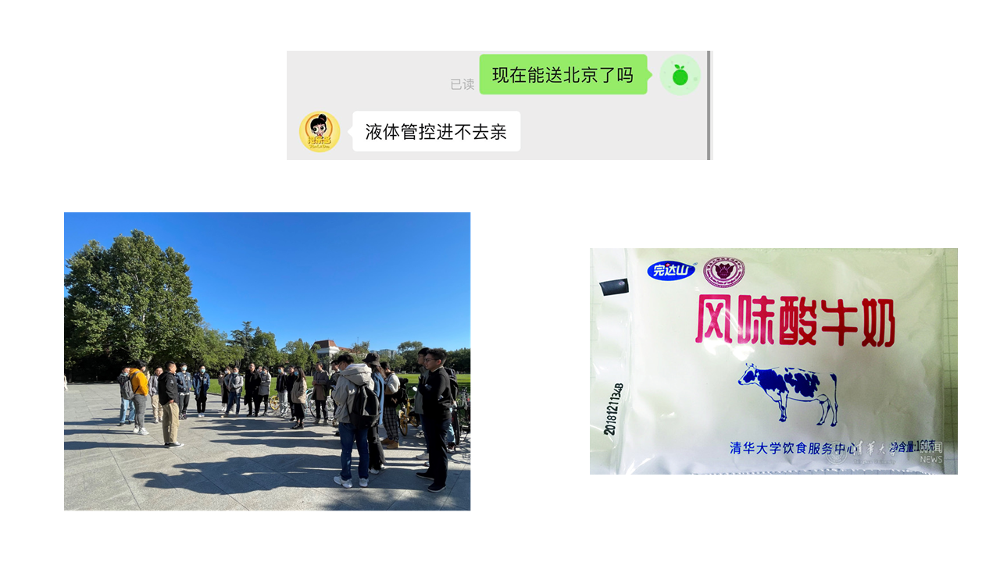
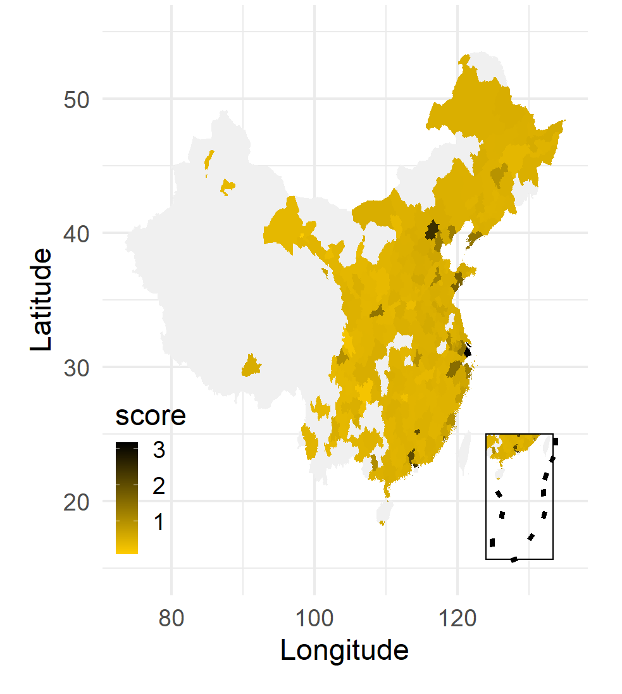
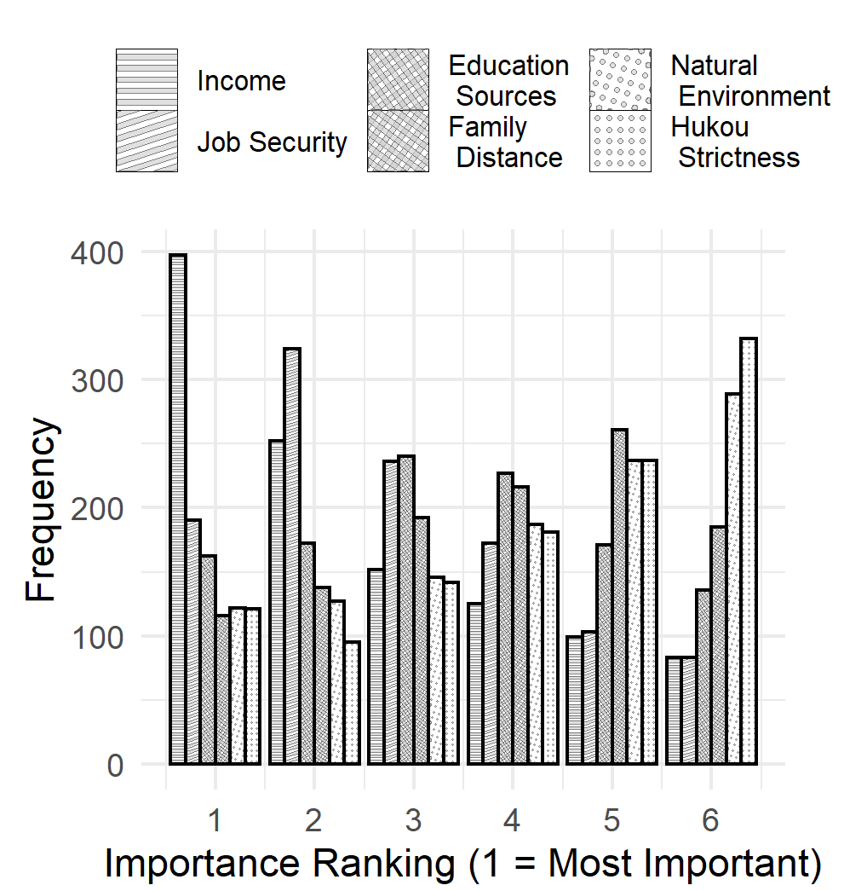
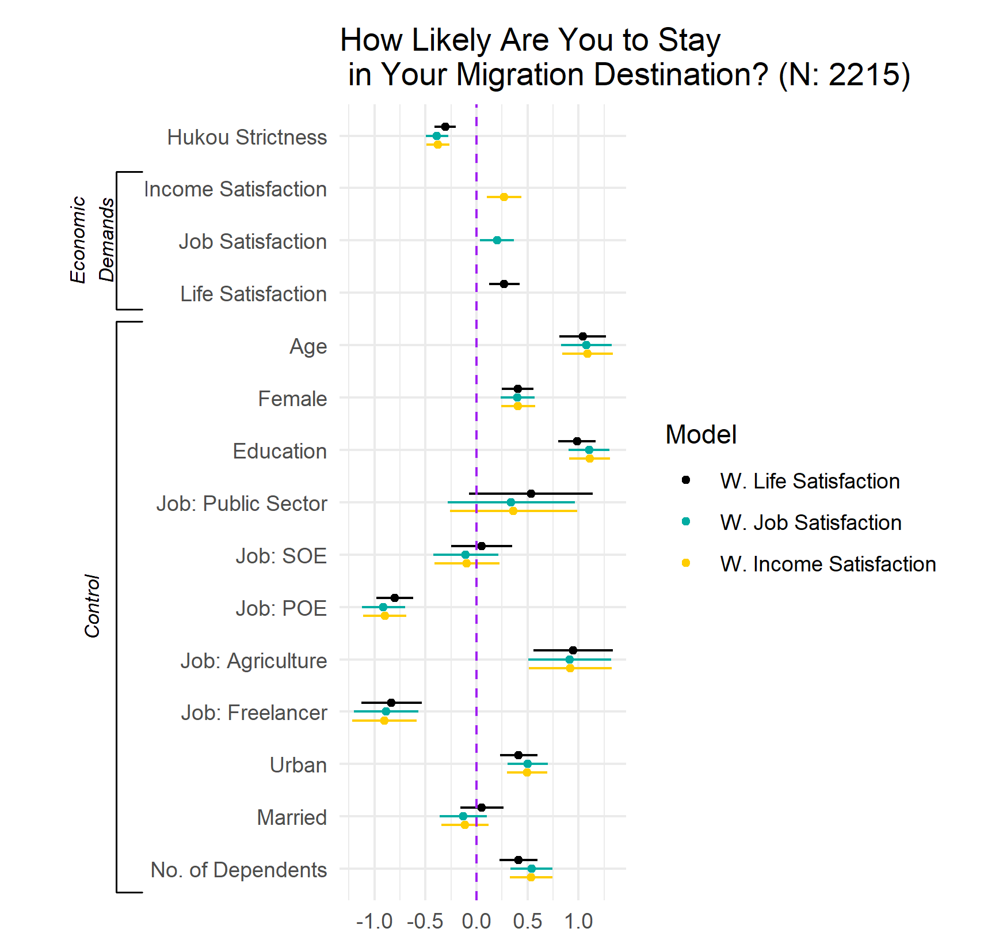

```{r setup, include=FALSE}
knitr::opts_chunk$set(echo = FALSE, message = FALSE, warning = FALSE)

if (!require(pacman)) install.packages("pacman")
library(pacman)

p_load(
  emo
) # data wrangling # data wrangling

xaringanExtra::use_xaringan_extra(c("tile_view", # O
                                    "broadcast", 
                                    "panelset",
                                    "tachyons"))

# Functions preload
set.seed(313)
```

## Overview

- Interviewer
- Instruction
- Analysis

---

class: inverse, bottom

# Interviewer

---

## Being a Good Interviewer

1. Express .red[confidence] you can enlist cooperation.
2. Engaging people .red[personally] (but not with personal details).
3. Read questions .red[slowly] to convey a willingness to take the time
to obtain thoughtful, accurate answers.
4. Interviewers and supervisors should ensure .blue[standardized interviewer behavior].

---

## Standardized Interviewer Behavior

1. Have a .red[common] understanding of the purposes of the study;
2. Ask questions .red[exactly] the way they are written;
3. Probe .red[incomplete] answers in non-directive ways;
4. Record answers in a standardized way to .red[avoid variation] induced by interviewers;
5. Avoid behaviors that communicate the personal, .red[idiosyncratic characteristics] of the interviewer.

---

class: center, middle

> Studies have found that interviewers significantly affect the
mean or variation of answers for between one third and one half of
questions.

--


## Who Are Good Interviewers

1. Reasonably good reading and writing skills;
2. Be able to work intermittently and part-time;
3. Be able to work flexible hours;
4. Specialized knowledge about the topic is seldom a plus;
5. Age, education, and gender of interviewer typically don't affect data quality.

--

In some rather .red[specialized] circumstances, the interviewer's ethnic background, age, or gender may affect answers.

---

## Interviewer Training

Train on general procedures as well as study-specific ones;

--

Write out procedures explicitly and share;

--

Use supervised structured practice (mock interviews);

???

Show how they did and point out what's wrong

--

Best training procedures take multiple days;

--

Training is ongoing within and across projects---effective real-time and general supervision is critical.

---

class: inverse, bottom

# Instruction

---

class: small, bottom, center

## What to Put in the Survey Instruction

**Primarily about academic ethics**

The .red[name] of the organization that is carrying out the research.

--

Who is .red[supporting or paying] for the research.

--

A brief description of the .red[purposes] of the research.

--

The extent to which .red[confidentiality] is protected. 
Any risks to that should be stated clearly.

--

Assurance that cooperation is .red[voluntary] and that .red[no negative] consequences will result to those who decide not to participate.

--

Assurance that respondents .red[can skip] any questions that they do not want to answer.

--

Typically this is done through a consent question, but signed consent may sometimes be appropriate. 
The researcher should make sure that no individual suffers any adverse consequences as a result of the survey.

---

class: center

## Respondent Protection

Commit study team to upholding .red[confidentiality].

--

.red[Minimize] links between answers and identifiers.

--

Remove .red[identifiers] from completed survey instruments ASAP.

--

.red[Destroy] names and addresses once they are no longer needed.

--

.red[Limit access] to completed surveys, physically or digitally.

--

Restrict access to .red[individuals] who could identify respondents from their responses.

--

Restrict access to .red[the link] between ID numbers and sample information.

--

Be careful about .red[presenting] data for very small categories.

--

.red[Destroy] or secure completed surveys when no longer needed.


---

class: small

您好！非常感谢参与我们的调查。此次调查会花费您10分钟左右。您的答案将完全保密，并进行匿名处理，请放心作答。您的答案将直接影响到我们的研究结果，所以请认真阅读题目并根据实际情况如实作答。   另外，欢迎您将答题感受和意见通过问卷最后的建议框反馈给我们。尤其是如果有某些题让您感到有清楚、不明白或者不舒服，请务必将题号卸载建议框中，我们将会根据您的宝贵意见对问卷作进一步的改进和完善。谢谢配合！<br>以下是参与本次调查的同意书，请认真阅读。如您继续答题则视为您认可以下条款并同意继续参与本次研究。<p> </p>  <p style="text-align: center;"><strong>同意书</strong></p>  <p>项目：流动人口与国家发展</p>  <p>项目主持：Elise Pizzi</p>  <p>项目执行联系人：Elise Pizzi <span class="gc-cs-link" id="gc-number-13" title="Call with Google Voice">+1 (319) 335-2360</span></p>  <p> </p>  <p>以下文字是对本研究内容的介绍，包含研究过程、潜在风险与收益以及您作为研究对象的权力等重要内容。您可据此判断是否继续参与此次研究。您可根据以上信息联系执行团队获得更多详细信息。您也可以与家人或朋友讨论后再决定是否继续参加。继续答题则默认您已没有疑问并已同意参与本项目。</p>  <p> </p>  <p><u>研究目的</u></p>  <p>这是一个学术研究。基于您是中国公民，我们邀请您参与此次研究。本次研究旨在了解当代中国流动人口及其动态。我们尤其希望通过其了解为什么在当今中国有些人选择成为流动人口，而其他人则选择留在家中，以及这一抉择的社会、政治以及经济原因。</p>  <p> </p>  
<p><u>参与人数</u></p>  <p>大约1000名调查者将同您一起参与到此次研究中。研究由美国爱荷华大学发起。</p>  

---

class: small

<p> </p>  <p><u>研究用时</u></p>  <p>如果您同意继续参与，研究总时长会在20分钟左右。您只需回答一次网上问卷，不会有任何后续访问或后续问卷。</p>  <p> </p>  <p><u>研究内容</u></p>  <p>如果您同意参与，我们将先会进行资格认证。通过认证后您将会收到一个多页的网上问卷；每一页都会包含若干问题，如选择、排序、程度判断等。当您完成答题，此次参与即为结束。整个过程都将通过网络进行。您可以在任何时候选择终止答题。</p>  <p> </p>  <p><u>潜在风险</u></p>  <p>参与此次研究并不会带来任何风险，但某些问题可能会让您感到略微不适。当然，研究或许还有其他不可预计的风险。</p>  <p> </p>  <p><u>研究收益</u></p>  <p>虽然您或许不会从参与本次研究中获得重大的直接收益，但我们希望您的参与能够帮助政策制定者和研究者增进对流动人口与公共产品的关系的理解。</p>  <p> </p>  <p><u>研究花费</u></p>  <p>参与此次研究不需要承担任何花费。</p>  <p> </p>  <p><u>有偿研究</u></p>  <p>您将通过Qualtrics有偿参与此次研究。</p>  <p> </p> 

---

class: small

<p><u>研究支持</u></p>  <p>美国爱荷华大学和本研究团队未获得来自任何机构、组织或企业的资助来进行此次研究。</p>  <p> </p>  <p><u>保密条款</u></p>  <p>我们将会依法对您的答案进行严格保密。当然后面我们会提及一些人员，他们可能会被授权对您的参与知情并对部分答案进行审查和拷贝。</p>  <p>为了保障您的隐私，我们将不会收集您的任何身份信息。由于没有后续采访，我们也不会询问您的联系方式。如果您的答案最终被作为有效数据进入我们的研究，我们也将避免在文章或报告中透露您的任何个人信息。</p>  <p> </p>  <p><u>自愿原则</u></p>  <p>参加此次研究应为您的自愿行为。您可以自由选择不参与或中途退出，这并不会影响倒您的任何权益和收益。</p>  <p> </p>  <p><u>信息更新</u></p>  <p>如果我们获得任何有关信息或可能影响到您继续参与的内容，我们会即使向您反馈。</p>  <p> </p>  <p><u>答疑解惑</u></p>  <p>如果您有问题，欢迎告诉我们，请联系Elise Pizzi  +1 (319) 335-2360；如果您受到和研究有关的伤害，也请联系Elise Pizzi  +1 (319) 335-2360。如果您仍有关于参与者权益的任何问题、顾虑或意见，请联系the Human Subjects Office, 105 Hardin Library for the Health Sciences, 600 Newton Rd, The University of Iowa, Iowa City, IA  52242-1098, (319) 335-6564, 或 e-mail irb@uiowa.edu。 其他问题可通过点击Human Subjects Office 主页http://hso.research.uiowa.edu/的“Info for Public” 获得。如果您想反馈参与经历，您可当面或打电话联系研究人员或Human Subjects Office的工作人员。</p>

---

class: inverse, bottom

# Analysis


---

## Controlled Comparison Design

Examining the relationship between an explanatory (X) and an outcome variable (Y) while holding constant other variables (Zs) suggested by rival explanations and hypotheses.

.left-column[
Uncontrolled

Controlled

Spurious

Additive

Interactive

]

.right-column[

.center[]

]

???

- Uncontrolled effect: a relationship between X and Y that does not take into account other variables, Z (a.k.a. a zero-order relationship). 	
- Controlled effect: a relationship between X and Y within (at least) one value of another causal variable, Z. 	
- Spurious relationship: when the relationship between X and Y is actually explained by another variable, Z. 	
- Additive effect: when the relationship between X and Y exists and is the same within values of Z.	
- Interactive effect: when the relationship between X and Y exists but changes within values of Z.

---

## Survey Data Analysis

.pull-left[
Demographic profile


]


.pull-right[
Single variable analysis


]

---

.pull-left[
Multiple variable analysis


]

--

.pull-right[
We'll talk more in a later lecture. 
And again, learn more in *Analysis of Political Data* (70700173).
]

---

background-image: url("images/train_mindmap.png")
background-position: center
background-size: contain

## Quick Review