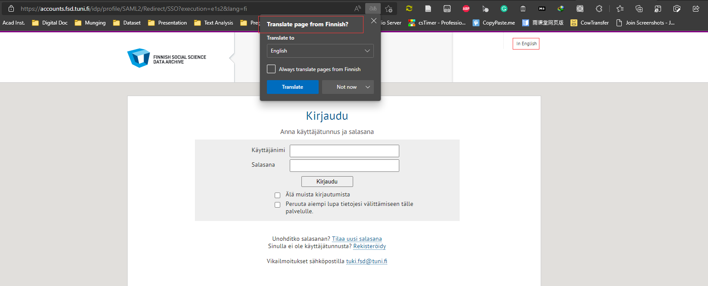
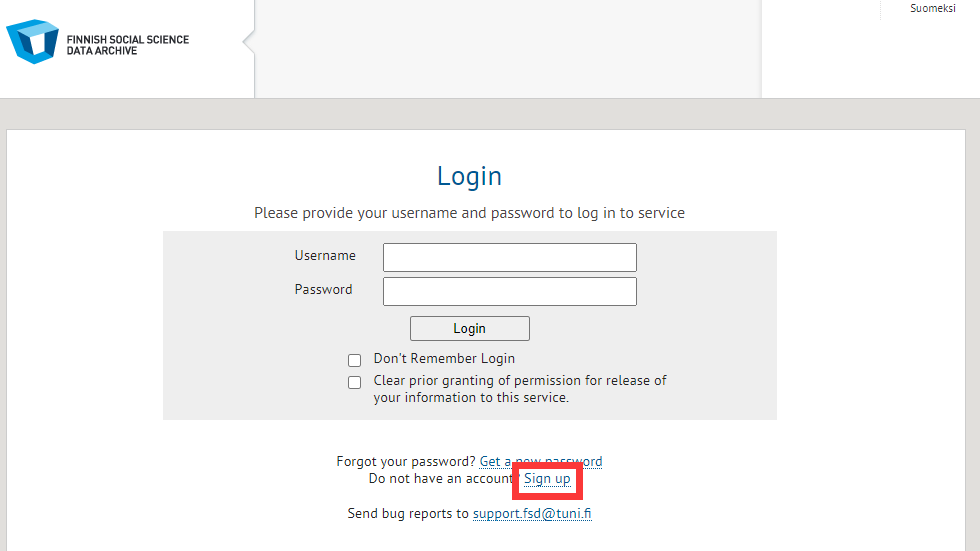
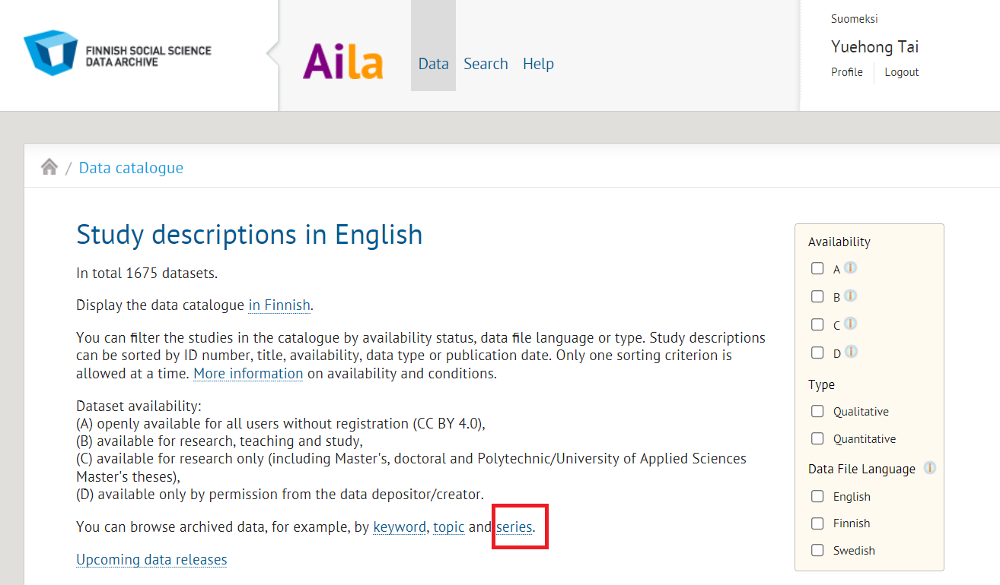
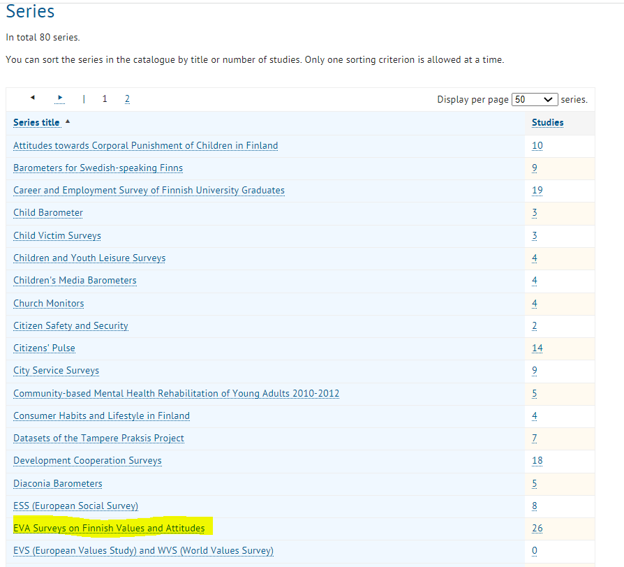
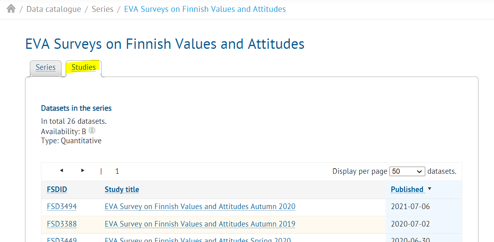
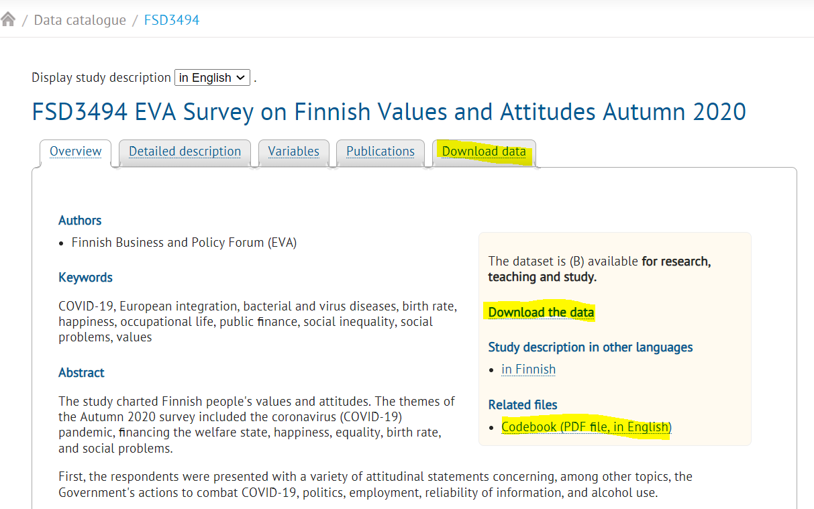
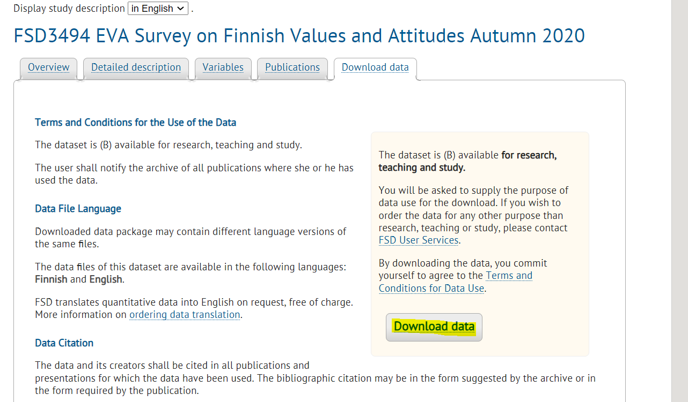
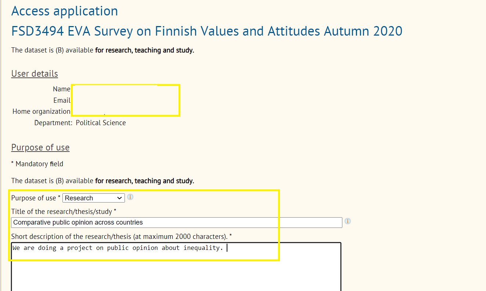
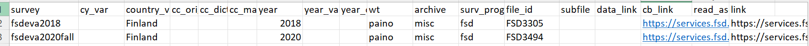
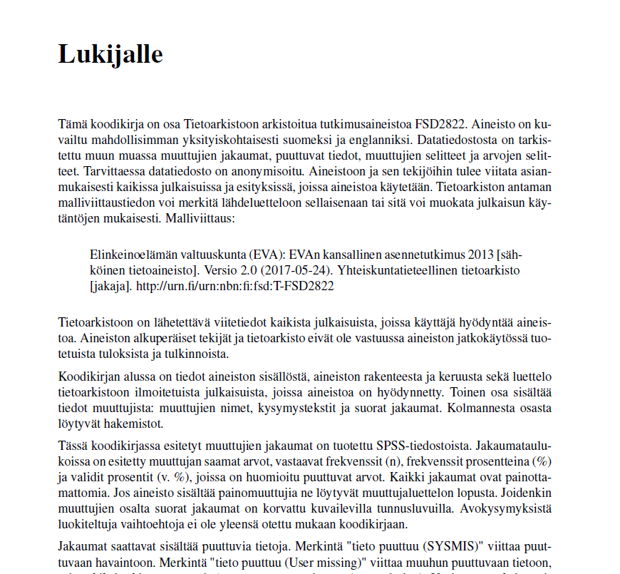

```{r setup, include=FALSE}
knitr::opts_chunk$set(echo = FALSE, message = FALSE, warning = FALSE)

if (!require(pacman)) install.packages("pacman")
library(pacman)

p_load(
  emo
) # data wrangling # data wrangling

xaringanExtra::use_xaringan_extra(c("tile_view", # O
                                    "broadcast", 
                                    "panelset",
                                    "tachyons"))

# Functions preload
set.seed(313)
```

## Overview

- Bio: DCPO
- Data Generation Process for DCPO
- Applications
- Assignments and Reading club

---

class: inverse, bottom

# A Bio of DCPO

---

class: center, middle

## DCPO as a Project

Aiming to conquer a critical puzzle in comparative politics...

--

.large[Common objectives]    
Development, culture, democracy...

\+ 

.large[Rich data]    
WVS, Global Barometers, ?GSS, Pew ...


.large[.red[&#10504;]]

.large[Clear patterns]


---

## Democracy &larr;?&rarr; Public support

Support .navy[&uarr;] &rarr; democracy .navy[&uarr;] .small[(e.g., Inglehart & Welzel 2005, Claassen 2019)]    
Support .navy[&uarr;] &rarr; democracy .red[&#8675;] .small[(e.g., Fails & Pierce 2010)]

???

Countries with greater democratic support have been found to become stronger and more stable democracies

Inglehart, Ronald and Christian Welzel. 2005. *Modernization, Cultural Change, and Democracy*. Cambridge: Cambridge University Press. 

Fails, Matthew D. and Heather Nicole Pierce. 2010. "Changing Mass Attitudes and Democratic Deepening." *Political Research Quarterly* 63(1):174–187.

(Insignificant positive with one-year survey, and insig negative with multiple years)

--

Democracy .navy[&uarr;] &rarr; support .navy[&uarr;] .small[(e.g., Wuttke et. al. 2020) ]   
Democracy .navy[&uarr;] &rarr; support .red[&darr;] .small[(e.g., Foa & Mounk 2017)]  
Democracy .red[&darr;] &rarr; support .navy[&uarr;] .small[(Claassen 2020)]

???
More experience with democracy yields more democratic support 
vs.
Long-established democracies are suffering from democratic fatigue 

Wuttke, Alexander, Christian Schimpf and Harald Schoen. 2020. "When the Whole Is Greater
than the Sum of Its Parts: On the Conceptualization and Measurement of Populist Attitudes and Other Multidimensional Constructs." *American Political Science Review* 114(2):356–374.

Foa, Roberto Stefan and Yascha Mounk. 2017. "The Signs of Deconsolidation." *Journal of Democracy* 28(1):5–15

thermostatic effect. 

---

## Source of the Puzzle: Invisible Opinions

.red[Different] questions

.center[]

???
Why are there mixed results? 
Difficutlies in measuring. 
First, pub sp is latent variable, unobservable. Uncertainty. 
Sec, a big challenge is the sparced and fragmented data at aggregate level. 
churchihill items,  democracy has its probles, still the best one. 
milltary rule items, military should govern the country. what do you think. 
Worldwide survey project, 4 years. 
across countries, overtime. 

---

.red[Different] respondents

.pull-left[


]

--

.pull-right[


]

???

Different respondents have different concepts of democracy and different way to support democracy. 
United Kindom, lawmakers leave. 
Swarming Capital defending democracy.  

---

class: center, middle, large

Different questions   
Different people   
&dArr;    
.red[Incomparable] data   


--

w. 

.blue[Latent variable analysis]

---

## DCPO: The Most Updated Solution

.center[.red[D]ynamic .red[C]omparative .red[P]ublic .red[O]pinion (Bayesian-Based)]

In comparison with the existing methods:

.left-column[
### Function
]

.right-column[
.center[]
]

---

## DCPO: The Most Updated Solution

.center[.red[D]ynamic .red[C]omparative .red[P]ublic .red[O]pinion (Bayesian-Based)]

In comparison with the existing methods:

.left-column[
### Function
### Complexity 
]

.right-column[
Claasseen 2019 < DCPO < DGIRT

Saliently faster empowered by `cmdstanr`
]


---

## Operation

1. Collect survey data and identify the survey items (.blue[crowd-sourcing]);
1. Generate raw dataset (using `DCPOtools`, .red[automated]);
1. Reformat dataset for model (using `DCPOtools`, .red[automated]);
1. Analyze the data with `DCPO`
1. Diagnosis for convergence with `shinystan`.

---

## DCPO as a Team

.center[


]

???

Hyein Ko

Byung-Deuk

---

class: small

## Outcomes

### Publications

Tai, Yuehong, Yue Hu, and Frederick Solt. 2022. "Democracy, Public Support, and Measurement Uncertainty." *American Political Science Review*: Forthcoming.

Woo, Byung-Deuk, Lindsey Allemang, and Frederick Solt. 2022. "Public Gender Egalitarianism: A Dataset of Dynamic Comparative Public Opinion Toward Egalitarian Gender Roles in the Public Sphere." *British Journal of Political Science*: Forthcoming

### Software

Solt, Frederick, Dong Yu, and Yue Hu. 2015. "DCPO: Dynamic Comparative Public Opinion." https://CRAN.R-project.org/package=DCPO

Solt, Frederick et. al. 2019. "DCPOtools: Tools for Dynamic Comparative Public Opinion." https://github.com/fsolt/DCPOtools

---

<iframe src="https://ctai.shinyapps.io/dmsweb/" height = 600 width = 1000></iframe>

---

class: center, middle, huge

.green[Welcome to .red[Join]    
Us!]

---

class: inverse, bottom

# Data Generation Process for DCPO

---

## Goal

- Collecting surveys across the world, over time
- Identifying indicators of specific sociopolitical issues

--

.center[
Democratic support; .green[&check;]

Egalitarian gender role; .green[&check;]

Immigration; .orange[&star;]

Redistribution/inequality; .orange[&starf;]

Abortion;

Gay rights;


......
]
---

class: center, middle

## Scale of Surveys

Academic and public surveys

--

Multilingual;

--

Once or cross-sectional time-series (CSTS), long series are prefered, though


--


---


class: inverse, bottom

# Application

---

## Example: Finish Survey Data

.center[
Step 1: Go to the [Finish Survey Data](https://services.fsd.tuni.fi/disco/discovery?entityID=https%3A%2F%2Fservices.fsd.uta.fi%2F&return=https%3A%2F%2Fservices.fsd.tuni.fi%2FShibboleth.sso%2FLogin%3FSAMLDS%3D1%26target%3Dss%253Amem%253Ade320958e85a7a473cf0373f9620630a84c82a54466edd4183f7fb66323f9ea3&lang=en) website.
]

- Don't worry if it is not in English. A number have an English version
    - Even they don't, browsers (Chrome, Edge, Firefox, etc.) have translators.

.center[

]

---

.center[Step 2: Sign-up an account]

- Not always necessary, such as for Pew Data
- Signing up accounts usually requires institutional email addresses
- Try to find "Sign-up"; if not, click "log-in" 

.center[

]

---

background-image: url("images/dcpo_registration.jpeg")
background-position: center
background-size: contain

---

class: center

Step 3: Log in and check the *Information Release* after receiving the username and pin


---

class: center

Step 4: Click the "Data" tab


---

class: center

Step 5: Click the "series" link



---

class: center

Step 6: Finding the series assigned to you, e.g., the EVA.



---

class: center

Step 7: Click the "EVA Surveys on Finnish Values and Attitudes" and     
choose the "Studies" tab 



---

class: center

Step 8: Click the "Download the data" link on the right panel;    
Also click the "Codebook" link



---

class: center

Step 8.1: Sometimes you need to click the "Download data" tab and the "Download data" button to get the data



---

class: center

Fill in the purpose of usage and other info to accomplish the "Access application"



---

class: center

Step 9: Create a folder named "FSD3494," the name of the downloaded file.    
Step 10: Save both the data and codebook there.


---

Step 10: Download the [`survey_additions_template.csv`](https://github.com/fsolt/DCPOtools/blob/master/data-raw/survey_additions_template.csv)

--

You'll see many columns. But for a single-country dataset, you onlly need to fill:

- "survey"
- "courntry_v"
- "year"
- "wt"
- "archive"
- "surv_prog"
- "file_id"
- "cb_link"
- "link."  

--

The full information and meaning of the columns are available [here](https://github.com/fsolt/DCPOtools/wiki/How-to-add-new-surveys).

---

class: small



--

Some notes:

- Use the codebook find the year when the survey was carried out, and variable name for weighting.

--

- Be care for about the weighting variable, making sure the variable name is the same with the variable name in the dataset
    - Especially for non-English surveys, check the var_name in the data file

--

- If there are multiple surveys in one year, noting it in survey column, such "fsdeva2020fall."

--

- `cb_link` is the link for codebook.

--

- `link` is the link to the series. 

--

- Fill up data link if there is link for the data set
    - Not in our case since the data cannot be downloaded directly.

---

Step 11: Open the data and convert it into a format that R can read

```{r echo = TRUE, eval = FALSE}
rio::convert("FSD3494/daF3388e.csv", "FSD3494/FSD3494.RData")
```

NB: Make sure the file names are consistent.

---

## When the Codebook Isn't English

Use the translation tool to translate the file and then find weight variable.
Be CAREFUL about the variable name and check the variable name in
the data.

.center[]

--

Open the data in R and check the variables' names.

---

## The First-Stage Assignments

1. https://services.fsd.tuni.fi/catalogue/series/26?tab=studies&lang=en
1. https://services.fsd.tuni.fi/catalogue/series/58?tab=studies&lang=en
1. https://services.fsd.tuni.fi/catalogue/series/81?tab=studies&lang=en
1. https://services.fsd.tuni.fi/catalogue/series/86?tab=studies&lang=en
1. https://services.fsd.tuni.fi/catalogue/series/14?tab=studies&lang=en
1. https://services.fsd.tuni.fi/catalogue/series/39?tab=studies&lang=en
1. https://services.fsd.tuni.fi/catalogue/series/47?tab=studies&lang=en
1. https://www.icpsr.umich.edu/web/ICPSR/series/51
1. https://www.cis.es/cis/opencm/ES/2_bancodatos/estudios/resBusqueda.jsp?nEstudioMin=&nEstudioMax=&mesIni=&anioIni=&mesFin=&anioFin=&muestraIni=&muestraFin=&publicado=3&cualitativo=3&ptitulo=inmigraci%C3%B3n&pcontenido=&ambito=0&universo=0&sexo=0&edad=0&btnBuscarE=
1. https://csrda.iss.u-tokyo.ac.jp/english/infrastructure/access/apply.html

--

.center[
Language specialties?

Time to work on it?
]

---

## (Optional) Inequality Reading Club

- Classic and latest research on inequality

- One assigned paper and one self-searched

- Once per bi-/tri-weeks

- .green[Voluntarily], but committed 

- Sign up and schedule

---

class: inverse, center, middle

# Comments, Questions, Suggestions


