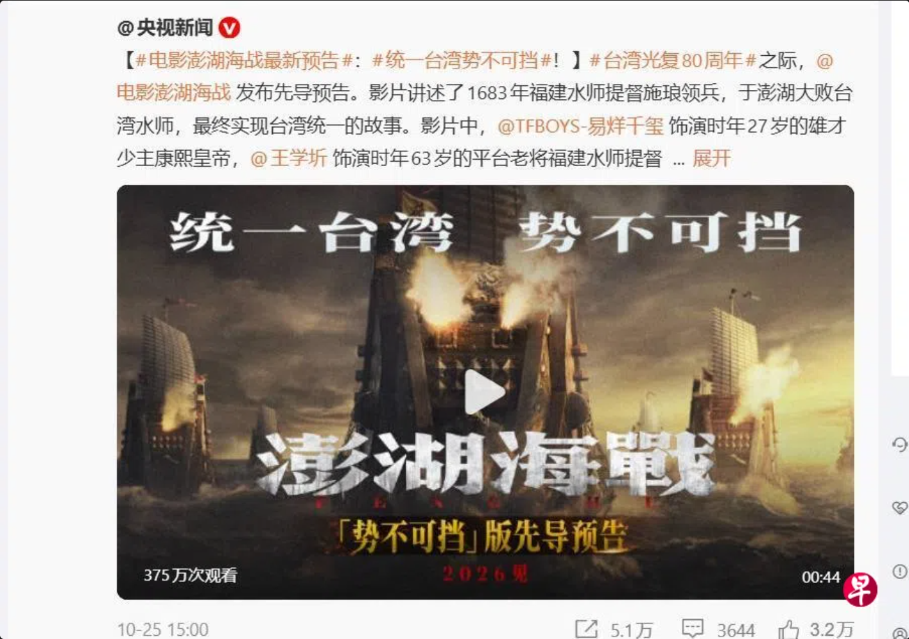
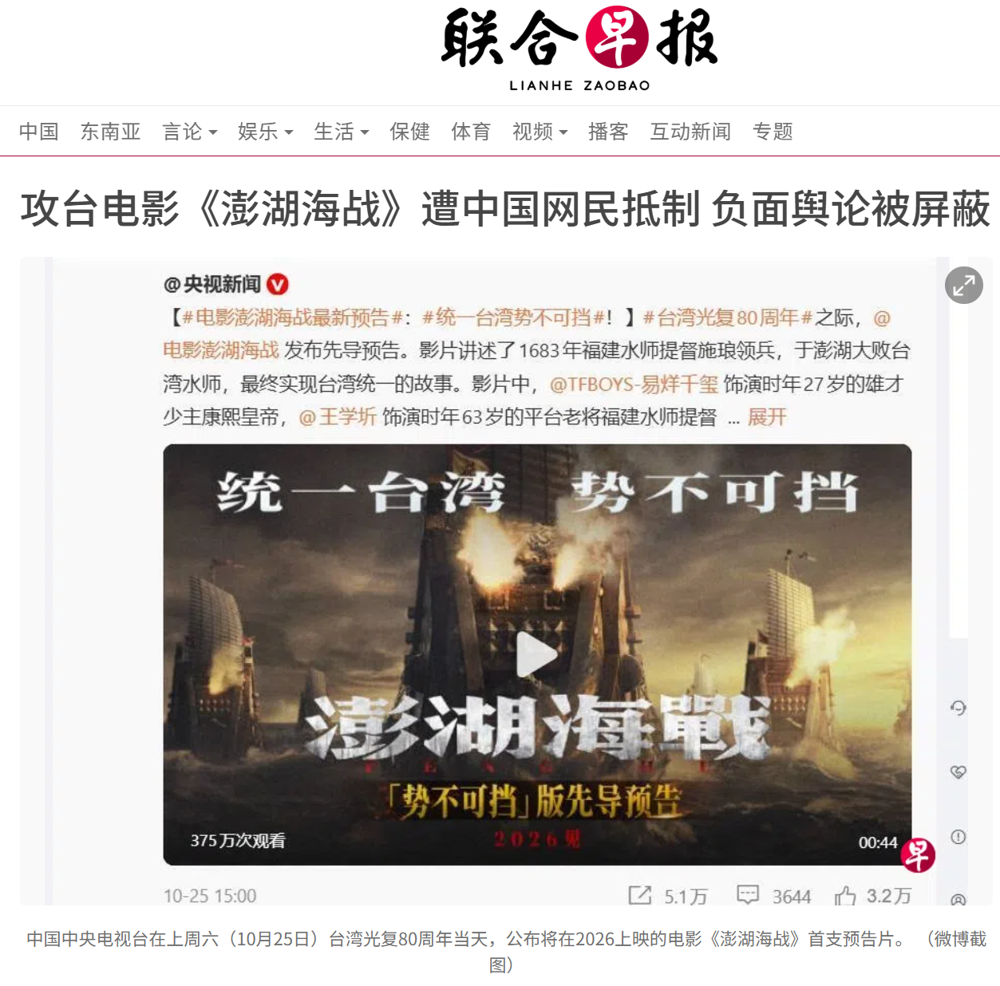
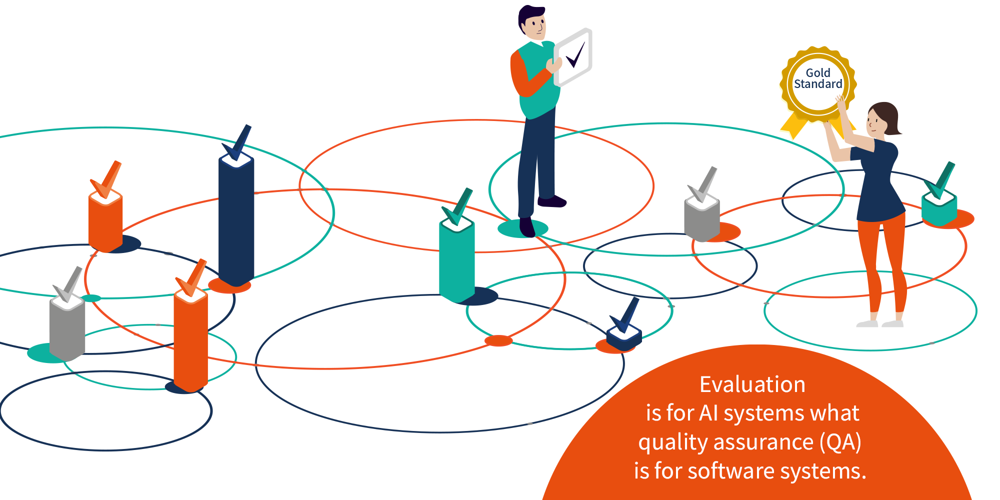
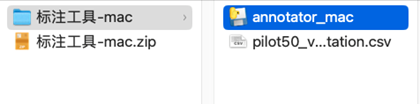
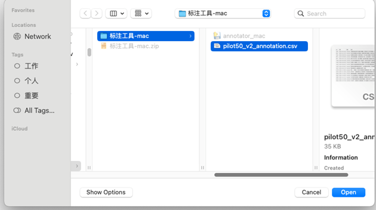
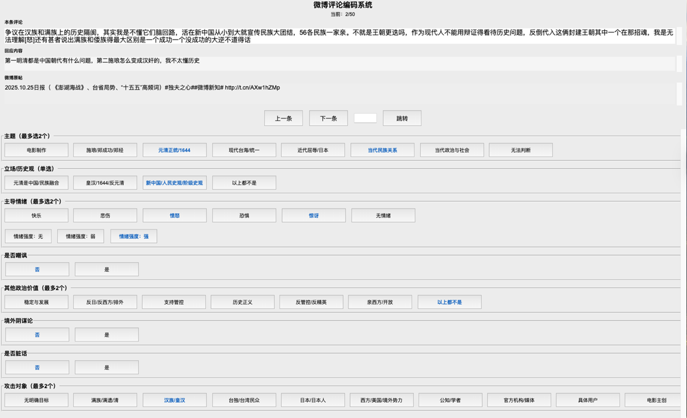

## 培训安排

::: {style="text-align:center; margin-top: 1em"}

1. 研究内容和目的
3. 数据与标注界面
4. 编码维度详解
5. 网络词汇速查
6. 标注工具操作
7. 实战练习
8. 工作规范

:::

::: {.notes}

约 90 分钟。重点在第 4 部分（编码维度详解），占一半以上时间。

:::


# 研究内容和目的

## 一部引发争议的电影

::: {.r-stack}

{fig-align="center" height=400}

{.fragment fig-align="center" height=400}

:::

- 改编自1683年（清康熙二十二年）真实历史事件
- 施琅率军渡海击败郑克塽，将台湾纳入清朝版图
- 网上争论焦点不是电影本身，而是深层历史与政治问题

::: {.notes}

电影公映预告发出后，微博迅速掀起激烈讨论。

:::


## 争论源头

清朝在中国人记忆中有**两面性**：

:::: {.columns}

::: {.column width="50%"}

**鼎盛一面**

- 康乾时期版图扩张
- 帝国鼎盛

:::

::: {.column width="50%"}

**屈辱一面**

- 后期对外战争屡屡失败
- 签订大量不平等条约

:::

::::


[→ 以**施琅**为正面形象，直接触怒了相当一部分人]{.fragment}


::: {.fragment}

| 史观 | 核心主张 | 代表立场 |
|------|---------|----------|
| **"1644 史观"** | 清军入关 = 近代开端，清朝 = 外来征服 | 皇汉群体 |
| **"1840 史观"** | 鸦片战争 = 近代开端 | 主流教育 |
| **团结史观** | 各民族共同创造历史共同体 | 官方立场 |
| **人民/阶级史观** | 人民是历史创造者，阶级矛盾 > 民族矛盾 | 官方立场 |

:::


## 事件发展与阵营分化

| 时间 | 事件 |
|------|------|
| 2025.10.25 | 电影宣发，话题词上线 |
| 10月下旬至11月 | 争论爆发，微博大量讨论与骂战 |
| 11月至12月 | 1644 vs 团结史观之争升温，官媒介入 |
| 2025.12.27 | 数据采集截止 |


:::: {.columns .fragment}

::: {.column width="33%"}

**皇汉**

- 反满，强调汉族文化正统
- 常用蔑称：
    - 鞑清、满清
    - 野猪皮

:::

::: {.column .fragment width="33%"}

**满遗 / 官方主流**

- 多民族共同体
- 反对将清定性为外来统治

:::

::: {.column .fragment width="34%"}

**人民史观**

- 跳出民族框架
- 用阶级分析
- 只认同新中国合法性

:::

::::


## 主要争论议题

::: {style="text-align:center; margin-top: 2em"}

1. 当代人如何评价清朝的历史功过？
2. 清朝"统一台湾"能否类比当代两岸关系？
3. 民族政策与少数民族的当代待遇是否公正？
4. 谁在网络上"带节奏"？背后是否有推手？

:::


::: {.notes}

这场讨论远超电影本身，涉及历史认知、民族政策、台海关系等多个层面。

:::


## 研究方向

::: {style="text-align:center; margin-top: 2em"}

1. **主题漂移**：讨论是否从电影转向更广泛议题？
2. [**情绪演变**：愤怒、嘲讽等情绪如何传播与变化？]{.red}
3. **立场极化**：不同群体的政治价值表达有何差异？
4. **网络攻击**：互动如何演变为骂战与攻击？

:::


## 为什么需要您来编码？

{fig-align="center" height=300}

:::: {.columns .fragment}

::: {.column width="50%"}

**数据规模**

- 约 **8万条** 微博帖子
- 时间跨度：2025.10.25—12.27

:::

::: {.column .fragment width="50%"}

**您的角色**

- 每人标注 **> 1000条**
- 编码质量**直接决定**整个研究的科学性

:::

::::


::: {.callout-important .fragment}

## 最重要的原则
**宁可不确定，也不乱猜。** 准确 > 覆盖率。

:::


# 三、数据与标注界面


## 标注界面：三行文本

:::: {.columns}

::: {.column width="50%"}

*帖子类型*

| 类型 | 含义 |
|------|------|
| **original** | 原创帖 |
| **comment** | 评论 |
| **repost** | 转发（转发者写的） |

:::

::: {.column .fragment width="50%"}

标注界面按时间从晚到早显示三行文本：

- **第 1 行（本条评论）**：[要标注的对象]{style="color: red; font-weight: bold"}
- **第 2 行（回应内容）**：本条回应对象
- **第 3 行（微博原帖）**：讨论起源

:::

::::


::: {.callout-tip .fragment}

## 两种情况

- **情况 A**：只有第 1、3 行（本条直接回应原帖）
- **情况 B**：三行都有（第 3 行原帖 → 第 2 行别人的反应 → 第 1 行本条）

:::


## 判断原则

::: {.callout-important}
## 标注永远只针对"本条评论"（第 1 行）

第 2、3 行只是上下文，帮助理解，**不要标它们**。
:::

- 仅当本条指代不明时（如"+1""同意"），可参考上下文
- 即使参考了上下文，编码仍基于"本条"本身
- 不确定时选"无法判断"或留空，不要猜
- 只根据文本内容判断，不对作者"真实动机"做推测


# 四、编码维度详解

## 维度总览

| # | 维度 | 类型 |
|---|------|------|
| 1 | 议题焦点 | 最多选2 |
| 2 | 立场/历史观 | 单选 1-4 |
| 3 | 主导情绪 | 最多选2 |
| 4 | 情感强度 | 0/1/2 |
| 5 | 是否嘲讽/阴阳 | 0/1 |
| 6 | 其他政治价值取向 | 最多选2 |
| 7 | 境外阴谋论 | 0/1 |
| 8 | 是否脏话/粗口 | 0/1 |
| 9 | 攻击对象 | 最多选2 |

## 维度 1：议题焦点

> 这条帖子主要在谈什么？

| 代码 | 类别 |
|------|------|
| 1 | 电影制作（选角、档期、票房、审查） |
| 2 | 施琅 / 郑成功 / 郑经 |
| 3 | 元清正统性 / 1644 史观 |
| 4 | 现代台海 / 统一 |
| 5 | 近代屈辱 / 日本 |
| 6 | 当代民族关系 |
| 7 | 当代政治与社会 |
| 8 | 无法判断 |

## 维度 1：判断原则

- 涉及多议题时，取**篇幅最多、情绪最集中**的为主题
- 次要议题可填副主题（绝大多数帖子只有一个主题）
- 三个议题各占三分之一时，优先选与历史立场相关的（2、3）
- 只有完全无法理解或纯乱码时才选 8


## 维度 1：举例

1. 电影制作："这导演是HK的，投资也复杂"
2. 施琅/郑成功："施琅唯一可取之处是武力实现了统一"
3. 元清正统性："剃发易服 文字狱……近代落后不是清问题吗？"
4. 现代台海："支不支持解放台湾，统一中国"
5. 近代屈辱/日本："中国大学怎么请日本人当历史老师"
6. 当代民族关系："发达地区某些人也加分是真的崩不住"
7. 当代政治与社会："`@`紫光阁 给我下架这部电影"
8. 无法判断："下一句咋不发"

::: {.callout-tip .fragment}

## 类别2 vs 类别3 

**类别 2**：就事论事讨论施琅/郑成功等具体历史人物和事件

**类别 3**：讨论元清**整体**是否是中国、1644 vs 1840 史观之争

:::

## 维度 2：立场 / 历史观

:::: {.columns}

::: {.column width="60%"}

| 代码 | 类别 | 核心特征 |
|------|------|----------|
| 1 | 官方主流 | 元清是中国，强调民族融合 |
| 2 | 皇汉/1644 | 反满，视清为外来 |
| 3 | 超越民族叙事 | 阶级/人民史观，跳出民族框架 |
| 4 | 无法判断/模糊 | |

:::

::: {.column width="40%"}

::: {style="text-align:center; margin-top: 1em"}

```
帖子是否使用阶级、人民史观、封建主义等框架？
          │
     ┌────┴────┐
     是         否
     │          │
  类别 3    帖子是否反满，称清为外来政权？
                │
           ┌────┴────┐
           是         否
           │          │
        类别 2    帖子是否承认元/清是中国？
                      │
                 ┌────┴────┐
                 是         否
                 │          │
              类别 1      类别 4
```

:::

:::

::::


## 类别 3： 超越民族叙事（[★]{.red}）


**核心特征**

- 用阶级、人民、封建主义等分析框架，**不用**民族框架
- 认为满汉矛盾是虚假问题，真正矛盾在阶级层面
- 既不站官方主流，也不站皇汉，只认同新中国

**典型语言**

- "人民史观""阶级斗争""封建主义""三座大山""统治阶级都是剥削者"

::: {.callout-important .fragment}

## 这是一个不易识别的类别，但对后续研究尤其重要。请仔细阅读。

:::


## 类别 3 例句

> "满清统治阶级不就是这样吗？联合洋人压榨中华大地上**各族人民**。对普通百姓无论是汉满蒙等等都是屠杀和压榨"

> "作为中华人民共和国公民，只承认**人民史观**"

> "真正需要反思的不是群众怎么看历史，而是当局者到底要用什么立场与方法去向人民讲历史……当**封建统治阶级**的阶级本质被淡化，**民族情绪**被推到前台，几乎是不可避免的结果"

::: {.notes}

类别 3 区别于类别 1（民族共同体框架）和类别 2（汉族框架），它拒绝民族框架本身。

:::


## 维度 3：主导情绪（[★]{.red}）

| 代码 | 情绪 | 政治语境中的表现 |
|------|------|-----------------|
| 1 | 快乐 | 胜利感、正义感得到伸张、自豪 |
| 2 | 悲伤 | 屈辱、哀伤、无奈、失望 |
| 3 | 愤怒 | 生气、激愤（**最常见**的政治情绪） |
| 4 | 恐惧 | 担忧、害怕、警惕 |
| 5 | 惊讶 | 意外、震惊、不敢相信 |
| 6 | 无情绪 | 冷静陈述、学理讨论 |

可选 1-2 个（情绪 1 必填，情绪 2 可留空）


## 维度 3：例句

1. 快乐："彰显祖国统一大势，振奋人心"
2. 悲伤："中国近代史太过屈辱的不甘"
3. 愤怒："艹，真抽象"
4. 恐惧："历史政治这一块比较微妙，舆情风险是一大挑战"
5. 惊讶："居然最早在2009年就出现了！令人震惊！"
6. 无情绪："请看看《剑桥中国清代前中期史》的导论"


## 维度 4：情感强度

| 代码 | 级别 | 示例 |
|------|------|------|
| 0 | 无情绪/中性陈述 | "剧本由方家旭执笔。导演是港人。" |
| 1 | 弱情绪（有但克制） | "这电影选角有点迷" |
| 2 | 强情绪（明显激烈） | "艹，真抽象" |

::: {.callout-warning}

## 自我注意力测试

如果维度 3 = 6（无情绪），强度**必须**填 0。
两者要保持一致。

:::


## 维度 5：是否嘲讽/阴阳

> 帖子是否使用反讽修辞？

**标 0 (没有阴阳)的情况：**

- 直接表达情绪（愤怒、悲伤），无反讽修辞
- 陈述事实、平铺直叙

**标 1（嘲讽阴阳）的情况：**

- 表面说一件事，实际意思相反
- 使用 [doge]、[允悲]、[二哈]、[挖鼻]、笑死、呵呵
- 反问句嘲讽（"您是不是太天真了？"）
- 假装赞同


## 案例对比

:::: {.columns}

::: {.column width="50%"}

**非嘲讽 = 0**

"艹，真抽象"

"剃发易服 文字狱……近代的落后和清没关系？"

（虽是反问句，但是直接质问而非阴阳怪气）

:::

::: {.column width="50%"}

**嘲讽 = 1**

"1643的缠足是好的，1644的缠足是坏的。[doge]"

"幸亏日本失败了，不然现在要从"日本人立场"看抗日战争了[二哈]"

:::

::::

::: {.callout-tip .fragment}

## 阴阳和愤怒可以共存

"[doge] 笑死了，居然真有人信"： 既是愤怒也是阴阳。

:::

## 维度 6：其他政治价值取向


> 除史观/民族以外的政治诉求,与维度 1、2 的区分

::: {.callout-important}

## 三个维度各管各的

- **维度 1**（议题）= 帖子在**谈什么**
- **维度 2**（立场）= 关于元清/历史的**看法**
- **维度 6**（价值）= 还表达了哪些**其他**政治诉求

:::

**示例**："满清就是垃圾，但更可恨的是国家不让我们自由说话"

- 维度 1 = 3 元清正统性
- 维度 2 = 2 皇汉
- 维度 6 = 6 亲西方、呼吁开放

## 维度 6：7个类别

| 代码 | 类别 | 关键词 |
|------|------|--------|
| 1 | 稳定与发展主义 | 别折腾、搞经济 |
| 2 | 反日美、西方、排外 | 境外势力、小日本 |
| 3 | 呼吁网络/社会管控 | 封禁、举报、严管 |
| 4 | 反管控/反精英/反特权 | 批评宣传部门、官僚 |
| 5 | 历史正义/复仇 | 不忘、要报仇、清算 |
| 6 | 亲西方、呼吁开放 | 自由、开放（少见） |
| 7 | 以上都不是/纯情绪 | 无明确政治诉求 |


## 维度 7：境外阴谋论

> 是否指控境外势力或汉奸推动？

**标 0：**

- 仅表达对某个观点不满，但没有归因为境外/汉奸

**标 1：**

- 明确指控境外势力（美国、日本、台独、CIA、1450）介入
- 指控"公知""汉奸""第五纵队"推动
- 使用"带节奏""有预案""背后有人"等暗示


::: {.callout-tip .fragment}

## 阴谋论包含“双向”

可以指控皇汉是境外推动，也可以指控官方主流是境外推动。两个方向都标 1。

:::


## 维度 8：是否脏话/粗口

> 区分日常粗口与政治贬称

政治贬称属于歧视性政治表达，在维度 2（立场）或维度 9（攻击对象）中体现，**不算**脏话。

:::: {.columns}

::: {.column width="50%"}

**脏话 / 粗口 = [1]{style="color: red; font-weight: bold"}**

婊子、杂种、狗、傻逼

操、艹、滚

垃圾、畜生、脑残

:::

::: {.column width="50%"}

**政治贬称 ≠ 脏话 = [0]{style="color: green; font-weight: bold"}**

满遗、皇汉、鞑虏

野猪皮、通古斯

1450、蛙岛、汉奸

:::

::::


## 维度 9：攻击对象

> 帖子明确针对的目标是谁？

:::: {.columns}

::: {.column width="50%"}

| 代码 | 类别 |
|------|------|
| 1 | 无明确目标 |
| 2 | 满族/满遗/清 |
| 3 | 汉族/皇汉 |
| 4 | 台独/台湾民众 |
| 5 | 日本/日本人 |
| 6 | 西方/美国/境外势力 |
| 7 | 公知/学者 |
| 8 | 官方机构/媒体 |
| 9 | 某具体用户（`@`骂战）|
| 10 | 电影主创/演员 |

:::

::: {.column .fragment width="50%"}

**判断原则**

- 目标必须是**当代**具体人/群体
- 批评一个**历史现象**（如批评清朝制度）→ 选 1（无目标）
- 批评清朝遗民的**当代后裔** → 选 2（满族/满遗）
- 最多选 **2个**

::: {.fragment}

*示例*

- "公知、1450、碍国大V这次是合流了"→ 7 公知 + 4 台独
- "`@`紫光阁 给我下架这部电影"→ 10 电影主创
- "剃发易服 文字狱……近代落后和清没关系？"→ 1 无目标（批评历史现象）

:::

:::

::::

# 实战练习


## 练习 1

::: {.callout-note}

## 本条评论

"这导演是HK的，投资也复杂，您能指望HK导演有什么高眼界吗？"

:::

::: {.fragment}

| 维度 | 编码 | 说明 |
|------|------|------|
| 1 议题 | 1 电影制作 | 讨论导演和投资 |
| 2 立场 | 4 无法判断 | 无明确史观表达 |
| 3 情绪 | 3 愤怒 | 不满、质问语气 |
| 4 强度 | 1 弱情绪 | 有不满但相对克制 |
| 5 嘲讽 | 1 | 反问句带嘲讽 |
| 6 政治价值 | 7 无明确 | |
| 7 阴谋论 | 0 | |
| 8 脏话 | 0 | |
| 9 攻击对象 | 10 电影主创 | |

:::


## 练习 2

::: {.callout-note}

## 本条评论
"满清统治阶级不就是这样吗？联合洋人压榨中华大地上各族人民。对普通百姓无论是汉满蒙等等都是屠杀和压榨"

:::

::: {.fragment}

| 维度 | 编码 | 说明 |
|------|------|------|
| 1 议题 | 3 元清正统性 | 讨论清朝统治 |
| 2 立场 | 3 超越民族叙事 | 阶级框架，"各族人民" |
| 3 情绪 | 3 愤怒 | 对统治阶级激愤 |
| 4 强度 | 2 强 | "屠杀和压榨" |
| 5 嘲讽 | 0 | 直接表达 |
| 6 政治价值 | 7 无明确 | |
| 7 阴谋论 | 0 | |
| 8 脏话 | 0 | |
| 9 攻击对象 | 1 无目标 | 批评历史现象 |

:::

## 练习 3

::: {.callout-note}

## 本条评论
"公知、1450、碍国大V、申姨叫兽这次是合流了"

:::

::: {.fragment}

| 维度 | 编码 | 说明 |
|------|------|------|
| 1 议题 | 7 当代政治 | 讨论舆论推手 |
| 2 立场 | 1 官方主流 | 批评皇汉、台独 |
| 3 情绪 | 3 愤怒 | 指控语气 |
| 4 强度 | 2 强 | 多个贬称叠加 |
| 5 嘲讽 | 1 | "碍国""申姨叫兽" |
| 6 政治价值 | 2 反日美西方 | |
| 7 阴谋论 | 1 | 指控合流、有组织 |
| 8 脏话 | 0 | 政治贬称，非日常粗口 |
| 9 攻击对象 | 7 公知 + 4 台独 | |

:::

## 练习 4

::: {.callout-note}

## 本条评论
"1643的缠足是好的，1644的缠足是坏的。[doge]"

:::

::: {.fragment}

| 维度 | 编码 | 说明 |
|------|------|------|
| 1 议题 | 3 元清正统性 | 嘲讽 1644 史观的逻辑 |
| 2 立场 | 1 官方主流 | 反对皇汉立场 |
| 3 情绪 | 3 愤怒 | 嘲讽背后的不满 |
| 4 强度 | 1 弱 | 克制的嘲讽 |
| 5 嘲讽 | 1 | [doge] + 反讽对比 |
| 6 政治价值 | 7 无明确 | |
| 7 阴谋论 | 0 | |
| 8 脏话 | 0 | |
| 9 攻击对象 | 3 皇汉 | |

:::


# 标注工具操作


## 准备工作

1. 获得压缩包："标注工具-mac.zip"或"标注工具-windows.zip"
2. **解压**压缩包，内含：
    - 标注工具 app（annonator_mac 或 annonator_windows）
    - csv 文档（微博帖子）
3. **两个文件放在同一路径**，确保每次都能找到


## 软件设置

{fig-align="center" height=200}

{fig-align="center" height=200}

## 标注准备

{fig-align="center" height=200}

{fig-align="center" height=300}


## 操作要点

- **首次单击**标签 → 选择（字体变色）
- **二次点击** → 取消选择（回到黑色）
- 必须**完成当前帖子**所有维度才能跳到下一条
- 可通过"上一条""下一条""跳转"导航
- 遇到疑问：**先完成标注**，同时自行备注第几条有疑问

::: {.callout-tip}

## 保存机制
- 随时可关闭 app，下次打开输入**同样的 id** 即可恢复进度
- 编码结果保存在 `ann_[id].json` 和 `ann_[id].csv`
- 这两个文件[**请勿删除或手动编辑**]{.red}！

:::


# 工作规范


## 时间安排

| 阶段 | 内容 |
|------|------|
| 编码校准 | 50条试验 |
| 正式启动 | 每人完成 >1000 条标注 |
| 双周例会 | 线上/线下：汇总疑问、统一难点 |


## 每日工作建议

- 每日编码量：**不超过 300 条**
- 每日最长工作时间：**不超过 4 小时**
- 感到难以集中注意力时(如发现注意力问题打错)，**停下休息**

::: {.callout-important .fragment}

## 质量 > 数量
长时间高强度阅读会造成判断疲劳，导致标注质量下降。

:::

::: {.callout-tip .fragment}

## 遇到不确定怎么办？

1. **先查词汇表**
2. **百谷歌度**，仍不懂则标"无法判断/模糊"
3. **自行记录**：第几条、什么问题
4. **带到例会讨论**，期待发现问题、期待群策群力

:::

## Checking list

::: {style="font-size: 0.95em"}

- ☐ 温习了培训手册（含所有维度说明）
- ☐ 熟悉了网络词汇表
- ☐ 了解了9个编码维度的标注逻辑和顺序
- ☐ 清楚了不确定时的处理方式
- ☐ 标注工具已解压并测试

:::

::: {.fragment style="text-align:center; margin-top: 1em; font-size: 1.3em; font-weight: bold"}

我们与你们同在！[Aka, 随时准备好本手册在旁边！😏]{.fragment}

:::


# 祝编码顺利！ {background="#43464B"}

::: {style="text-align:center; margin-top: 2em; color: white; font-size: 1.2em"}

您的工作对这项研究至关重要！

如有任何问题，请随时发到群里。

:::


# 附录：相关网络词汇 {.appendix}

## 对清朝/满族的贬称

::: {style="font-size: 0.9em"}

| 词汇 | 含义 | 维度 8 |
|------|------|--------|
| 鞑清/鞑虏 | 对清朝政权的蔑称 | 0（政治贬称） |
| 满遗 | "满清遗老遗少" | 0 |
| 野猪皮 | 指努尔哈赤 | 0 |
| 金钱鼠尾 | 清代强制发型 | 0 |
| 通古斯 | 满族族源地 | 0 |
| 螨虫/满狗 | 极度贬称 | 0 |

:::

::: {.notes}
这些虽然带有强烈贬义，但在维度 8 中归为政治贬称，不算脏话。
:::


## 对台湾/日本/其他群体的称呼

::: {style="font-size: 0.9em"}

| 词汇 | 含义 |
|------|------|
| 1450 | 台独水军代号 |
| 蛙岛/蛙 | 对台湾的贬称 |
| 梧桐 | "武统"的谐音 |
| 小日子/倭寇/脚盆 | 对日本的蔑称 |
| 皇汉 | 汉族民族主义者（可自称/他称） |
| 50万/行走的50万 | 指控某人是间谍 |

:::


## 关键术语

| 术语 | 含义 |
|------|------|
| 吃瓜蒙主/蒙主 | 1644 史观主要推动者之一 |
| 沈逸 | 复旦学者，官方立场代表 |
| 浙江宣传 | 浙江省委宣传部公众号 |
| 南明 | 1644年后明朝南方政权 |
| 历史虚无主义 | 官方批评史观偏离用语 |
| 带节奏 | 故意引导舆论方向 |
| 第五纵队 | 阴谋论标签 |


## 常见表情包含义

::: {style="font-size: 1.1em; text-align: center"}

| 表情 | 含义 | 维度 5 |
|------|------|--------|
| [doge] | 嘲讽/反讽（**最常见的阴阳标志**） | → 1 |
| [笑cry] | 苦笑/自嘲 | → 看语境 |
| [允悲] | 无奈/哭笑不得 | → 1 |
| [二哈] | 戏谑/玩梗 | → 1 |
| [挖鼻] | 阴阳/不屑 | → 1 |
| [摊手] | 无奈 | → 看语境 |
| [怒] | 愤怒 | → 0 |

:::
