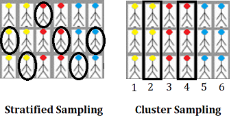
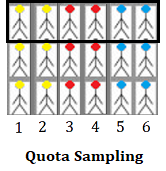
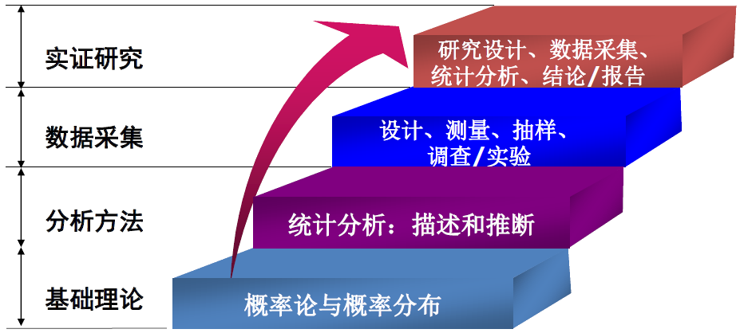
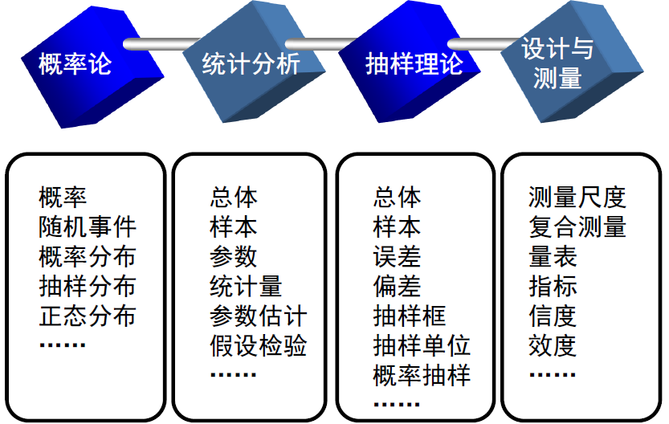
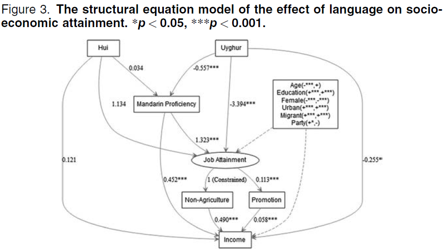
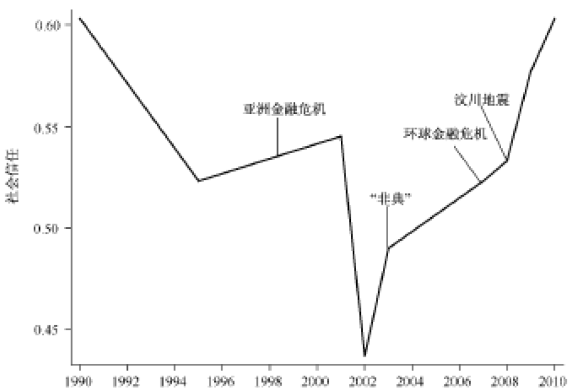
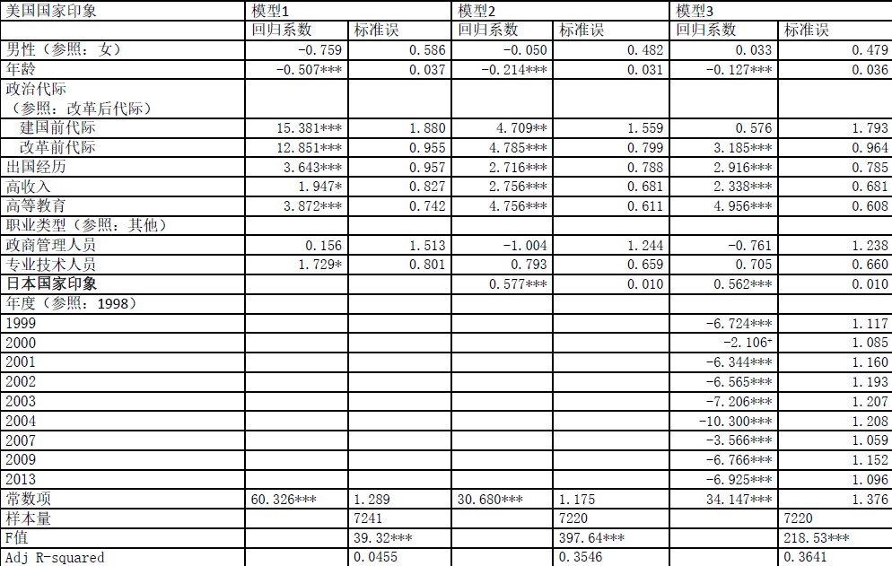

## 学习计划

### 研究设计原则

1. 科学研究

--

### 数据收集原则

1. 抽样与权重
1. 变量测量

--

### 数据分析原则

1. 统计基础
1. 重复性截面数据分析
1. 软件与数据资源

---

class: inverse, bottom

# 研究设计原则

---

class: middle

.center[.large[
.navy[政]务大数据研究 &sub; .navy[政]治.red[科学]研究 &sub; 社会.red[科学]研究]]

---

## 科学从何谈起

--

1. 程序
1. **方法**

---

## 研究程序

.left-column[
### 问题导向

1. .red[问题]提出
1. 理论.red[假设]
1. 数据.red[方法]
1. 实证.red[检验]
]

--

.right-column[
### 数据导向

1. .red[观察]数据
1. .red[分析]方法
1. .red[规律]总结
1. 理论.red[提升]

]

---

## 研究程序

.left-column[
### 问题导向

1. .red[问题]提出
1. 理论.red[假设]
1. 数据.red[方法]
1. 实证.red[检验]
]

--

.right-column[
.gray[
### 数据导向

1. 观察数据
1. 分析方法
1. 规律总结
1. 理论提升
]
]


---

## 好问题+好理论

### 问题来源

梁文道 + Sheldon + .red[卫斯理]

???
文献

观察与发现

兴趣

--

### 研究步骤

理论（一个想法）&rarr; 假设（一个判断）   
&rarr; 验证（一堆证据）

--

### 研究形式

1. 描述
1. 机制


---

## 描述

已知 &rArr; 未知

--

1. 无偏
1. 高效

---

## (因果)推论

搞清why & how, but how?

### 争论1


???

Definition of causality

时间序列角度

条件角度

未包含：

多重因果

决定论还是概率论

---

### 争论2


???

correlation doesn't imply causation

---

### 争论3

Y ~ X 

vs.

Y ~ A &rarr; B  &rarr; C  &rarr; D &rarr; E &rarr; ... &rarr; X

???

效应 vs. 机制

---

## 推论常见工具：

+ 反事实分析

--

这些都不是：

+ 方差分析
+ 非参数检验
+ 相关系数
+ 回归分析
+ Lasso
+ SEM
+ 倾向只匹配   
......

---

## Wrap Up

研究设计原则

1. 科学：程序 + 方法
1. 基础：问题 + 理论 + 假设
1. 角度：描述 and/or 机制

---

class: inverse, bottom

# 数据收集原则

---

class: inverse, bottom

# 抽样与权重

---

class: center, middle


“每日1亿条”

“全网数据”

“《人民日报》所有文章”

--

.Large[大数据亦常抽样。]

---

## 抽样

从.blue[一大堆]到.red[一小撮] &rarr; 代表性

???

随机抽样的代表性体现在一定的sample size上

--

### 简单随机抽样

???

计算机伪随机数

SHA算法和MD5

真随机数：物理现象，如内存、硬件、噪音

--

## （复杂）抽样设计

### 设计

+ 配额设计（quota）
+ 分群设计（clustering）
+ 分层设计（stratification）

### 矫正

+ 有限总体校正（finite population corrections, FPC）
+ 不相等的权重（unequal weights）
    

---

.center[


]

???

Stratification: 分类，每类中随机抽取，每类成员在总体中配比不变        
Clustering：直接随机抽取一类        
Quota：成分配比够就行，不用随机

---

## 常见设计

* Strata + Weight + FPC
      + PSU/SSU/TSU
    
???

PSU: primary sampling unit
SSU: secondary sampling unit
TSU: tertiary sampling unit

$FPC = \sqrt{(N-n)/(N-1)}$, N = population size, n = sample size.

Using $s = \frac{\sigma}{\sqrt{n}}\sqrt{(N-n)/(N-1)}.$

FPC is used when you sample without replacement from more than 5% of a finite population, leading to more uncertainty. 

--

* Strata: 将人口根据某些特征分组；
    + 减少点估计的标准误；
    + 不同层抽样权重不等

--

* Sampling (survey) weight：
    + 样本入选概率的倒数；
    + 各抽样阶段权重的乘积；
    + 抽样权重在总体层面是等概率的，但在个体层面是非等概；影响点估计的计算

???

For example, if you have selected 200 goldfish out of a population of 1000, the reciprocal of the likelihood of being selected is 1000/200, so the sampling weight for the goldfish would be 5


---

## 后果

* 不等权重 &rarr; 某些特征分布与总体不一致
* 分层 &rarr; 层间方差不齐
* 分群（clustering）&rarr; 群组间方差不齐，群组内不独立

--

.center[复杂抽样是.red[不得已而为之]]

---

## 怎么办？

Post-DGP correction &rarr; 把权重纳入分析

---

## 应用实例

[Behavioral Risk Factor Surveillance System (BRFSS) SMART](https://www.cdc.gov/brfss/smart/smart_2011.htm) county data by US Centers of Disease Control and Prevention (CDC)

```{r survey-example, include=FALSE, eval=FALSE}
brfss_11 <- Hmisc::sasxport.get("D:/Desktop/CNTY2011.xpt")

library(car)

nams<-names(brfss_11)

#we see some names are lower case, some are upper and some have a little _ in the first position. This is a nightmare.
newnames <- gsub(pattern = "_",
                 replacement =  "",
                 x =  nams)
names(brfss_11) <- tolower(newnames)

#Poor or fair self rated health
brfss_11$badhealth <- ifelse(brfss_11$genhlth %in% c(4, 5), 1, 0)

#race/ethnicity
brfss_11$black <-
  recode(brfss_11$racegr2, recodes = "2=1; 9=NA; else=0")
brfss_11$white <-
  recode(brfss_11$racegr2, recodes = "1=1; 9=NA; else=0")
brfss_11$other <-
  recode(brfss_11$racegr2, recodes = "3:4=1; 9=NA; else=0")
brfss_11$hispanic <-
  recode(brfss_11$racegr2, recodes = "5=1; 9=NA; else=0")

#insurance
brfss_11$ins <- ifelse(brfss_11$hlthpln1 == 1, 1, 0)

#income grouping
brfss_11$inc <- ifelse(brfss_11$x.incomg == 9, NA, brfss_11$x.incomg)

#education level
brfss_11$educ <-
  recode(brfss_11$educa,
         recodes = "1:2='0Prim'; 3='1somehs'; 4='2hsgrad'; 5='3somecol'; 6='4colgrad';9=NA",
         as.factor = T)
brfss_11$educ <- relevel(brfss_11$educ, ref = '2hsgrad')

#employment
brfss_11$employ <-
  recode(brfss_11$employ,
         recodes = "1:2='Employed'; 2:6='nilf'; 7='retired'; 8='unable'; else=NA",
         as.factor = T)
brfss_11$employ <- relevel(brfss_11$employ, ref = 'Employed')

#marital status
brfss_11$marst <-
  recode(brfss_11$marital,
         recodes = "1='married'; 2='divorced'; 3='widowed'; 4='separated'; 5='nm';6='cohab'; else=NA",
         as.factor = T)
brfss_11$marst <- relevel(brfss_11$marst, ref = 'married')

#Age cut into intervals
brfss_11$agec <- cut(brfss_11$age, breaks = c(0, 24, 39, 59, 79, 99))

#BMI, in the brfss_11a the bmi variable has 2 implied decimal places, so we must divide by 100 to get real bmi's
brfss_11$bmi <- brfss_11$x.bmi5 / 100

library(dplyr)

brfss_11 <- select(brfss_11, badhealth, black, white, other, hispanic, ins, inc, educ, employ, marst, agec, bmi, x.ststr, x.cntywt) %>% 
  rename(ststr = x.ststr, cntywt = x.cntywt)

saveRDS(brfss_11, "brfss_11.Rds")
```

Set the survey conditions:

```{r survey-analysis, message=FALSE, warning=FALSE}
brfss_11 <- readRDS("data/brfss_11.Rds")

library(survey)

options(survey.lonely.psu = "adjust")

des <-
  svydesign(
    ids =  ~ 1,
    strata =  ~ ststr,
    weights =  ~ cntywt,
    data = brfss_11[is.na(brfss_11$cntywt) == F, ] # non-missing case weights
  )
```

---

```{r descriptive, message=FALSE, warning=FALSE}
library(questionr)

prop.table(wtd.table(brfss_11$badhealth, brfss_11$educ, weights = brfss_11$cntywt), margin=2)

prop.table(table(brfss_11$badhealth, brfss_11$educ), margin=2)
```

---

```{r survey-ols, message=FALSE, warning=FALSE}
raw<-lm(bmi~educ+agec, data=brfss_11)
freqW<-lm(bmi~educ+agec, data=brfss_11, weights = cntywt)
surveyW<-svyglm(bmi~educ+agec,des, family=gaussian)
```

???

survey weight is using the inverse-probability weighting

---

```{r survey-ols-plot, echo = FALSE, message=FALSE, warning=FALSE, out.width="100%"}
library(dotwhisker)
dwplot(list(raw, freqW, surveyW)) + 
  theme_minimal()
```

---

## Wrap Up

+ 代表性 &rarr；抽样
    + 简单抽样
    + 复杂抽样
+ 复杂抽样步骤
    + 分配额/层/群
    + 抽
    + 权重
+ 复杂抽样分析：考虑权重

---

class: inverse, bottom

# 数据分析原则

---

class: center, middle

.Large[统计学 vs. 计量经济学]

???

结果准

方向对

---

## 统计学

### 分类I

* 理论统计学
* 应用统计学

???

研究统计学的一般理论；研究统计方法的数学原理

研究统计方法再具体领域中的应用

--

### 分类II

* 描述统计
* 推断统计


---

## 统计/计量功能

.center[]

---

## 统计学常用概念

.center[]

---

.left-column[

### DGP

总体 vs. 样本

抽样误差

### 分析

参数 vs. 系数

期望

Uncertainty

]


???
* 总体：在理论上明确界定的个体全部集合。
* 样本：从总体中按照一定规则和程序抽出来的个体的集合，是总体一个子集。


* 抽样误差: 用样本的统计值去推算总体的参数值时总会有差异，这个差异就是抽样误差。


* 参数：概括总体特征的测度值。
* 系数（统计量）：概括样本特征的测度值。

* 期望值: $E(X) = \sum Xp$
* 不可确定性： 描述数据的离散趋势
    + Variance: $\sigma^2 = \sum(X - \mu)^2p(X)$
    + Standard deviation: $\sigma$

--

.right-column[

### 材料

* 数据
* .red[变量]、变量值、缺失值

]

---

## 练习

研究者想了解全市居民上个月的平均通讯支出是多少元，为此随机抽取了1800个居民进行了访问，得到了这些居民上个月的平均通讯支出。

问题：总体、样本、参数、系数？


---

## 测量级别

定类

定序

定距

定比

???

1. 定类：每一种不同的数字或符号代表着不同的类别或标记。定类数据只有类别属性之分， 无大小、程度之分。

1. 定序：每一种数字或符号代表着事物的等级大小、高低、先后的次序。

1. 定距：每一种数字或符号代表着事物的量的间距。定距数据没有绝对的零点，例如，温度、智商，其中的“零”只是一个相对位置，不代表“没有”。

1. 定比：每一种数字或符号代表着事物的所有算术特征。其取值除了具有类别、次序、间距的属性以外，还可以构成一个有意义的比率，其中的“零” 表示真正的“一无所有” 。


例子：

feeling thermometer: 0-200，冷淡到热情, 0是非常极端的情绪，不代表没有
-100-0-100， 0代表0的意思，ratio 是唯一一种scale可以表示meaningful ratio

在-100-0-100，按10，30 （1：3）取值，放回0-200，110:130, 不是ratio

---

## 练习

“调查发现：人们对市政府工作的满意度，在不同年龄、教育水平、收入、职业，以 及不同户口人群中有显著的差异。”

问题：上述这段描述中提到了几个变量，分别是什么类型的数据？

---

## 测量手段

直接数据（Raw data）

--

整合变量（Aggregated data）

--

.red[潜在变量测量] (Latent measurement)

* .gray[经典：Factor analysis]
* .gray[新锐：IRT]
* 全面：SEM


---

class: small

## 结构方程模型

Tang, Wenfang, Yue Hu, and Shuai Jin. 2017. “Affirmative Inaction: Language Education and Labor Mobility among China’s Muslim Minorities.” *Chinese Sociological Review* 48(4): 346–66.

.center[]

---

## 变量 &rarr; 很多变量

数据：

1. 变量（variables）
1. 观测层级
1. 观测对象（observations）

---

## 结构化数据

Tidy version

```{r tidy, echo = FALSE}
head(mtcars)
```

.center[]

---

## 数据 &rarr; 很多数据

### 面板数据

好

???

动态分析

对比性高

--

（yysy，成本高，样本局限大

---

### 重复抽样数据

* 周期性调查
* 每次随机
* 时序性信息

e.g., WVS, CGSS, GSS, .navy[DCPO datasets]

--

* 呈现社会、政治、经济现象的变化.red[趋势]
* 探索特定.red[人群(Cohort)]社会行为与态度的变迁模式
* 适用于识别.red[自然实验]的效应

---

## 描述性分析

.center[]

???

显示、理解变化趋势

---

## 趋势性分析

* 分年度回归分析
	+ 评估某个时期内研究总体的一般模式
	+ 变化趋势

--
	
* Pooled analysis
	+ 时间效应
	+ 时间与特定人群的交互效应
	
	
---

class: small

Solt, Frederick, Yue Hu, et al. 2017. “Economic Inequality and Class Consciousness.” The Journal of Politics 79(3): 1079–83.

.center[]

???

比较变化

	
---

## 套路

1. 数据整理
1. 描述性分析
1. 分年度回归分析
1. Pooled analysis

---

## 举例：美国国家印象

### 描述

.center[]

---

### 分年度

.center[]

---

### Pooled

.center[]

---

.center[

非规定动作

探索目的为主

研究问题引领

]

---

## 数据分析工具

* 分析软件：STATA, SAS, SPSS, EXCEL
* 程序语言：R, Python, JAVA, C++

---

## Wrap Up

统计/计量功能

变量
+ 测量级别
+ 测量手段

数据（tidy version）

面板数据/重复抽样数据

数据分析工具