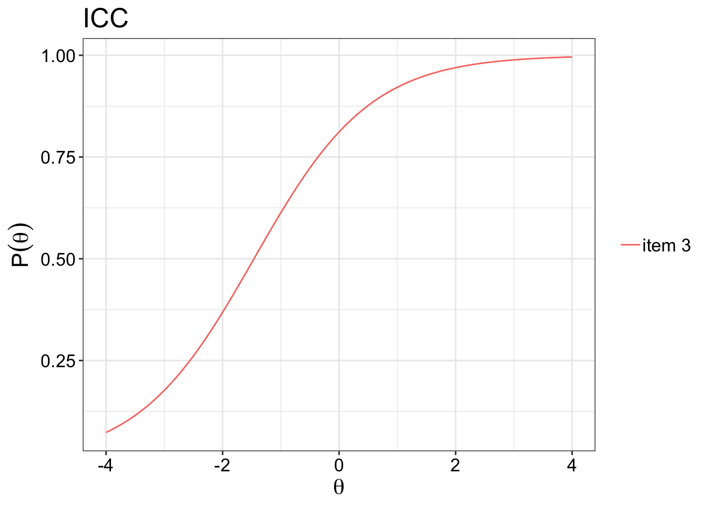
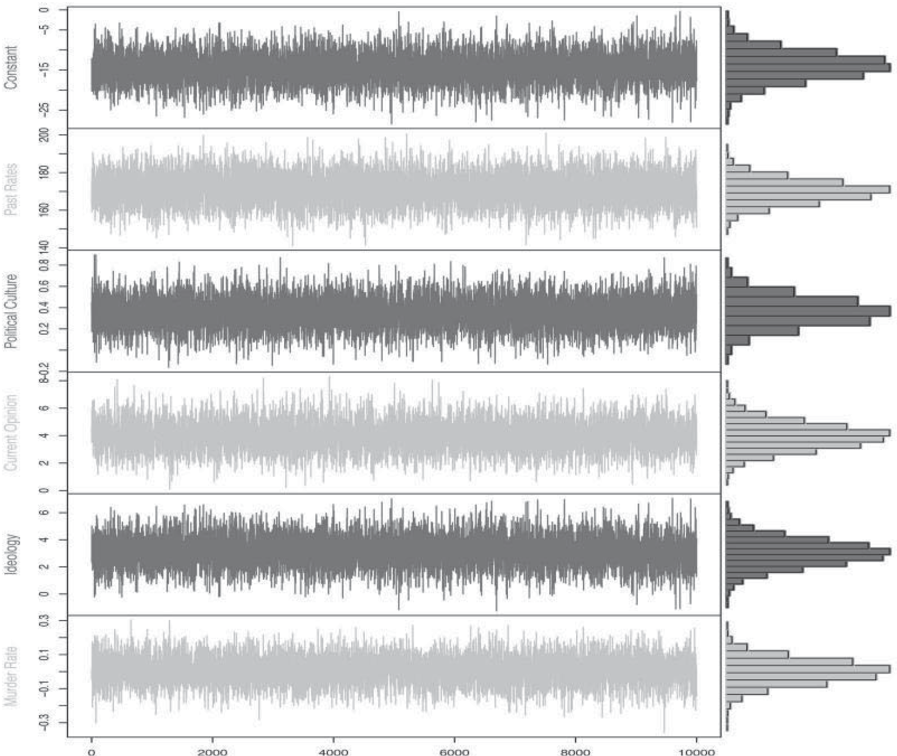
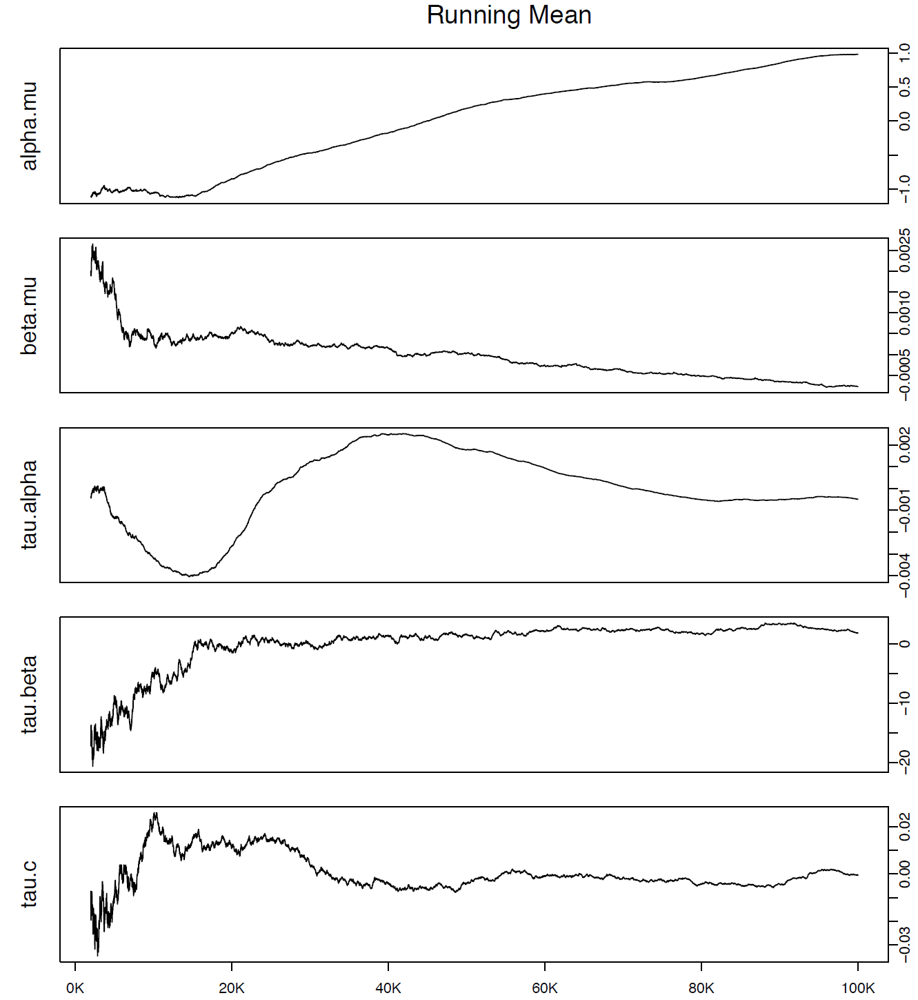
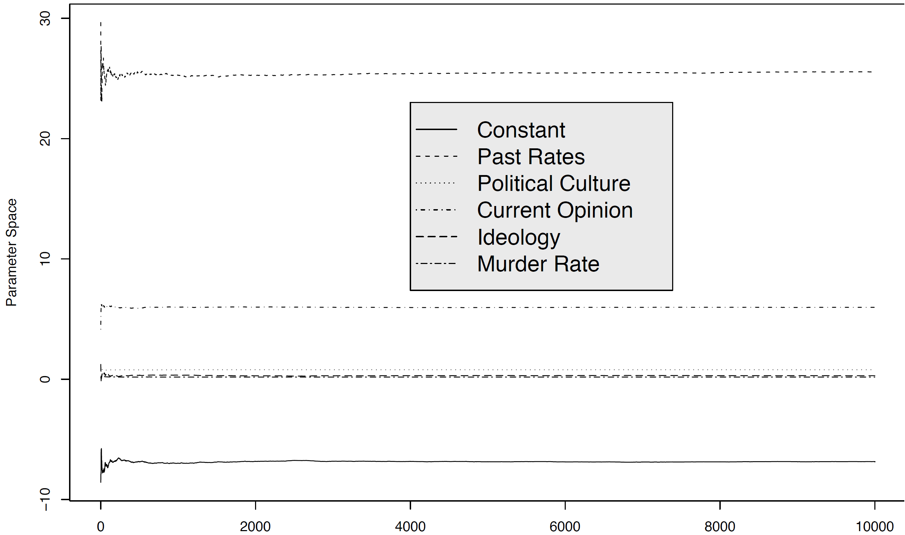

```{r setup, include=FALSE}
options(htmltools.dir.version = FALSE)
knitr::opts_chunk$set(echo = FALSE,
                      message = FALSE,
                      warning = FALSE)


library(pacman)

p_load("ltm", "mirt",
       "TeachingSampling", "lme4",
       "DCPO", 
       "knitr", "ggalt",
       "latex2exp", "tidyverse")

set.seed(313)

theme_set(theme_minimal())
```

## 内容概要
### 因素分析(Factorial Models)

1. .gray[探索性影子分析(EFA)]
1. .gray[验证性因果分析(CFA)]
1. .gray[结构方程模型(SEM)]


### 类型分析(Typological Models)

1. 项目反应理论(IRT)
1. 跨群组项目反应(MrP, GIRT, DCPO)


---

## 操作语言

* R<sup>1</sup>
    + [`mirt`](https://github.com/philchalmers/mirt/wiki)
    + [`DCPO`](https://github.com/fsolt/DCPO)

.footnote[[1] 现存处理IRT的R packages已超过[50](https://www.tandfonline.com/doi/full/10.1080/15366367.2019.1586404?src=recsys)个。]

---

## 项目反应理论 (Item Response Theory, IRT)

因子分析不香么？

--

1. 假定潜在变量是连续的；
1. 对于指标不区分变量类型；
1. 难以捕捉群组差异
1. EFA无法囊括指标间关系;
1. CFA面临“简略理论vs测量质量”的矛盾

???

CFA理论通常简略，只涉及一部分indices，但实际可能很复杂；当囊括更多indices测量质量会高，但不符合理论。

---

## IRT优势

1. 天生为.navy[二元]指标设计（衍生适应定序变量和连续变量）；
1. 易与Bayesian inference结合，解决.navy[潜在变量scale]不确定问题；
1. 在Bayesian框架下更好解决.navy[缺失值和“Don't Know”]问题；
1. 易与跨群组估计结合，实现指标.red[跨组可比]

---

## 个人层级IRT

应用范围：社会调查

调查问题：

1. Yes/No
2. 可以转化为二元的问题
3. 定序问题（e.g., Liker scale questions）

---

## IRT 假定

1. Monotonicity
1. Unidimensionality
1. Local independence
1. Parameter invariance

---

## Monotonicity

单增趋势：随潜在变量增加，获得1的可能性也随之增加。

.center[]

???

Item characteristic curve

比如随着能力的提高，回答正确答案的机会也就越高

---

## Unidimensionality

+ 聚合的项目均指向同一个潜在变量。  
+ 基于理论  

--

直到引入multidimensional IRT  


---

## Local Independency

对于每一项目（e.g.,一道题）的响应(e.g., 选择的选项)间的关联性.red[只]来自.red[共同]的潜在变量。

--

换言之，控制潜在变量影响后，问题间响应相互独立

P(y<sub>iq</sub>,y<sub>i'q</sub> | &theta;<sub>q</sub>) = P(y<sub>iq</sub> | &theta;<sub>q</sub>)P(y<sub>i'q</sub> | &theta;<sub>q</sub>)

---

## Parameter Invarance

+ Parameters在项目间不变
+ Parameters在响应人群间不变<sup>1</sup>
    + 当进行Multiple Group IRT时尤可能被违反

.footnote[<sup>1</sup> 通过基于Wald and likelihood-ratio approach来检测Differential item functioning (DIF).]

---

## Modeling Latent Variables

Rasch Model (1PL)     
&rarr; Two-Parameter Logistic Model (2PL)     
&rarr; Three-Parameter Logistic Model (3PL)     
&rarr; Four-Parameter Logistic Model (4PL)


Group IRT

---

## Rasch Model (1PL)


+ y<sub>iq</sub>&isin;{0,1}: subject `i`'s score on question `q`
+ &theta;<sub>i</sub>&isin;{-&infin;, +&infin;}: Unbounded latent trait
+ &sigma;<sub>q</sub>: Difficulty

.center[.orange[Pr(y<sub>iq</sub> = 1)] = .navy[logist<sup>-1</sup>(&theta;<sub>i</sub> - .red[&sigma;<sub>q</sub>])]]


???

Rasch /resh/  

Difficulty: 不同的问题回答肯定答案的难易度不一样, 通常显示为z scores， 低于0 表示比较简单
+ 当面临重大公共卫生威胁时，政府应该及时响应，采取果断措施
+ 政府是否可以牺牲少数民众安全和权力，来换取大多数社会成员的公共卫生安全时

--

.left-column[
.orange[Item Response]
]
.right-column[

.navy[Response Theory]]

---

## 操作案例 (Bock & Lieberman 1970)

Law School Admissions Test, sec 7  
5个yes/no问题

```{r data-verbal}
df_lsat <- expand.table(LSAT7)
df_lsat %>% kable(format = "html")
```

???

[`mirt` Workshop 1](http://philchalmers.github.io/mirt/extra/mirt-Workshop-2015_Day-1.pdf)

---

## Difficulty Parameter

```{r rasch-difficulty, echo=TRUE}
m_lsat <- mirt(df_lsat, model = 1, itemtype = "Rasch", verbose = FALSE)
coef(m_lsat, simplify = TRUE) %>% 
  kable(format = "html")
```

---

class: center, middle

.Large[Please always diagnose your results,]

--

.Large[and .red[understand] what you are diagnosing.]

.pull-right[--- Dr. Yue Hu]

---

## Item Characteristic Curves （ICC）

```{r icc, fig.height=8, fig.width=10}
plot(m_lsat, type = "trace", facet_items = FALSE)
```

???

检查各题affirmative的难易程度，看逐个是不是大体同一个趋势

---

## Test Charactersitic Curve

```{r tcc, fig.height=8, fig.width=10}
plot(m_lsat, type = "infoSE")
```

???

TCC： 所有ICC之和，体现how reliable, information 理想是形成一个钟形,顶尖处代表平均水平，据此对比个人&theta;可以判断这人是否是outlier
SE(&theta;) = (test)<sup>-1/2</sup>


---

Rasch局限：Measurement error

???

人们对同一个题理解不同，回答出affirmative答案可能性也不同。

--

## Two-Parameter Logistic Model (2PL IRT)

.center[Pr(y<sub>iq</sub> = 1) = logist<sup>-1</sup>(.red[&kappa;<sub>q</sub>]&theta;<sub>i</sub> - &sigma;<sub>q</sub>)]

&kappa;<sub>q</sub>: Discrimination (Parameter of dispersion)

???

Discrimination: how well a question can different people from below to above;

Rule of thumb above 1 meaning a good question in terms of examination

--

另一种常见写法

$$Pr(y_{iq} = 1) = logist^{-1}[\frac{\theta_i - {\color{red}{\beta_q}}}{\color{red}{\alpha_q}}]$$


&beta;<sub>q</sub>: &sigma;<sub>q</sub> &frasl; &kappa;<sub>q</sub>, threshold("difficulty", 控制location)  
&alpha;<sub>q</sub>: &kappa;<sub>q</sub><sup>-1</sup>, dispersion (控制斜率)

???

Dispersion: magnitude of the measurement error 

---

```{r irt-illustration, fig.height=8, fig.width=10, fig.cap="Difficulty & Dispersion"}
tibble(
  theta = rep(seq(-3, 3, length.out = 100), 6),
  beta = rep(c(-2, 0, 2, 0, 0, 0), each = 100),
  alpha = rep(c(1, 1, 1, .25, 1, 2), each = 100),
  pr_y = plogis((theta - beta) / alpha),
  line_no = rep(1:6, each = 100),
  plot_facet = rep(
    c("Varying Question Difficulty", "Varying Question Dispersion"),
    each = 300
  )
) %>%
  ggplot(aes(theta, pr_y, group = line_no)) +
  geom_line() +
  facet_wrap(~ plot_facet) +
  xlab(TeX("Individual Unbounded Latent Trait $\\theta'_{i}$")) +
  ylab(TeX("Pr(y_{iq} = 1)")) +
  theme_bw() +
  theme(
    strip.background = element_rect(colour = "white", fill = "white"),
    plot.title.position = "plot"
  ) +
  scale_x_continuous(breaks = seq(-3, 3, 1)) +
  geom_text(
    data = tibble(
      theta = -2.25,
      pr_y = .65,
      line_no = 1,
      plot_facet = "Varying Question Difficulty",
    ),
    label = TeX("$\\beta_1 = -2$", output = "character"),
    parse = TRUE
  ) +
  geom_text(
    data = tibble(
      theta = -.6,
      pr_y = .525,
      line_no = 1,
      plot_facet = "Varying Question Difficulty",
    ),
    label = TeX("$\\beta_2 = 0$", output = "character"),
    parse = TRUE
  ) +
  geom_text(
    data = tibble(
      theta = .9,
      pr_y = .4,
      line_no = 1,
      plot_facet = "Varying Question Difficulty",
    ),
    label = TeX("$\\beta_3 = 2$", output = "character"),
    parse = TRUE
  ) +
  geom_text(
    data = tibble(
      theta = 2.5,
      pr_y = 0.025,
      line_no = 1,
      plot_facet = "Varying Question Difficulty",
    ),
    label = TeX("$\\alpha_q = 1$", output = "character"),
    parse = TRUE
  ) +
  geom_text(
    data = tibble(
      theta = -.03,
      pr_y = .96,
      line_no = 1,
      plot_facet = "Varying Question Dispersion",
    ),
    label = TeX("$\\alpha_1 = .25$", output = "character"),
    parse = TRUE
  ) +
  geom_text(
    data = tibble(
      theta = 1.4,
      pr_y = .9,
      line_no = 1,
      plot_facet = "Varying Question Dispersion",
    ),
    label = TeX("$\\alpha_2 = 1$", output = "character"),
    parse = TRUE
  ) +
  geom_text(
    data = tibble(
      theta = 2.1,
      pr_y = .66,
      line_no = 1,
      plot_facet = "Varying Question Dispersion",
    ),
    label = TeX("$\\alpha_3 = 2$", output = "character"),
    parse = TRUE
  ) +
  geom_text(
    data = tibble(
      theta = 2.5,
      pr_y = 0.025,
      line_no = 1,
      plot_facet = "Varying Question Dispersion",
    ),
    label = TeX("$\\beta_q = 0$", output = "character"),
    parse = TRUE
  )
```

---

```{r ltm, echo=TRUE}
m_lsat2PL <-  mirt(df_lsat, model = 1, itemtype = "2PL", verbose = FALSE)
coef(m_lsat2PL, simplify = TRUE)
```

---

## 需要2PL吗？

Likelihood-Ratio Test

```{r llr}
anova(m_lsat, m_lsat2PL) %>%  
  select(AIC, SABIC, HQ, logLik, df, p) %>% 
  kable(format = "html")
```

---

class: Small

如果有人全凭猜咋办？——大量低&theta;人群

--

## Three-Parameter Logistic Model (3PL)

$$Pr(y_{iq} = 1) = \color{red}{c_i + (1 - c_i)}logist^{-1}[\frac{(\theta_i - \beta_q)}{\alpha_q}]$$

c<sub>i</sub>：Item .red[lower] asymptote ("guessing")

极大增加演算成本&rarr;通常需要1000以上观测点

---

如果有人不care咋办

## Four-Parameter Logistic Model (4PL)

$$Pr(y_{iq} = 1) = c_i + (\color{red}{d_i} - c_i)logist^{-1}[\frac{(\theta_i - \beta_q)}{\alpha_q}]$$

d<sub>i</sub>：Item .red[upper] asymptote ("carelessness"), d < 1

--

鉴于3PL已经需要1000-ish观测点……

---

## IRT 统计检验

+ 测试层：Global fit
+ 项目层：Item fit & residual
+ 个体层：Personal fit

---

## Global Fit<sup>1</sup>

$$G^2 = 2[\sum_l^s r_lln(\frac{r_l}{N\tilde{P}_l})]$$

N: 参与人数  
l: 可能的反应  
r: 做出特定反应的人数

--

当数据过于稀疏时(item > 10)，M2, M2* 

```{r diagnostics-overall, echo=TRUE}
M2(m_lsat)
```


.footnote[
[1] RMSEA, SRMSR, CFI, TLI对于IRT同样使用
]

???

N is the number of subjects, L is number of possible response patterns, $P_ l$ is the estimated probability of observing response pattern l, and $r_ l$ is the number of subjects who have response pattern l

&chi; sig   
Tucker-lewis index, 1 ideal, < .95 poor   
Comparative fit index, the same   
Root mean square error of approximation, 0 perfect, <.05 good, [.05, .08] ok, > .1 poor    
Standardized root mean square residual <.08 acceptable

---

## Item Diagnostics

Covariation-based residuals

```{r diagnostics-residual, echo=TRUE}
residuals(m_lsat)
```

???

看item residual的协变程度，多用于看multidimensionality, 不应有关联
infit/outfit, close to 1 is good

---

Single item/person fit 

```{r item-infit, echo=TRUE}
# Item 
itemfit(m_lsat, fit_stats = "infit")
```

```{r personfit, echo=TRUE}
# Person
personfit(m_lsat)
```


???

Z<sub>h</sub> > 0 better

---

如果出现问题：

1. 通过S-&chi;<sup>2</sup>、local dependency等检查观测和估计数值差别
1. 改变model type, 比如2PL &rarr; 3PL
1. 如果最初用binary，尝试polytomous或者nominal response models
1. 尝试non-parametric smoothing techniques

---

## 延展1：一维到多维

传统IRT：一维聚合

--

Multidimentional IRT (MIRT, Phil Chalmers, 2015)

$$Pr(y_{iq} = 1) = logist^{-1}[\frac{\boldsymbol{\theta_i} - \beta_q}{\boldsymbol{\alpha_q}}]$$


**&theta;<sub>i</sub>**和**&alpha;<sub>q</sub>**不再是单一值，而是一个矩阵。

???

Pyschologist

---

## 延展2：二元到定序

Logit &rarr; Cumulative logit

Pr(y<sub>iq</sub> = 1) &rarr; $Pr(\frac{y_{iq}\leq c}{y_{iq}>c})$

```{r twoDimension, fig.height=4, fig.width=10}
m_lsat2D <- mirt(df_lsat, model = 2, verbose = FALSE)
plot(m_lsat2D, type = "score")
```

---

## 三种主要类型

1. (Modified) Graded Response Model
    + 用于scoring rubrics，比如 Likert
1. (Generalized) Partial Credit Model，Rating Scale Model
    + 用于可转化为定序的分类变量
1. Nominal Response Model
    + 用于无序分类变量

---

## 延展3：群组效应

.center[]

Multilevel Mixture IRT with Item Bias Effects (Stegmueller 2011)

在估测&alpha;<sub>q</sub>时加入random effect.

???

Daniel Stegmueller, Duke U, poli sci

---

## 超越个体

Individual fallacy: Ecological fallacy 的反面

<video width="700" height="200" controls>
    <source src="images/antiAsian.mp4" type="video/mp4">
</video>

--

再比如，民主、不平等、政治文化……

---

## Disaggregation

.center[y<sub>kq</sub> = &Sigma;y<sub>ikq</sub> &frasl; n.]

--

问题：

1. 如果群组过小，其平均值的代表意义不大
2. 不同的指标对于潜在变量贡献不一样

---

## Multilevel Regression and Post-stratification (MrP)

经过群组信息（地理、人口）加权的平均值

???

Gelman, Andrew, and Thomas C. Little. 1997. “Poststratification Into Many Categories Using Hierarchical Logistic Regression.” Survey Methods 23: 127--135.

--

.Small[
1. 将总体（population）按群组（strata，如国家、地区）切分；
1. 估测对象为核心变量在每个群组中的平均值/比例， &theta;<sub>h</sub> (h &isin; {1, H});
1. 已知各群组以人口变量j（如老年男性、青年女性等）划分，群组人口（N<sub>j</sub>）或占总人口比；
1. 各组总体平均值&mu;<sub>j</sub>可通过multilevel model 进行估算。
]

---

$$\theta_h = \frac{\sum_{j \in h} N_j \mu_j }{\sum_{j \in h} n_j}$$


N: 总体（来自普查）  
n: 样本（来自sample）
---

class: Small

## 操作案例

数据：某年某市五区域2396家产业公司的财政信息  
目标：估测每个区域的产业平均收入（记为&theta;<sub>1~5</sub>）

公司规模和区域分布

```{r descriptive-level}
data(Lucy)
table(Lucy$Level, Lucy$Zone) %>% 
  kable(format = "html")
```

???

https://www.r-bloggers.com/gelmans-mrp-in-r-what-is-this-all-about/


---

总体平均值（真值）

```{r trueMean}
tb_true <- group_by(Lucy, Zone) %>% 
  summarise(income = mean(Income) )
tb_true %>% 
  kable(format = "html", digits = 2)
```

---

我们随机选取数据中1000个产业公司作为样本：

```{r rawVsTrue, fig.height=7, fig.width=10}
SLucy <- sample_n(Lucy, size = 1000)
Np <- table(Lucy$Level, Lucy$Zone)


tb_compare <- group_by(SLucy, Zone) %>% 
  summarise(income = mean(Income)) %>% 
  left_join(tb_true, by = c("Zone")) %>% 
  mutate(incomeTrue = 0,
         rawDiff = income.x - income.y,)

ggplot(tb_compare, aes(x = incomeTrue, xend = rawDiff, y = Zone)) +
  geom_dumbbell(
    size=4, 
    color="#ffffbf",
    colour_x = "#0571b0",
    colour_xend = "#ca0020",
  ) +
  labs(subtitle = "Raw Mean vs. True Value")
```

---

class: Small

## Step I: Mr

Income = &beta;<sub>0z</sub> + &beta;<sub>1z</sub>Level<sub>iz</sub> + &epsilon;<sub>iz</sub>

.center[&beta;<sub>0z</sub> = &gamma;<sub>00</sub> + &gamma;<sub>01</sub>Zone<sub>z</sub> + u<sub>0z</sub>]

--

Output: Post-strata means

```{r mr}
# Step 1: <<MR>> - Multilevel regression
M1 <- lmer(Income ~ Level + (1 | Zone), data = SLucy)
SLucy$Pred <- predict(M1)

# Summary
sum <- group_by(SLucy, Zone, Level) %>% 
  summarise(mean2 = mean(Pred))
Mupred <- matrix(sum$mean2, ncol = 5, nrow = 3)

rownames(Mupred) <- levels(SLucy$Level)
colnames(Mupred) <- levels(SLucy$Zone)

Mupred %>% kable(format = "html", digits = 2)
```

---

## Step II: P

N<sub>z</sub> &times; weighted mean / n<sub>z</sub>

```{r p}
colSums(Np * Mupred) / count(Lucy, Zone)$n
```

---

## Comparision

```{r mrpVsraw, fig.height=8, fig.width=10}
# Step 2: <<Post-stratification>>
# Mean income estimation per zone
tb_compare$mrpDiff <- colSums(Np * Mupred) / count(Lucy, Zone)$n - tb_compare$income.y

tb_compare %>%
  pivot_longer(rawDiff:mrpDiff, names_to = "methods", values_to = "diff") %>%
  ggplot(aes(x = incomeTrue, xend = diff, y = Zone, color = methods)) +
  geom_dumbbell(
    size = 4,
    colour_x = "#0571b0",
    colour_xend = "#ca0020"
  ) +
  scale_color_viridis_d(alpha = 0.5, end = 0.7)
```

---

MrP: 依然是算术平均数。

+ 答题难度的地区差异
+ 题目的scale
+ Measurement error

--

## 聚合层级IRT：DGIRT

Dynamic Group-level IRT——结合IRT和MrP (Caughey & Warshaw 2015)

---

## DGIRT

1. 在群组层面估测IRT；
1. 在估测IRT过程中加入群组级别变量；
1. 将时间变量融入IRT估测；
1. 用MrP给估测进行权重。

---

class: small

## IRT的群组层级估测

个体

$$p_{iq} = logist^{-1}[\frac{\theta_i - {\beta_q}}{\alpha_q}]$$

--

群组

$$\eta_{ktq} = logit^{-1}(\frac{\color{red}{\bar{\theta}_{kt}}- \beta_q}{\sqrt{\alpha^2_q + \color{red}{(1.7\sigma_{kt})^2}}}).$$

$\bar{\theta}_k$ 和 &sigma;<sub>kt</sub> 是潜在变量在组k时间t的均值和sd。  

???

1.7: sd of probit is (&pi;/3)<sup>1/2</sup> for logit, while Long 1997 found it is more close to 1.7 in actual estimations.

Mislevy, Robert J. 1983. “Item Response Models for Grouped Data.” Journal of Educational Statistics 8(4): 271–88.

&eta;: eta 

---

## 囊括时间与空间问题

$$\bar{\theta}_k\sim N(\xi_t + \boldsymbol{x'_k\gamma}, \sigma^2_{\bar{\theta}})$$

.center[&xi;<sub>t</sub> ~ N(&xi;<sub>.red[t-1]</sub>;&sigma;<sub>&gamma;</sub><sup>2</sup>)]

.center[&gamma;<sub>pt</sub> ~ N(&gamma;<sub>p,t-1</sub>&delta;<sub>t</sub> + .red[**z'<sub>p.</sub>&eta;<sub>t</sub>**], &sigma;<sub>&gamma;</sub><sup>2</sup>)]

.center[n<sup>*</sup><sub>kqt</sub>]

???
 
&xi;<sub>t</sub>: xi

x 为群组级变量  
t-1, dynamic linear model  
**z'<sub>p.</sub>&eta;<sub>t</sub>**: geography-level attributes, &eta;是coefficients  
n<sup>*</sup><sub>kqt</sub>基于MrP

---

DGIRT：

+ 囊括诸多因素
+ 可以部分平衡样本代表性问题

--

+ 强大，但.red[复杂]


???

Caughey & Warshaw称会跑几个星期

---

class: Small

## DGIRT简装版 (Claassen 2019)

简化1：只作用于代表性样本和国家级别  
简化2：将国家作用从估测&theta;变为估测difficulty  
简化3：忽略本地问题分布（如极化现象）


--

$$\eta_{ktq} = logit^{-1}(\frac{\bar{\theta}'_{kt}- \beta_q}{\sqrt{\alpha^2_q + (1.7\sigma_{kt})^2}}).$$

.center[&darr;]


$$\eta_{ktq} = logit^{-1}(\frac{\bar{\theta}'_{kt}- (\beta_q + \delta_{kq})}{\alpha_q}).$$


???

&delta;<sub>kq</sub>: 问题的difficulty随国家k变化。

---

## 聚合IRT最新进化态：DCPO

.left-column[

]

.right-column[
.red[D]ynamic .red[C]omparative .red[P]ublic .red[O]pinion

复杂程度：

Claasseen 2019 <   
DCPO <   
DGIRT
]

---

background-image: url("images/irtCompare.png")
background-position: center
background-size: contain


???

Bounded: 使用logit归为0-1

---

## 优化效果

.center[]

---

## 操作过程

1. 收集survey数据，明确与感兴趣的变量相关的指标问题
1. 通过`DCPOtools`对数据进行预处理
1. 通过`DCPO`进行数据分析
1. 通过`shinystan`诊断convergence

---

class: small

## 总结

.pull-left[
+ 个体IRT
    + Rasch model
    + nPL model
    + 多维IRT
    
+ 检验
    + Glbal: G2/M2
    + Item: in/outfit
]

.pull-right[
+ 群体IRT
    + MrP
    + DGIRT
    + *DCPO*
]


---

## Bonus: "调得一手好参"

Bayesian Analysis 参数与Convergence

1. Individual IRT、MrP、DGIRT、DCPO
1. Convergence是底线


---

## Convergence

最常见的Bayesian inference方法：Markov Chain Monte Carlo (MCMC)

--

### 一个Markov Chain何时Converge? 

当Chain的posterior停留在一个.red[相对稳定]的区域内(.red[ergodic] chain)

$$\lim_{n\to \infty}p^n(\theta_i, \theta_j) = \pi(\theta_j), \forall \theta_i, \theta_j.$$

???

+ Homogeneity: at step m the transition probability at this step do not depend on
+ Ergodicity：遍历性

---

## An Ergodic Chain

+ Homogeneous/Closed
+ Irreducible
+ Stationary
+ Recurrent
+ Aperodic

???

+ Reccurent
    + Homogeneous/Closed: At step m if the trasition probabilities at this step do not depend on m; for State A, B, p(A, B) = 0
    + Irreducible: If every reached point/point collection can be reached from every other reached point/point collection; p(&theta;<sub>i</sub>, &theta;<sub>j</sub>)&ne; 0, &forall; &theta;<sub>i</sub>, &theta;<sub>j</sub>
+ Stationary: no autocorrelation
+ Aperodic: even with a long time there's no identical cycle of chain values repeating


---

class: Small

## "下雪啦，天晴啦"

.left-column[

>下雪啦天晴啦
下雪别忘穿棉袄
下雪啦天晴啦
天晴别忘戴草帽
带草帽~~~  

>《心中的太阳》
]

--

.right-column[

今晴，明80%也晴；  
今雪，明60%也雪。

|      |                     | 明天                |                     |
|------|---------------------|---------------------|---------------------|
|      |                     | &theta;<sub>1</sub> | &theta;<sub>2</sub> |
| 今天 | &theta;<sub>1</sub> | 0.8                 | 0.2                 |
|      | &theta;<sub>2</sub> | 0.6                 | 0.4                 |

]

???

刘欢：《心中的太阳》, 《雪城》主题曲，1988年，倪萍主演

example of converged

---

class: Small

起始点: [0.5 0.5]

$$S_1 = [0.5\; 0.5]\begin{bmatrix}0.8 & 0.2\\ 0.6 & 0.4 \end{bmatrix}=[0.7\; 0.3]$$
$$S_2 = [0.7\; 0.3]\begin{bmatrix}0.8 & 0.2\\ 0.6 & 0.4 \end{bmatrix}=[0.74\; 0.26]$$
$$S_3 = [0.74\; 0.26]\begin{bmatrix}0.8 & 0.2\\ 0.6 & 0.4 \end{bmatrix}=[0.748\; 0.252]$$
$$S_4 = [0.748\; 0.252]\begin{bmatrix}0.8 & 0.2\\ 0.6 & 0.4 \end{bmatrix}=[0.749\; 0.250]$$

---

## Convergence检验

没有办法能够证明一个Markov Chain是converged:

1. 在给定时间内，无法保证Markov chain能够.red[达到]目标分布;
1. 无法预先确定一条Chain能够.red[遍历]目标分布的所有区域;
1. 诊断只能判断一条Chain是否.red[未converged]。

---

## Thinning

+ 每个Chain记录多少samples
    + Chain将仅记录第k个值，越高丢失的信息越多
    + k通常取值：4，5，10
    
--

+ Thinning 并.red[不会]提高Chain的运算速度、帮助convergence或增强估测质量
    + 仅用于降低autocorrelation

---

## 调Thin?

1. 迭代中autocorrelation太高
1. Chain的convergence太低
1. 并行运算
1. 模型维度过高

---

## Burn-In

给与足够的burning in以到达目标分布

“炸毛的毛毛虫”（Fuzzy Caterpillar）

.center[]

---

## Autocorrelation

1. Chain间高相关性
1. 单一parameter高相关性

--

.left-column[

]

.right-column[

]

???

1. Chain间高相关性：Slow convergence
1. 单一parameter的高相关：Individual nonconvergence
---

## 实证指标

1. Geweke
1. Gelman-Rubin
1. Raftery-Lewis
1. Heidelberger-Welch

---

## Geweke's G

比较parameters在Chain早期和晚期两个.red[不重叠]的窗口内的均值

$$G = \frac{\bar{\theta_1}- \bar{\theta_2}}{\sqrt{\frac{s_1}{n_1} + \frac{s_2}{n_2}}}.$$


???

检验Recurrence

A fancy difference of means

converge 则显示不显著差异，增加burn-in

---

class: Small

## Gelman & Rubin 1992

1. 跑多条chains（5~10），每条长2n
1. 对每一个感兴趣的parameter计算
    1. Within chain variance(W)
    1. Between chain variance(B)
1. 计算总体variance： var(&theta;) = (1 - 1/n)W + (1/n)B
1. 计算Scale reduction (亦称shrink factor)

$$\hat{R}= \sqrt{\frac{\hat{var(\theta)}}{W}}$$

???

R趋近于1表示chains operating on same distribution

<1.1或1.2是可以接受的

---

class: Small

## Raftery & Lewis (1991, 1996)

+ 分别评价每一个Chain的每一个变量
    1. 根据Chain间的相关性，并据此提供一个迭代数（iteration number）
    1. 检验autocorrelation inflation
    
+ 输出
    + Burin-in 
    + Total
    + Dependence Factor

???
检验 burn-in  

Burn-in: 是一位数或两位数为佳  
Total: 建议的burnin数，未考虑cross-chain，因此真正burnin要乘上chain数

---

class: Small

### Heidelberger and Welch

1. 确定一个迭代数N, 以及准确性（&epsilon;）和显著性数准(&alpha;)
1. 运行整个chain
1. 施用Cram&eacute;r-von Mises Test，Null: Chain是stationary
1. 如检验未通过则依次略去10%、20%,乃至50%的迭代，再次检测；
1. 如结果表示部分数据不是stationary，则对该部分数据进行halfwidth检验
1. 如果halfwidth ratio < &epsilon;, 则通过检验


???

检验Stationary
