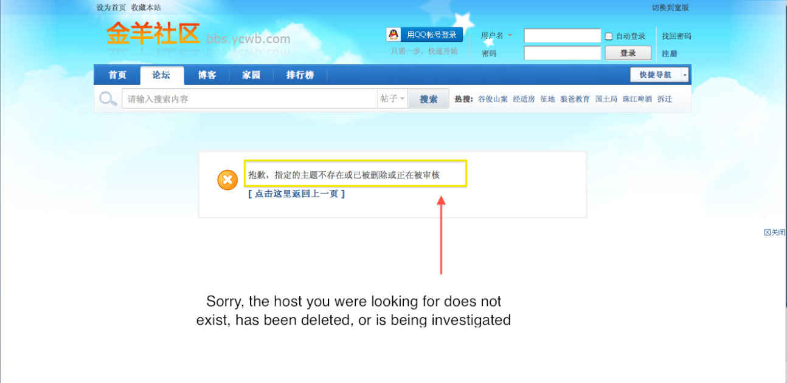
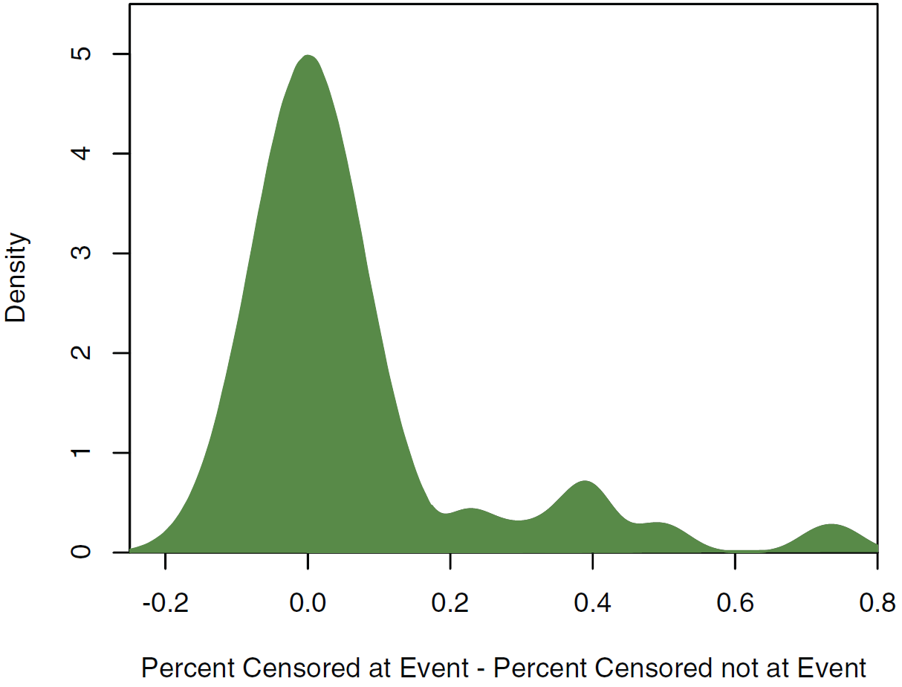
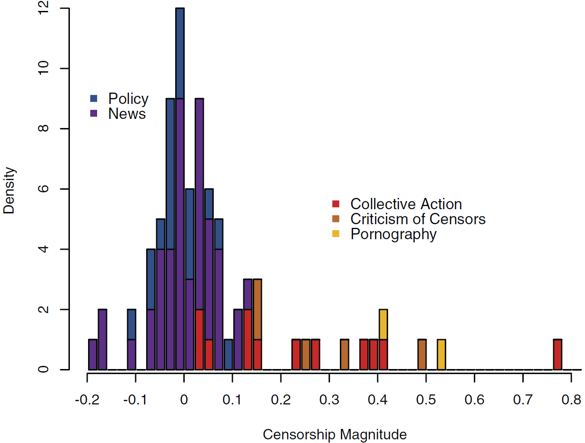
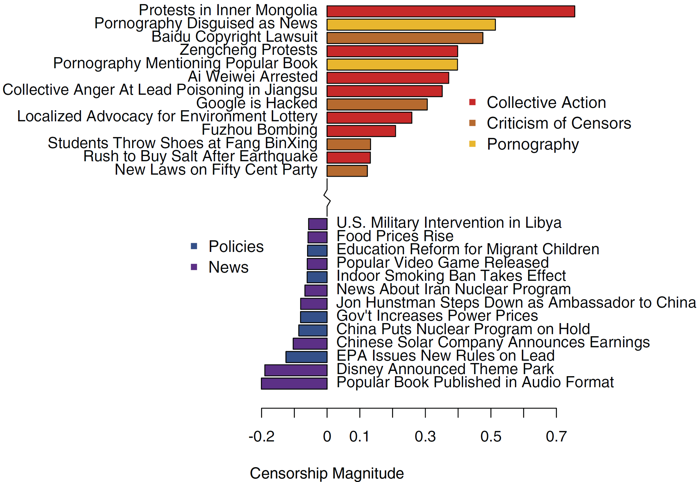
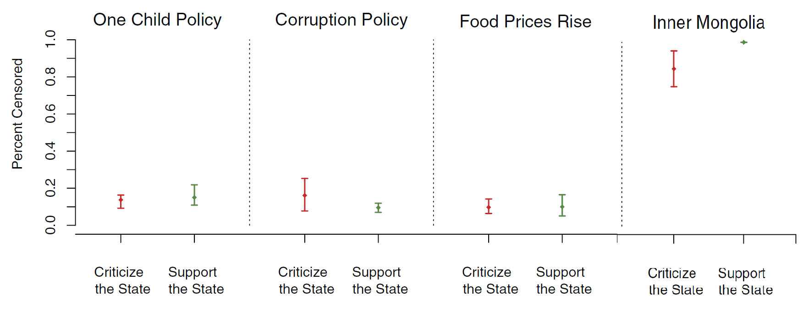
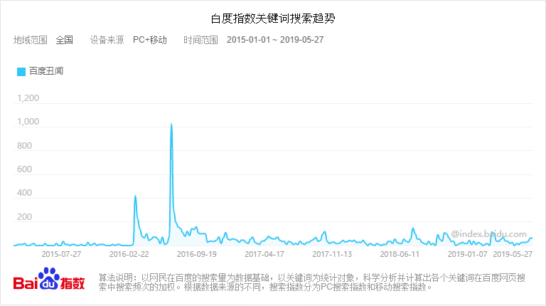
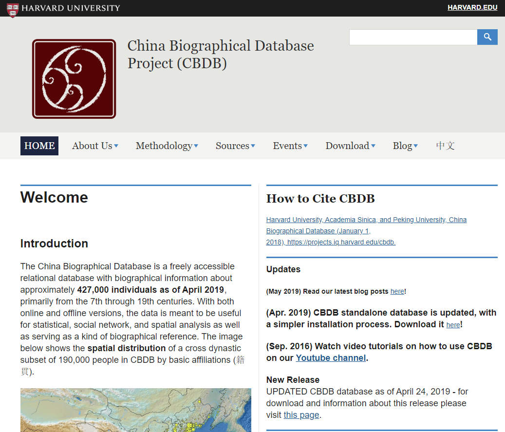
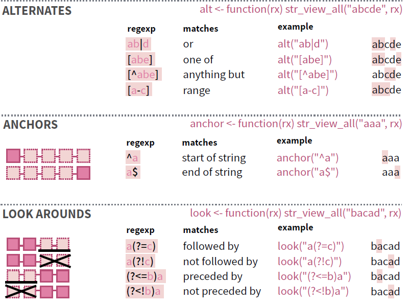

```{r setup, include=FALSE}
knitr::opts_chunk$set(echo = FALSE,
                      message = FALSE,
                      warning = FALSE)


htmltools::tagList(rmarkdown::html_dependency_font_awesome())

if (!require(pacman)) install.packages("pacman")
library(pacman)

p_load(
  flextable, gridExtra,
  knitr, # dependency
  rvest, stringr, broom, jiebaR, tidytext, tidyverse
) # data wrangling # data wrangling

xaringanExtra::use_xaringan_extra(c("tile_view", # O
                                    "broadcast", 
                                    "panelset",
                                    "tachyons"))

# Functions preload
set.seed(313)
```


## Overview

.pull-left[
### 理论

* .red[见字如数]：文本与文本数据
* .red[以字当数]：文本分析研究模式
]

.pull-right[
### 操作

.red[化字为数]: 文本数据化原则

* 数据获取
* 数据整理
* 基本分析
* .grayLight[进阶分析]
]

--


### 技术来源 （R）

[`rvest`](https://rvest.tidyverse.org/)   
[`jiebaR`](https://qinwenfeng.com/jiebaR/)/[`TopWORDS`](http://www.stat.tsinghua.edu.cn/kdeng/r-package/)    
[`tidytext`](https://www.tidytextmining.com/)   


---

class: inverse, bottom

# 见字如数：文本与文本数据化

---

## 文本的数据

每年： 社交媒体用户2017--2018年年增量56,530,000人。


每天：
+ 百度.blue[日]用户搜索请求，需.blue[1.7天]才能扫描一遍；
+ 微信.blue[日]增数据.blue[500TB]——比人类所有书籍存量还多。


每秒：全世界每秒发送290万封电子邮件，一个人需要.blue[5.5年]日以继夜才能读完。

--

.center[2019年，数据总量达40ZB，人均5.2TB<sup>1</sup>]

.footnote[<sup>1</sup> 1ZB = 1,024EB = 1,024<sup>2</sup>PB = 1,024<sup>3</sup>TB  = 1024<sup>4</sup>GB; 1080p HD 2hrs：6GB]

???

Giga Byte < Tera Byte < Peta Byte < 
Exa Byte < Zetta Byte < Yotta Byte

---

## 文本之于研究人类

历史悠久而非主流 

&uarr; 资料难获取；花时间；难推广；难管理；难分析

--

新兴工具的繁荣：

+ 通过文本表达的社会意义更.blue[广泛];
+ 文本.blue[资料]指数级增长；
+ 大规模文本数据.blue[采集]；
+ .blue[存储和管理]能力增强；
+ 可推广、系统化和.blue[廉价]化；


+ 文本分析.blue[方法]蓬勃发展


---

## (计算机辅助）文本分析

.pull-left[
## 对象

~~文字~~ 语言

## 类型

* Text analysis vs. content analysis
* Representational analysis vs. Instrumental analysis
* Thematic analysis vs. semantic analysis
]

???
Representational 精确解码，关注外显（manifest）；
Instrumental 探索意图，关注隐含（latent）
Thematic 概念是否出现及何种关系，基于词频和向量；
Semantic 识别主题间的具体关系；考虑语法、逻辑等

语法学(syntax, how to say it)
语义学(semantic, what is said)
语用学(pragmatic, what is implicated)

--

.pull-right[

## 挑战

### 理论

Single causal mechanism 

### 数据

* DGP
    + 随机抽取    
    + Only posted   
    + One-time censor
* 非结构化
* 海量潜在维度
* 内容复杂且微妙

### 前提

"A bag of word" assumption

]


???

审查已经使用 machine learning

Su, Y.-S., Y. Ruan, S. Sun, and Y.-T. Chang. 2020. “A Pattern Recognition Framework for Detecting Changes in Chinese Internet Management System.” Journal of Social Computing 1(1): 28–39.

---

## 分析方法实例

Grimmer 2010. 

* 目标：美国参议员的政治沟通

???

Grimmer, Justin. 2010. “A Bayesian Hierarchical Topic Model for Political Texts: Measuring Expressed Agendas in Senate Press Releases.” *Political Analysis* 18(1): 1–35.

--

* 核心方法：贝叶斯分层主题模型

--

* 数据：美国参议院2007年来发布的24000余份新闻通告

--

* 发现：
    + 关注重点与其他参议员的关注事件相关；
    + 关注重点的地域分布具集聚性；
    + 议员对挪用的关注程度与他们对禁止挪用法案的投票呈现出正相关关系。


---

## Benoit et al. 2016. 

* 问题：专家与普通人对政治理解异同
* 方法：Crowd-sourced identification
* 数据：18,263 natural sentences, 1987~2010
    + 215,107 群众评判
    + 123,000 专家评判

???

Benoit, Kenneth et al. 2016. “Crowd-Sourced Text Analysis: Reproducible and Agile Production of Political Data.” *American Political Science Review* 110(2): 278–95.

British Conservative, Labour and Liberal Democrat manifesto, 

---

.center[]


---

.center[]


---

## Dietrich et al 2019 

* 目标： 测量情感强烈度
* 数据：74,158 Congressional floor speeches
* 方法： 统计音高变化

???

Dietrich, Bryce J., Matthew Hayes, and Diana Z. O’Brien. 2019. “Pitch Perfect: Vocal Pitch and the Emotional Intensity of Congressional Speech.” American Political Science Review: Forthcoming.

--

.center[]

---

.center[]


???

female MCs speak with greater emotional intensity when talking about women as compared to both their male colleagues and their speech on other topics.


---

## Zhang & Pan 2019

* 目标：从社交媒体中获取集体行动信息
* 数据：A random sample of 20,000 geocoded posts from Weibo, 2010--2017
* 方法：CNN for images; CNN-RNN for texts


???

Zhang, Han, and Jennifer Pan. 2019. “CASM: A Deep-Learning Approach for Identifying Collective Action Events with Text and Image Data from Social Media.” Sociological Methodology 49(1): 1–57.

张涵（普林斯顿）

convolutional neural network (CNN) for image classification and a combination of convolutional and recurrent neural networks with long short-term memory (CNN-RNN)

---

background-image: url(images/text_casm.png)
background-position: 50% 50%
background-size: 100%

---

.center[

Validation


]

---

class: inverse, bottom

# 以字当数：文本分析研究模式

---

class: center, middle

## 文本分析研究思路（以King et al. 2013为例）

问题：Censorship

&vellip;    
&vellip;    
&vellip;    
&vellip;    
&vellip;    
&dArr;

发现：
+ 批评意见；
+ 集体行动。

???

是阻止/打击批评政府?

King, Gary, Jennifer Pan, and Margaret E. Roberts. 2013. “How Censorship in China Allows Government Criticism but Silences Collective Expression.” American Political Science Review 107(02): 326–43.

+ 允许新媒体上存在大量批评政府的意见；
+ 批评政府意见之所以存在，其原因不在于审查不完美或遗漏，而在于政府审查制度的目标是阻止集体行动，切割社会联系。

---

## DGP

+ 2010年上半年，85个议题领域的 3,674,698 社交媒体发帖
+ 随机抽取:127,283 .center[]

* 对每个网贴，首次出现时下载；
* 一段时间后再次访问该网贴，识别是否被删帖； 
* 使用自动文本分析分析海量文本资料。

.center[]


???

2007年Gary King创办，2018年并入英国Brandwatch.

---

background-image: url(images/chinese-media.png)
background-position: 50% 50%
background-size: 100%

---

class: center

## 研究设计

检测各议题领域    
&darr;    
识别发帖量爆发点及相关事件    
&darr;    
识别集体行动事件    
&darr;    
判断发帖与行动关联    
&darr;    
判断支持或批评政府    

???

识别出87件

--

## 观测指标

发帖量   
事件类型   
贴子内容

---

## 发帖量

.pull-left[
.center[
检测各议题领域    
&darr;    
.red[识别发帖量爆发点及相关事件]    
]
]

.pull-right[]

---

## 事件类型

.pull-left[
1. 情感维度：对政府的负面、正面、或中立意见 
1. 主题维度：
    + 集体行动
    + 对审查者的批评
    + 色情内容
    + 新闻
    + 政府政策
]

.pull-right[
.center[
检测各议题领域    
&darr;    
识别发帖量爆发点及相关事件    
&darr;    
.red[识别集体行动事件]    
]
]

???

网络外抗议或有组织的群体性事件；
以往有组织或煽动集体行动的个体；
以往煽动抗议或集体行动的民族主义或民族情绪；


---

.pull-left[]

.pull-right[]

---

class: middle

.pull-left[
.center[
检测各议题领域    
&darr;    
识别发帖量爆发点及相关事件    
&darr;    
识别集体行动事件    
&darr;    
.red[判断发帖与行动关联] 
] 

]

.pull-right[]


???

On May 10 an ethnic Mongol herdsman named Mergen (Chinese: 莫日根; Mongols often use one name) was obstructing a mining company, Liaoning Chencheng Industry and Trade Group, from passing onto his pastureland.[1] He was then hit by an ethnic Han coal truck driver named Li Lindong. After the collision, the herdsman's body was dragged for more than 30 meters.


---

## 帖子内容

.pull-left[
* 对中文帖子进行结构化编码；
* 按类别计算被审查掉的词语比例；



[`Readme`](https://gking.harvard.edu/readme) in R
]

.pull-right[
.center[
检测各议题领域    
&darr;    
识别发帖量爆发点及相关事件    
&darr;    
识别集体行动事件    
&darr;    
判断发帖与行动关联    
&darr;    
.red[判断支持或批评政府]
]  
]

???

This approach enables one to define a set of mutually exclusive and exhaustive categories, to then code a small number of example posts within each category (known as the labeled “training set”), and to infer the proportion of posts within each category in a potentially much larger “test set” without hand coding their category labels.

---

class: center, middle

1. .gold[问题：Censorship]    
&dArr;    
1. 数据收集    
&darr;    
1. 检测各议题领域    
&darr;    
1. 识别发帖量爆发点及相关事件    
&darr;    
1. 识别集体行动事件    
&darr;    
1. 判断发帖与行动关联    
&darr;    
1. 判断支持或批评政府    
&dArr;
1. .gold[发现]：
+ 批评意见；
+ 集体行动。


---

class: inverse, bottom

# 化字为数: 文本数据化原则

---

class: large,center

本节要回答之问题：

1. 文本资源哪里找？
1. 文本资源怎么得？
1. 文本信息如何理？
1. 文本数据能干啥？

---

## 文本资源: 原生数据

* Email/短信
* 网站HTML
* RSS feeds
* 网络社交媒体
* 网络论坛
* 网络问答平台
* 媒体数据库
* 网络交易行为
……

---

## 社交媒体

.center[]

???

新浪微博1.4亿，微信用户5.5亿;
微信日增数据500TB，QQ日增数据200TB。

---

## 公共开放平台

.center[]

---

## 网络问政平台

.center[]

---

## 社会化问答网站

.center[]

???

Quora, Stack Overflow

---

## 媒体数据库

.center[]

---

## 问卷开放性问题

.center[]

---

## 文本资源: 档案数据

* 中国知网等数据库（期刊、报刊、年鉴等）
* Google Books、百度学术
* Google Trend、百度指数
* JSTOR Data for Research……

---

## 百度指数

.center[]

---

## 文本数字化

* 文本扫描 + OCR
.center[]

---

.center[]

---

## 文本获取

* 二手数据：档案数据和数字化数据
* 原生数据：Spider/crawler/scraper

Some foolproof scrapers

.center[]

---

.pull-left[]

.pull-right[]

---

class: bottom

background-image: url(images/text_gooseekerI.png)
background-position: 50% 50%
background-size: 100%

## 使用案例: 冰箱信息

---

background-image: url(images/text_gooseekerII.png)
background-position: 50% 50%
background-size: 100%

---

background-image: url(images/text_gooseekerIII.png)
background-position: 50% 50%
background-size: 100%

---

## 用R进行文本抓取

`SelectorGadget`(Chrome)

.center[]

---

`rvest`(R)

```{r zhongsheng-scrape, eval = FALSE, include = FALSE}
ls_zhongsheng <- read_html("http://politics.people.com.cn/GB/8198/426918/index.html") %>% # index page
  html_nodes("h5 a") %>% # the nodes of the links
  html_attr("href") %>% # just the links
  str_replace("^/n1", "http://politics.people.com.cn/n1")

df_zhongsheng <- map_df(ls_zhongsheng, function(link) {
  zs_article <- read_html(link, encoding = "GB18030") # read the html
  
  zs_title <- html_nodes(zs_article, "h1") %>%
    html_text
  
  zs_time <- html_nodes(zs_article, ".box01 .fl") %>%
    html_text %>%
    str_extract("\\d{4}年\\d{2}月\\d{2}日")
  
  zs_content <- html_nodes(zs_article, "#rwb_zw p") %>%
    html_text %>%
    str_c(collapse = "") %>% # combined the paragraphs
    str_remove_all("\\s|\\n|\\t") # remove the horizontal spaces
  
  zs_data <- data.frame(title = zs_title,
                        time = zs_time,
                        content = zs_content) %>%
    mutate(
      time = str_replace(time, "(\\d{4})年(\\d{2})月(\\d{2})日", "\\1-\\2-\\3"),
      time = as.Date(time)
    )
})

saveRDS(df_zhongsheng, "zhongsheng.RDS")
```

```{r zhongsheng-eg, eval = FALSE, echo=TRUE}
ls_zhongsheng <- read_html("http://politics.people.com.cn/GB/8198/426918/index.html") %>% # index page
  html_nodes("h5 a") %>% # the nodes of the links
  html_attr("href") %>% # just the links
  str_replace("^/n1", "http://politics.people.com.cn/n1")

df_zhongsheng <- map_df(ls_zhongsheng, function(link) {
  zs_article <- read_html(link, encoding = "GB18030") # read the html
  
  zs_title <- html_nodes(zs_article, "h1") %>%
    html_text
  
  zs_time <- html_nodes(zs_article, ".box01 .fl") %>%
    html_text %>%
    str_extract("\\d{4}年\\d{2}月\\d{2}日")
  
  zs_content <- html_nodes(zs_article, "#rwb_zw p") %>%
    html_text %>%
    str_c(collapse = "") %>% # combined the paragraphs
    str_remove_all("\\s|\\n|\\t") # remove the horizontal spaces
  
  zs_data <- data.frame(title = zs_title,
                        time = zs_time,
                        content = zs_content) 
})
```

---

## 抓取特定形式：Regular Expression

.center[]

---

## 结果·结构化文本数据

```{r zhongsheng-analyze}
df_zhongsheng <- readRDS("data/zhongsheng.RDS")
```

.center[]

---

## 文本分析方法概览

.center[]

???

Grimmer, Justin (Stanford), and Brandon M. Stewart (Princeton). 2013. “Text as Data: The Promise and Pitfalls of Automatic Content Analysis Methods for Political Texts.” Political Analysis 21(3): 267–97.


---

## 常见文本分析层次

### 描述

词云(word-cloud)、网络

.center[
### 聚类

知类分文、知文分类
]

.pull-right[
.center[
### 语义

情感分析(sentiment analysis)
]
]

---

## 基本原则

(Grimmer & Stewart 2013)

--

1. 所有现存关于语言的定量模型都是有.blue[偏误]的——但不乏能提供有用的信息。

--

1. 文本定量模型旨在.blue[增强人]（作为主体）的辨识范围和能力。

--

1. .blue[不存在]通行的文本分析最优模型。

--

1. .blue[Validation! Validation! Validation!]

---

## "偏误“的假定： A Bag of Words

A text is represented as the bag (multiset) of its words. 

--

.center[

]

---

## 操作化: Tokenization

1.  文章打散

1. 洗去Syntax
    + 大小写
    + stemming (e.g., 美国式、美式)
    + 标点
    + 非字符（@#￥%……&*）

1. 区别词性
    + Content vs. function
    + 名、动、形、副、介、代……


---

### Stop words


```{r stop-words-en}
read_lines(STOPPATH)[883:933]
```

--

```{r stop-words-ch}
read_lines(STOPPATH)[157:207]
```

---

常见中文stop words资源

* 百度停词表
* 哈工大停词表
* 网络搜集停词表，如[“最全中文停用词表整理（1893个）”](https://blog.csdn.net/shijiebei2009/article/details/39696571)
* 自定义

---

## 转化结果

.center[]

---

class: small

## 亚洲特色：Segment

"一场经贸摩擦，让世界看到了一个有担当负责任的中国和一个一意孤行的美国。”埃及《金字塔报》资深记者萨米·卡姆哈维的话意味深长。近年来，美国一些政客被“美国优先”遮住了双眼，大搞贸易保护主义、单边主义，肆意挥舞关税大棒，全然不顾中美两国人民和全世界人民的强烈反对。"——"难道非要撞了南墙才回头——意孤行必将失败", 《人民日报》（2019年05月30日02版）


```{r segment, echo=TRUE}
library(jiebaR)

zhongsheng <- "一场经贸摩擦，让世界看到了一个有担当负责任的中国和一个一意孤行的美国。”埃及《金字塔报》资深记者萨米·卡姆哈维的话意味深长。近年来，美国一些政客被“美国优先”遮住了双眼，大搞贸易保护主义、单边主义，肆意挥舞关税大棒，全然不顾中美两国人民和全世界人民的强烈反对。"
cutter <- worker() # segment engine
new_user_word(cutter, "萨米·卡姆哈维", "nr") # customize segmentation

segment(zhongsheng, cutter)
```

---

"壮志凌云白虹贯、壮哉都督赠离言。六十年来尘扑面，今日才得洗汗颜。说什么开基业[转二六]经百战，说什么鲸鲵阵里骋雕鞍。大丈夫岂能够老死床第间，学一个丹心报国马革裹尸还。[转快板]我把长江当匹练，信手舒卷履平川。东风起、烧战船，应笑我白发苍苍着先鞭。烈火更助英雄胆，我管叫那八十三万灰飞烟灭火冲天。收拾起风雷供调遣，百万一藐谈笑间。[西皮散板]大丈夫能把乾坤变，何惜萧萧易水寒，斗酒奉赠壮虎胆。[西皮散板]这斗酒酹东风扫荡云天！"

```{r huangGai, eval = FALSE, echo=TRUE}
tx_huangGai <- "壮志凌云白虹贯、壮哉都督赠离言。六十年来尘扑面，今日才得洗汗颜。说什么开基业[转二六]经百战，说什么鲸鲵阵里骋雕鞍。大丈夫岂能够老死床第间，学一个丹心报国马革裹尸还。[转快板]我把长江当匹练，信手舒卷履平川。东风起、烧战船，应笑我白发苍苍着先鞭。烈火更助英雄胆，我管叫那八十三万灰飞烟灭火冲天。收拾起风雷供调遣，百万一藐谈笑间。[西皮散板]大丈夫能把乾坤变，何惜萧萧易水寒，斗酒奉赠壮虎胆。[西皮散板]这斗酒酹东风扫荡云天！"

library(TopWORDS) # Made by Ke Deng

topwords(tx_huangGai)
```


---

class: small

## 词频与词性分析

```{r zhongsheng-clean}
df_zhongsheng$segmented <- map_chr(df_zhongsheng$content, function(content){
  segment(content, cutter) %>% paste(collapse = " ")
})

df_zhongsheng$phase <- "US_fail"
df_zhongsheng$phase[df_zhongsheng$time <= "2019-05-22"] <- "theory_test"
df_zhongsheng$phase[df_zhongsheng$time <= "2019-05-11"] <- "reassessment"
df_zhongsheng$phase[df_zhongsheng$time <= "2019-05-08"] <- "optimism"


df_token <- df_zhongsheng %>% 
  select(-content) %>% 
  unnest_tokens(word, segmented) # tokenization

# Show the word counts
select(df_token, -phase) %>% head %>% kable
```

--

去掉停词

```{r zhongsheng-stop}
# removing the stop words
df_stopWords <- tibble(word = read_lines(STOPPATH))

df_token <- df_token %>% 
  anti_join(df_stopWords) 

select(df_token, -phase) %>% head %>% kable
```

---

```{r zhongsheng-frequency, fig.align='center'}
df_token %>% count(word, sort = TRUE) %>% 
  filter(n > 151) %>%
  mutate(word = reorder(word, n)) %>%
  ggplot(aes(word, n)) +
  geom_col() +
  xlab(NULL) +
  ylab("词频统计") + 
  theme(axis.text = element_text(size = 20)) +
  coord_flip()
```

---

.pull-left[
```{r zhongsheng-phase-freq, out.width="100%"}
df_token %>% 
  group_by(phase) %>% 
  count(word, sort = TRUE) %>% 
  top_n(10) %>%
  ungroup() %>% 
  mutate(word = reorder(word, n),
         word = factor(word, levels = rev(unique(word)))) %>%
  ggplot(aes(word, n)) +
  geom_col() +
  xlab(NULL) +
  coord_flip() +
  ylab("词频统计") + 
  theme(axis.text = element_text(size = 18)) +
  facet_wrap(~ phase, scales = "free")
```
]

???

The Economist journalist Simon Rabinovitch

--

.pull-right[
```{r zhongsheng-fre-compare, out.width="100%"}
frequency <- df_token %>% 
  count(phase, word) %>%
  group_by(phase) %>%
  mutate(proportion = n / sum(n)) %>% 
  select(-n) %>% 
  spread(phase, proportion) %>% 
  gather(phase, proportion, optimism:theory_test)

library(scales)

# expect a warning about rows with missing values being removed
ggplot(frequency, aes(x = proportion, y = `US_fail`, color = abs(`US_fail` - proportion))) +
  geom_abline(color = "gray40", lty = 2) +
  geom_jitter(alpha = 0.1, size = 2.5, width = 0.3, height = 0.3) +
  geom_text(aes(label = word), check_overlap = TRUE, vjust = 1.5, family = "WenQuanYi Micro Hei") +
  scale_x_log10(labels = percent_format()) +
  scale_y_log10(labels = percent_format()) +
  scale_color_gradient(limits = c(0, 0.001), low = "darkslategray4", high = "gray75") +
  facet_wrap(~phase, ncol = 2) +
  theme(legend.position="none") +
  labs(y = "US Inevitable Failure", x = NULL) +
  theme(text = element_text(family = "WenQuanYi Micro Hei"))
```
]

???

x = proportion, y = `US_fail`

proportion = n / sum(n)

---

## Keyword Analysis


```{r keyword}
extractor_keyword <- worker("simhash", topn = 5)

simhash(df_zhongsheng$content[df_zhongsheng$time == "2019-05-30"], extractor_keyword)
```

---

class: small

Hamming Distance

.pull-left[


]

???

the Hamming distance between two strings of equal length is the number of .blue[positions] at which the .red[corresponding symbols are different]. 

It measures the minimum number of substitutions required to change one string into the other, or the minimum number of errors that could have transformed one string into the other.

Two example distances: 100→011 has distance 3; 010→111 has distance 2


--

.pull-right[
05-30 vs. 05-22

```{r keyword-distnace}
distance(df_zhongsheng$content[df_zhongsheng$time == "2019-05-30"],
         df_zhongsheng$content[df_zhongsheng$time == "2019-05-22"],
         extractor_keyword)
```

05-30 vs. 05-23

```{r keyword-distance2}
distance(df_zhongsheng$content[df_zhongsheng$time == "2019-05-30"],
         df_zhongsheng$content[df_zhongsheng$time == "2019-05-23"][1],
         extractor_keyword)
```
]


---

## Topic Modeling

.center[
<video width="500" height="500" controls>
<source src="images/text_topicModeling.webm" type="video/webm">
</video>
]

---

## 超越A Bag of Words

* Stop words
* 词性分析

--

* Word order: Markov Model of Order N
    + Unigram: 清华 大学 政治 系
    + Bigram: 清华大学 政治系/清华 大学政治 系
    + Trigram：清华大学政治 系/清华 大学政治系

--

* Weighted words: TF-IDF

???

term frequency-inverse document frequency

--

* Word vector: word2vec; text2vec; doc2vec

???

 word embeddings

---

## 文本比较

.pull-left[
文本特征：
+ 长度
+ 用词
+ 词频
+ 关键词    
……

]

.pull-right[
语义特征
+ 政治立场
+ 文化
+ 主张
+ 价值
+ 意义
……
]

---

## Bonus: 文本分析de1“黑话”

* Corpus
    + Document
    + DTM/TDM

???
Document-term matrix

--

* Classification
    + Dictionary
    + Machine learning
    
--

* Clustering
    + Membership
    + Topic modeling
        + LDA
        + STM
        
???
Latent Dirichlet Allocation

---

## Take Home Points

.pull-left[
### What You Already Know

1. 文本之于研究
    + 丰富资源
    + 分析门槛
1. 文本分析路径
    + 词 &dzigrarr; 图
1. 文本分析步骤
    + 打散
    + 聚合


]

--

.pull-right[

### Prospect

文字分析

+ 词频分析
+ 信息提取
+ 情感标记
+ 语义网络

文本分析

+ 文本分类
+ 主题分析
+ 语义联系

]


---

class: inverse, center, middle

# Thank you!

<i class="fa fa-envelope fa-lg"></i>&nbsp; [yuehu@tsinghua.edu.cn](mailto:yuehu@tsinghua.edu.cn) 

<i class="fa fa-globe fa-lg"></i>&nbsp; https://sammo3182.github.io/

<i class="fab fa-github fa-lg"></i>&nbsp; [sammo3182](https://github.com/sammo3182)